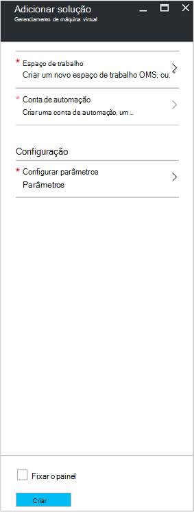
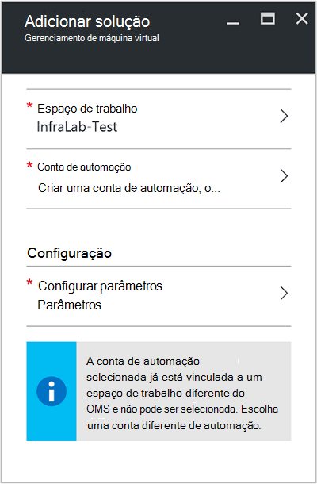
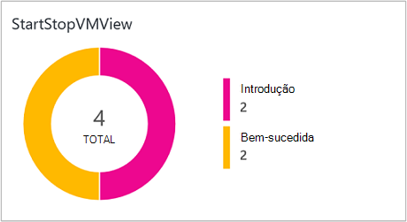
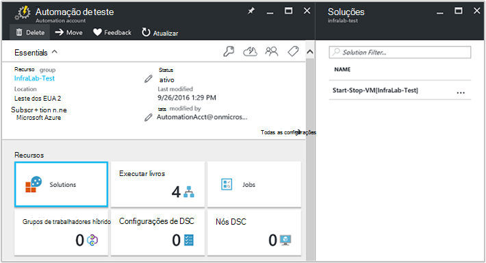
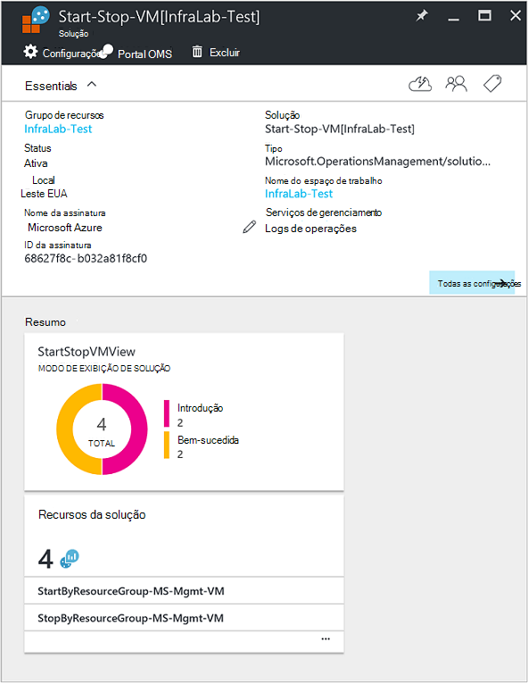

<properties
    pageTitle="Iniciar/Parar VMs durante a solução de horários [visualização] | Microsoft Azure"
    description="As soluções de gerenciamento de máquina virtual é iniciado e interrompido suas máquinas virtuais do Azure Gerenciador de recursos em um cronograma e monitorar proativamente de análise de Log."
    services="automation"
    documentationCenter=""
    authors="MGoedtel"
    manager="jwhit"
    editor=""
    />
<tags
    ms.service="automation"
    ms.workload="tbd"
    ms.tgt_pltfrm="na"
    ms.devlang="na"
    ms.topic="get-started-article"
    ms.date="10/07/2016"
    ms.author="magoedte"/>

# Iniciar/Parar VMs durante a solução de horários [visualização] na automação

VMs iniciar/parar durante a solução de horários [visualização] é iniciado e interrompido suas máquinas virtuais de Gerenciador de recursos do Azure em um cronograma definido pelo usuário e oferece percepção o sucesso dos trabalhos de automação que iniciar e parar suas máquinas virtuais com a análise de Log OMS.  

## Pré-requisitos

- Os runbooks trabalhar com uma [conta do Azure executar como](automation-sec-configure-azure-runas-account.md).  A conta executar como é o método de autenticação preferencial, pois ele usa autenticação de certificado em vez de uma senha que pode expirar ou mudarem com frequência.  

- Esta solução só pode gerenciar VMs que estão na mesma assinatura e o grupo de recursos como onde reside a conta de automação.  

- Essa solução implantará somente aos seguintes regiões Azure - Austrália Sudeste, Leste EUA, Sudeste Asiático e Europa Oeste.  O runbooks que gerenciar a agenda de máquina virtual pode direcionar VMs em qualquer região.  

- Para enviar notificações por email quando concluir os runbooks de máquina virtual de início e parada, é necessária uma assinatura do Office 365 corporativo.  

## Componentes de solução

Essa solução consiste nos seguintes recursos que serão importados e adicionados à sua conta de automação.

### Runbooks

Runbook | Descrição|
--------|------------|
CleanSolution-MS-gerenciamento de máquina virtual | Este runbook removerá contidos todos os recursos e agendamentos quando você vai para excluir a solução de sua assinatura.|  
Gerenciamento de MS SendMailO365 | Este runbook envia um email por meio do Exchange do Office 365.|
StartByResourceGroup-MS-gerenciamento de máquina virtual | Este runbook destina-se ao iniciar VMs (os dois clássico e BRAÇO base VMs) que reside em uma determinada lista de grupos aos quais o recurso Azure.
StopByResourceGroup-MS-gerenciamento de máquina virtual | Este runbook destina-se a parar VMs (os dois clássico e VMs de em ARM) que reside em uma determinada lista de grupos aos quais o recurso Azure.|
 

### Variáveis

Variável | Descrição|
---------|------------|
**Gerenciamento de MS SendMailO365** Runbook ||
SendMailO365-IsSendEmail-MS-gerenciamento | Especifica se StartByResourceGroup-MS-gerenciamento-máquina virtual e StopByResourceGroup-MS-gerenciamento-máquina virtual runbooks pode enviar notificação por email após a conclusão.  Selecione **True** para ativar e **Falso** para desativar o alerta de email. Valor padrão é **Falso**.| 
**StartByResourceGroup-MS-gerenciamento de máquina virtual** Runbook ||
StartByResourceGroup-ExcludeList-MS-gerenciamento-máquina virtual | Insira os nomes de máquina virtual a ser excluído da operação de gerenciamento; Separe os nomes usando semi-colon(;). Valores diferenciam maiusculas de minúsculas e curinga (asterisco) é suportada.|
StartByResourceGroup-SendMailO365-EmailBodyPreFix-MS-gerenciamento | Texto que pode ser anexado ao início do corpo da mensagem de email.|
StartByResourceGroup-SendMailO365-EmailRunBookAccount-MS-gerenciamento | Especifica o nome da conta de automação que contém o runbook de Email.  **Não modifique essa variável.**|
StartByResourceGroup-SendMailO365-EmailRunbookName-MS-gerenciamento | Especifica o nome do runbook email.  Isso é usado pelo StartByResourceGroup-MS-gerenciamento de máquina virtual e StopByResourceGroup-MS-gerenciamento-máquina virtual runbooks para enviar email.  **Não modifique essa variável.**|
StartByResourceGroup-SendMailO365-EmailRunbookResourceGroup-MS-gerenciamento | Especifica o nome do grupo de recursos que contém o runbook de Email.  **Não modifique essa variável.**|
StartByResourceGroup-SendMailO365-EmailSubject-MS-gerenciamento | Especifica o texto da linha de assunto do email.|  
StartByResourceGroup-SendMailO365-EmailToAddress-MS-gerenciamento | Especifica os destinatários de email.  Insira nomes separados usando semi-colon(;).|
StartByResourceGroup-TargetResourceGroups-MS-gerenciamento-máquina virtual | Insira os nomes de máquina virtual a ser excluído da operação de gerenciamento; Separe os nomes usando semi-colon(;). Valores diferenciam maiusculas de minúsculas e curinga (asterisco) é suportada.  Valor padrão (asterisco) incluirá todos os grupos de recursos na assinatura.|
StartByResourceGroup-TargetSubscriptionID-MS-gerenciamento-máquina virtual | Especifica a assinatura que contém VMs a serem gerenciadas por esta solução.  Isso deve ser a mesma assinatura onde reside a conta de automação desta solução.|
**StopByResourceGroup-MS-gerenciamento de máquina virtual** Runbook ||
StopByResourceGroup-ExcludeList-MS-gerenciamento-máquina virtual | Insira os nomes de máquina virtual a ser excluído da operação de gerenciamento; Separe os nomes usando semi-colon(;). Valores diferenciam maiusculas de minúsculas e curinga (asterisco) é suportada.|
StopByResourceGroup-SendMailO365-EmailBodyPreFix-MS-gerenciamento | Texto que pode ser anexado ao início do corpo da mensagem de email.|
StopByResourceGroup-SendMailO365-EmailRunBookAccount-MS-gerenciamento | Especifica o nome da conta de automação que contém o runbook de Email.  **Não modifique essa variável.**|
StopByResourceGroup-SendMailO365-EmailRunbookResourceGroup-MS-gerenciamento | Especifica o nome do grupo de recursos que contém o runbook de Email.  **Não modifique essa variável.**|
StopByResourceGroup-SendMailO365-EmailSubject-MS-gerenciamento | Especifica o texto da linha de assunto do email.|  
StopByResourceGroup-SendMailO365-EmailToAddress-MS-gerenciamento | Especifica os destinatários de email.  Insira nomes separados usando semi-colon(;).|
StopByResourceGroup-TargetResourceGroups-MS-gerenciamento-máquina virtual | Insira os nomes de máquina virtual a ser excluído da operação de gerenciamento; Separe os nomes usando semi-colon(;). Valores diferenciam maiusculas de minúsculas e curinga (asterisco) é suportada.  Valor padrão (asterisco) incluirá todos os grupos de recursos na assinatura.|
StopByResourceGroup-TargetSubscriptionID-MS-gerenciamento-máquina virtual | Especifica a assinatura que contém VMs a serem gerenciadas por esta solução.  Isso deve ser a mesma assinatura onde reside a conta de automação desta solução.|  
 

### Agendas

Cronograma | Descrição|
---------|------------|
StartByResourceGroup-agenda-MS-gerenciamento | Agenda para runbook StartByResourceGroup, que executa a inicialização de VMs gerenciado por esta solução.|
StopByResourceGroup-agenda-MS-gerenciamento | Agenda para runbook StopByResourceGroup, que executa o desligamento de VMs gerenciado por esta solução.|

### Credenciais

Credencial | Descrição|
-----------|------------|
O365Credential | Especifica uma conta de usuário do Office 365 válida para enviar email.  Só é necessário se variável SendMailO365-IsSendEmail-MS-gerenciamento estiver definida como **True**.

## Configuração

Execute as seguintes etapas para adicionar as VMs iniciar/parar durante a solução de horários [visualização] à sua conta de automação e configure as variáveis para personalizar a solução.

1. Na página inicial-tela no portal do Azure, selecione o bloco de **Marketplace** .  Se o bloco já não é fixado sua tela inicial, no painel de navegação esquerdo, selecione **novo**.  
2. Na lâmina Marketplace, digite **Máquina virtual iniciar** na caixa de pesquisa e, em seguida, selecione a solução **VMs iniciar/parar expediente [visualização]** nos resultados da pesquisa.  
3. Na lâmina **VMs iniciar/parar expediente [visualização]** para a solução selecionada, examine as informações de resumo e clique em **criar**.  
4. A lâmina **Add Solution** aparece onde você for solicitado a configurar a solução antes de importá-lo em sua assinatura de automação.     
5.  Na lâmina **Adicionar solução** , selecione **área de trabalho** e aqui você selecionar um espaço de trabalho OMS que esteja vinculado a mesma assinatura do Azure que a conta de automação está em ou crie um novo espaço de trabalho do OMS.  Se você não tiver um espaço de trabalho do OMS, você pode selecionar **Criar novo espaço de trabalho** e no **Espaço de trabalho de OMS** blade, execute o seguinte procedimento: 
   - Especifique um nome para o novo **Espaço de trabalho do OMS**.
   - Selecione uma **assinatura** para vincular a, selecionando na lista suspensa, se o padrão selecionado não for apropriado.
   - Para o **Grupo de recursos**, você pode criar um novo grupo de recursos ou selecione um grupo de recursos existente.  
   - Selecione um **local**.  Atualmente os únicos locais fornecidos para seleção são **Austrália Sudeste**, **Leste EUA**, **Sudeste Asiático**e **Europa Oeste**.
   - Selecione um **nível de preços**.  A solução é oferecida em dois níveis: livre e OMS pago camada.  A camada livre tem um limite na quantidade de dados coletados diariamente, período de retenção e runbook minutos de tempo de execução de trabalho.  A camada OMS pago não tem um limite na quantidade de dados coletados diariamente.  

        > [AZURE.NOTE]
        > Enquanto o Standalone pago camada é exibido como uma opção, não é aplicável.  Se você selecioná-la e continuar com a criação desta solução em sua assinatura, ele falhará.  Isso será corrigido quando esta solução oficialmente é lançada. Se você usar esta solução, ele só usa os minutos de trabalho de automação e faça logon inclusão.  A solução não adiciona nós OMS adicionais ao seu ambiente.  

6. Depois de fornecer as informações necessárias no **espaço de trabalho OMS** blade, clique em **criar**.  Enquanto as informações serão verificadas e o espaço de trabalho for criado, você pode controlar o andamento em **notificações por** no menu.  Você será retornado lâmina **Adicionar solução** .  
7. Na lâmina **Adicionar solução** , selecione a **Conta de automação**.  Se você estiver criando um novo espaço de trabalho OMS, será necessário para criar uma nova conta de automação que será associada com o novo OMS espaço de trabalho especificado anteriormente, incluindo sua assinatura do Azure, grupo de recursos e região.  Você pode selecionar **criar uma conta de automação** e na lâmina **automação adicionar conta** , fornecer o seguinte: 
  - No campo **nome** , digite o nome da conta de automação.

    Todas as outras opções são preenchidas automaticamente com base no espaço de trabalho do OMS selecionado e essas opções não podem ser modificadas.  Uma conta do Azure executar como é o método de autenticação padrão para o runbooks incluídos nesta solução.  Quando você clicar **Okey**, as opções de configuração são validadas e a conta de automação é criada.  Você pode controlar o andamento em **notificações por** no menu. 

    Caso contrário, você pode selecionar uma conta de automação executar como existente.  Observe que a conta que você selecionar não pode já estar vinculada a outro espaço de trabalho OMS, caso contrário, uma mensagem será exibida na lâmina para informá-lo.  Se ele já estiver vinculado, você precisará selecionar uma conta de automação executar como diferente ou crie um novo.    

8. Finalmente na lâmina **Adicionar solução** , selecione **a configuração** e a lâmina de **parâmetros** aparece.  Na lâmina **parâmetros** , você será solicitado a:  
   - Especifique os **Nomes de ResourceGroup de destino**, que é um nome de grupo de recursos que contém VMs a serem gerenciadas por esta solução.  Você pode inserir mais de um nome e separe cada usando ponto e vírgula (valores diferenciam maiusculas de minúsculas).  Usar um caractere curinga é suportado se quiser destino VMs em todos os grupos de recursos na assinatura.
   - Selecione uma **agenda** que é uma data e hora para iniciar e parar a máquina virtual em grupos de recursos de destino recorrente.  

10. Quando tiver concluído Configurando as configurações iniciais necessárias para a solução, selecione **criar**.  Todas as configurações serão validadas e, em seguida, ele tentará implantar a solução em sua assinatura.  Esse processo pode levar alguns segundos para ser concluída e você pode controlar o andamento em **notificações por** no menu. 

## Frequência de conjunto

Dados de fluxo automação trabalho log e trabalho é incluídos no repositório do OMS cada cinco minutos.  

## Usando a solução

Quando você adiciona a solução de gerenciamento de máquina virtual, no seu espaço de trabalho do OMS o **Modo de exibição de StartStopVM** bloco será adicionado ao seu painel OMS.  Esse bloco exibe a contagem e representação gráfica dos trabalhos runbooks para a solução que começaram e tiver concluído com êxito.     

Em sua conta de automação, você pode acessar e gerenciar a solução selecionando o bloco de **soluções** e, em seguida, da lâmina **soluções** , selecionando a solução **Iniciar-Parar-máquina virtual [Workspace]** na lista.     

Selecionando a solução exibirá a lâmina de solução de **Iniciar-Parar-máquina virtual [Workspace]** , onde você pode analisar detalhes importantes, como o bloco de **StartStopVM** , como o seu espaço de trabalho do OMS, que exibe uma contagem e representação gráfica dos trabalhos runbooks para a solução que começaram e tiver concluído com êxito.     

A partir daqui você também pode abrir seu espaço de trabalho do OMS e analisar melhor os registros de trabalho.  Apenas clique em **todas as configurações**e na lâmina **configurações** , selecione **Início rápido** e na lâmina **Quick Start** selecione **OMS Portal**.   Isso abrirá uma nova guia ou uma nova sessão do navegador e apresentar seu espaço de trabalho OMS associado a sua conta de automação e assinatura.  

### Configurar notificações por email

Para habilitar notificações por email quando concluído, que você precisará modificar o **O365Credential** os início e parada máquina virtual runbooks credencial e no mínimo, as seguintes variáveis:

 - SendMailO365-IsSendEmail-MS-gerenciamento
 - StartByResourceGroup-SendMailO365-EmailToAddress-MS-gerenciamento
 - StopByResourceGroup-SendMailO365-EmailToAddress-MS-gerenciamento

Para configurar a credencial **O365Credential** , execute as seguintes etapas:

1. Em sua conta de automação, clique em **Todas as configurações** na parte superior da janela. 
2. Na lâmina **configurações** na seção **Recursos de automação**, selecione **ativos**. 
3. Na lâmina **ativos** , selecione o bloco de **credencial** e da lâmina **credencial** , selecione a **O365Credential**.  
4. Digite um nome de usuário do Office 365 válido e a senha e clique em **Salvar** para salvar as alterações.  

Para configurar as variáveis destacadas anteriormente, execute as seguintes etapas:

1. Em sua conta de automação, clique em **Todas as configurações** na parte superior da janela. 
2. Na lâmina **configurações** na seção **Recursos de automação**, selecione **ativos**. 
3. Na lâmina **ativos** , selecione o bloco de **variáveis** e da lâmina **variáveis** , selecione a variável listada acima e modificar seu valor após a descrição para ele especificada na seção [variável](##variables) anteriormente.  
4. Clique em **Salvar** para salvar as alterações para a variável.   

### Modificar a agenda de inicialização e desligamento

Gerenciar o cronograma de inicialização e desligamento nesta solução segue as mesmas etapas, conforme descrito em [um runbook no Azure automação de agendamento](automation-scheduling-a-runbook.md).  Lembre-se de que você não pode modificar a configuração de agendamento.  Você precisará desabilitar o cronograma existente e, em seguida, crie um novo e, em seguida, vincular à **StartByResourceGroup-MS-gerenciamento de máquina virtual** ou runbook **StopByResourceGroup-MS-gerenciamento de máquina virtual** que deseja que o cronograma para aplicar a.   

## Registros de log de análise

Automação cria dois tipos de registros no repositório OMS.

### Logs de trabalho

Propriedade | Descrição|
----------|----------|
Chamador |  Quem iniciou a operação.  Valores possíveis são um sistema para as tarefas agendadas ou endereço de email.|
Categoria | Classificação do tipo de dados.  Para automação, o valor é JobLogs.|
CorrelationId | GUID que é a Id de correlação do trabalho runbook.|
JobId | GUID que é a Id do trabalho runbook.|
operationName | Especifica o tipo de operação executado no Azure.  Para automação, o valor será trabalho.|
identificação de recurso | Especifica o tipo de recurso no Azure.  Para automação, o valor é a conta de automação associada runbook.|
ResourceGroup | Especifica o nome do grupo de recursos do trabalho runbook.|
ResourceProvider | Especifica o serviço Azure que fornece os recursos que você pode implantar e gerenciar.  Para automação, o valor é automação do Azure.|
Tipo de recurso | Especifica o tipo de recurso no Azure.  Para automação, o valor é a conta de automação associada runbook.|
resultType | O status do trabalho runbook.  Valores possíveis são: -Introdução -Interrompido -Suspenso -Falha -Bem-sucedida|
resultDescription | Descreve o estado de resultado de trabalho runbook.  Valores possíveis são: -Trabalho é iniciado -Falha no trabalho -Trabalho concluído|
RunbookName | Especifica o nome do runbook.|
SourceSystem | Especifica o sistema de origem para os dados enviados.  Para automação, o valor será: OpsManager|
StreamType | Especifica o tipo de evento. Valores possíveis são: -Detalhado -Saída -Erro -Aviso|
SubscriptionId | Especifica a identificação de assinatura do trabalho.
Tempo | Data e hora quando o trabalho de runbook executado.|

### Fluxos de trabalho

Propriedade | Descrição|
----------|----------|
Chamador |  Quem iniciou a operação.  Valores possíveis são um sistema para as tarefas agendadas ou endereço de email.|
Categoria | Classificação do tipo de dados.  Para automação, o valor é JobStreams.|
JobId | GUID que é a Id do trabalho runbook.|
operationName | Especifica o tipo de operação executado no Azure.  Para automação, o valor será trabalho.|
ResourceGroup | Especifica o nome do grupo de recursos do trabalho runbook.|
identificação de recurso | Especifica o recurso Id do Azure.  Para automação, o valor é a conta de automação associada runbook.|
ResourceProvider | Especifica o serviço Azure que fornece os recursos que você pode implantar e gerenciar.  Para automação, o valor é automação do Azure.|
Tipo de recurso | Especifica o tipo de recurso no Azure.  Para automação, o valor é a conta de automação associada runbook.|
resultType | O resultado do trabalho runbook no momento em que o evento foi gerado.  Valores possíveis são: -InProgress|
resultDescription | Inclui o fluxo de saída do runbook.|
RunbookName | O nome do runbook.|
SourceSystem | Especifica o sistema de origem para os dados enviados.  Para automação, o valor será OpsManager|
StreamType | O tipo de fluxo de trabalho. Valores possíveis são: -Andamento -Saída -Aviso -Erro -Depurar -Detalhado|
Tempo | Data e hora quando o trabalho de runbook executado.|

Quando você executa qualquer pesquisa de log que retorna registros de categoria de **JobLogs** ou **JobStreams**, você pode selecionar o modo de exibição **JobLogs** ou **JobStreams** que exibe um conjunto de blocos resumindo as atualizações retornadas pela pesquisa.

## Pesquisas de log de amostra

A tabela a seguir fornece pesquisas de log de amostra para registros de trabalho coletadas por esta solução. 

Consulta | Descrição|
----------|----------|
Localizar trabalhos de runbook StartVM que foram concluídas com êxito | Categoria = JobLogs RunbookName_s = "StartByResourceGroup-MS-gerenciamento-máquina virtual" ResultType = bem-sucedida & #124; Count () medida por JobId_g|
Localizar trabalhos de runbook StopVM que foram concluídas com êxito | Categoria = JobLogs RunbookName_s = "StartByResourceGroup-MS-gerenciamento-máquina virtual" ResultType = falha & #124; Count () medida por JobId_g
Mostrar o status de trabalho ao longo do tempo para runbooks StartVM e StopVM | Categoria = JobLogs RunbookName_s = NOT(ResultType="started") "StartByResourceGroup-MS-gerenciamento-máquina virtual" ou "StopByResourceGroup-MS-gerenciamento-máquina virtual" | Meça Count () pelo intervalo de ResultType 1 dia|

## Próximas etapas

- Para saber mais sobre como construir consultas de pesquisa diferentes e examine os logs de trabalho de automação com a análise de Log, consulte [pesquisas de Log no Log de análise](../log-analytics/log-analytics-log-searches.md)
- Para saber mais sobre a execução de runbook, como monitorar runbook trabalhos e outros detalhes técnicos, consulte [controlar um trabalho runbook](automation-runbook-execution.md)
- Para saber mais sobre a análise de Log OMS e fontes de conjunto de dados, consulte [dados de armazenamento do Azure coletando em Visão geral de análise de Log](../log-analytics/log-analytics-azure-storage.md)

   

