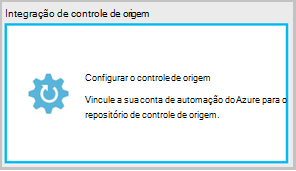
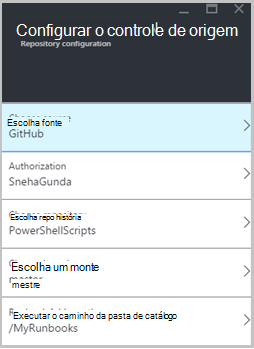
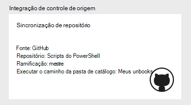
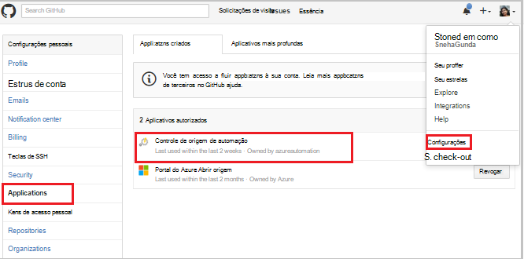
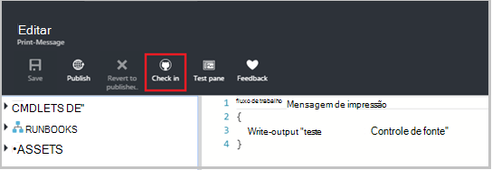
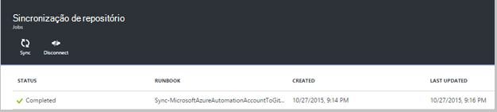
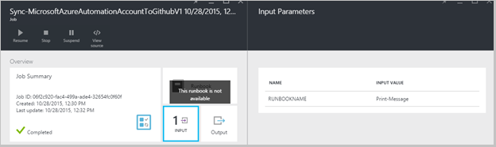
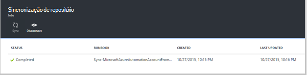
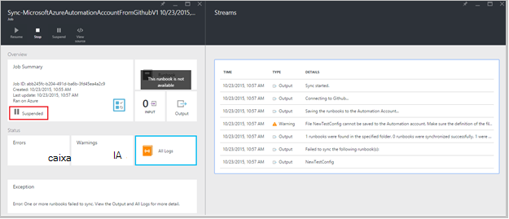
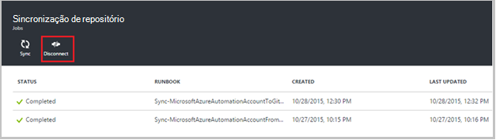

<properties 
    pageTitle=" Integração de controle no Azure automação de fonte | Microsoft Azure"
    description="Este artigo descreve a integração de controle de origem com GitHub na automação do Azure."
    services="automation"
    documentationCenter=""
    authors="mgoedtel"
    manager="jwhit"
    editor="tysonn" />    
<tags 
    ms.service="automation"
    ms.devlang="na"
    ms.topic="article"
    ms.tgt_pltfrm="na"
    ms.workload="infrastructure-services"
    ms.date="09/12/2016"
    ms.author="magoedte;sngun" />

# Integração de controle de origem na automação do Azure

Integração de controle de origem permite associar runbooks em sua conta de automação para um repositório de controle de origem GitHub. Controle de origem permite que você facilmente colaborar com sua equipe controlar alterações e reverter para versões anteriores do seu runbooks. Por exemplo, o controle da fonte permite que você sincronizar diferente ramificações no controle de origem para desenvolvimento, teste ou produção automação contas, tornando mais fácil para promover código que foi testado em seu ambiente de desenvolvimento para sua conta de automação de produção.

Controle de origem permite que você enviar um código de automação do Azure ao controle de origem ou retirar seus runbooks do controle de origem à automação do Azure. Este artigo descreve como configurar o controle de origem no seu ambiente de automação do Azure. Vamos começar pela configuração de automação do Azure para acessar o repositório de GitHub e percorrer operações diferentes que podem ser executadas usando a integração de controle de origem. 

>[AZURE.NOTE]Controle de origem suporta retirando e insistem [runbooks de fluxo de trabalho do PowerShell](automation-runbook-types.md#powershell-workflow-runbooks) bem como [runbooks do PowerShell](automation-runbook-types.md#powershell-runbooks). [Runbooks gráficas](automation-runbook-types.md#graphical-runbooks) ainda não são aceitas.  

Há duas etapas simples necessárias para configurar o controle de origem para sua conta de automação e somente um se você já tiver uma conta de GitHub. Eles são:
## Etapa 1: criar um repositório de GitHub

Se você já tiver uma conta de GitHub e um repositório que você deseja vincular a automação do Azure, em seguida, efetuar login em sua conta existente e iniciar na etapa 2 abaixo. Caso contrário, navegue até [GitHub](https://github.com/), sinal de cima para uma nova conta e [criar um novo repositório](https://help.github.com/articles/create-a-repo/).

## Etapa 2 – configure o controle de origem no Azure automação

1. Da lâmina conta de automação no portal do Azure, clique em **definir controle de origem.** 
 
    

2. A lâmina de **Controle de origem** é aberta, onde você pode configurar os detalhes da conta GitHub. A seguir é a lista de parâmetros para configurar:  

  	|**Parâmetro**            |**Descrição** |
  	|:---|:---| 
  	|Escolha fonte   | Selecione a fonte. Atualmente, somente **GitHub** é suportada. |
  	|Autorização | Clique no botão **Autorizar** para conceder acesso de automação do Azure para seu repositório GitHub. Se você já estiver conectado à sua conta de GitHub em uma janela diferente, as credenciais de conta são usadas. Depois de autorização for bem-sucedida, a lâmina mostrará seu nome de usuário GitHub em **Autorização de propriedade**. |
  	|Escolher o repositório | Selecione um repositório GitHub na lista de repositórios disponíveis. |
  	|Escolha ramificação | Selecione uma ramificação na lista de ramificações disponíveis. Somente a ramificação **mestre** é mostrada se você ainda não criou qualquer ramificações. |
  	|Caminho da pasta runbook | O caminho da pasta runbook Especifica o caminho no repositório GitHub do qual você deseja push ou retirar seu código. Ele deve ser inserido no formato **/foldername/subfoldername**. Somente runbooks no caminho da pasta runbook serão sincronizados com sua conta de automação. Runbooks nas subpastas de runbook pasta caminho vai **não** ser sincronizado. Use **/** para sincronizar todas as runbooks em repositório. |

3. Por exemplo, se você tiver um repositório chamado **PowerShellScripts** que contém uma pasta chamada **RootFolder**, que contém uma pasta chamada **subpasta**. Você pode usar as seguintes cadeias de caracteres para cada nível de pasta de sincronização:

    1. Para sincronizar runbooks do **repositório**, o caminho da pasta de runbook é*/*
    2. Para sincronizar runbooks de **RootFolder**, o caminho da pasta runbook é */RootFolder*
    3. Para sincronizar runbooks da **subpasta**, o caminho da pasta runbook é */RootFolder/SubFolder*.
  

4. Depois de configurar os parâmetros, eles são exibidos na **blade definir controle de origem.**  
 
    

5. Quando você clicar Okey, integração de controle de origem agora está configurada para a sua conta de automação e deve ser atualizada com suas informações de GitHub. Agora, você pode clicar nessa parte para ver todas as seu histórico de trabalho de sincronização de controle de origem.  

    

6. Depois de você configurar o controle de origem, os seguintes recursos de automação serão criados em sua conta de automação:  
 Duas [variáveis ativos](automation-variables.md) são criados.  
      
    * A variável **Microsoft.Azure.Automation.SourceControl.Connection** contém os valores de cadeia de conexão, conforme mostrado abaixo.  

  	|**Parâmetro**            |**Valor** |
  	|:---|:---|
  	| Nome  | Microsoft.Azure.Automation.SourceControl.Connection |
  	| Tipo | Cadeia de caracteres |
  	| Valor  | {"Ramificação":\<*seu nome de ramificação*>, "RunbookFolderPath":\<*caminho da pasta Runbook*>, "ProviderType":\<*tem um valor 1 para GitHub*>, "Repositório":\<*nome do seu repositório*>, "Username":\<*GitHub seu nome de usuário*>} |   

    * A variável **Microsoft.Azure.Automation.SourceControl.OAuthToken**, contém o valor de criptografada seguro do seu OAuthToken.  

  	|**Parâmetro**            |**Valor** |
  	|:---|:---|
  	| Nome  | Microsoft.Azure.Automation.SourceControl.OAuthToken |
  	| Tipo | Unknown(Encrypted) |
  	| Valor | <*OAuthToken criptografada*> |  

      

    * **Controle de origem de automação** é adicionado como um aplicativo autorizado à sua conta de GitHub. Para exibir o aplicativo: GitHub home page, navegue até seu **perfil** > **configurações** > **aplicativos**. Este aplicativo permite a automação do Azure sincronizar seu repositório GitHub a uma conta de automação.  

    

## Usando o controle de origem na automação

### Seleção de um runbook de automação do Azure ao controle de origem

Seleção de runbook permite push as alterações feitas uma runbook na automação do Azure para o repositório de controle de origem. Estas são as etapas um runbook de check-in:

1. Sua conta de automação, [criar um novo runbook textual](automation-first-runbook-textual.md)ou [Editar um runbook existente e textual](automation-edit-textual-runbook.md). Este runbook pode ser um fluxo de trabalho do PowerShell ou um runbook de script do PowerShell.  

2. Depois de editar seu runbook, salvá-la e clique **na seleção** da lâmina **Editar** .  

    

     >[AZURE.NOTE] A entrada de automação do Azure substituirá o código que existe atualmente no seu controle de origem. A instrução de linha de comando equivalente gito check-in é **Adicionar gito + gito confirmação + gito push**  

3. Quando você clica **na seleção**, você receberá uma mensagem de confirmação, clique em Sim para continuar.  

    

4. Seleção de inicia o runbook de controle de origem: **MicrosoftAzureAutomationAccountToGitHubV1 de sincronização**. Este runbook se conecta ao GitHub e envia alterações de automação do Azure para seu repositório. Para exibir o histórico de seleção no trabalho, volte para a guia de **Integração de controle de origem** e clique para abrir a lâmina de sincronização de repositório. Este blade mostra todos os trabalhos de controle de origem.  Selecione o trabalho que você deseja exibir e clique em para exibir os detalhes.  

    

    >[AZURE.NOTE] Runbooks de controle de origem são especiais runbooks de automação que você não pode exibir ou editar. Enquanto elas não serão exibidos na sua lista de runbook, você verá os trabalhos de sincronização aparecendo na sua lista de trabalhos.
 
5. O nome do runbook modificado é enviado como um parâmetro de entrada para runbook na seleção. Você pode [Exibir os detalhes de trabalho](automation-runbook-execution.md#viewing-job-status-using-the-azure-management-portal) expandindo runbook no **Repositório sincronização** blade.  

    

6. Atualize seu repositório GitHub depois que o trabalho for concluído para exibir as alterações.  Deve haver uma confirmação no seu repositório com uma mensagem de confirmação: *Nome de Runbook *atualizado ** no Azure Automation.* *  

### Runbooks de sincronização do controle de origem à automação do Azure 

O botão Sincronizar na lâmina repositório sincronização permite separar todas as runbooks no caminho da pasta runbook do seu repositório à sua conta de automação. O mesmo repositório pode ser sincronizado com mais de uma conta de automação. Estas são as etapas para sincronizar um runbook:

1. A conta de automação onde você configurar o controle de origem, abra o **blade de sincronização de integração/repositório de controle de origem** e clique em **sincronizar** e em seguida, você receberá uma mensagem de confirmação, clique em **Sim** para continuar.  

    

2. Sincronização inicia runbook: **MicrosoftAzureAutomationAccountFromGitHubV1 de sincronização**. Este runbook se conecta ao GitHub e obtém as alterações do seu repositório à automação do Azure. Você deve ver uma nova tarefa na lâmina **Repositório sincronização** para esta ação. Para exibir detalhes sobre o trabalho de sincronização, clique para abrir a lâmina de detalhes de trabalho.  
 
    

 
    >[AZURE.NOTE] Uma sincronização do controle de origem substitui a versão de rascunho do runbooks que existem atualmente em sua conta de automação para **todos os** runbooks que estão atualmente no controle de origem. A instrução de linha de comando equivalente gito sincronizar é **pegar gito**

## Solução de problemas de controle de origem

Se houver erros com um trabalho de check-in ou sincronização, o status do trabalho deve ser suspenso e você pode exibir mais detalhes sobre o erro na lâmina trabalho.  A parte de **Todos os Logs** mostram todos os fluxos de PowerShell associados ao trabalho. Isso fornecerá os detalhes necessários para ajudá-lo a corrigir problemas com seu check-in ou a sincronização. Ele também mostrará a sequência de ações que ocorreu durante a sincronização ou check-in um runbook.  

## Desconectar o controle de origem

Desconectar a sua conta de GitHub, abra a lâmina de sincronização de repositório e clique em **Desconectar**. Depois que você desconecta o controle de origem, runbooks que foram sincronizados anteriormente ainda permanecerá em sua conta de automação, mas a lâmina de sincronização de repositório não será habilitada.  

  

## Próximas etapas

Para obter mais informações sobre a integração de controle de origem, consulte os seguintes recursos:  
- [Automação Azure: Integração de controle de origem em automação Azure](https://azure.microsoft.com/blog/azure-automation-source-control-13/)  
- [Votar para seu sistema de controle de fonte favorita](https://www.surveymonkey.com/r/?sm=2dVjdcrCPFdT0dFFI8nUdQ%3d%3d)  
- [Automação Azure: Integração de controle de origem de Runbook usando os serviços de equipe do Visual Studio](https://azure.microsoft.com/blog/azure-automation-integrating-runbook-source-control-using-visual-studio-online/)  
