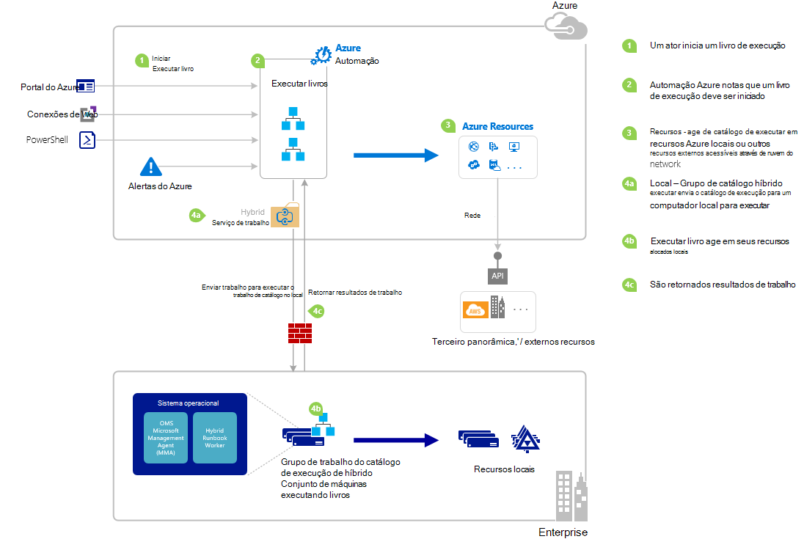

<properties
   pageTitle="Iniciando um runbook no Azure automação | Microsoft Azure"
   description="Resume os diferentes métodos que podem ser usados para iniciar uma runbook no Azure automação e fornece detalhes sobre como usar o portal do Azure e o Windows PowerShell."
   services="automation"
   documentationCenter=""
   authors="mgoedtel"
   manager="jwhit"
   editor="tysonn" />
<tags
   ms.service="automation"
   ms.devlang="na"
   ms.topic="article"
   ms.tgt_pltfrm="na"
   ms.workload="infrastructure-services"
   ms.date="10/08/2016"
   ms.author="magoedte;bwren"/>

# <a name="starting-a-runbook-in-azure-automation"></a>Iniciando um runbook no Azure automação

A tabela a seguir o ajudará a determinar o método para iniciar uma runbook em automação Azure que é mais adequado para seu cenário em particular. Este artigo inclui detalhes sobre como iniciar um runbook com o portal do Azure e com o Windows PowerShell. Para obter detalhes sobre os outros métodos são fornecidos em outra documentação que você pode acessar dos links abaixo.

| **MÉTODO**                                                                    | **CARACTERÍSTICAS**                                                                                                                                                                                                                                                                                                                                                |
|-------------------------------------------------------------------------------|--------------------------------------------------------------------------------------------------------------------------------------------------------------------------------------------------------------------------------------------------------------------------------------------------------------------------------------------------------------------|
| [Portal do Azure](#starting-a-runbook-with-the-azure-portal)                     | <li>Método mais simples com interface de usuário interativo.<br> <li>Formulário para fornecer valores de parâmetro simples.<br> <li>Controle facilmente o estado de trabalho.<br> <li>Acesso autenticado com logon Azure.                                                                                                                                                                               |
| [Windows PowerShell](https://msdn.microsoft.com/library/dn690259.aspx)        | <li>Ligar de linha de comando com os cmdlets do Windows PowerShell.<br> <li>Pode ser incluído na solução automatizada com várias etapas.<br> <li>Solicitação é autenticada com o certificado ou OAuth usuário principal / serviço principal.<br> <li>Forneça os valores de parâmetro simples e complexos.<br> <li>Controlar o estado de trabalho.<br> <li>Cliente necessário para dar suporte a cmdlets do PowerShell. |
| [API de automação do Azure](https://msdn.microsoft.com/library/azure/mt662285.aspx) | <li>Método mais flexível, mas também mais complexas.<br> <li>Chamar a partir de qualquer código personalizado que pode fazer solicitações HTTP.<br> <li>Solicitação autenticada com o certificado ou Oauth usuário principal / serviço principal.<br> <li>Forneça os valores de parâmetro simples e complexos.<br> <li>Controlar o estado de trabalho.                                                                          |
| [Webhooks](automation-webhooks.md)                                            | <li>Inicie runbook da única solicitação HTTP.<br> <li>Autenticada com o token de segurança de URL.<br> <li>Cliente não pode substituir valores de parâmetro especificados quando webhook criado. Runbook pode definir único parâmetro que é preenchido com os detalhes da solicitação HTTP.<br> <li>Nenhuma capacidade de controlar o estado de trabalho por meio de URL de webhook.                                      |
| [Responder a alerta Azure](../log-analytics/log-analytics-alerts.md)               | <li>Inicie um runbook em resposta ao alerta Azure.<br> <li>Configure webhook para runbook e link para o alerta.<br> <li>Autenticada com o token de segurança de URL.<br> <li>Atualmente oferece suporte alerta em métricas somente.                                                                                                                                                       |
| [Cronograma](automation-schedules.md)                                | <li>Inicie automaticamente runbook agenda por hora, diária ou semanal.<br> <li>Manipule cronograma através do portal do Azure, cmdlets do PowerShell ou API do Azure.<br> <li>Forneça os valores de parâmetro para ser usado com a agenda.                                                                                                                                               |
| [Do Runbook outro](automation-child-runbooks.md)                          | <li>Use um runbook como uma atividade no outro runbook.<br> <li>Útil para funcionalidade usada por vários runbooks.<br> <li>Fornecer valores de parâmetro para runbook filho e usar saída em runbook pai.                                                                                                                                                               |

A imagem a seguir ilustra o processo passo a passo detalhado no ciclo de vida de um runbook. Ele inclui um runbook é iniciado no Azure automação, componentes necessários para híbrido Runbook trabalhador para executar runbooks de automação do Azure e interações entre diferentes componentes de maneiras diferentes. Para saber sobre como executar automação runbooks na data center, consulte [trabalhadores de runbook híbrido](automation-hybrid-runbook-worker.md)



## <a name="starting-a-runbook-with-the-azure-portal"></a>Iniciando um runbook com o portal do Azure

1.  No portal do Azure, selecione **automação** e, em seguida, clique no nome de uma conta de automação.
2.  Selecione a guia **Runbooks** .
3.  Selecione um runbook e, em seguida, clique em **Iniciar**.
4.  Se runbook tiver parâmetros, você será solicitado a fornecer valores com uma caixa de texto para cada parâmetro. Consulte [Parâmetros de Runbook](#Runbook-parameters) abaixo para mais detalhes sobre parâmetros.
5.  Selecione **Exibir trabalho** ao lado da mensagem de runbook **Iniciando** ou selecione a guia **trabalhos** para runbook exibir o runbook status do trabalho.

## <a name="starting-a-runbook-with-the-azure-portal"></a>Iniciando um runbook com o portal do Azure

1.  De sua conta de automação, clique na parte de **Runbooks** para abrir a lâmina **Runbooks** .
2.  Clique em um runbook para abrir seu blade **Runbook** .
3.  Clique em **Iniciar**.
4.  Se runbook não tiver parâmetros, você será solicitado a confirmar se deseja iniciá-lo. Se runbook tiver parâmetros, o blade **Runbook iniciar** será aberto para que você possa fornecer valores de parâmetro. Consulte [Parâmetros de Runbook](#Runbook-parameters) abaixo para mais detalhes sobre parâmetros.
5.  A lâmina de **trabalho** é aberta para que você pode controlar o status do trabalho.

## <a name="starting-a-runbook-with-windows-powershell"></a>Iniciando um runbook com o Windows PowerShell

Você pode usar o [AzureRmAutomationRunbook iniciar](https://msdn.microsoft.com/library/mt603661.aspx) para iniciar uma runbook com o Windows PowerShell. O código de exemplo a seguir inicia uma runbook chamado Runbook de teste.

```
Start-AzureRmAutomationRunbook -AutomationAccountName "MyAutomationAccount" -Name "Test-Runbook" -ResourceGroupName "ResourceGroup01"
```

Iniciar AzureRmAutomationRunbook retorna um objeto de trabalho que você pode usar para controlar seu status quando runbook for iniciado. Em seguida, você pode usar esse objeto de trabalho com [Get-AzureRmAutomationJob](https://msdn.microsoft.com/library/mt619440.aspx) para determinar o status do trabalho e [Get-AzureRmAutomationJobOutput](https://msdn.microsoft.com/library/mt603476.aspx) para obter a saída. O código de exemplo a seguir inicia uma runbook chamado teste-Runbook, aguarda até que ele foi concluída e, em seguida, exibe seu resultado.

```
$runbookName = "Test-Runbook"
$ResourceGroup = "ResourceGroup01"
$AutomationAcct = "MyAutomationAccount"

$job = Start-AzureRmAutomationRunbook –AutomationAccountName $AutomationAcct -Name $runbookName -ResourceGroupName $ResourceGroup

$doLoop = $true
While ($doLoop) {
   $job = Get-AzureRmAutomationJob –AutomationAccountName $AutomationAcct -Id $job.JobId -ResourceGroupName $ResourceGroup
   $status = $job.Status
   $doLoop = (($status -ne "Completed") -and ($status -ne "Failed") -and ($status -ne "Suspended") -and ($status -ne "Stopped"))
}

Get-AzureRmAutomationJobOutput –AutomationAccountName $AutomationAcct -Id $job.JobId -ResourceGroupName $ResourceGroup –Stream Output
```

Se runbook requer parâmetros, você deve fornecê-los como uma [tabela de hash](http://technet.microsoft.com/library/hh847780.aspx) onde a chave da tabela de hash corresponde ao nome do parâmetro e o valor é o valor do parâmetro. O exemplo a seguir mostra como iniciar um runbook com dois parâmetros de cadeia de caracteres denominados nome e sobrenome, um número inteiro denominado RepeatCount e um parâmetro booliano chamada Show. Para obter informações adicionais sobre parâmetros, consulte [Parâmetros de Runbook](#Runbook-parameters) abaixo.

```
$params = @{"FirstName"="Joe";"LastName"="Smith";"RepeatCount"=2;"Show"=$true}
Start-AzureRmAutomationRunbook –AutomationAccountName "MyAutomationAccount" –Name "Test-Runbook" -ResourceGroupName "ResourceGroup01" –Parameters $params
```

## <a name="runbook-parameters"></a>Parâmetros de runbook

Quando você inicia um runbook do Portal Azure ou o Windows PowerShell, a instrução é enviada pelo serviço da web de automação do Azure. Esse serviço não oferece suporte a parâmetros com tipos de dados complexos. Se você precisar fornecer um valor para um parâmetro complexo, em seguida, você precisa chamar-embutida de runbook outro conforme descrito em [runbooks filho na automação do Azure](automation-child-runbooks.md).

O serviço da web de automação do Azure fornecerá funcionalidade especial para parâmetros usando certos tipos de dados, conforme descrito nas seções a seguir.

### <a name="named-values"></a>Valores nomeados

Se o parâmetro é o tipo de dados [objeto], você pode usar o seguinte formato JSON para enviá-la uma lista de valores nomeados: *{nome1: 'Valor1', Nome2: 'Valor2', nome3: 'Valor3'}*. Esses valores devem ser tipos simples. Runbook receberá o parâmetro como um [PSCustomObject](https://msdn.microsoft.com/library/system.management.automation.pscustomobject%28v=vs.85%29.aspx) com propriedades que correspondem a cada valor nomeado.

Considere a seguinte runbook de teste que aceita um parâmetro chamado de usuário.

```
Workflow Test-Parameters
{
   param (
      [Parameter(Mandatory=$true)][object]$user
   )
    $userObject = $user | ConvertFrom-JSON
    if ($userObject.Show) {
        foreach ($i in 1..$userObject.RepeatCount) {
            $userObject.FirstName
            $userObject.LastName
        }
    }
}
```

O texto a seguir poderia ser usado para o parâmetro de usuário.

```
{FirstName:'Joe',LastName:'Smith',RepeatCount:'2',Show:'True'}
```

Isso resulta na saída a seguir.

```
Joe
Smith
Joe
Smith
```

### <a name="arrays"></a>Matrizes

Se o parâmetro é uma matriz como [matriz] ou [string []], então você pode usar o seguinte formato JSON para enviá-lo em uma lista de valores: *[valor1, valor2, valor3]*. Esses valores devem ser tipos simples.

Considere o seguinte runbook teste que aceita um parâmetro chamado de *usuário*.

```
Workflow Test-Parameters
{
   param (
      [Parameter(Mandatory=$true)][array]$user
   )
    if ($user[3]) {
        foreach ($i in 1..$user[2]) {
            $ user[0]
            $ user[1]
        }
    }
}
```

O texto a seguir poderia ser usado para o parâmetro de usuário.

```
["Joe","Smith",2,true]
```

Isso resulta na saída a seguir.

```
Joe
Smith
Joe
Smith
```

### <a name="credentials"></a>Credenciais

Se o parâmetro é o tipo de dados **PSCredential**, você pode fornecer o nome de um [ativo de credencial](automation-credentials.md)do Azure automação. Runbook recuperará a credencial com o nome que você especificar.

Considere a seguinte runbook de teste que aceita um parâmetro chamado credencial.

```
Workflow Test-Parameters
{
   param (
      [Parameter(Mandatory=$true)][PSCredential]$credential
   )
   $credential.UserName
}
```

O texto a seguir poderia ser usado para o parâmetro de usuário presumindo que houve um ativo de credencial chamado *Minhas credenciais*.

```
My Credential
```

Considerando que o nome de usuário na credencial de foi *jsmith*, isso resulta na saída a seguir.

```
jsmith
```

## <a name="next-steps"></a>Próximas etapas

-   A arquitetura de runbook no artigo atual fornece uma visão geral do runbooks gerenciar recursos do Azure e no local com o operador de Runbook híbrido.  Para saber sobre como executar automação runbooks na data center, consulte [Híbrida Runbook trabalhadores](automation-hybrid-runbook-worker.md).
-   Para saber mais sobre a criação runbooks modular a ser usado por outros runbooks para funções específicas ou comuns, consulte [Runbooks filho](automation-child-runbooks.md).
