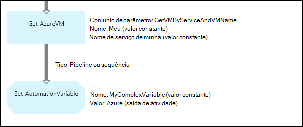

<properties 
   pageTitle="Variáveis ativos no Azure automação | Microsoft Azure"
   description="Variáveis ativos são valores que estão disponíveis para todos os runbooks e configurações de DSC na automação do Azure.  Este artigo explica os detalhes de variáveis e como trabalhar com eles em textuais e gráfica de criação."
   services="automation"
   documentationCenter=""
   authors="mgoedtel"
   manager="jwhit"
   editor="tysonn" />
<tags 
   ms.service="automation"
   ms.devlang="na"
   ms.topic="article"
   ms.tgt_pltfrm="na"
   ms.workload="infrastructure-services"
   ms.date="05/24/2016"
   ms.author="magoedte;bwren" />

# Variáveis ativos na automação do Azure

Variáveis ativos são valores que estão disponíveis para todos os runbooks e configurações de DSC em sua conta de automação. Eles podem ser criados, modificados e recuperados a partir do portal do Azure, o Windows PowerShell e em uma configuração de DSC ou runbook. Variáveis de automação são úteis para os seguintes cenários:

- Compartilhe um valor entre várias runbooks ou configurações de DSC.

- Compartilhe um valor entre vários trabalhos a partir da mesma runbook ou configuração de DSC.

- Gerencie um valor a partir do portal ou da linha de comando do Windows PowerShell que é usada pelo runbooks ou configurações de DSC.

Variáveis de automação são mantidas para que elas continuarão disponíveis mesmo se a configuração de DSC ou runbook falha.  Isso também permite que um valor a ser definido por uma runbook que é usado por outro, ou que é usado pelo mesmo runbook ou configuração de DSC na próxima vez que ele é executado.

Quando uma variável é criada, você pode especificar que ele seja armazenado criptografado.  Quando uma variável é criptografada, ela é armazenada com segurança na automação do Azure e seu valor não é possível recuperar o cmdlet [Get-AzureAutomationVariable](http://msdn.microsoft.com/library/dn913772.aspx) que é fornecido como parte do módulo do PowerShell do Azure.  É a única maneira que um valor criptografado pode ser recuperado da atividade **Get-AutomationVariable** em uma configuração de DSC ou runbook.

>[AZURE.NOTE]Proteger ativos no Azure automação incluem credenciais, certificados, conexões e variáveis criptografados. Esses ativos são criptografados e armazenados na automação Azure usando uma chave exclusiva que é gerada para cada conta de automação. Esta chave é criptografada por um certificado mestre e armazenada em automação do Azure. Antes de armazenar um ativo seguro, a chave da conta de automação é descriptografada usando o certificado mestre e, em seguida, usado para criptografar o ativo.

## Tipos de variáveis

Quando você cria uma variável com o portal do Azure, você deve especificar um tipo de dados na lista suspensa para que o portal possa exibir o controle apropriado para inserir o valor da variável. A variável não está restrita a esse tipo de dados, mas você deve definir a variável usando o Windows PowerShell se desejar especificar um valor de um tipo diferente. Se você especificar **não definido**, em seguida, o valor da variável será definido para **$null**e você deve definir o valor com o cmdlet [Set-AzureAutomationVariable](http://msdn.microsoft.com/library/dn913767.aspx) ou **Set-AutomationVariable** atividade.  Você não pode criar ou alterar o valor para um tipo de variável complexo no portal do, mas você pode fornecer um valor de qualquer tipo usando o Windows PowerShell. Tipos complexos serão retornados como um [PSCustomObject](http://msdn.microsoft.com/library/system.management.automation.pscustomobject.aspx).

Você pode armazenar vários valores para uma única variável criando uma matriz ou tabela de hash e salvá-lo para a variável.

## Atividades de fluxo de trabalho e cmdlets

Os cmdlets na tabela a seguir são usados para criar e gerenciar variáveis de automação com o Windows PowerShell. Eles fornecidos como parte do [módulo do PowerShell do Azure](../powershell-install-configure.md) que está disponível para uso em automação runbooks e configuração de DSC.

|Cmdlets|Descrição|
|:---|:---|
|[Get-AzureAutomationVariable](http://msdn.microsoft.com/library/dn913772.aspx)|Recupera o valor de uma variável existente.|
|[Novo AzureAutomationVariable](http://msdn.microsoft.com/library/dn913771.aspx)|Cria uma nova variável e define seu valor.|
|[Remover AzureAutomationVariable](http://msdn.microsoft.com/library/dn913775.aspx)|Remove uma variável existente.|
|[Set-AzureAutomationVariable](http://msdn.microsoft.com/library/dn913767.aspx)|Define o valor de uma variável existente.|

As atividades de fluxo de trabalho na tabela a seguir são usadas para acessar as variáveis de automação de um runbook. Eles estão disponíveis apenas para uso em uma configuração de DSC ou runbook e não são fornecidos como parte do módulo do PowerShell do Azure.

|Atividades de fluxo de trabalho|Descrição|
|:---|:---|
|Get-AutomationVariable|Recupera o valor de uma variável existente.|
|Set-AutomationVariable|Define o valor de uma variável existente.|

>[AZURE.NOTE] Evite usar variáveis no – nome parâmetro de **Get-AutomationVariable** em uma configuração de DSC desde que isso poderá complicar descobertas dependências entre runbooks ou configuração DSC e variáveis de automação em tempo de design ou runbook.

## Criando uma nova variável de automação

### Para criar uma nova variável com o portal do Azure

1. Na sua conta de automação, clique em **ativos** na parte superior da janela.
1. Na parte inferior da janela, clique em **Adicionar configuração**.
1. Clique em **Adicionar variável**.
1. Conclua o assistente e clique na caixa de seleção para salvar a nova variável.

### Para criar uma nova variável com o portal do Azure

1. De sua conta de automação, clique na parte de **ativos** para abrir a lâmina de **ativos** .
1. Clique na parte de **variáveis** para abrir a lâmina de **variáveis** .
1. Clique em **Adicionar uma variável** na parte superior da lâmina.
1. Preencha o formulário e clique em **criar** para salvar a nova variável.

### Para criar uma nova variável com o Windows PowerShell

O cmdlet [New-AzureAutomationVariable](http://msdn.microsoft.com/library/dn913771.aspx) cria uma nova variável e define seu valor inicial. Você pode recuperar o valor usando [Get-AzureAutomationVariable](http://msdn.microsoft.com/library/dn913772.aspx). Se o valor for um tipo simples, será retornado o mesmo tipo. Se for um tipo complexo, será retornado um **PSCustomObject** .

Os comandos de exemplo a seguir mostram como criar uma variável do tipo cadeia de caracteres e, em seguida, seu valor de retorno.

    New-AzureAutomationVariable –AutomationAccountName "MyAutomationAccount" –Name 'MyStringVariable' –Encrypted $false –Value 'My String'
    $string = (Get-AzureAutomationVariable –AutomationAccountName "MyAutomationAccount" –Name 'MyStringVariable').Value

Os comandos de exemplo a seguir mostram como criar uma variável com um tipo complexo e retorne suas propriedades. Nesse caso, um objeto de máquina virtual do **Get-AzureVM** é usado.

    $vm = Get-AzureVM –ServiceName "MyVM" –Name "MyVM"
    New-AzureAutomationVariable –AutomationAccountName "MyAutomationAccount" –Name "MyComplexVariable" –Encrypted $false –Value $vm
    
    $vmValue = (Get-AzureAutomationVariable –AutomationAccountName "MyAutomationAccount" –Name "MyComplexVariable").Value
    $vmName = $vmValue.Name
    $vmIpAddress = $vmValue.IpAddress

## Usando uma variável em uma configuração de DSC ou runbook

Use a atividade de **Set-AutomationVariable** para definir o valor de uma variável de automação em um runbook ou configuração de DSC e o **Get-AutomationVariable** para recuperá-lo.  Você não deve usar os cmdlets **Set-AzureAutomationVariable** ou **Get-AzureAutomationVariable** em uma configuração de DSC ou runbook como eles são menos eficientes do que as atividades de fluxo de trabalho.  Você também não pode recuperar o valor de variáveis seguros com **Get-AzureAutomationVariable**.  A única maneira de criar uma nova variável de dentro de uma configuração de DSC ou runbook é usar o cmdlet [New-AzureAutomationVariable](http://msdn.microsoft.com/library/dn913771.aspx) .

### Exemplos de runbook textuais

#### Configurando e recuperando um valor simples de uma variável

Os comandos de exemplo a seguir mostram como definir e recuperar uma variável em um runbook textual. Neste exemplo, será considerado que variáveis do tipo inteiro chamado *NumberOfIterations* e *NumberOfRunnings* e uma variável do tipo cadeia de caracteres nomeado *SampleMessage* já foram criadas.

    $NumberOfIterations = Get-AutomationVariable -Name 'NumberOfIterations'
    $NumberOfRunnings = Get-AutomationVariable -Name 'NumberOfRunnings'
    $SampleMessage = Get-AutomationVariable -Name 'SampleMessage'
    
    Write-Output "Runbook has been run $NumberOfRunnings times."
    
    for ($i = 1; $i -le $NumberOfIterations; $i++) {
       Write-Output "$i`: $SampleMessage"
    }
    Set-AutomationVariable –Name NumberOfRunnings –Value ($NumberOfRunnings += 1)

#### Configurando e recuperando um objeto complexo em uma variável

O código de exemplo a seguir mostra como atualizar uma variável com um valor complexo em uma runbook textual. Neste exemplo, uma máquina virtual Azure é recuperada com **Get-AzureVM** e salva uma variável de automação existente.  Como explicado em [tipos de variáveis](#variable-types), isso é armazenado como um PSCustomObject.

    $vm = Get-AzureVM -ServiceName "MyVM" -Name "MyVM"
    Set-AutomationVariable -Name "MyComplexVariable" -Value $vm

No código a seguir, o valor é recuperado da variável e usado para iniciar a máquina virtual.

    $vmObject = Get-AutomationVariable -Name "MyComplexVariable"
    if ($vmObject.PowerState -eq 'Stopped') {
       Start-AzureVM -ServiceName $vmObject.ServiceName -Name $vmObject.Name
    }

#### Configurando e recuperando um conjunto em uma variável

O código de exemplo a seguir mostra como usar uma variável com um conjunto de valores complexos em uma runbook textual. Neste exemplo, várias máquinas virtuais Azure são recuperadas com **Get-AzureVM** e salva uma variável de automação existente.  Como explicado em [tipos de variáveis](#variable-types), isso é armazenado como uma coleção de PSCustomObjects.

    $vms = Get-AzureVM | Where -FilterScript {$_.Name -match "my"}     
    Set-AutomationVariable -Name 'MyComplexVariable' -Value $vms

No código a seguir, a coleção é recuperada a partir da variável e usada para iniciar cada máquina virtual.

    $vmValues = Get-AutomationVariable -Name "MyComplexVariable"
    ForEach ($vmValue in $vmValues)
    {
       if ($vmValue.PowerState -eq 'Stopped') {
          Start-AzureVM -ServiceName $vmValue.ServiceName -Name $vmValue.Name
       }
    }

### Exemplos de runbook gráfica

Um runbook gráfica, você adiciona o **Get-AutomationVariable** ou **Set-AutomationVariable** clicando na variável no painel de biblioteca do editor gráfico e selecionando a atividade desejada.

#### Definir valores em uma variável

A imagem a seguir mostra as atividades de amostra para atualizar uma variável com um valor simple em um runbook gráfica. Neste exemplo, uma única máquina virtual Azure é recuperada com **Get-AzureVM** e o nome do computador é salva em uma variável de automação existente com um tipo de cadeia de caracteres.  Não importa se o [link é um pipeline ou sequência](automation-graphical-authoring-intro.md#links-and-workflow) desde que esperamos que apenas um único objeto na saída.

A imagem a seguir mostra as atividades usadas para atualizar uma variável com um valor complexo em uma runbook gráfica. A única alteração do exemplo anterior não está especificando um **caminho de campo** para a **saída de atividade** na atividade **Set-AutomationVariable** para que o objeto está armazenado em vez de apenas uma propriedade do objeto.  Como explicado em [tipos de variáveis](#variable-types), isso é armazenado como um PSCustomObject.

A imagem a seguir mostra a funcionalidade similar como no exemplo anterior, com várias máquinas virtuais salvas para a variável.  Um [link de sequência](automation-graphical-authoring-intro.md#links-and-workflow) deve ser usado para que a atividade de **Conjunto AutomationVariable** recebe todo o conjunto de máquinas virtuais como uma coleção.  Se um [link de pipeline](automation-graphical-authoring-intro.md#links-and-workflow) foi usada, então a atividade de **Conjunto AutomationVariable** seria executado separadamente para cada objeto com o resultado sendo que poderiam ser salvos apenas a última máquina virtual no conjunto de.  Como explicado em [tipos de variáveis](#variable-types), isso é armazenado como uma coleção de PSCustomObjects.

#### Recuperando valores de uma variável

A imagem a seguir mostra as atividades de amostra que recuperar e usam uma variável em um runbook gráfica.  A primeira atividade recupera as máquinas virtuais que foram salvas para a variável no exemplo anterior.  O link precisa ser um [pipeline](automation-graphical-authoring-intro.md#links-and-workflow) para que a atividade de **Início-AzureVM** executa uma vez para cada objeto enviado da atividade de **Get-AutomationVariable** .  Isso funcionará a mesma se um um único objeto ou vários objetos são armazenados na variável.  A atividade de **Início-AzureVM** usa propriedades da PSCustomObject que representa cada máquina virtual. 

A imagem a seguir mostra como os objetos que estão armazenados em uma variável em um runbook gráfica de filtro.  Uma [condição](automation-graphical-authoring-intro.md#links-and-workflow) é adicionada ao link no exemplo anterior para filtrar apenas essas máquinas virtuais que foram interrompidas quando a variável foi definida.

## Próximas etapas

- Para saber mais sobre como conectar atividades juntos na criação de gráficos, consulte [Links na criação de gráficos](automation-graphical-authoring-intro.md#links-and-workflow)
- Para começar a usar runbooks gráficas, consulte [Minha primeira runbook gráfica](automation-first-runbook-graphical.md) 
