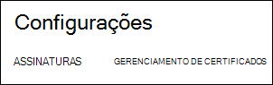
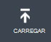
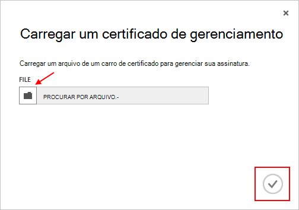

<properties 
    pageTitle="Carregar um certificado de API de gerenciamento Azure | Microsoft Azure" 
    description="Saiba como carregar certficado de API de gerenciamento de athe para o Portal de clássico do Azure." 
    services="cloud-services" 
    documentationCenter=".net" 
    authors="Thraka" 
    manager="timlt" 
    editor=""/>

<tags 
    ms.service="na" 
    ms.workload="tbd" 
    ms.tgt_pltfrm="na" 
    ms.devlang="na" 
    ms.topic="article" 
    ms.date="04/18/2016"
    ms.author="adegeo"/>

# Carregar um certificado de gerenciamento de API de gerenciamento Azure

Certificados gerenciamento permitem que você autenticar com a API de gerenciamento do serviço fornecido pelo Azure. Muitos programas e ferramentas (como Visual Studio ou o SDK do Azure) usará esses certificados para automatizar o processo de configuração e implantação dos vários serviços Azure. **Isso só se aplica ao portal clássico do Azure**. 

>[AZURE.WARNING] Tenha cuidado! Esses tipos de certificados permitir que qualquer pessoa que autentica com elas para gerenciar a assinatura que eles estão associados. 

Mais informações sobre certificados Azure (incluindo criando um certificado autoassinado) estão [disponível](cloud-services/cloud-services-certs-create.md#what-are-management-certificates) para você caso necessário.

Você também pode usar o [Active Directory do Azure](/services/active-directory/) para autenticar o código do cliente para fins de automação.

## Carregar um certificado de gerenciamento

Depois que você tiver um certficado de gerenciamento criado, (arquivo. cer com somente a chave pública) você pode carregá-lo no portal. Quando o certificado está disponível no portal do, qualquer pessoa com um certficiate correspondente (chave particular) pode se conectar por meio da API de gerenciamento e acessar os recursos para a assinatura associado.

1. Faça logon no [portal de clássico Azure](http://manage.windowsazure.com).

2. Certifique-se de selecionar a assinatura correta que você deseja associar um certificado com. Pressione o texto de **assinaturas** no canto superior direito do portal.

    

3. Depois que a assinatura correta selecionada, pressione **configurações** no lado esquerdo do portal (talvez seja necessário rolar para baixo). 
    
    

4. Pressione a guia de **Gerenciamento de certificados** .

    
    
5. Pressione o botão **carregar** .

    
    
6. Preencha as informações da caixa de diálogo e pressione a **marca de seleção**de concluído.

    

## Próximas etapas

Agora que você tem um certficado de gerenciamento associado a uma assinatura, você pode (depois de ter instalado o certificado correspondente localmente) programaticamente conectar-se à [API de REST de gerenciamento de serviço](https://msdn.microsoft.com/library/azure/mt420159.aspx) e automatizar a vários recursos Azure que também estão associados essa assinatura. 