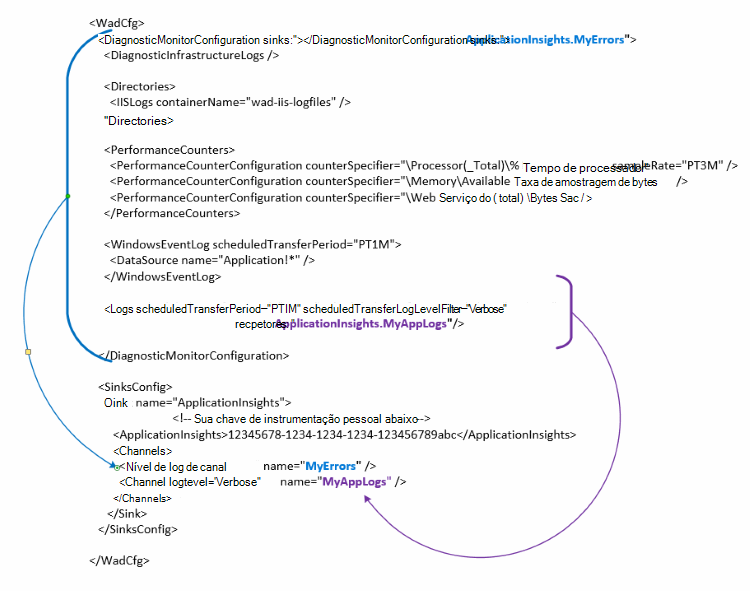

<properties
   pageTitle="Configurar o diagnóstico do Azure para enviar dados para obtenção de informações de aplicativo | Microsoft Azure"
   description="Atualize a configuração de diagnóstico do Azure pública para enviar dados de obtenção de informações do aplicativo."
   services="multiple"
   documentationCenter=".net"
   authors="sbtron"
   manager="douge"
   editor="" />
<tags
   ms.service="application-insights"
   ms.devlang="na"
   ms.topic="article"
   ms.tgt_pltfrm="na"
   ms.workload="na"
   ms.date="12/15/2015"
   ms.author="saurabh" />

# Configurar o diagnóstico do Azure para enviar dados para obtenção de informações de aplicativo

Diagnóstico do Azure armazena dados às tabelas de armazenamento do Azure.  No entanto, você também pode barra vertical todos ou um subconjunto dos dados de obtenção de informações de aplicativo configurando "recpetores" e "canais" em sua configuração usando a extensão de diagnóstico do Azure 1.5 ou posterior.

Este artigo descreve como criar a configuração pública para a extensão de diagnóstico do Azure para que seu configurado para enviar dados de obtenção de informações do aplicativo.

## Configurando o aplicativo ideias como um receptor

A extensão de diagnóstico do Azure 1,5 apresenta o **<SinksConfig>** elemento na configuração do público. Isso define o adicionais *receptor* onde os dados de diagnóstico do Azure podem ser enviados. Você pode especificar os detalhes do recurso ideias de aplicativo onde você deseja enviar os dados de diagnóstico do Azure como parte desse **<SinksConfig>**.
Um exemplo **SinksConfig** tem esta aparência-  

    <SinksConfig>
        <Sink name="ApplicationInsights">
          <ApplicationInsights>{Insert InstrumentationKey}</ApplicationInsights>
          <Channels>
            <Channel logLevel="Error" name="MyTopDiagData"  />
            <Channel logLevel="Verbose" name="MyLogData"  />
          </Channels>
        </Sink>
      </SinksConfig>

Para o elemento de **receptor** o atributo *name* Especifica um valor de cadeia de caracteres que será usado para consultar exclusivamente o receptor.
O elemento **ApplicationInsights** Especifica a chave de instrumentação o obtenção de informações de recurso de aplicativo onde os dados de diagnóstico do Azure serão enviados. Se você não tiver um recurso de obtenção de informações de aplicativo existente, consulte [criar um novo recurso de obtenção de informações do aplicativo](./application-insights/app-insights-create-new-resource.md) para obter mais informações sobre a criação de um recurso e obter a chave de instrumentação.

Se você está desenvolvendo um projeto de serviço de nuvem com o Azure SDK 2,8 esta tecla instrumentação é preenchida automaticamente na configuração pública baseada na configuração do serviço **APPINSIGHTS_INSTRUMENTATIONKEY** quando o projeto de serviço de nuvem de embalagem. Consulte [Usar obtenção de informações de aplicativo com diagnóstico do Azure para solucionar problemas de serviço de nuvem](./cloud-services/cloud-services-dotnet-diagnostics-applicationinsights.md).

O elemento de **canais** permite que você defina um ou mais elementos de **canal** para os dados que serão enviados para o receptor. O canal funciona como um filtro e permite que você selecione níveis de log específico que você gostaria de enviar para o receptor. Por exemplo, você pode coletar logs detalhados e enviá-los para armazenamento, mas você pode optar por definir um canal com um nível de log de erro e quando você enviar logs por meio de que os logs de erro somente de canal serão enviados para esse receptor.
De um **canal** o atributo *name* é usado para se referem exclusivamente a esse canal.
O atributo *loglevel* permite especificar o nível de log que permitirão o canal. Os níveis de log disponíveis em ordem das informações mais menos são
 - Detalhado
 - Informações
 - Aviso
 - Erro
 - Crítica

## Enviar dados para o receptor de obtenção de informações de aplicativo
Depois que o receptor de obtenção de informações do aplicativo tiver sido definida pode enviar dados para esse receptor, adicionando o atributo *receptor* aos elementos sob o nó **DiagnosticMonitorConfiguration** . Adicionando o elemento *recpetores* a cada nó Especifica que você deseja dados coletados de nó e qualquer nó sejam enviadas para o receptor especificado.

Por exemplo, se você deseja enviar todos os dados que estão sendo coletados pelo diagnóstico do Azure, em seguida, você pode adicionar o atributo *receptor* diretamente para o nó de **DiagnosticMonitorConfiguration** . Defina o valor dos *coletores* para o nome de receptor que foi especificado na **SinkConfig**.

    <DiagnosticMonitorConfiguration overallQuotaInMB="4096" sinks="ApplicationInsights">

Se você quiser enviar apenas os logs de erros para a obtenção de informações de aplicativo PIA e em seguida, você pode definir o valor de *receptores* para o nome de receptor seguido do nome de canal separado por um ponto ("."). Por exemplo, para enviar logs de erro somente para a obtenção de informações do aplicativo receptor usar o canal de MyTopDiagdata que foi definido na SinksConfig acima.  

    <DiagnosticMonitorConfiguration overallQuotaInMB="4096" sinks="ApplicationInsights.MyTopDiagdata">

Se você só quiser enviar logs de aplicativo detalhado de obtenção de informações do aplicativo você adiciona o atributo *recpetores* para o nó de **Logs** .

    <Logs scheduledTransferPeriod="PT1M" scheduledTransferLogLevelFilter="Verbose" sinks="ApplicationInsights.MyLogData"/>

Você também pode incluir vários receptores na configuração em diferentes níveis da hierarquia. Nesse caso, o receptor especificado no nível superior da hierarquia atua como uma configuração global e especificada no elemento individual elemento atuar como uma substituição para essa configuração global.    

Aqui está um exemplo completo do arquivo de configuração pública que envia todos os erros para a obtenção de informações de aplicativo (especificado no nó **DiagnosticMonitorConfiguration** ) e logs de nível detalhados além para os Logs de aplicativo (especificado no nó **Logs** ).

    <WadCfg>
      <DiagnosticMonitorConfiguration overallQuotaInMB="4096"
           sinks="ApplicationInsights.MyTopDiagData"> <!-- All info below sent to this channel -->
        <DiagnosticInfrastructureLogs />
        <PerformanceCounters>
          <PerformanceCounterConfiguration counterSpecifier="\Processor(_Total)\% Processor Time" sampleRate="PT3M" sinks="ApplicationInsights.MyLogData/>
          <PerformanceCounterConfiguration counterSpecifier="\Memory\Available MBytes" sampleRate="PT3M" />
          <PerformanceCounterConfiguration counterSpecifier="\Web Service(_Total)\Bytes Total/Sec" sampleRate="PT3M" />
        </PerformanceCounters>
        <WindowsEventLog scheduledTransferPeriod="PT1M">
          <DataSource name="Application!*" />
        </WindowsEventLog>
        <Logs scheduledTransferPeriod="PT1M" scheduledTransferLogLevelFilter="Verbose"
                sinks="ApplicationInsights.MyLogData"/> <!-- This specific info sent to this channel -->
      </DiagnosticMonitorConfiguration>

    <SinksConfig>
        <Sink name="ApplicationInsights">
          <ApplicationInsights>{Insert InstrumentationKey}</ApplicationInsights>
          <Channels>
            <Channel logLevel="Error" name="MyTopDiagData"  />
            <Channel logLevel="Verbose" name="MyLogData"  />
          </Channels>
        </Sink>
      </SinksConfig>
    </WadCfg>

Existem algumas limitações a serem consideradas com essa funcionalidade

- Canais destinam-se apenas para trabalhar com o tipo de log e não contadores de desempenho. Se você especificar um canal com um elemento de contador de desempenho que ele será ignorado.
- O nível de log de um canal não pode exceder o nível de log para o que está sendo coletado pelo diagnóstico do Azure. Por exemplo: você não pode coletar erros do Log de aplicativo no elemento Logs e tente enviar detalhado logs para o receptor de visão de aplicativo. O atributo *scheduledTransferLogLevelFilter* sempre deve coletar igual ou mais logs do que os logs que você está tentando enviar para um receptor.
- Você não pode enviar quaisquer dados blob coletadas pelo extensão de diagnóstico do Azure de obtenção de informações do aplicativo. Por exemplo nada especificado sob o nó de *diretórios* . Para falha descarta o despejo real ainda será enviado ao armazenamento de blob e somente uma notificação de que o despejo gerado será enviada para a obtenção de informações do aplicativo.

## Próximas etapas

- Use o [PowerShell](./cloud-services/cloud-services-diagnostics-powershell.md) para habilitar a extensão de diagnóstico do Azure para seu aplicativo. 
- Use o [Visual Studio](vs-azure-tools-diagnostics-for-cloud-services-and-virtual-machines.md) para habilitar a extensão de diagnóstico do Azure para seu aplicativo
