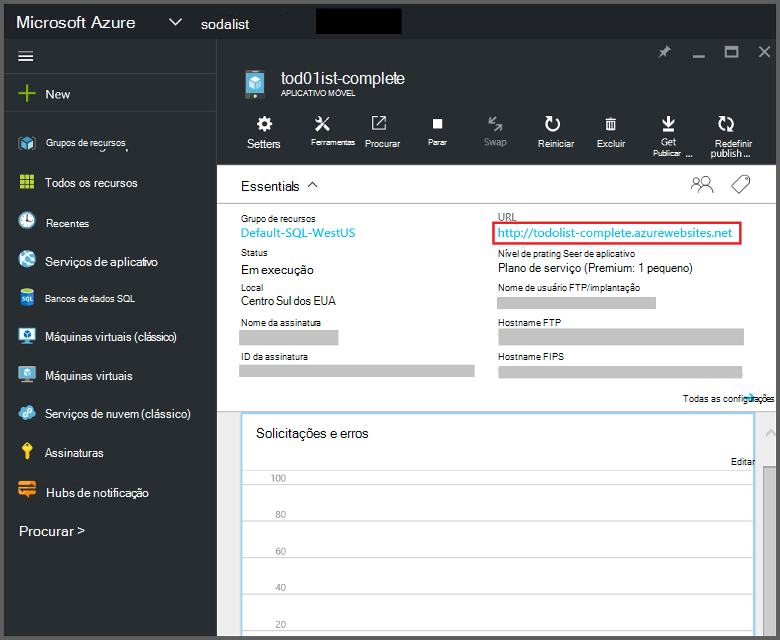
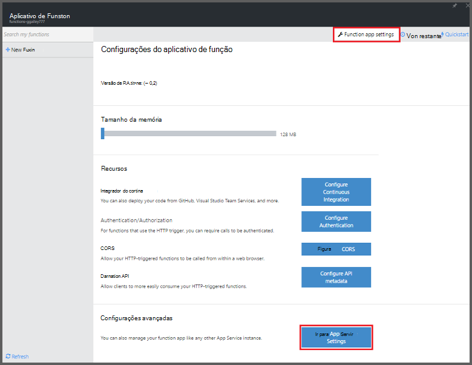
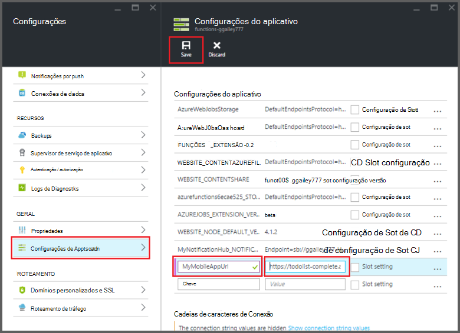

<properties
    pageTitle="Associações de aplicativos de Mobile funções Azure | Microsoft Azure"
    description="Compreenda como usar ligações de aplicativos do Azure Mobile em funções do Azure."
    services="functions"
    documentationCenter="na"
    authors="ggailey777"
    manager="erikre"
    editor=""
    tags=""
    keywords="funções de Azure, funções, processamento de eventos, computação dinâmico, arquitetura sem servidor"/>

<tags
    ms.service="functions"
    ms.devlang="multiple"
    ms.topic="reference"
    ms.tgt_pltfrm="multiple"
    ms.workload="na"
    ms.date="08/30/2016"
    ms.author="glenga"/>

# Azure ligações de aplicativos do Mobile de funções

[AZURE.INCLUDE [functions-selector-bindings](../../includes/functions-selector-bindings.md)]

Este artigo explica como configurar e ligações de aplicativos do Azure Mobile código em funções do Azure. 

[AZURE.INCLUDE [intro](../../includes/functions-bindings-intro.md)] 

Aplicativos do Azure aplicativo serviço Mobile permite expor dados de ponto de extremidade de tabela para clientes móveis. Estes mesmos dados tabulares podem ser usados com entrada e saída ligações em funções do Azure. Porque ele dá suporte a esquema dinâmica, um aplicativo móvel de back-end Node é ideal para expor dados tabulares para usar com suas funções. Esquema dinâmica é ativada por padrão e deve ser desabilitada em um aplicativo móvel de produção. Para obter mais informações sobre pontos de extremidade de tabela em um back-end Node, consulte [Visão geral: operações de tabela](../app-service-mobile/app-service-mobile-node-backend-how-to-use-server-sdk.md#TableOperations). Em aplicativos móveis, back-end node suporta no portal navegação e edição de tabelas. Para obter mais informações, consulte [no portal de edição](../app-service-mobile/app-service-mobile-node-backend-how-to-use-server-sdk.md#in-portal-editing) no tópico SDK Node. Quando você usa um aplicativo móvel de back-end do .NET com funções do Azure, você deve atualizar manualmente o modelo de dados conforme necessário pela sua função. Para obter mais informações sobre pontos de extremidade de tabela em um aplicativo móvel de back-end do .NET, consulte [como: definir um controlador de tabela](../app-service-mobile/app-service-mobile-dotnet-backend-how-to-use-server-sdk.md#define-table-controller) no tópico SDK .NET back-end. 

## Criar uma variável de ambiente para a URL de back-end do aplicativo móvel

Associações de aplicativos Mobile atualmente exigem que você crie uma variável de ambiente que retorna a URL do aplicativo móvel back-end em si. Essa URL pode ser encontrada no [portal do Azure](https://portal.azure.com) localizando o aplicativo móvel e abrindo a lâmina.

Para definir esta URL como uma variável de ambiente em seu aplicativo de função:

1. No seu aplicativo de função no [portal de funções do Azure](https://functions.azure.com/signin), clique em **configurações do aplicativo de função** > **vá para configurações de serviço de aplicativo**. 

    

2. Em seu aplicativo de função, clique em **todas as configurações**, role para baixo até **as configurações do aplicativo**, em seguida, em tipo de **configurações do aplicativo** um novo **nome** para a variável de ambiente, cole a URL no **valor**, lembrando-se usar o esquema de HTTPS, e clique em **Salvar** e feche a lâmina de aplicativo de função para retornar para o portal de funções.   

    

Agora você pode definir esta variável de ambiente novo como o campo de *conexão* em suas ligações.

## Use uma chave de API para acesso seguro aos seus pontos de extremidade de tabela de aplicativos Mobile.

Em funções do Azure, ligações de tabela móveis permitem especificar uma chave API, que é um segredo compartilhado que pode ser usado para impedir o acesso indesejado de aplicativos diferente de suas funções. Aplicativos Mobile não tem suporte interno para autenticação de chave API. No entanto, você pode implementar uma chave API em seu aplicativo móvel do Node back-end seguindo os exemplos de [aplicativos do Azure aplicativo serviço Mobile back-end implementando uma chave API](https://github.com/Azure/azure-mobile-apps-node/tree/master/samples/api-key). Da mesma forma, você pode implementar uma chave API em um [aplicativo móvel do .NET back-end](https://github.com/Azure/azure-mobile-apps-net-server/wiki/Implementing-Application-Key).

>[AZURE.IMPORTANT] Esta chave API não deve ser distribuído com seus clientes de aplicativo móvel, só deve ser distribuído com segurança para clientes do lado do serviço, como funções do Azure. 

## Vinculação de entrada de aplicativos do Azure Mobile

Associações de entrada podem carregar um registro de um ponto de extremidade de tabela móvel e passar diretamente para sua vinculação. O registro que ID é determinado com base no disparador que chamou a função. Em uma função c#, quaisquer alterações feitas no registro são enviadas automaticamente para a tabela quando a função sai com êxito.

#### Function.JSON para vinculação de entrada de aplicativos Mobile

O arquivo de *function.json* compatível com as seguintes propriedades:

- `name`: Nome variável usado no código de função do novo registro.
- `type`: Biding tipo deve ser definida como *mobileTable*.
- `tableName`: A tabela onde o novo registro será criado.
- `id`: A ID do registro para recuperar. Essa propriedade oferece suporte a ligações semelhantes a `{queueTrigger}`, que usará o valor de cadeia de caracteres da mensagem fila do registro ID.
- `apiKey`: Cadeia de caracteres que é a configuração de aplicativo que especifica a chave de API opcional para o aplicativo móvel. Isso é necessário quando o aplicativo móvel usa uma chave API para restringir o acesso de cliente.
- `connection`: Cadeia de caracteres que é o nome da variável de ambiente nas configurações do aplicativo que especifica a URL do seu back-end do aplicativo móvel.
- `direction`: Direção vinculação, o que deve ser definida como *no*.

Exemplo de arquivo de *function.json* :

    {
      "bindings": [
        {
          "name": "record",
          "type": "mobileTable",
          "tableName": "MyTable",
          "id" : "{queueTrigger}",
          "connection": "My_MobileApp_Url",
          "apiKey": "My_MobileApp_Key",
          "direction": "in"
        }
      ],
      "disabled": false
    }

#### Exemplo de código de aplicativos Mobile Azure para um gatilho de fila c#

De acordo com o function.json de exemplo acima, o recupera de associação de entrada que o registro de um aplicativos móveis tabela ponto de extremidade com a ID que corresponde a cadeia de caracteres de mensagem de fila e passa para o parâmetro de *registro* . Quando o registro não for encontrado, o parâmetro é nulo. O registro é atualizado com o novo valor de *texto* quando a função sai.

    #r "Newtonsoft.Json"    
    using Newtonsoft.Json.Linq;
    
    public static void Run(string myQueueItem, JObject record)
    {
        if (record != null)
        {
            record["Text"] = "This has changed.";
        }    
    }

#### Exemplo de código de aplicativos Mobile Azure para um gatilho de fila Node

De acordo com o function.json de exemplo acima, o recupera de associação de entrada que o registro de um aplicativos móveis tabela ponto de extremidade com a ID que corresponde a cadeia de caracteres de mensagem de fila e passa para o parâmetro de *registro* . Em funções de Node, registros atualizados não são enviados para a tabela. Este exemplo de código grava o registro recuperado no log.

    module.exports = function (context, input) {    
        context.log(context.bindings.record);
        context.done();
    };

## Os aplicativos do Azure Mobile ligação de saída

Sua função pode gravar um registro em um ponto de extremidade de tabela de aplicativos Mobile usando uma associação de saída. 

#### ligação de saída Function.JSON para aplicativos móvel

O arquivo de function.json compatível com as seguintes propriedades:

- `name`: Nome variável usado no código de função do novo registro.
- `type`: Tipo de vinculação que deve ser definido como *mobileTable*.
- `tableName`: A tabela onde o novo registro é criado.
- `apiKey`: Cadeia de caracteres que é a configuração de aplicativo que especifica a chave de API opcional para o aplicativo móvel. Isso é necessário quando o aplicativo móvel usa uma chave API para restringir o acesso de cliente.
- `connection`: Cadeia de caracteres que é o nome da variável de ambiente nas configurações do aplicativo que especifica a URL do seu back-end do aplicativo móvel.
- `direction`: Direção ligação, que deve ser definida para *check-out*.

Function.json de exemplo:

    {
      "bindings": [
        {
          "name": "record",
          "type": "mobileTable",
          "tableName": "MyTable",
          "connection": "My_MobileApp_Url",
          "apiKey": "My_MobileApp_Key",
          "direction": "out"
        }
      ],
      "disabled": false
    }

#### Exemplo de código de aplicativos Mobile Azure para um gatilho de fila c#

Este exemplo de código c# insere um novo registro em um ponto de extremidade de tabela de aplicativos Mobile com uma propriedade de *texto* na tabela especificada na ligação acima.

    public static void Run(string myQueueItem, out object record)
    {
        record = new {
            Text = $"I'm running in a C# function! {myQueueItem}"
        };
    }

#### Exemplo de código de aplicativos Mobile Azure para um gatilho de fila Node

Este exemplo de código Node insere um novo registro em um ponto de extremidade de tabela de aplicativos Mobile com uma propriedade de *texto* na tabela especificada na ligação acima.

    module.exports = function (context, input) {
    
        context.bindings.record = {
            text : "I'm running in a Node function! Data: '" + input + "'"
        }   
    
        context.done();
    };

## Próximas etapas

[AZURE.INCLUDE [next steps](../../includes/functions-bindings-next-steps.md)]
