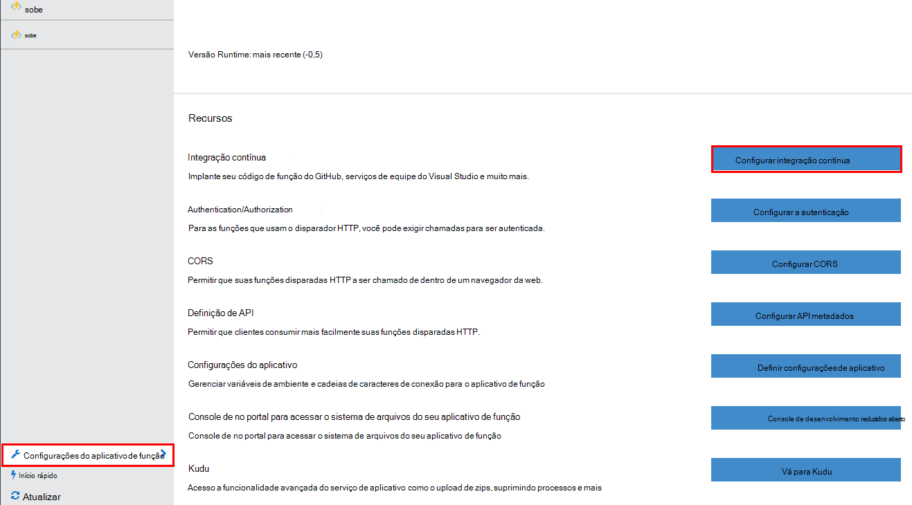
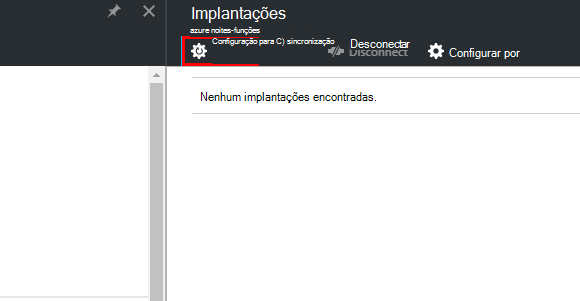
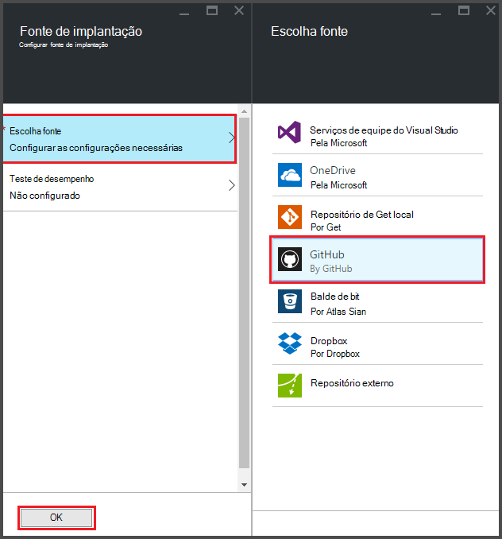
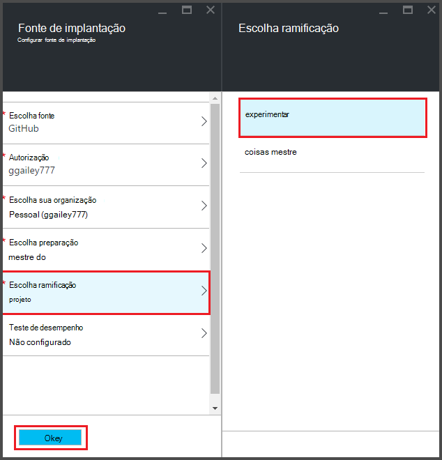
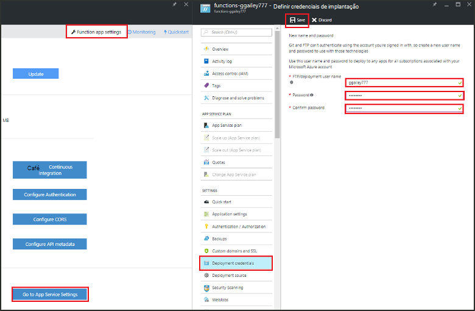
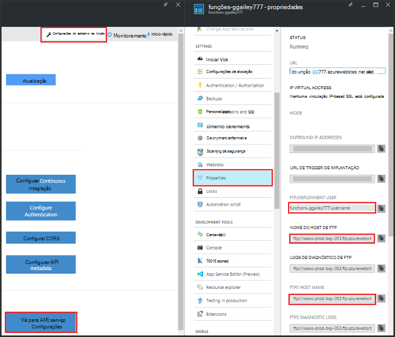
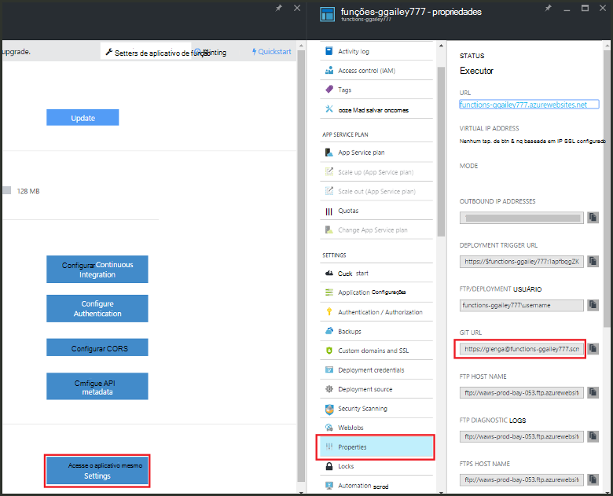

<properties
   pageTitle="Implantação contínua para funções do Azure | Microsoft Azure"
   description="Use recursos de implantação contínuo do serviço de aplicativo do Azure para publicar suas funções do Azure."
   services="functions"
   documentationCenter="na"
   authors="ggailey777"
   manager="erikre"
   editor=""
   tags=""
   />

<tags
   ms.service="functions"
   ms.devlang="multiple"
   ms.topic="article"
   ms.tgt_pltfrm="multiple"
   ms.workload="na"
   ms.date="09/25/2016"
   ms.author="glenga"/>

# Implantação contínua para funções do Azure 

Funções Azure facilita a configurar a implantação contínua para seu aplicativo de função. Funções utiliza a integração de serviço de aplicativo do Azure com BitBucket, Dropbox, GitHub e equipe serviços VSTS (Visual Studio) para ativar um fluxo de trabalho de implantação contínuo onde o Azure recebe as atualizações ao seu código de funções quando elas são publicadas em um desses serviços. Se você estiver começando a usar funções do Azure, comece com [Visão geral de funções do Azure](functions-overview.md).

Implantação contínua é uma ótima opção para projetos onde vários e contribuições frequentes estão sendo integradas. Ele também permite manter o controle da fonte em seu código de funções. As seguintes fontes de implantação são suportadas:

+ [Bitbucket](https://bitbucket.org/)
+ [Dropbox](https://bitbucket.org/)
+ [Repo local gito](../app-service-web/app-service-deploy-local-git.md)
+ Repo externo gito
+ [GitHub]
+ Mercurial repo externo
+ [OneDrive](https://onedrive.live.com/)
+ Serviços de equipe do Visual Studio

Implantações são configuradas em cada aplicativo por função. Depois de implantação contínua estiver habilitada, acesso ao código de função no portal está definido como *somente leitura*.

## Requisitos de implantação contínuo

Você deve ter sua fonte de implantação configurado e seu código de funções na fonte de implantação antes de você configurar contínuo implantação. Em uma implantação de aplicativo de determinada função, cada função reside em uma subpasta nomeada, o nome do diretório há o nome da função. Essa estrutura de pasta é essencialmente o código do seu site. 

[AZURE.INCLUDE [functions-folder-structure](../../includes/functions-folder-structure.md)]

## Configurar contínua implantação

Use o procedimento a seguir para configurar a implantação contínua para um aplicativo de função existente:

1. No seu aplicativo de função no [portal de funções do Azure](https://functions.azure.com/signin), clique em **configurações do aplicativo de função** > **integração contínua configurar** > **configuração**.

    
    
    
    
    Você também pode chegar lâmina implantações do início rápido funções clicando em **Iniciar do controle de origem**.

2. Na lâmina implantações, clique em **Escolher fonte**, em seguida, Fill-in as informações para sua fonte de implantação escolhido e clique em **Okey**.

    

Após a implantação contínua estiver configurada, todos os arquivos de alterações na sua fonte de implantação são copiados para o aplicativo de função e uma implantação de site completo for disparada. O site é redistribuído quando arquivos na fonte são atualizados.

##Opções de implantação

Estes são alguns cenários comuns de implantação:

+ 

###Criar uma implantação de teste

Função aplicativos ainda não dá suporte a slots de implantação. No entanto, você ainda poderá gerenciar implantações de estágios e de produção separadas usando a integração contínua.

O processo para configurar e trabalhar com uma implantação preparação geralmente tem esta aparência:

1. Crie dois aplicativos de função em sua assinatura, uma para o código de produção e outra para preparação. 

2. Crie uma fonte de implantação, se ainda não tiver uma. Usaremos [GitHub].
 
3. Para o aplicativo de função de produção, conclua as etapas acima em **Configurar contínua implantação** e defina a ramificação de implantação para a ramificação mestre de sua repo GitHub.

    

4. Repita esta etapa para o aplicativo de função preparação, mas desta vez Escolha a ramificação preparação no seu repo GitHub. Se sua fonte de implantação não dá suporte a ramificação, use uma pasta diferente.
 
5. Fazer atualizações em seu código no teste ramificação ou pasta e, em seguida, verificar se essas alterações são refletidas na implantação de teste.

6. Após o teste, mesclar alterações a partir da ramificação preparação na ramificação mestre. Isso acionará a implantação do aplicativo de função de produção. Se sua fonte de implantação não dá suporte a ramificações, substitua os arquivos da pasta de produção com os arquivos da pasta de teste.

###Mover as funções existentes para implantação contínua

Quando você tem funções existentes que você criou e mantidas no portal do, você precisa baixar os arquivos de código de função existentes usando FTP ou repositório gito local antes de você pode implantação contínuo configurados conforme descrito acima. Você pode fazer isso nas configurações do serviço de aplicativo para o aplicativo de função. Depois que seus arquivos são baixados, você pode carregá-las à sua fonte de implantação contínuo escolhido.

>[AZURE.NOTE]Depois de configurar a integração contínua, já não será capaz de editar seus arquivos de origem no portal de funções.

####Como: configurar credenciais de implantação
Antes que você pode baixar arquivos de seu aplicativo de função, você deve configurar suas credenciais para acessar o site, que pode ser feito a partir do portal. Credenciais são definidas no nível do aplicativo de função.

1. No seu aplicativo de função no [portal de funções do Azure](https://functions.azure.com/signin), clique em **configurações do aplicativo de função** > **vá para configurações de serviço de aplicativo** > **credenciais de implantação**.

    

2. Digite um nome de usuário e senha e, em seguida, clique em **Salvar**. Agora você pode usar essas credenciais para acessar seu aplicativo de função de FTP ou o repo gito interno.

####Como: baixar arquivos usando FTP

1. No seu aplicativo de função no [portal de funções do Azure](https://functions.azure.com/signin), clique em **configurações do aplicativo de função** > **vá para configurações de serviço de aplicativo** > **Propriedades** e copie os valores para **Usuário FTP/implantação**, **Nome de Host de FTP**e **FTPS Host Name**.  
**Usuário FTP/implantação** devem ser inseridas como exibido no portal do, incluindo o nome do aplicativo para fornecer o contexto apropriado para o servidor FTP.

    
    
2. A partir do seu cliente de FTP, use as informações de conexão reunidas para se conectar ao seu aplicativo e baixar os arquivos de fonte para suas funções.

####Como: baixar arquivos usando o repositório gito local

1. No seu aplicativo de função no [portal de funções do Azure](https://functions.azure.com/signin), clique em **configurações do aplicativo de função** > **integração contínua configurar** > **configuração**.

2. Na lâmina implantações, clique em **Escolher fonte**, **repositório de gito Local**, clique **Okey**.
 
3. Clique em **Ir para configurações do serviço de aplicativo** > **Propriedades** e anote o valor da URL gito. 
    
    

4. Clone o repo no seu computador local usando uma linha de comando gito reconhecimento ou ferramenta gito favorita. O comando de clonar gito tem a seguinte aparência:

        git clone https://username@my-function-app.scm.azurewebsites.net:443/my-function-app.git

5. Busca arquivos de seu aplicativo de função para o clonar em seu computador local, como no exemplo seguinte:

        git pull origin master

    Se solicitado, forneça o nome de usuário e a senha para a sua implantação do aplicativo de função.  

[GitHub]: https://github.com/
