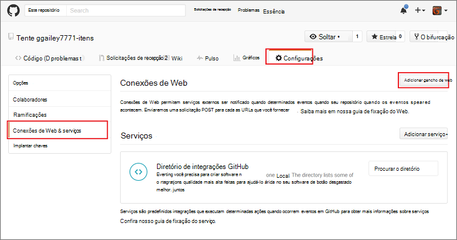

<properties
   pageTitle="Criar um gancho de web ou a função da API do Azure | Microsoft Azure"
   description="Use funções do Azure para criar uma função que é invocada por um WebHook ou API chamar."
   services="azure-functions"
   documentationCenter="na"
   authors="ggailey777"
   manager="erikre"
   editor=""
   tags=""
   />

<tags
   ms.service="functions"
   ms.devlang="multiple"
   ms.topic="get-started-article"
   ms.tgt_pltfrm="multiple"
   ms.workload="na"
   ms.date="08/30/2016"
   ms.author="glenga"/>
   
# Criar um webhook ou a função da API do Azure

Funções Azure é uma experiência de computação sob demanda, orientados a eventos que permitem que você crie agendado ou disparadas unidades de código implementadas em uma variedade de linguagens de programação. Para saber mais sobre funções do Azure, consulte [Visão geral de funções do Azure](functions-overview.md).

Este tópico mostra como criar uma nova função node que é invocada por um webhook GitHub. A nova função é criada com base em um modelo predefinido no portal do Azure funções. Você também pode assistir a um vídeo curto para ver como essas etapas são executadas no portal.

## Assista ao vídeo

O vídeo a seguir mostram como executar as etapas básicas neste tutorial 

[AZURE.VIDEO create-a-web-hook-or-api-azure-function]

##Criar uma função webhook acionada a partir do modelo

Um aplicativo de função hospeda a execução de suas funções no Azure. Antes de criar uma função, você precisa ter uma conta do Azure active. Se você ainda não tiver uma conta do Azure, [contas gratuitas estão disponíveis](https://azure.microsoft.com/free/). 

1. Acesse o [portal de funções do Azure](https://functions.azure.com/signin) e entrar com sua conta do Azure.

2. Se você tiver um aplicativo de função existente para usar, selecione-o nos **seus aplicativos de função** , em seguida, clique em **Abrir**. Para criar um novo aplicativo de função, digite um **nome** exclusivo para o novo aplicativo de função ou aceitar aquele gerado, selecione seu preferencial **região**e clique em **criar + introdução**. 

3. Em seu aplicativo de função, clique em **+ nova função** > **GitHub Webhook - nó** > **criar**. Isso cria uma função com um nome padrão com base no modelo especificado. 

     

4. Na **desenvolver**, observe a função de express.js de exemplo na janela de **código** . Esta função recebe uma solicitação de GitHub de um webhook de comentário do problema, registra o texto de problema e envia uma resposta para o webhook como `New GitHub comment: <Your issue comment text>`.

     

5. Copie os valores de **URL de função** e **GitHub secreta** . Você precisará esses quando você cria o webhook no GitHub. 

6. Role para baixo para **Executar**, observe o corpo JSON predefinido de um comentário de problema no corpo da solicitação e clique em **Executar**. 
 
    Você sempre pode testar uma nova função baseado no modelo direita na guia **desenvolver** fornecendo qualquer esperado corpo dados JSON e clicando no botão **Executar** . Nesse caso, o modelo tem um corpo predefinido de um comentário de problema. 
 
Em seguida, você criará o webhook real no seu repositório GitHub.

##Configurar o webhook

1. No GitHub, navegue até um repositório que você possui; Isso inclui todos os repositórios que você tiver bifurcada.
 
2. Clique em **configurações** > **Webhooks & serviços** > **webhook de adicionar**.

       

3. Cole a URL e segredo sua função em **URL de carga** e **segredo**, clique **Deixe-me selecionar eventos individuais**, selecione **problema comentário** e clique em **Adicionar webhook**.

     

Neste ponto, o webhook GitHub está configurado para disparar sua função quando um novo comentário de problema é adicionado.  
Agora, é hora de testá-lo.

##Testar a função

1. No seu repo GitHub, abra a guia **problemas** em uma nova janela de navegador, clique em **Nova questão**, digite um título e clique em **Enviar nova questão**. Você também pode abrir uma questão existente.

2. Na edição de, digite um comentário e clique em **comentário**. Neste ponto, você pode voltar ao seu novo webhook no GitHub e em **Entregas recentes** consulte que uma solicitação de webhook foi enviada e o corpo da resposta é `New GitHub comment: <Your issue comment text>`.

3. De volta ao portal de funções, role para baixo até os logs e ver que a função foi disparada e o valor `New GitHub comment: <Your issue comment text>` escrito os logs de streaming.

##Próximas etapas

Consulte estes tópicos para obter mais informações sobre funções do Azure.

+ [Referência do desenvolvedor funções Azure](functions-reference.md)  
Referência do programador para funções de codificação.
+ [Funções Azure de teste](functions-test-a-function.md)  
Descreve várias ferramentas e técnicas para testar suas funções.
+ [Como escalar funções Azure](functions-scale.md)  
Discute os planos de serviços disponíveis com as funções do Azure, incluindo o plano de serviço dinâmico e como escolher o plano certo.  

[AZURE.INCLUDE [Getting Started Note](../../includes/functions-get-help.md)]
