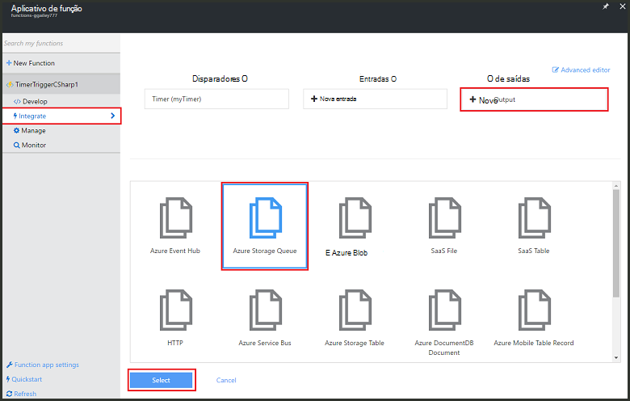
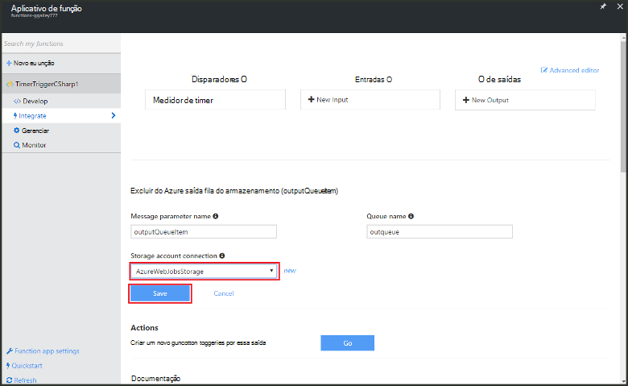

<properties
   pageTitle="Criar um evento de função de processamento | Microsoft Azure"
   description="Use funções de Azure criar uma função c# que é executado com base em um temporizador de evento."
   services="functions"
   documentationCenter="na"
   authors="ggailey777"
   manager="erikre"
   editor=""
   tags=""
   />

<tags
   ms.service="functions"
   ms.devlang="multiple"
   ms.topic="get-started-article"
   ms.tgt_pltfrm="multiple"
   ms.workload="na"
   ms.date="09/25/2016"
   ms.author="glenga"/>
   
# Criar um evento Azure função de processamento

Funções Azure é uma experiência de computação sob demanda, orientados a eventos que permitem que você crie agendado ou disparadas unidades de código implementadas em uma variedade de linguagens de programação. Para saber mais sobre funções do Azure, consulte [Visão geral de funções do Azure](functions-overview.md).

Este tópico mostra como criar uma nova função no c# que executa com base em um temporizador de evento para adicionar mensagens para uma fila de armazenamento. 

## Pré-requisitos 

Antes de criar uma função, você precisa ter uma conta do Azure active. Se você ainda não tiver uma conta do Azure, [contas gratuitas estão disponíveis](https://azure.microsoft.com/free/).

## Criar uma função timer acionada a partir do modelo

Um aplicativo de função hospeda a execução de suas funções no Azure. Antes de criar uma função, você precisa ter uma conta do Azure active. Se você ainda não tiver uma conta do Azure, [contas gratuitas estão disponíveis](https://azure.microsoft.com/free/). 

1. Acesse o [portal de funções do Azure](https://functions.azure.com/signin) e entrar com sua conta do Azure.

2. Se você tiver um aplicativo de função existente para usar, selecione-o nos **seus aplicativos de função** , em seguida, clique em **Abrir**. Para criar um novo aplicativo de função, digite um **nome** exclusivo para o novo aplicativo de função ou aceitar aquele gerado, selecione seu preferencial **região**e clique em **criar + introdução**. 

3. Em seu aplicativo de função, clique em **+ nova função** > **TimerTrigger - c#** > **criar**. Isso cria uma função com um nome de padrão que é executado no agendamento padrão de uma vez a cada minuto. 

    

4. Na sua nova função, clique na guia **integrar** > **Nova saída** > **Fila de armazenamento do Azure** > **Selecione**.

    

5. Na **fila de armazenamento do Azure saída**, selecione uma **conexão de conta de armazenamento**existente, ou crie um novo, clique em **Salvar**. 

    

6. De volta ao guia **desenvolver** , substitua o script c# existente na janela de **código** com o seguinte código:

        using System;
        
        public static void Run(TimerInfo myTimer, out string outputQueueItem, TraceWriter log)
        {
            // Add a new scheduled message to the queue.
            outputQueueItem = $"Ping message added to the queue at: {DateTime.Now}.";
            
            // Also write the message to the logs.
            log.Info(outputQueueItem);
        }

    Este código adiciona uma nova mensagem na fila com a data e hora atuais quando a função é executada.

7. Clique em **Salvar** e assista os **Logs** do windows para a próxima execução de função.

8. (Opcional) Navegue até a conta de armazenamento e verificar se as mensagens estão sendo adicionadas à fila.

9. Volte para a guia de **integrar** e altere o campo de cronograma para `0 0 * * * *`. A função agora é executado a cada hora. 

Este é um muito simplificada ligação de saída de exemplo de um gatilho de timer e uma fila de armazenamento. Para obter mais informações, consulte o [gatilho de timer de funções do Azure](functions-bindings-timer.md) e os tópicos [gatilhos de funções do Azure e ligações para o armazenamento do Azure](functions-bindings-storage.md) .

##Próximas etapas

Consulte estes tópicos para obter mais informações sobre funções do Azure.

+ [Referência do desenvolvedor funções Azure](functions-reference.md)  
Referência do programador para funções de codificação e definir disparadores e ligações.
+ [Funções Azure de teste](functions-test-a-function.md)  
Descreve várias ferramentas e técnicas para testar suas funções.
+ [Como escalar funções Azure](functions-scale.md)  
Discute os planos de serviços disponíveis com as funções do Azure, incluindo o plano de serviço dinâmico e como escolher o plano certo.  

[AZURE.INCLUDE [Getting Started Note](../../includes/functions-get-help.md)]
