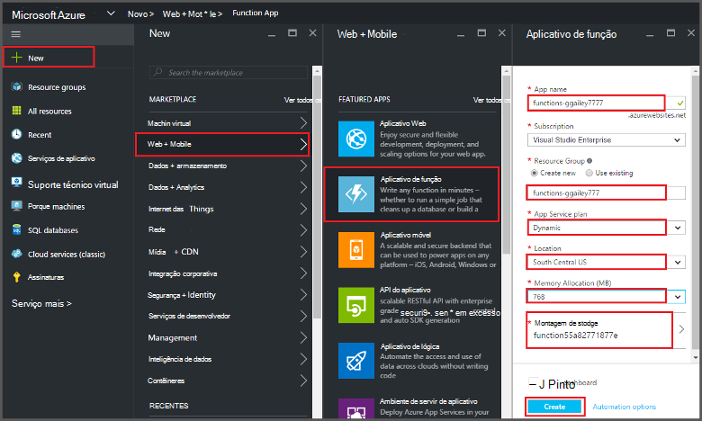
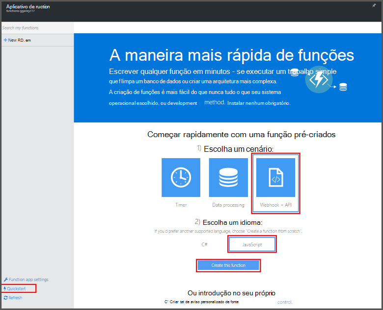
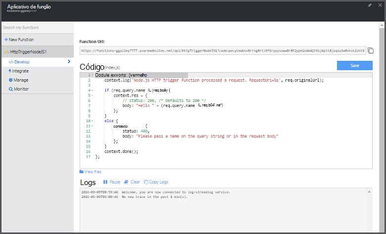

<properties
   pageTitle="Criar uma função a partir do Portal do Azure | Microsoft Azure"
   description="Crie sua primeira função do Azure, um aplicativo sem servidor, em menos de dois minutos."
   services="functions"
   documentationCenter="na"
   authors="ggailey777"
   manager="erikre"
   editor=""
   tags=""
/>

<tags
   ms.service="functions"
   ms.devlang="multiple"
   ms.topic="article"
   ms.tgt_pltfrm="multiple"
   ms.workload="na"
   ms.date="09/08/2016"
   ms.author="glenga"/>

#Criar uma função a partir do portal do Azure

##Visão geral
Funções Azure é uma experiência de computação sob demanda, orientados a eventos que se estende a plataforma de aplicativo do Azure existente com recursos para implementar o código disparado por eventos que ocorrem em outros sistemas de locais, SaaS produtos e serviços do Azure. Com as funções do Azure, seus aplicativos dimensionar com base em demanda e paga apenas para recursos que consumir. Permite que o Azure funções criar agendado ou disparadas unidades de código implementado em várias linguagens de programação. Para saber mais sobre funções do Azure, consulte [Visão geral de funções do Azure](functions-overview.md).

Este tópico mostra como usar o portal do Azure para criar um simples "Olá" node Azure função que é invocado por um gatilho de HTTP. Antes de criar uma função no portal do Azure, você deve criar um aplicativo de função explicitamente no serviço de aplicativo do Azure. Para que o aplicativo de função criado automaticamente para você, consulte [o tutorial de início rápido outras funções do Azure](functions-create-first-azure-function.md), que é uma experiência de início rápido mais simples e inclui um vídeo.

##Criar um aplicativo de função

Um aplicativo de função hospeda a execução de suas funções no Azure. Siga estas etapas para criar um aplicativo de função no portal do Azure.

Antes de criar sua primeira função, você precisa ter uma conta do Azure active. Se você ainda não tiver uma conta do Azure, [contas gratuitas estão disponíveis](https://azure.microsoft.com/free/).

1. Acesse o [portal do Azure](https://portal.azure.com) e entrar com sua conta do Azure.

2. Clique em **+ novo** > **Web + Mobile** > **Aplicativo de função**, selecione sua **assinatura**, digite um **nome de aplicativo** exclusivo que identifica seu aplicativo de função, e em seguida, especifique as seguintes configurações:

    + **[Grupo de recursos](../azure-portal/resource-group-portal.md/)**: selecione **Criar novo** e digite um nome para seu novo grupo de recursos. Você também pode escolher um grupo existente do recurso, mas você não poderá criar um plano de serviço de aplicativo dinâmico para o aplicativo de função.
    + **[Plano de serviço de aplicativo](../app-service/azure-web-sites-web-hosting-plans-in-depth-overview.md)**: escolha *dinâmico* ou *clássico*. 
        + **Dinâmico**: O tipo de plano padrão para funções do Azure. Quando você escolhe um plano dinâmico, você também deve escolher o **local** e definir a **Alocação de memória** (em MB). Para obter informações sobre como a alocação de memória afeta os custos, consulte [funções do Azure preços](https://azure.microsoft.com/pricing/details/functions/). 
        + **Clássico**: um plano de serviço de aplicativo clássico requer que você criar um **plano de serviço de aplicativo/local** ou selecione um existente. Essas configurações determinam o [local, recursos, custos e recursos de computação](https://azure.microsoft.com/pricing/details/app-service/) associado ao seu aplicativo.  
    + **Conta de armazenamento**: cada aplicativo função requer uma conta de armazenamento. Você pode escolher uma conta de armazenamento existente ou criar uma. 

    

3. Clique em **criar** para provisionar e implantar o novo aplicativo de função.  

Agora que o aplicativo de função está provisionado, você pode criar sua primeira função.

## Criar uma função

Estas etapas criam uma função a partir do início rápido do Azure funções.

1. Na guia de **início rápido** , clique em **WebHook + API** e **JavaScript**, clique em **criar uma função**. Uma nova função node predefinida é criada. 

    

2. (Opcional) Neste ponto no início de rápido, você pode optar por fazer um tour rápido dos recursos de funções do Azure no portal.   Depois que você tiver concluído ou ignorada tour, você pode testar sua nova função usando o disparador HTTP.

##Testar a função

Como os guias de início rápido do Azure funções contenham código funcional, você pode testar imediatamente sua nova função.

1. Na guia **desenvolver** , examine a janela de **código** e observe que este código Node espera uma solicitação HTTP com um valor de *nome* passado no corpo da mensagem ou em uma sequência de consulta. Quando a função é executado, esse valor é retornado na mensagem de resposta.

    

2. Role para baixo até a caixa de texto de **corpo de solicitação** , altere o valor da propriedade *nome* para seu nome e clique em **Executar**. Você vê que a execução é disparada por uma solicitação de HTTP de teste, as informações são gravadas os logs de streaming e a resposta "Olá" é exibida na **saída**. 

3. Para disparar a execução da mesma função de outra janela do navegador ou tab, copie o valor da **Função URL** da guia **desenvolver** e colá-lo em uma barra de endereços do navegador e acrescentar o valor de cadeia de caracteres de consulta `&name=yourname` e pressione enter. As mesmas informações são gravadas os logs e o navegador exibirá a resposta "Olá" como antes.

##Próximas etapas

Neste início rápido demonstra uma execução muito simple de uma função de disparadas HTTP básica. Consulte estes tópicos para obter mais informações sobre como usar a potência das funções do Azure em seus aplicativos.

+ [Referência do desenvolvedor funções Azure](functions-reference.md)  
Referência do programador para funções de codificação e definir disparadores e ligações.
+ [Funções Azure de teste](functions-test-a-function.md)  
Descreve várias ferramentas e técnicas para testar suas funções.
+ [Como escalar funções Azure](functions-scale.md)  
Discute os planos de serviços disponíveis com as funções do Azure, incluindo o plano de serviço dinâmico e como escolher o plano certo. 
+ [O que é o serviço de aplicativo do Azure?](../app-service/app-service-value-prop-what-is.md)  
Funções Azure usa a plataforma de serviço de aplicativo do Azure funcionalidade principais como implantações, variáveis de ambiente e o diagnóstico. 

[AZURE.INCLUDE [Getting Started Note](../../includes/functions-get-help.md)]
