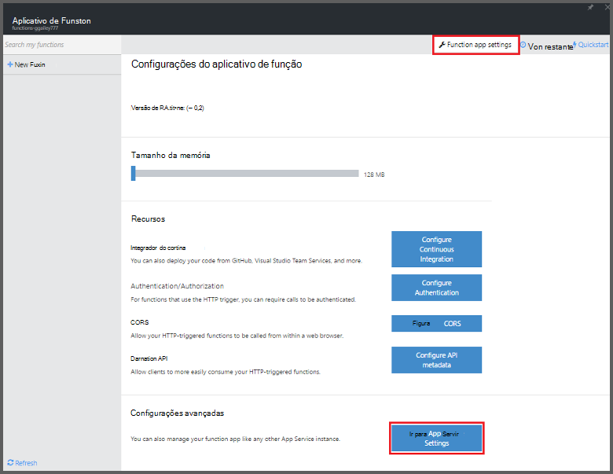
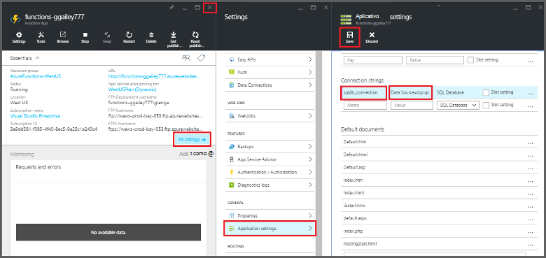
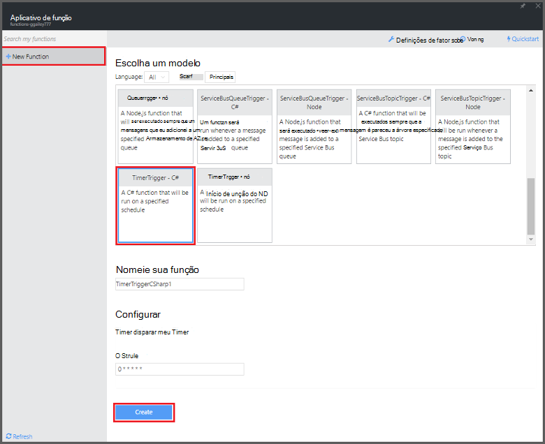

<properties
   pageTitle="Usar funções do Azure para executar uma tarefa agendada de limpeza | Microsoft Azure"
   description="Use funções de Azure criar uma função c# que é executado com base em um temporizador de evento."
   services="functions"
   documentationCenter="na"
   authors="ggailey777"
   manager="erikre"
   editor=""
   tags=""
   />

<tags
   ms.service="functions"
   ms.devlang="multiple"
   ms.topic="article"
   ms.tgt_pltfrm="multiple"
   ms.workload="na"
   ms.date="09/26/2016"
   ms.author="glenga"/>
   
# Usar funções do Azure para executar uma tarefa agendada de limpeza

Este tópico mostra como usar funções do Azure para criar uma nova função no c# que é executado com base em um temporizador de evento para limpeza linhas em uma tabela de banco de dados. A nova função é criada com base em um modelo predefinido no portal do Azure funções. Para oferecer suporte a esse cenário, você também deve definir uma cadeia de conexão de banco de dados como um serviço de aplicativo de configuração no aplicativo função. 

## Pré-requisitos 

Antes de criar uma função, você precisa ter uma conta do Azure active. Se você ainda não tiver uma conta do Azure, [contas gratuitas estão disponíveis](https://azure.microsoft.com/free/).

Este tópico demonstra um comando de Transact-SQL que executa uma operação de limpeza em massa na tabela denominada *TodoItems* em um banco de dados do SQL. Esta tabela TodoItems mesma é criada quando você concluir o [tutorial de início rápido do Azure aplicativo de serviço móvel aplicativos](../app-service-mobile/app-service-mobile-ios-get-started.md). Você também pode usar um banco de dados de exemplo, se você optar por usar uma tabela diferente, será necessário modificar o comando.

Você pode obter a cadeia de conexão usada por um back-end do aplicativo Mobile no portal em **todas as configurações** > **configurações do aplicativo** > **cadeias de caracteres de Conexão** > **Mostrar valores de cadeia de conexão** > **MS_TableConnectionString**. Você também pode chegar a cadeia de conexão direta de banco de dados SQL do portal em **todas as configurações** > **Propriedades** > **mostram cadeias de caracteres de conexão de banco de dados** > **ADO.NET (autenticação de SQL)**.

Esse cenário usa uma operação em massa no banco de dados. Para que suas operações CRUD individuais do processo de função em uma tabela de aplicativos Mobile, você deve usar vinculação de tabela de celular.

## Definir uma cadeia de conexão de banco de dados SQL no aplicativo função

Um aplicativo de função hospeda a execução de suas funções no Azure. É uma prática recomendada para armazenar cadeias de caracteres de conexão e outros segredos em suas configurações de aplicativo de função. Isso evita divulgação acidental quando seu código de função extremidades para cima em uma repo para outro. 

1. Acesse o [portal de funções do Azure](https://functions.azure.com/signin) e entrar com sua conta do Azure.

2. Se você tiver um aplicativo de função existente para usar, selecione-o nos **seus aplicativos de função** , em seguida, clique em **Abrir**. Para criar um novo aplicativo de função, digite um **nome** exclusivo para o novo aplicativo de função ou aceitar aquele gerado, selecione seu preferencial **região**e clique em **criar + introdução**. 

3. No seu aplicativo de função, clique em **configurações do aplicativo de função** > **vá para configurações de serviço de aplicativo**. 

    

4. No seu aplicativo de função, clique em **todas as configurações**, role para baixo até **as configurações do aplicativo**, em seguida, em tipo de **cadeias de caracteres de Conexão** `sqldb_connection` de **nome**, cole a cadeia de conexão no **valor**, clique em **Salvar**, feche a lâmina de aplicativo de função para retornar para o portal de funções.

    

Agora, você pode adicionar o código de função c# que se conecta ao seu banco de dados do SQL.

## Criar uma função timer acionada a partir do modelo

1. Em seu aplicativo de função, clique em **+ nova função** > **TimerTrigger - c#** > **criar**. Isso cria uma função com um nome de padrão que é executado no agendamento padrão de uma vez a cada minuto. 

    

2. No painel de **código** na guia **desenvolver** , adicione as seguintes referências de assembly na parte superior do código de função existente:

        #r "System.Configuration"
        #r "System.Data"

3. Adicione o seguinte `using` instruções para a função:

        using System.Configuration;
        using System.Data.SqlClient;
        using System.Threading.Tasks; 

4. Substitua a função de **Executar** existente com o seguinte código:

        public static async Task Run(TimerInfo myTimer, TraceWriter log)
        {
            var str = ConfigurationManager.ConnectionStrings["sqldb_connection"].ConnectionString;
            using (SqlConnection conn = new SqlConnection(str))
            {
                conn.Open();
                var text = "DELETE from dbo.TodoItems WHERE Complete='True'";
                using (SqlCommand cmd = new SqlCommand(text, conn))
                {
                    // Execute the command and log the # rows deleted.
                    var rows = await cmd.ExecuteNonQueryAsync();
                    log.Info($"{rows} rows were deleted");
                }
            }
        }

5. Clique em **Salvar**, assista os **Logs** do windows para a próxima execução de função e anote o número de linhas excluídas da tabela TodoItems.

6. (Opcional) Usando o [aplicativo de início rápido de aplicativos Mobile](../app-service-mobile/app-service-mobile-ios-get-started.md), marca itens adicionais, como "concluído" retorne à janela de **Logs** e inspeção o mesmo número de linhas seja excluído pela função durante a execução próxima. 

##Próximas etapas

Consulte estes tópicos para obter mais informações sobre funções do Azure.

+ [Referência do desenvolvedor funções Azure](functions-reference.md)  
Referência do programador para funções de codificação e definir disparadores e ligações.
+ [Funções Azure de teste](functions-test-a-function.md)  
Descreve várias ferramentas e técnicas para testar suas funções.
+ [Como escalar funções Azure](functions-scale.md)  
Discute os planos de serviços disponíveis com as funções do Azure, incluindo o plano de serviço dinâmico e como escolher o plano certo.  

[AZURE.INCLUDE [Getting Started Note](../../includes/functions-get-help.md)]