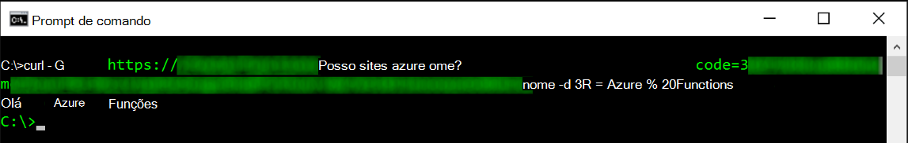
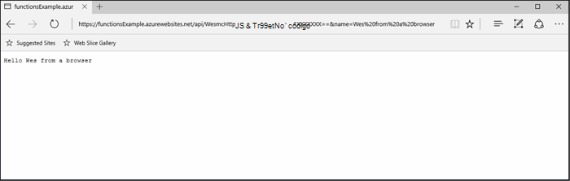
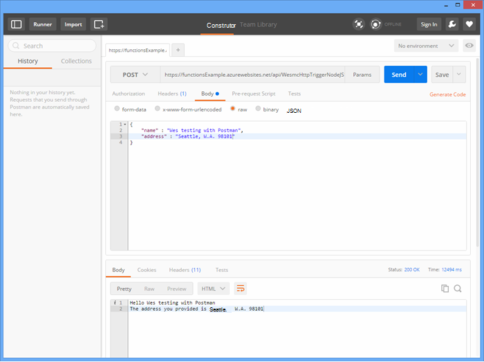
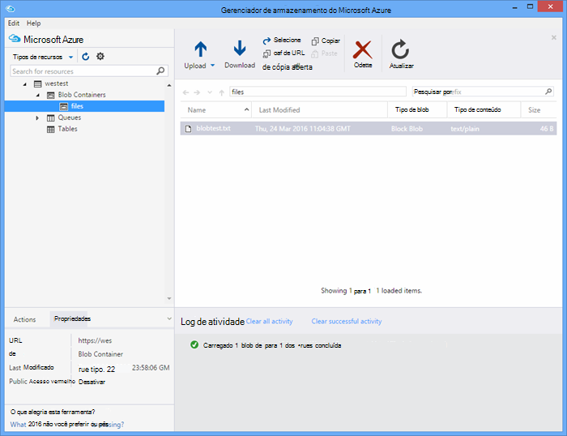

<properties
   pageTitle="Teste funções Azure | Microsoft Azure"
   description="Teste suas funções do Azure usando carteiro, Ondulação e Node."
   services="functions"
   documentationCenter="na"
   authors="wesmc7777"
   manager="erikre"
   editor=""
   tags=""
   keywords="Azure funções, funções, processamento de eventos, webhooks, computação dinâmica, sem servidor arquitetura, teste"/>

<tags
   ms.service="functions"
   ms.devlang="multiple"
   ms.topic="article"
   ms.tgt_pltfrm="multiple"
   ms.workload="na"
   ms.date="08/19/2016"
   ms.author="wesmc"/>

# Funções Azure de teste

## Visão geral

Neste tutorial, vamos percorrer diferentes abordagens para funções de teste. Será definimos uma função de gatilho de http que aceita entrada por meio de um parâmetro de cadeia de consulta ou o corpo da solicitação. O código de modelo de **HttpTrigger Node função** padrão suporta um `name` parâmetro da sequência de consulta. Nós também irá adicionar código para oferecer suporte a esse parâmetro junto com `address` informações para o usuário no corpo da solicitação.

## Criar uma função para teste

Para a maioria deste tutorial, usaremos uma versão ligeiramente modificada do modelo **HttpTrigger Nodejs função** que está disponível ao criar uma nova função.  Você pode examinar a [criar seu primeiro tutorial de função do Azure](functions-create-first-azure-function.md) se precisar de ajuda para criar uma nova função.  Basta escolha o modelo de **HttpTrigger Nodejs função** ao criar a função de teste no [Portal do Azure].

O modelo de função padrão é basicamente uma função de mundo de saudação que exibe novamente o nome do solicitação corpo ou consulta cadeia parâmetro, `name=<your name>`.  Atualizaremos o código para também permitem que você forneça o nome e um endereço como conteúdo JSON no corpo da solicitação. Em seguida, a função será eco estas voltar para o cliente quando disponível.   

Atualize a função com o seguinte código que usaremos para teste:

    module.exports = function(context, req) {
        context.log("Node.js HTTP trigger function processed a request. RequestUri=%s", req.originalUrl);
        context.log("Request Headers = " + JSON.stringify(req.headers));    
    
        if (req.query.name || (req.body && req.body.name)) {
            if (typeof req.query.name != "undefined") {
                context.log("Name was provided as a query string param..."); 
                ProcessNewUserInformation(context, req.query.name);
            }
            else {
                context.log("Processing user info from request body..."); 
                ProcessNewUserInformation(context, req.body.name, req.body.address);
            }
        }
        else {
            context.res = {
                status: 400,
                body: "Please pass a name on the query string or in the request body"
            };
        }
        context.done();
    };
    
    function ProcessNewUserInformation(context, name, address)
    {    
        context.log("Processing User Information...");            
        context.log("name = " + name);            
        echoString = "Hello " + name;
        
        if (typeof address != "undefined")
        {
            echoString += "\n" + "The address you provided is " + address;
            context.log("address = " + address);            
        }
        
        context.res = {
                // status: 200, /* Defaults to 200 */
                body: echoString
            };
    }

## Testar uma função com ferramentas

### Teste com ondulação

Muitas vezes ao testar software, não é necessário pesquisar qualquer além da linha de comando para ajudar a depurar seu aplicativo, isso não será diferente com funções.

Para testar a função acima, copie a **Url de função** a partir do portal. Ele terá a seguinte forma: 

    https://<Your Function App>.azurewebsites.net/api/<Your Function Name>?code=<your access code>
    
Esta é a Url para o disparo sua função, podemos testar isso usando o comando ondulação na linha de comando para fazer um Get (`-G` ou `--get`) solicitação contra nossa função:

    curl -G https://<Your Function App>.azurewebsites.net/api/<Your Function Name>?code=<your access code>
    
Esse exemplo específico acima exige um parâmetro de cadeia de caracteres de consulta que pode ser passado como dados (`-d`) no comando ondulação:

    curl -G https://<Your Function App>.azurewebsites.net/api/<Your Function Name>?code=<your access code> -d name=<Enter a name here>
    
Sucessos Insira e você verá a saída da função na linha de comando.

Na janela de **Logs** portal, saída semelhante à seguinte é registrada durante a execução da função:

    2016-04-05T21:55:09  Welcome, you are now connected to log-streaming service.
    2016-04-05T21:55:30.738 Function started (Id=ae6955da-29db-401a-b706-482fcd1b8f7a)
    2016-04-05T21:55:30.738 Node.js HTTP trigger function processed a request. RequestUri=https://functionsExample.azurewebsites.net/api/HttpTriggerNodeJS1?code=XXXXXXX&name=Azure Functions
    2016-04-05T21:55:30.738 Function completed (Success, Id=ae6955da-29db-401a-b706-482fcd1b8f7a)

### Teste com um navegador

Funções que não exigem parâmetros, ou só precisará de parâmetros de cadeia de caracteres de consulta, podem ser testadas usando um navegador.

Para testar a função que definimos acima, copie a **Url de função** a partir do portal. Ele terá a seguinte forma:

    https://<Your Function App>.azurewebsites.net/api/<Your Function Name>?code=<your access code>

Acrescentar a `name` consulta parâmetro de cadeia de caracteres da seguinte maneira, usando um nome real para o `<Enter a name here>` espaço reservado.

    https://<Your Function App>.azurewebsites.net/api/<Your Function Name>?code=<your access code>&name=<Enter a name here>

Cole a URL no seu navegador e você deve obter uma resposta semelhante à seguinte.

Na janela de **Logs** portal, saída semelhante à seguinte é registrada durante a execução da função:

    2016-03-23T07:34:59  Welcome, you are now connected to log-streaming service.
    2016-03-23T07:35:09.195 Function started (Id=61a8c5a9-5e44-4da0-909d-91d293f20445)
    2016-03-23T07:35:10.338 Node.js HTTP trigger function processed a request. RequestUri=https://functionsExample.azurewebsites.net/api/WesmcHttpTriggerNodeJS1?code=XXXXXXXXXX==&name=Wes from a browser
    2016-03-23T07:35:10.338 Request Headers = {"cache-control":"max-age=0","connection":"Keep-Alive","accept":"text/html","accept-encoding":"gzip","accept-language":"en-US"}
    2016-03-23T07:35:10.338 Name was provided as a query string param.
    2016-03-23T07:35:10.338 Processing User Information...
    2016-03-23T07:35:10.369 Function completed (Success, Id=61a8c5a9-5e44-4da0-909d-91d293f20445)

### Teste com carteiro

A ferramenta recomendada para testar a maioria das suas funções é carteiro. Para instalar o carteiro, consulte [Obter carteiro](https://www.getpostman.com/). Carteiro oferece controle sobre muitos atributos mais de uma solicitação HTTP.

> [AZURE.TIP] Use o cliente de restante no qual você está confortável. Aqui estão algumas alternativas para carteiro:  
> 
> * [Fiddler](http://www.telerik.com/fiddler)  
> * [PATA](https://luckymarmot.com/paw)  

Para testar a função com o corpo de uma solicitação carteiro: 

1. Inicie carteiro a partir do botão de **aplicativos** no canto superior esquerdo do canto da janela do navegador Chrome.
2. Copie a **Url de função** e colá-lo em carteiro. Ele inclui o parâmetro de cadeia de caracteres de consulta de código de acesso.
3. Altere o método HTTP a **POSTAGEM**.
4. Clique em **corpo** > **bruto** e adicione o corpo da solicitação JSON semelhante ao seguinte:

        {
            "name" : "Wes testing with Postman",
            "address" : "Seattle, W.A. 98101"
        }

5. Clique em **Enviar**.

A imagem a seguir mostra o teste o exemplo de função eco simples neste tutorial. 

Na janela de **Logs** portal, saída semelhante à seguinte é registrada durante a execução da função:

    2016-03-23T08:04:51  Welcome, you are now connected to log-streaming service.
    2016-03-23T08:04:57.107 Function started (Id=dc5db8b1-6f1c-4117-b5c4-f6b602d538f7)
    2016-03-23T08:04:57.763 Node.js HTTP trigger function processed a request. RequestUri=https://functions841def78.azurewebsites.net/api/WesmcHttpTriggerNodeJS1?code=XXXXXXXXXX==
    2016-03-23T08:04:57.763 Request Headers = {"cache-control":"no-cache","connection":"Keep-Alive","accept":"*/*","accept-encoding":"gzip","accept-language":"en-US"}
    2016-03-23T08:04:57.763 Processing user info from request body...
    2016-03-23T08:04:57.763 Processing User Information...
    2016-03-23T08:04:57.763 name = Wes testing with Postman
    2016-03-23T08:04:57.763 address = Seattle, W.A. 98101
    2016-03-23T08:04:57.795 Function completed (Success, Id=dc5db8b1-6f1c-4117-b5c4-f6b602d538f7)
    
### Testar um disparador blob usando o Gerenciador de armazenamento

Você pode testar uma função de gatilho de blob usando o [Gerenciador de armazenamento do Microsoft Azure](http://storageexplorer.com/).

1. No [Portal do Azure] para seu aplicativo de funções, crie uma nova função de disparador blob c#, F # ou nó. Defina o caminho para monitorar para o nome do seu contêiner de blob. Por exemplo:

        files

2. Clique na **+** botão para selecionar ou criar a conta de armazenamento que você deseja usar. Clique em **criar**.

3. Criar um arquivo de texto com o seguinte texto e salvá-lo:

        A text file for blob trigger function testing.

4. Executar o [Gerenciador de armazenamento do Microsoft Azure](http://storageexplorer.com/) e conecte-se ao contêiner de blob na conta de armazenamento sob monitoramento.

5. Clique no botão **carregar** e carregue o arquivo de texto.

    

    O código de função padrão blob disparador reporta o processamento do blob em logs de:

        2016-03-24T11:30:10  Welcome, you are now connected to log-streaming service.
        2016-03-24T11:30:34.472 Function started (Id=739ebc07-ff9e-4ec4-a444-e479cec2e460)
        2016-03-24T11:30:34.472 C# Blob trigger function processed: A text file for blob trigger function testing.
        2016-03-24T11:30:34.472 Function completed (Success, Id=739ebc07-ff9e-4ec4-a444-e479cec2e460)

## Testar uma função dentro de funções

### Testar com o portal de funções botão Executar

O portal fornece um botão **Executar** que permitirá que você faça alguns testes limitados. Você pode fornecer um corpo da solicitação usando o botão Executar mas, você não pode fornecer parâmetros de cadeia de caracteres de consulta ou atualizar cabeçalhos de solicitação.

Testar a função de gatilho HTTP criado anteriormente, adicionando uma cadeia de caracteres JSON semelhante à seguinte no campo **Solicitar corpo** e em seguida, clique no botão **Executar** .

    {
        "name" : "Wes testing Run button",
        "address" : "USA"
    } 

Na janela de **Logs** portal, saída similar ao seguinte é registrada ao executar a função:

    2016-03-23T08:03:12  Welcome, you are now connected to log-streaming service.
    2016-03-23T08:03:17.357 Function started (Id=753a01b0-45a8-4125-a030-3ad543a89409)
    2016-03-23T08:03:18.697 Node.js HTTP trigger function processed a request. RequestUri=https://functions841def78.azurewebsites.net/api/wesmchttptriggernodejs1
    2016-03-23T08:03:18.697 Request Headers = {"connection":"Keep-Alive","accept":"*/*","accept-encoding":"gzip","accept-language":"en-US"}
    2016-03-23T08:03:18.697 Processing user info from request body...
    2016-03-23T08:03:18.697 Processing User Information...
    2016-03-23T08:03:18.697 name = Wes testing Run button
    2016-03-23T08:03:18.697 address = USA
    2016-03-23T08:03:18.744 Function completed (Success, Id=753a01b0-45a8-4125-a030-3ad543a89409)

### Teste com um gatilho de timer

Algumas funções, não pode ser testado verdadeiramente com as ferramentas mencionadas anteriormente. Por exemplo, uma fila disparador função que é executada quando uma mensagem é inserida no [Armazenamento de fila do Azure](../storage/storage-dotnet-how-to-use-queues.md). Você sempre pode escrever código para solte uma mensagem na fila e um exemplo de isso em um projeto de console é fornecido abaixo. No entanto, há outro método, que você pode usar para testar com funções diretamente.  

Você pode usar um disparador de timer configurado com uma fila ligação de saída. Que código do disparador timer poderia então escrever as mensagens de teste para a fila. Esta seção guiará por meio de um exemplo. 

Para obter informações mais detalhadas sobre como usar ligações com funções do Azure, consulte a [referência do desenvolvedor de funções do Azure](functions-reference.md). 

#### Criar fila disparador para teste

Para demonstrar essa abordagem, nós primeiro criará uma função de gatilho de fila que queremos testar para uma fila denominada `queue-newusers`. Esta função processará informações de nome e endereço para um novo usuário soltas no armazenamento de fila Azure. 

> [AZURE.NOTE] Se você usar um nome de fila diferente, verifique se o nome que você usa em conformidade com as regras de [nomenclatura filas e metadados](https://msdn.microsoft.com/library/dd179349.aspx) .  Caso contrário, você receberá um código de Status de HTTP 400: solicitação incorreta. 

1. No [Portal do Azure] para seu aplicativo de funções, clique em **Nova função** > **QueueTrigger - c#**.
2. Insira o nome da fila monitorar pela função fila 

        queue-newusers 

3. Clique na **+** (Adicionar) botão para selecionar ou criar a conta de armazenamento que você deseja usar. Clique em **criar**.
4. Deixe esta janela do navegador portal aberta para que você possa monitorar as entradas de log para o código de modelo de função de fila padrão.

#### Criar um gatilho de timer para cancelar uma mensagem na fila

1. Abra o [Portal do Azure] em uma nova janela do navegador e navegue até seu aplicativo de função.
2. Clique em **nova função** > **TimerTrigger - c#**. Inserir uma expressão cron para definir com que frequência o código do temporizador executará testando sua função fila. Clique em **criar**. Se quiser que o teste para executar a cada 30 segundos, você pode usar a seguinte [expressão CRON](https://wikipedia.org/wiki/Cron#CRON_expression):

        */30 * * * * *

2. Clique na guia de **integrar** para seu novo disparador de timer.
3. Em **saída**, clique no botão **+ nova saída** . Clique em **fila** e no botão **Selecionar** .
4. Observe o nome que você usa para o **objeto de fila de mensagens** que você usará no código de função timer.

        myQueue

4. Insira o nome da fila onde a mensagem será enviada: 

        queue-newusers 

3. Clique na **+** (Adicionar) botão para selecionar a conta de armazenamento que você usou anteriormente com o disparador fila. Clique em **Salvar**.
4. Clique na guia **desenvolver** para seu disparador de timer.
5. Você pode usar o seguinte código para a função de timer c# desde que você usou o mesmo nome de objeto de mensagem de fila mostrado acima. Clique em **Salvar**

        using System;
        
        public static void Run(TimerInfo myTimer, out String myQueue, TraceWriter log)
        {
            String newUser = 
            "{\"name\":\"User testing from C# timer function\",\"address\":\"XYZ\"}";
        
            log.Verbose($"C# Timer trigger function executed at: {DateTime.Now}");   
            log.Verbose($"{newUser}");   
            
            myQueue = newUser;
        }

Neste ponto, função de timer c# executará cada 30 segundos se você usou a expressão cron de exemplo. Os logs da função timer reporta cada execução:

    2016-03-24T10:27:02  Welcome, you are now connected to log-streaming service.
    2016-03-24T10:27:30.004 Function started (Id=04061790-974f-4043-b851-48bd4ac424d1)
    2016-03-24T10:27:30.004 C# Timer trigger function executed at: 3/24/2016 10:27:30 AM
    2016-03-24T10:27:30.004 {"name":"User testing from C# timer function","address":"XYZ"}
    2016-03-24T10:27:30.004 Function completed (Success, Id=04061790-974f-4043-b851-48bd4ac424d1)

Na janela do navegador para a função de fila, você verá a cada mensagem sendo processada:

    2016-03-24T10:27:06  Welcome, you are now connected to log-streaming service.
    2016-03-24T10:27:30.607 Function started (Id=e304450c-ff48-44dc-ba2e-1df7209a9d22)
    2016-03-24T10:27:30.607 C# Queue trigger function processed: {"name":"User testing from C# timer function","address":"XYZ"}
    2016-03-24T10:27:30.607 Function completed (Success, Id=e304450c-ff48-44dc-ba2e-1df7209a9d22)
    
## Testar uma função com código

### Testar uma função de disparador HTTP com código: Node

Você pode usar o código de Node para executar uma solicitação de http para testar sua função do Azure. 

Certifique-se de definir:

- O `host` nas opções de solicitação para o host do seu aplicativo de função
- Seu nome de função na `path`.
- O código de acesso (`<your code>`) na `path`.

Exemplo de código:

    var http = require("http");
    
    var nameQueryString = "name=Wes%20Query%20String%20Test%20From%20Node.js";
    
    var nameBodyJSON = {
        name : "Wes testing with Node.JS code",
        address : "Dallas, T.X. 75201"
    };
    
    var bodyString = JSON.stringify(nameBodyJSON);
    
    var options = {
      host: "functions841def78.azurewebsites.net",
      //path: "/api/HttpTriggerNodeJS2?code=sc1wt62opn7k9buhrm8jpds4ikxvvj42m5ojdt0p91lz5jnhfr2c74ipoujyq26wab3wk5gkfbt9&" + nameQueryString,
      path: "/api/HttpTriggerNodeJS2?code=sc1wt62opn7k9buhrm8jpds4ikxvvj42m5ojdt0p91lz5jnhfr2c74ipoujyq26wab3wk5gkfbt9",
      method: "POST",
      headers : {
          "Content-Type":"application/json",
          "Content-Length": Buffer.byteLength(bodyString)
        }    
    };
    
    callback = function(response) {
      var str = ""
      response.on("data", function (chunk) {
        str += chunk;
      });
    
      response.on("end", function () {
        console.log(str);
      });
    }
    
    var req = http.request(options, callback);
    console.log("*** Sending name and address in body ***");
    console.log(bodyString);
    req.end(bodyString);

Saída:

    C:\Users\Wesley\testing\Node.js>node testHttpTriggerExample.js
    *** Sending name and address in body ***
    {"name" : "Wes testing with Node.JS code","address" : "Dallas, T.X. 75201"}
    Hello Wes testing with Node.JS code
    The address you provided is Dallas, T.X. 75201
        
Na janela de **Logs** portal, saída similar ao seguinte é registrada ao executar a função:

    2016-03-23T08:08:55  Welcome, you are now connected to log-streaming service.
    2016-03-23T08:08:59.736 Function started (Id=607b891c-08a1-427f-910c-af64ae4f7f9c)
    2016-03-23T08:09:01.153 Node.js HTTP trigger function processed a request. RequestUri=http://functionsExample.azurewebsites.net/api/WesmcHttpTriggerNodeJS1/?code=XXXXXXXXXX==
    2016-03-23T08:09:01.153 Request Headers = {"connection":"Keep-Alive","host":"functionsExample.azurewebsites.net"}
    2016-03-23T08:09:01.153 Name not provided as query string param. Checking body...
    2016-03-23T08:09:01.153 Request Body Type = object
    2016-03-23T08:09:01.153 Request Body = [object Object]
    2016-03-23T08:09:01.153 Processing User Information...
    2016-03-23T08:09:01.215 Function completed (Success, Id=607b891c-08a1-427f-910c-af64ae4f7f9c)
    

### Testar uma função de disparador fila com código: C# #

Podemos mencionado anteriormente que você poderia testar um disparador fila usando código para cancelar uma mensagem na fila. O código de exemplo a seguir baseia-se desativar o código c# apresentado no tutorial [guia de Introdução do armazenamento de fila do Azure](../storage/storage-dotnet-how-to-use-queues.md) . Código para outros idiomas também está disponível no link.

Para testar este código em um aplicativo de console, você deve:

- [Configurar sua cadeia de caracteres de conexão de armazenamento no arquivo App](../storage/storage-dotnet-how-to-use-queues.md#setup-a-storage-connection-string).
- Este código aceita o nome e endereço para um novo usuário como argumentos de linha de comando durante a execução. Passar um `name` e `address` como parâmetros para o aplicativo. Por exemplo,`C:\myQueueConsoleApp\test.exe "Wes testing queues" "in a console app"`

Código de exemplo c#:

    static void Main(string[] args)
    {
        string name = null;
        string address = null;
        string queueName = "queue-newusers";
        string JSON = null;

        if (args.Length > 0)
        {
            name = args[0];
        }
        if (args.Length > 1)
        {
            address = args[1];
        }

        // Retrieve storage account from connection string
        CloudStorageAccount storageAccount = CloudStorageAccount.Parse(ConfigurationManager.AppSettings["StorageConnectionString"]);

        // Create the queue client
        CloudQueueClient queueClient = storageAccount.CreateCloudQueueClient();

        // Retrieve a reference to a queue
        CloudQueue queue = queueClient.GetQueueReference(queueName);

        // Create the queue if it doesn't already exist
        queue.CreateIfNotExists();

        // Create a message and add it to the queue.
        if (name != null)
        {
            if (address != null)
                JSON = String.Format("{{\"name\":\"{0}\",\"address\":\"{1}\"}}", name, address);
            else
                JSON = String.Format("{{\"name\":\"{0}\"}}", name);
        }

        Console.WriteLine("Adding message to " + queueName + "...");
        Console.WriteLine(JSON);

        CloudQueueMessage message = new CloudQueueMessage(JSON);
        queue.AddMessage(message);
    }

Na janela do navegador para a função de fila, você verá a cada mensagem sendo processada:

    2016-03-24T10:27:06  Welcome, you are now connected to log-streaming service.
    2016-03-24T10:27:30.607 Function started (Id=e304450c-ff48-44dc-ba2e-1df7209a9d22)
    2016-03-24T10:27:30.607 C# Queue trigger function processed: {"name":"Wes testing queues","address":"in a console app"}
    2016-03-24T10:27:30.607 Function completed (Success, Id=e304450c-ff48-44dc-ba2e-1df7209a9d22)

<!-- URLs. -->

[Portal do Azure]: https://portal.azure.com
