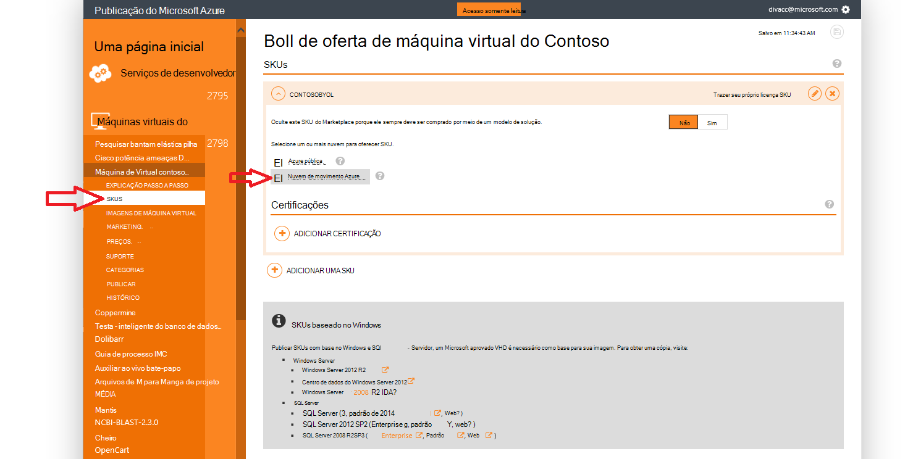
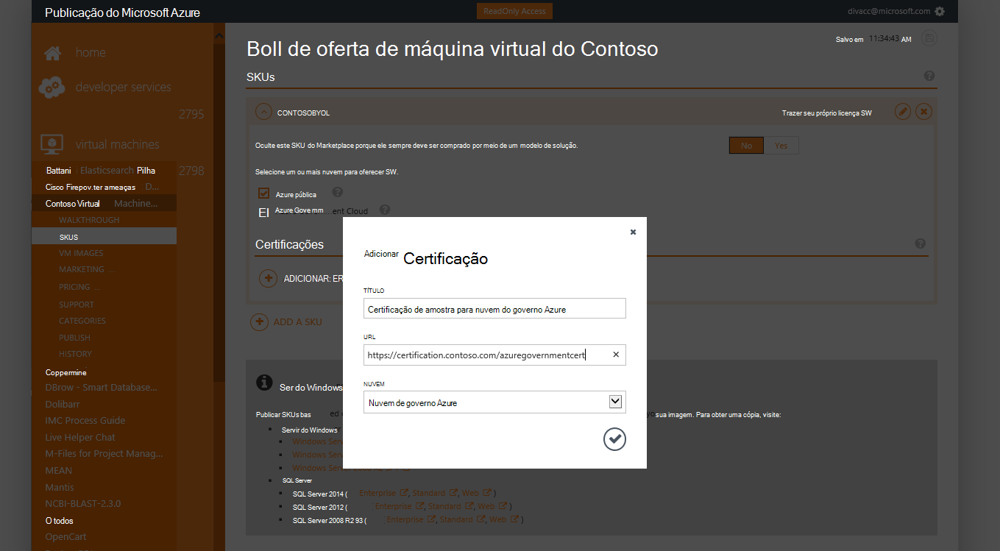
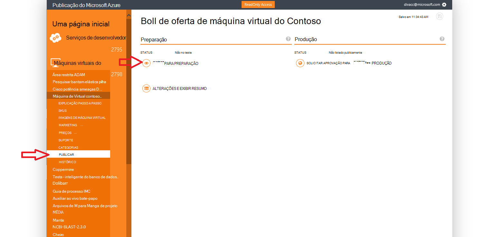
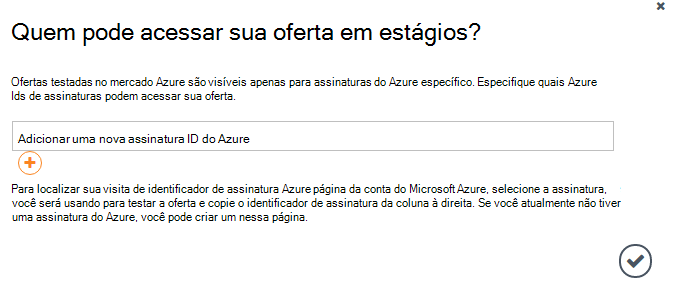
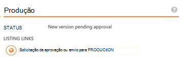

<properties
            pageTitle="Documentação do governo Azure | Microsoft Azure"
            description="Isso fornece uma comparação de recursos e orientações sobre como desenvolver aplicativos para o governo do Azure."
            services="Azure-Government"
            cloud="gov"
            documentationCenter=""
            authors="tsingh"
            manager="asimm"
            editor=""/>
 
<tags    ms.service="multiple"
            ms.devlang="na"
            ms.topic="article"
            ms.tgt_pltfrm="na"
            ms.workload="azure-government"
            ms.date="10/20/2016"
            ms.author="zakramer;tsingh;divacc"/> 

# Governo Azure Marketplace
Para parceiros interessados em publicar suas ofertas do Azure Marketplace do governo, encontre os detalhes abaixo.

## Publicação
>[AZURE.NOTE] Se você não for um parceiro Azure Marketplace Certified existente, conclua as etapas [aqui](../marketplace-publishing/marketplace-publishing-getting-started.md) antes de continuar.

### Etapa 1  
Faça logon no [https://publish.windowsazure.com](https://publish.windowsazure.com)

### Etapa 2
Clique na oferta que você deseja publicar

### Etapa 3
Clique em **SKUS** e clique na caixa de nuvem do governo do Azure

>[AZURE.NOTE] Apenas as SKUs de trazer seu próprio licença (BYOL) são suportadas.  Esta opção não está disponível para SKUs de pré-pago (PayG).

### Etapa 4
Clique na + vincular de certificação Adicionar para adicionar links a qualquer certificações para sua oferta.

### Etapa 5
Solicitação de uma conta de avaliação na nuvem do Microsoft Azure Government para habilitar testar sua imagem no portal de publicação: [https://azuregov.microsoft.com/trial/azuregovtrial](https://azuregov.microsoft.com/trial/azuregovtrial)

Sua qualificação como um parceiro que serve EUA entidades federais, estaduais, locais ou tribal são verificados e confirmação será fornecida via email.  Sua conta de avaliação estará disponível dentro é 3 a 5 dias úteis.

### Etapa 6
Clique em Publicar e clique em Enviar para teste. 

Você será solicitado a inserir uma assinatura na lista branca que tenha acesso ao em estágios a oferecer. Insira a ID da assinatura da sua conta de avaliação do Azure governo comprada recentemente.

### Etapa 7
Depois que a oferta é transferida com êxito, você pode testar sua imagem ao fazer login em [https://portal.azure.us](https://portal.azure.us) usando sua conta de avaliação de governo do Azure.

### Etapa 8
Depois que você tiver validada sua imagem usando a assinatura de avaliação, você pode disponibilizar a oferta ao vivo ao clicar em Publicar e solicitando aprovação produção. 

## Próximas etapas

Para informações complementares e atualizações, assine o [Blog do Microsoft Azure governamentais](https://blogs.msdn.microsoft.com/azuregov/).
