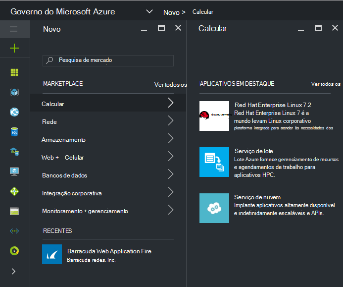
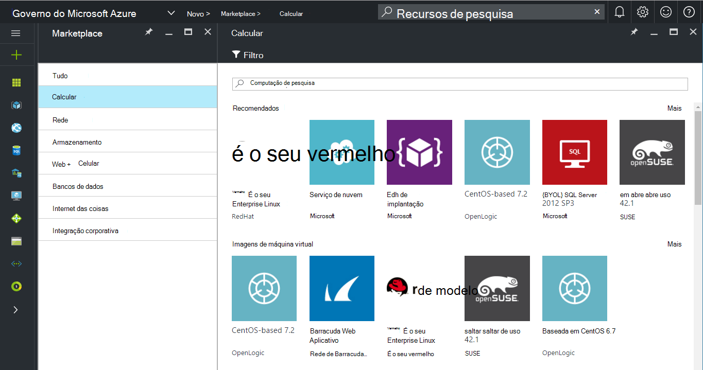
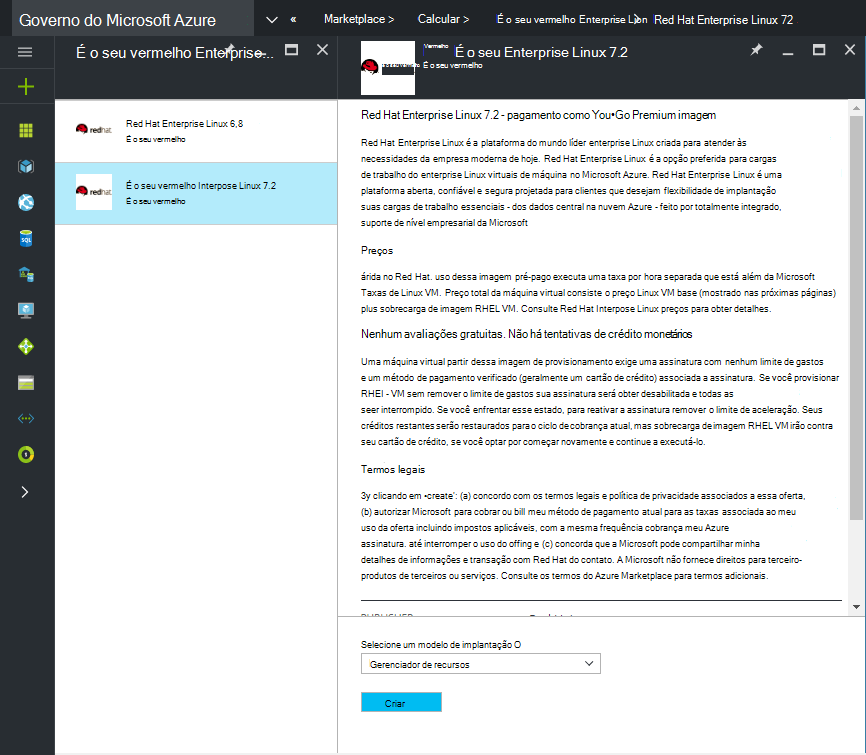
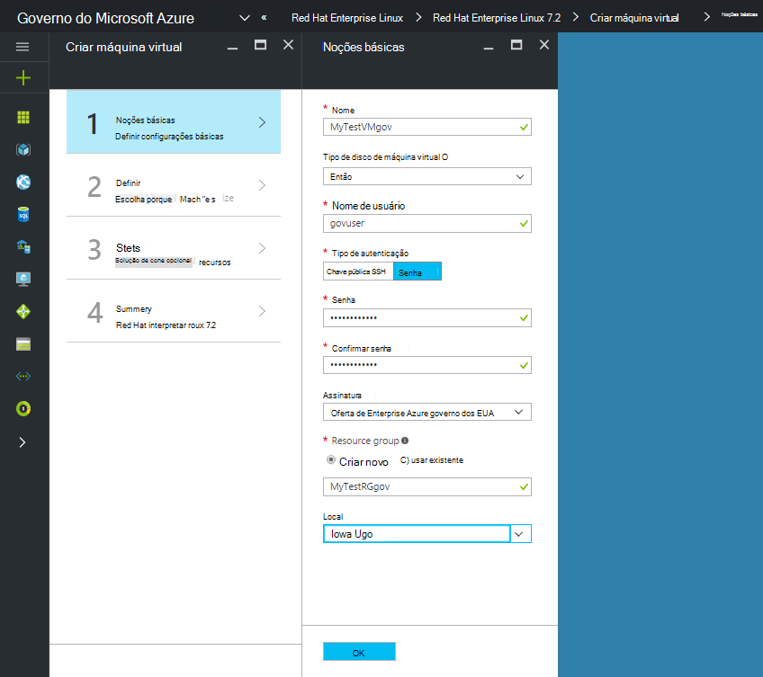
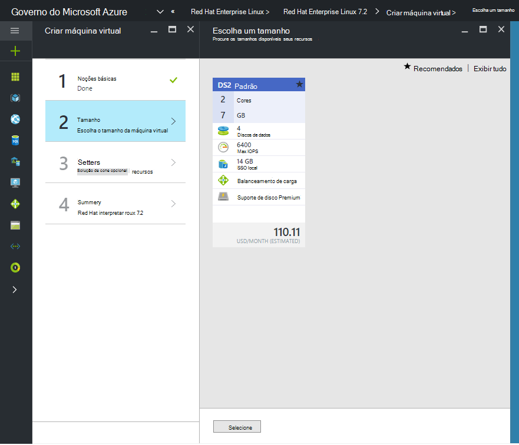

 <properties
    pageTitle="Documentação do governo Azure | Microsoft Azure"
    description="Isso fornece uma comparação de recursos e orientações sobre como desenvolver aplicativos para o governo do Azure."
    services="Azure-Government"
    cloud="gov"
    documentationCenter=""
    authors="VybavaRamadoss"
    manager="asimm"
    editor=""/>

<tags   ms.service="multiple"
    ms.devlang="na"
    ms.topic="article"
    ms.tgt_pltfrm="na"
    ms.workload="azure-government"
    ms.date="10/20/2016"
    ms.author="zakramer;vybavar"/>

# Azure Marketplace do governo
Do Azure Marketplace está disponível para Azure governamentais com uma lista atualizada de imagens de nossos fornecedores marketplace. 

## Variações
Estas são algumas considerações ao usar o Azure Marketplace para governo:

- Somente as imagens de trazer seu próprio licença (BYOL) estão disponíveis. Você não pode acessar qualquer imagens que exijam transação de compra por meio do Azure Marketplace
- Apenas um subconjunto de imagens está disponível atualmente em comparação com o marketplace público. Você pode encontrar na lista de imagens disponíveis [aqui](../azure-government-image-gallery.md) 
- Antes de provisionar uma imagem, o administrador da sua empresa deve habilitar compras Marketplace para sua assinatura do Azure
  - Faça logon no Portal do como administrador corporativo
  - Navegue para *Gerenciar*
  - Em *Detalhes de inscrição* , clique no ícone de lápis ao lado do item de linha do *Azure Marketplace*
  - Alternar *Ativado/desativado* conforme apropriado
  - Clique em *Salvar*

>[AZURE.NOTE] Se você estiver interessado em tornar as imagens disponíveis no Azure governo consultem [diretrizes de integração de parceiro](documentation-government-manage-marketplace-partners.md) para obter mais informações.

### Etapa 1
Início do Marketplace

  

### Etapa 2
Navegue por produtos diferentes para encontrar o correto.

O publisher marketplace fornece uma lista das certificações como parte da descrição do produto para ajudá-lo a fazer a escolha certa. 

### Etapa 3
Escolha um product\image

### Etapa 4
Iniciar o fluxo de criar e insira os parâmetros necessários para implantação

>[AZURE.NOTE] No menu suspenso de local, somente os locais de governo do Azure estão visíveis

### Etapa 5
Observar preços

### Etapa 6
Conclua todas as etapas e clique em Okey para iniciar o processo de provisionamento

## Próximas etapas

Para informações complementares e atualizações, assine o [Blog do Microsoft Azure governamentais](https://blogs.msdn.microsoft.com/azuregov/).
