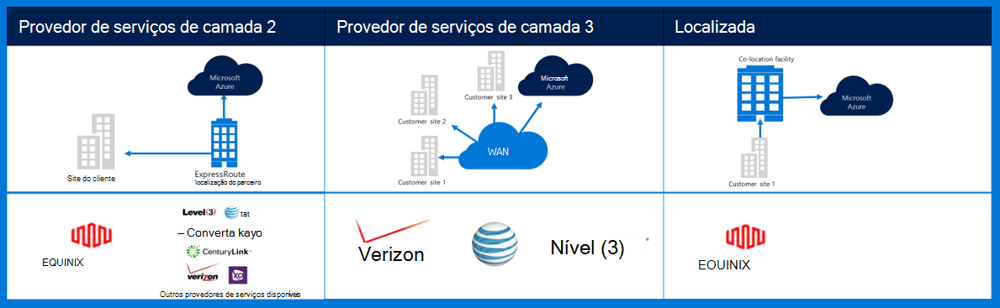
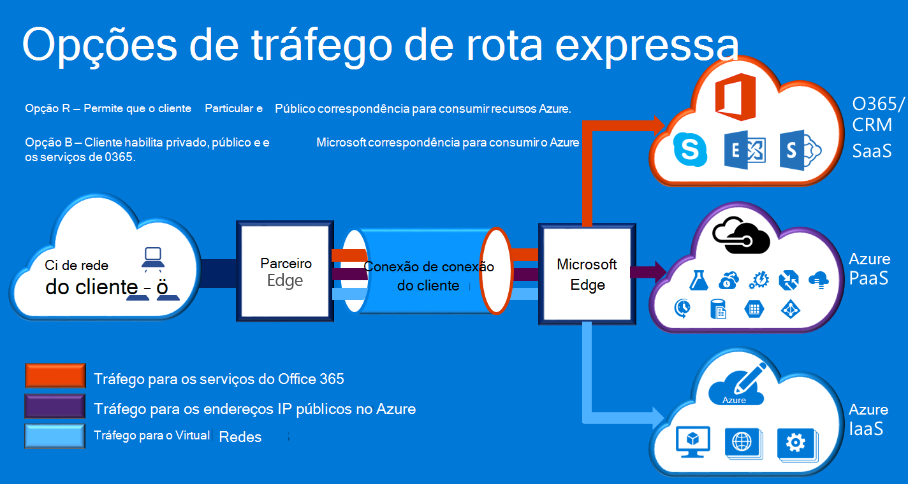

<properties
    pageTitle="Documentação do Azure Governmenmt | Microsoft Azure"
    description="Isso fornece uma comparação de recursos e orientações para conectividade particular e Government"
    services="Azure-Government"
    cloud="gov" 
    documentationCenter=""
    authors="ryansoc"
    manager="zakramer"
    editor=""/>

<tags
    ms.service="multiple"
    ms.devlang="na"
    ms.topic="article"
    ms.tgt_pltfrm="na"
    ms.workload="azure-government"
    ms.date="09/28/2016"
    ms.author="ryansoc"/>

#  Rede de governo Azure

##  Rota expressa (conectividade privada)

Rota expressa estará disponível no governo do Azure. Para obter mais informações (incluindo parceiros e correspondência locais), consulte a <a href="https://azure.microsoft.com/en-us/documentation/services/expressroute/">documentação pública rota expressa </a>.

###  Variações

Rota expressa é disponibilidade geral (GA) no governo do Azure. 

- Clientes do governo conectarem a uma capacidade física isolada ao longo de uma conexão de rota expressa do Azure Government (Gov) (ER) dedicado

- Gov Azure fornece maior disponibilidade & durabilidade aproveitando vários pares de região localizado um mínimo de 500 milhas separadamente 

- Por padrão toda a conectividade Azure Gov ER é configurada ativa redundantes com suporte para interromper e oferece a capacidade de circuito até 10 G (50MB é menor)

- Locais de ER Gov Azure fornecem caminhos otimizados (saltos mais curto, baixa latência, alto desempenho, etc.) para clientes e regiões geográfica redundantes Gov do Azure

- A conexão privada do Azure Gov ER não utilizar, desviar ou dependem da Internet

- Infraestrutura de física e lógica de Gov Azure física é dedicada e separada e acesso é restrito a pessoas dos EUA

- Microsoft possui e opera todos infraestrutura de fibra entre regiões de Gov do Azure e o Azure Gov ER reunir-Me locais

- Azure ER Gov fornece conectividade aos serviços de nuvem do Microsoft Azure, Office 365 e CRM

### Considerações

Há dois serviços básicos que fornecem conectividade de rede privada para o Azure Government: VPN (-to-site para uma organização típica) e rota expressa.

Rota expressa do Azure é usada para criar conexões privadas entre dos data centers do governo do Azure e sua infraestrutura no local ou em um ambiente de colocação. Rota expressa conexões não entram na Internet pública — eles oferecem mais confiabilidade, rapidez e latências mais típicas conexões com a Internet. Em alguns casos, usando conexões de rota expressa para transferir dados nos sistemas de local e Azure rendimentos significativos benefícios de custo.   

Com a rota expressa, você estabelece conexões com o Azure em um local de rota expressa (como um recurso de provedor do Exchange) ou você se conectar diretamente a Azure da sua rede WAN existente (como um multiprotocol rotular mudança (MPLS) VPN, fornecida por um provedor de serviço de rede).

    

Serviços de rede dar suporte a soluções e aplicativos de cliente do governo do Azure, é altamente recomendável que rota expressa (conectividade privada) é implementada para se conectar ao governo do Azure. Se conexões VPN forem usadas, a seguir deve ser considerada:

- Os clientes devem contatar seu autorizar oficial/agência para determinar se conectividade privada ou outro mecanismo de conexão segura é necessário e para identificar quaisquer restrições adicionais a considerar.

- Os clientes devem decidir se exigem que a VPN to-site é roteada por meio de uma zona de conectividade particular.

- Os clientes devem obter um circuito MPLS ou VPN com um provedor de acesso licenciado conectividade particular.

Todos os clientes que utilizam uma arquitetura de conectividade particular devem validar que uma implementação apropriada é estabelecida e mantida para a conexão de cliente para a Internet da rede do Gateway (GN / eu) ponto de demarcação roteador de borda para governo do Azure. Da mesma forma, sua organização deve estabelecer a conectividade de rede entre o seu ambiente local e o ponto de demarcação de roteador de borda de rede/cliente do Gateway (GN/C) do governo do Azure.

## Próximas etapas

Para informações complementares e atualizações assine o <a href="https://blogs.msdn.microsoft.com/azuregov/">Blog do Microsoft Azure governamentais.</a>
