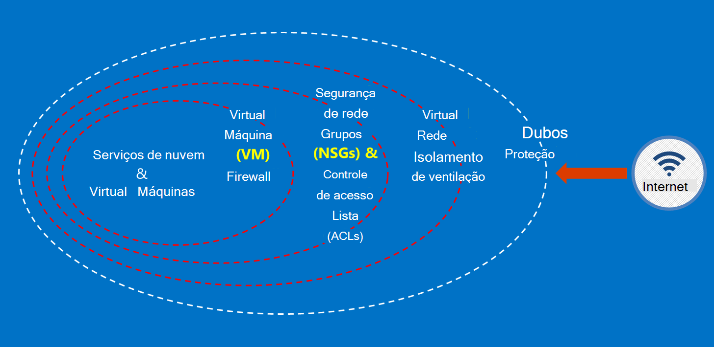

<properties
    pageTitle="Serviços governamentais Azure | Microsoft Azure"
    description="Fornece e a visão geral dos serviços disponíveis no governo do Azure"
    services="Azure-Government"
    cloud="gov"
    documentationCenter=""
    authors="zakramer"
    manager="liki"
    editor="" />

<tags
    ms.service="multiple"
    ms.devlang="na"
    ms.topic="article"
    ms.tgt_pltfrm="na"
    ms.workload="azure-government"
    ms.date="10/18/2016"
    ms.author="ryansoc" />

#  Segurança

##  Princípios para a proteção de dados do cliente no Azure governo

Governo Azure fornece uma variedade de recursos e serviços que você pode usar para criar soluções de nuvem para atender suas necessidades de dados regulamentadas/controlados. Uma solução de conformidade com cliente é nada mais do que a implementação eficaz de recursos de governo do Azure-de-prontos, juntamente com uma prática de segurança de dados sólida.

Quando você hospeda uma solução no Azure governo, Microsoft trata muitas desses requisitos do nível de infraestrutura de nuvem.

O diagrama a seguir mostra o modelo de defesa no Azure. Por exemplo, a Microsoft fornece infraestrutura de nuvem básicas DDOS, juntamente com recursos de cliente como dispositivos de segurança para o aplicativo específico do cliente que DDoS precisa.

Esta página descreve os princípios fundamentais para proteger seus serviços e aplicativos, fornecendo orientação e práticas recomendadas sobre como aplicar esses princípios; em outras palavras, como os clientes devem fazer uso inteligente do governo do Azure para cumprir as obrigações e responsabilidades necessários para uma solução que lida com informações de ITAR.

 Os princípios abrangente para a proteção de dados do cliente são:

- Proteção de dados usando criptografia
- Gerenciando segredos
- Isolamento restringir o acesso a dados

###  Proteção de dados do cliente usando criptografia

Reduzindo riscos e regulamentares obrigações de reunião estão gerando o foco crescente e a importância da criptografia de dados. Usar uma implementação de criptografia eficaz para aprimorar atuais medidas de segurança de rede e aplicativos — e reduzir o risco geral do seu ambiente de nuvem.

#### Criptografia inativos
A criptografia de dados inativos aplica-se a proteção de conteúdo de cliente contido em armazenamento em disco. Existem várias maneiras que isso pode acontecer:

#### Criptografia de serviço de armazenamento

Azure criptografia de serviço de armazenamento está habilitada no nível da conta de armazenamento, resultando em bloco blobs e blobs de página sendo criptografados automaticamente quando gravados ao armazenamento do Azure. Quando você lê os dados do armazenamento do Azure, ele será descriptografado pelo serviço de armazenamento antes de ser retornado. Use isto para proteger seus dados sem precisar modificar ou adicionar código a todos os aplicativos.

#### Criptografia do lado do cliente
Criptografia do lado do cliente é incorporada do Java e as bibliotecas de cliente de armazenamento do .NET, que podem utilizar Azure chave cofre APIs, como fazer isso simples de implementar. Use Cofre de chave do Azure para obter acesso às senhas no Azure chave cofre para indivíduos específicos usando o Active Directory do Azure.

#### Criptografia em trânsito

A criptografia básica disponível para conectividade com o Azure governo suporta o protocolo de segurança de nível de transporte (TLS) 1.2 e certificados x. 509. Federal Information Processing Standard (FIPS) 140-2 algoritmos de criptografia de nível 1 também são usados para conexões de rede de infraestrutura entre data centers do governo do Azure.  Windows 8-plus VMs e compartilhamentos de arquivos do Azure e Windows Server 2012 R2 pode usar SMB 3.0 para criptografia entre a máquina virtual e o compartilhamento de arquivos. Use a criptografia do lado do cliente para criptografar os dados antes que ele é transferido para o armazenamento em um aplicativo cliente e descriptografar os dados depois que ele é transferido sem armazenamento.

#### Práticas recomendadas para criptografia

- IaaS VMs: Use a criptografia de disco Azure. Ativar a criptografia de serviço de armazenamento para criptografar os arquivos VHD que são usados para fazer backup desses discos no armazenamento do Azure, mas isso só criptografa dados recém-criados. Isso significa que, se você criar uma máquina virtual e habilite a criptografia de serviço de armazenamento da conta de armazenamento que contém o arquivo VHD, somente as alterações serão criptografadas, não o arquivo VHD original.
- Criptografia do lado do cliente: Este é o método mais seguro para criptografar seus dados, porque ele criptografa antes de trânsito e criptografa os dados inativos. No entanto, ele requer que você adiciona código a aplicativos usando armazenamento, que talvez você não queira fazer. Nesses casos, você pode usar HTTPs para seus dados e em trânsito, criptografia de serviço de armazenamento para criptografar os dados inativos. Criptografia do lado do cliente também envolve mais carga no cliente — você precisa levar isso em conta seus planos de escalabilidade, especialmente se você estiver criptografando e transferindo muitos dados.

###  Proteção de dados do cliente ao gerenciar segredos

Gerenciamento de chave seguro é essencial para proteger os dados na nuvem. Clientes esforce-se simplificar o gerenciamento de chaves e manter o controle de teclas usada pelos serviços e aplicativos de nuvem para criptografar dados.

#### Práticas recomendadas para gerenciamento de informações secretas

- Use chave cofre para minimizar os riscos de segredos sejam expostos por meio de arquivos de configuração embutida, scripts, ou no código-fonte. Azure Cofre de chave criptografa chaves (como as chaves de criptografia para criptografia de disco do Azure) e senhas (como senhas), armazenando-os em FIPS 140-2 nível 2 validados módulos de segurança de hardware (HSMs). Para assurance adicionado, você pode importar ou gerar chaves nestas HSMs.
- Modelos e códigos de aplicativo devem conter apenas as referências de URI para as senhas (que significa que reais são eles não no código, configuração ou código-fonte repositórios). Isso impede ataques de phishing chave em repos internos ou externos, como coleta-robôs no GitHub.
- Utilize controles RBAC fortes dentro de compartimento de chave. Se um operador confiável deixa a empresa ou transferências para um novo grupo dentro da empresa, eles devem ser impedidos de poder acessar as senhas.

Para obter mais informações <a href="https://azure.microsoft.com/documentation/services/key-vault">documentação pública do Azure chave cofre.</a>

###  Isolamento restringir o acesso a dados

Isolamento trata usando limites, segmentação e contêineres para limitar o acesso a dados para somente os usuários autorizados, serviços e aplicativos. Por exemplo, a separação entre locatários é um mecanismo de segurança essenciais para plataformas de nuvem vários locatários como Microsoft Azure. Isolamento lógico ajuda a impedir que um locatário interferindo com as operações de qualquer outro locatário.

#### Isolamento de ambiente
O ambiente do governo do Azure é uma instância física separada do restante da rede da Microsoft. Isso é feito por meio de uma série de controles físicos e lógicos que incluem o seguinte:

- Protegendo de obstáculos físicos usando câmeras e dispositivos biométricos.
- Uso de credenciais específicas e autenticação multifator pelo pessoal da Microsoft que exigem acesso lógico ao ambiente de produção.
- Todos os infraestrutura de serviço para o Azure governo está localizada nos Estados Unidos.

#### Isolamento por cliente
Controle de acesso de rede do Azure implementa e diferenciação por meio de isolamento de VLAN, ACLs, carregam balanceadores e filtros IP

Os clientes podem isolar ainda mais seus recursos em assinaturas, grupos de recursos, redes virtuais e sub-redes.

## Triagem

O lançados recentemente FedRAMP alto e capacitação de nível de impacto do departamento de defesa 4. Isso tem gerado a barra de segurança e conformidade em todo o ambiente do governo do Azure.

Agora podemos são triagem todos os nossos operadores ao verificar a agência nacional com lei e crédito (NACLC), conforme definido na seção 5.6.2.2 do DoD nuvem computação segurança requisitos guia (SRG):

>[AZURE.NOTE] A investigação de plano de fundo mínimo necessário para a equipe CSP ter acesso de nível 4 e 5 informações com base em um "não críticas sensíveis" (por exemplo, do DoD ADP-2) são uma verificação agência nacional com lei e crédito (NACLC) (para empreiteiros "não críticas sensíveis") ou um moderado risco fundo investigação (IMN) para uma designação de posição de "risco moderado".

A tabela a seguir resume nossa triagem atual para operadores de governo do Azure:

Sessões de Gov Azure e verificações de plano de fundo | Descrição|
---|---|
Ações sociais dos EUA |Verificação de ações sociais dos EUA.
Seleção de plano de fundo do Microsoft cloud (a cada dois anos)|Número da previdência social pesquisa, seleção de histórico criminosos, lista de escritório de controle de ativos estrangeira (OFAC), lista de segurança e do gabinete do setor (BIS), lista do Office de defesa Trade controles jurídicas pessoas.
Seleção de agência nacional com lei e crédito (NACLC) (cada cinco anos) | Adiciona a seleção de plano de fundo de impressão digital em bancos de dados do FBI. Para obter informações adicionais, vá para o<a href="https://www.opm.gov/investigations/background-investigations/federal-investigations-notices/1997/fin97-02/"> Site de gerenciamento de pessoal do Office</a>. | 
<a href="https://www.microsoft.com/en-us/TrustCenter/Compliance/CJIS">Serviços de informações criminosos justiça (CJIS)</a> | CJIS é um estado, local e governo FBI triagem impressão quais processos registros e valida históricos criminosos na equipe operacional que pode ser fornecido acesso aos dados do críticas justiça criminal informações (CJI).  Cada estado significa seu próprio plano de fundo verificação e aprovação subsequente de todos os funcionários com acesso potencial a CJI.|

Para a equipe de operações Azure, os princípios de acesso a seguir se aplicam:

- Responsabilidades sejam claramente definidas, com responsabilidades separadas para solicitando, aprovar e implantar as alterações.
- Acesso é por meio de interfaces definidas que têm funcionalidade específica.
- Acesso é just-in-time (JIT) e é concedido apenas em um por incidente ou para um evento de manutenção específico e sempre por uma período limitada.
- Acesso é baseado em regra, com funções definidas somente atribuídas as permissões necessárias para solução de problemas.

Padrões de triagem incluem a validação de ações sociais EUA de todos suporte da Microsoft e equipe operacional para obter acesso aos sistemas hospedado no Azure governamentais. Equipe de suporte que precisam para transferir dados usa os recursos de seguros dentro do Azure governamentais. Transferência de dados segura requer um conjunto de credenciais de autenticação para obter acesso separado. Por exemplo, para acessar os metadados do sistema, a equipe de operações usa ferramentas de gerenciamento interno específico baseado na web, APIs de somente leitura e JIT elevação.

## Próximas etapas

Para informações complementares e atualizações assine o <a href="https://blogs.msdn.microsoft.com/azuregov/">Blog do Microsoft Azure governamentais.</a>
