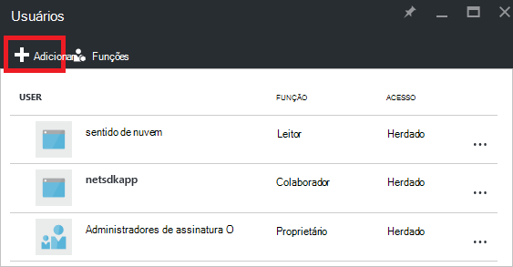

<properties
   pageTitle="Acesso do Azure dashboard portal | Microsoft Azure"
   description="Este artigo explica como compartilhar o acesso a um painel no portal do Azure."
   services="azure-portal"
   documentationCenter=""
   authors="tfitzmac"
   manager="timlt"
   editor="tysonn"/>

<tags
   ms.service="multiple"
   ms.devlang="NA"
   ms.topic="article"
   ms.tgt_pltfrm="NA"
   ms.workload="na"
   ms.date="08/01/2016"
   ms.author="tomfitz"/>

# Compartilhamento de painéis do Azure

Depois de configurar um painel, você pode publicá-lo e compartilhá-la com outros usuários na sua organização. Permitir que outras pessoas acessem seu painel usando o [Controle de acesso com base em função](../active-directory/role-based-access-control-configure.md)do Azure. Atribuir um usuário ou grupo de usuários a uma função e essa função define se os usuários podem exibir ou modificar o publicados no painel. 

Todos os painéis publicados são implementados como recursos Azure, o que significa que eles existem como gerenciáveis itens dentro de sua assinatura e estão contidos em um grupo de recursos.  De uma perspectiva de controle de acesso, painéis não são diferentes de outros recursos, como uma máquina virtual ou uma conta de armazenamento.

> [AZURE.TIP] Blocos individuais no painel impõem seus próprios requisitos de controle de acesso com base nos recursos que eles serão exibidos.  Portanto, você pode criar um painel que é compartilhado amplamente ainda proteger os dados em blocos individuais.

## Controle de acesso de compreensão de painéis

Com o controle de acesso baseado em função, você pode atribuir usuários a funções em três níveis diferentes de escopo:

- assinatura
- grupo de recursos
- recurso

As permissões atribuídas são herdadas de assinatura para baixo até o recurso. O painel publicado é um recurso. Portanto, você já pode ter usuários atribuídos às funções para a assinatura que também funcionam para o painel publicado. 

Aqui está um exemplo.  Digamos que você tem uma assinatura do Azure e vários membros da equipe foram atribuídos as funções do **proprietário**, **Colaborador**ou **leitor** para a assinatura. Os usuários que são proprietários ou colaboradores são capazes de lista, exibir, criar, modificar ou excluir painéis na assinatura.  Os usuários que são leitores são capazes de painéis de lista e exibição, mas não podem modificar ou exclui-los.  Usuários com acesso leitor são capazes de fazer edições locais a um painel publicado (como ao solucionar um problema), mas não é possível publicar essas alterações no servidor.  Eles terão a opção para fazer uma cópia particular do painel para si mesmo

No entanto, você também pode atribuir permissões para o grupo de recursos que contém vários painéis ou para um painel individual. Por exemplo, você pode decidir que um grupo de usuários deve ter permissões limitadas a assinatura mas maior acesso a um painel específico. Você pode atribuir esses usuários a uma função para esse painel. 

## Publique dashboard

Vamos supor que você terminar de configurar um painel que você deseja compartilhar com um grupo de usuários em sua assinatura. As etapas a seguir descrevem um grupo personalizado chamado gerentes de armazenamento, mas você pode nomear seu grupo tudo o que você gostaria. Para obter informações sobre como criar um grupo do Active Directory e adicionar usuários ao grupo, consulte [Gerenciando grupos do Active Directory do Azure](../active-directory/active-directory-accessmanagement-manage-groups.md).

1. No painel de controle, selecione **compartilhar**.

     

2. Antes de atribuir acesso, você deve publicar o painel. Por padrão, o painel será publicado para um grupo de recursos denominado **painéis**. Selecione **Publicar**.

     

Seu painel agora é publicado. Se as permissões herdadas da assinatura forem adequadas, você não precisa fazer nada mais. Outros usuários na sua organização poderão acessar e modificar o painel com base em suas funções de nível de assinatura. No entanto, para este tutorial, vamos atribuir um grupo de usuários a uma função para esse painel.

## Atribuir acesso a um painel

1. Após a publicação no painel, selecione **Gerenciar usuários**.

     

2. Você verá uma lista de usuários existentes que já estão atribuídos a uma função para esse painel. Sua lista de usuários existentes será diferente do que a imagem abaixo. Provavelmente, as atribuições são herdadas da assinatura. Para adicionar um novo usuário ou grupo, selecione **Adicionar**.

     

3. Selecione a função que representa as permissões que você deseja conceder. Neste exemplo, selecione **Colaborador**.

     

4. Selecione o usuário ou grupo que você deseja atribuir a função. Se você não vir o usuário ou grupo que você está procurando na lista, use a caixa de pesquisa. Sua lista de grupos disponíveis dependem os grupos que você criou no seu Active Directory.

      

5. Quando você terminar de adicionar usuários ou grupos, selecione **Okey**. 

6. A nova atribuição é adicionada à lista de usuários. Observe que seu **acesso** é listada como **atribuído** em vez de **herdadas**.

     

## Próximas etapas

- Para obter uma lista de funções, consulte [RBAC: funções internas](../active-directory/role-based-access-built-in-roles.md).
- Para saber sobre o gerenciamento de recursos, consulte [recursos de gerenciar Azure por meio do portal](resource-group-portal.md).