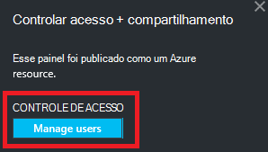

<properties
   pageTitle="Painéis de portal Azure | Microsoft Azure"
   description="Este artigo explica como criar e editar painéis no portal do Azure."
   services="azure-portal"
   documentationCenter=""
   authors="sewatson"
   manager="timlt"
   editor="tysonn"/>

<tags
   ms.service="multiple"
   ms.devlang="NA"
   ms.topic="article"
   ms.tgt_pltfrm="NA"
   ms.workload="na"
   ms.date="09/06/2016"
   ms.author="sewatson"/>

# Criar e compartilhar painéis no portal do Azure

Você pode criar vários painéis e compartilhá-los com outras pessoas que tenham acesso às suas assinaturas Azure.  Esta postagem percorre Noções básicas de criação/edição, a publicação e gerenciando o acesso aos painéis.

## Personalizando painéis versus lâminas

Desde iniciar painéis alguns meses, houve uma diminuição estável em personalizações de blade e um rápido aumento em personalizações de painel. Essa tendência de uso forte mostra que você preferir personalizar painéis sobre lâminas. Para oferecer suporte a essa tendência, podemos removerá a capacidade de personalizar blades e dedicar nossos esforços para aprimorar a funcionalidade do painel. Se você personalizou um blade, sua personalização breve será removida. Para preservar essa personalização, fixe as peças personalizadas a um painel. Simplesmente o bloco de atalho e selecione **Fixar no dashboard** conforme mostrado na imagem a seguir.

## Criar um painel

Para criar um painel, selecione o botão **novo painel** ao lado do nome do painel atual.  

Esta ação cria um painel de novo, vazio particular e colocará no modo de personalização de onde você pode nomear seu painel e adicionar ou reorganizar blocos.  Nesse modo, a Galeria de bloco recolhíveis assume o menu de navegação à esquerda.  A Galeria do bloco, você pode encontrar peças para os seus recursos Azure de várias maneiras: você pode navegar pelo [grupo de recursos](../azure-resource-manager/resource-group-overview.md#resource-groups), por tipo de recurso, por [marca](../resource-group-using-tags.md)ou pesquisando pelo seu recurso por nome.  

Adicione blocos arrastando e soltando-os para a superfície de painel onde desejar.

Não há uma nova categoria chamada **Geral** para blocos que não estão associados um determinado recurso.  Neste exemplo, podemos fixar o bloco de redução.  Use este bloco para adicionar conteúdo personalizado ao seu painel.  Compatível com o bloco de texto sem formatação, [redução sintaxe](https://daringfireball.net/projects/markdown/syntax)e um conjunto limitado de HTML.  (Para segurança, você não pode fazer coisas como inserir `<script>` marcas ou usar certos elementos de estilo de CSS que podem interferir com o portal.) 

## Editar um painel

Depois de criar seu painel, você pode fixar blocos da Galeria de bloco ou a representação de bloco de lâminas. Vamos fixar a representação de nosso grupo de recursos. Você pode o pin quando o item de navegação ou da lâmina de grupo do recurso. As duas abordagens resultam em fixando a representação de bloco do grupo de recursos.

Depois de fixar o item, ele aparece em seu painel.

Agora que temos um bloco de redução e um grupo de recursos fixos ao painel, podemos redimensionar e reorganizar os blocos em um layout adequado.

Passar o mouse e selecionando "..." ou clicando em um bloco, você pode ver todos os comandos contextuais para esse bloco. Por padrão, há dois itens:

1. **Desafixar do dashboard** – remove o bloco de painel
2.  **Personalizar** – insere Personalizar modo

Selecionando Personalizar, você pode redimensionar e reordenar as peças. Para redimensionar um bloco, selecione o novo tamanho no menu contextual, conforme mostrado na imagem a seguir.

Ou, se o bloco suporta qualquer tamanho, você pode arrastar o canto inferior direito para o tamanho desejado.

Após o redimensionamento peças, exiba o painel de controle.

Depois que terminar de personalizar um painel, basta selecionar o **feito personalizando** para sair Personalizar modo ou com o botão direito e selecione **feito personalizando** no menu de contexto.

## Publicar um painel e gerenciar o controle de acesso

Quando você cria um painel, ele é particular por padrão, o que significa que você é a única pessoa que possa vê-la.  Para torná-la visível para outras pessoas, use o botão de **compartilhamento** exibido juntamente com os outros comandos de painel.

Você será solicitado a escolher uma assinatura e o grupo de recursos para seu painel deve ser publicado. Para integrar perfeitamente painéis no ecossistema, podemos tiver implementado painéis compartilhados como recursos Azure (para que você não pode compartilhar digitando um endereço de email).  Acesso às informações exibidas pela maioria dos blocos no portal são controladas por [Controle de acesso baseado do Azure função](../active-directory/role-based-access-control-configure.md ). De uma perspectiva de controle de acesso, painéis compartilhados não são diferentes de uma máquina virtual ou uma conta de armazenamento.  

Digamos que você tiver uma assinatura do Azure e membros da equipe recebeu as funções do **proprietário**, **Colaborador**ou **leitor** da assinatura.  Os usuários que são proprietários ou colaboradores são capazes de lista, exibir, criar, modificar ou excluir painéis dentro dessa assinatura.  Os usuários que são leitores são capazes de painéis de lista e exibição, mas não podem modificar ou exclui-los.  Usuários com acesso leitor são capazes de fazer edições locais a um painel compartilhado, mas não serão possível publicar essas alterações no servidor.  No entanto, eles podem tornar uma cópia particular do painel de controle para seu próprio uso.  Como sempre, ladrilhos individuais no painel impõem suas próprias regras de controle de acesso baseadas nos recursos de acordo com.  

Para sua conveniência, experiência de publicação do portal orienta você em direção a um padrão onde você coloca painéis em um grupo de recursos chamado **painéis**.  

Você também pode optar por publicar um dashboard em um grupo de recursos específico.  O controle de acesso para esse painel corresponde o controle de acesso do grupo de recursos.  Usuários que podem gerenciar os recursos desse grupo de recursos também têm acesso aos painéis.

Após a publicação de seu painel, o painel de controle do **compartilhamento + access** será atualizar e mostrar informações sobre no painel publicado, incluindo um link para gerenciar o acesso de usuário ao painel.  Esse link inicia a lâmina de controle de acesso com base em função padrão usada para gerenciar o acesso a qualquer recurso Azure.  Você sempre pode voltar a este modo de exibição selecionando o **compartilhamento**.

## Próximas etapas

- Para gerenciar recursos, consulte [recursos de gerenciar Azure por meio do portal](resource-group-portal.md).
- Para implantar recursos, consulte [recursos de implantar com modelos do Gerenciador de recursos e portal do Azure](../resource-group-template-deploy-portal.md).