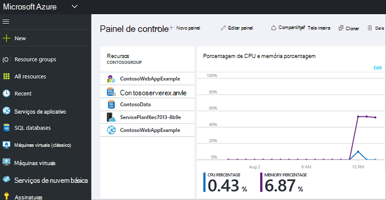

<properties 
    pageTitle="Usar o portal do Azure para gerenciar recursos Azure | Microsoft Azure" 
    description="Use Azure portal e gerenciar de recurso do Azure para gerenciar seus recursos. Mostra como trabalhar com painéis para monitorar os recursos." 
    services="azure-resource-manager,azure-portal" 
    documentationCenter="" 
    authors="tfitzmac" 
    manager="timlt" 
    editor="tysonn"/>

<tags 
    ms.service="azure-resource-manager" 
    ms.workload="multiple" 
    ms.tgt_pltfrm="na" 
    ms.devlang="na" 
    ms.topic="article" 
    ms.date="09/12/2016" 
    ms.author="tomfitz"/>

# Gerenciar recursos Azure por meio do portal

> [AZURE.SELECTOR]
- [PowerShell Azure](../powershell-azure-resource-manager.md)
- [CLI Azure](../xplat-cli-azure-resource-manager.md)
- [Portal](resource-group-portal.md) 
- [API REST](../resource-manager-rest-api.md)

Este tópico mostra como usar o [portal do Azure](https://portal.azure.com) com [Gerenciador de recursos do Azure](../azure-resource-manager/resource-group-overview.md) para gerenciar seus recursos Azure. Para saber sobre a implantação de recursos por meio do portal, consulte [recursos de implantar com modelos do Gerenciador de recursos e portal do Azure](../resource-group-template-deploy-portal.md).

Atualmente, não cada serviço suporta o portal ou o Gerenciador de recursos. Para esses serviços, você precisa usar o [portal clássico](https://manage.windowsazure.com). O status de cada serviço, consulte o [gráfico de disponibilidade de portal Azure](https://azure.microsoft.com/features/azure-portal/availability/).

## Gerenciar grupos de recursos

1. Para ver todos os grupos de recursos em sua assinatura, selecione **grupos de recursos**.

    

1. Para criar um grupo de recursos vazia, selecione **Adicionar**.

    

1. Forneça um nome e local para o novo grupo de recursos. Selecione **criar**.

    

1. Você talvez precise selecione **Atualizar** para ver o grupo de recursos criado recentemente.

    

1. Para personalizar as informações exibidas para os grupos de recursos, selecione **colunas**.

    

1. Selecione as colunas para adicionar e, em seguida, selecione **Atualizar**.

    

1. Para saber mais sobre a implantação de recursos para seu novo grupo de recursos, consulte [recursos de implantar com modelos do Gerenciador de recursos e portal do Azure](../resource-group-template-deploy-portal.md).

1. Para obter acesso rápido a um grupo de recursos, você pode fixar a lâmina ao seu painel.

    

1. O painel exibe o grupo de recursos e seus recursos. Você pode selecionar os grupos de recursos ou qualquer um dos seus recursos para navegar até o item.

    

## Recursos de marca

Você pode aplicar marcas a grupos de recursos e recursos para organizar logicamente seus ativos. Para obter informações sobre como trabalhar com marcas de formatação, consulte [usando marcas para organizar seus recursos Azure](../resource-group-using-tags.md).

[AZURE.INCLUDE [resource-manager-tag-resource](../../includes/resource-manager-tag-resources.md)]

## Recursos do monitor

Quando você seleciona um recurso, a lâmina recurso apresenta padrão gráficos e tabelas para monitoramento desse tipo de recurso.

1. Selecione um recurso e observe a seção de **monitoramento** . Ele inclui gráficos relevantes para o tipo de recurso. A imagem a seguir mostra o padrão de monitoramento de dados para uma conta de armazenamento.

    

1. Você pode fixar uma seção da lâmina ao seu painel selecionando as reticências (…) acima da seção. Você também pode personalizar o tamanho da seção na lâmina ou removê-lo completamente. A imagem a seguir mostra como fixar, personalizar ou remover a seção de CPU e memória.

    

1. Depois de fixar a seção para o painel de controle, você verá o resumo no painel. E, selecionando-o imediatamente leva você para obter mais detalhes sobre os dados.

    

1. Para personalizar completamente os dados que você monitorar por meio do portal, navegue até o painel padrão e selecione o **novo painel de controle**.

    

1. Dê um nome para o novo painel de controle e arraste blocos para o painel. As peças são filtradas por diferentes opções.

    

     Para saber mais sobre como trabalhar com painéis, consulte [Criando e compartilhamento painéis no portal do Azure](azure-portal-dashboards.md).

## Gerenciar recursos

Na lâmina para um recurso, você deve ver as opções de gerenciamento do recurso. O portal apresenta opções de gerenciamento do tipo determinado recurso. Você pode ver os comandos de gerenciamento na parte superior da lâmina recurso e no lado esquerdo.

Estas opções, você pode executar operações como iniciar e interromper uma máquina virtual ou reconfigurar as propriedades da máquina virtual.

## Mover recursos

Se você precisar mover recursos para outro grupo de recursos ou outra assinatura, consulte [Mover recursos para novo grupo de recursos ou assinatura](../resource-group-move-resources.md).

## Recursos de bloqueio

Você pode bloquear uma assinatura, grupo de recursos ou recurso para impedir que outros usuários na sua organização acidentalmente excluam ou modifiquem recursos críticos. Para obter mais informações, consulte [recursos de bloqueio com o Gerenciador de recursos do Azure](../resource-group-lock-resources.md).

[AZURE.INCLUDE [resource-manager-lock-resources](../../includes/resource-manager-lock-resources.md)]

## Exibir sua assinatura e os custos

Você pode exibir informações sobre sua assinatura e os custos acumulados para todos os seus recursos. Selecione **assinaturas** e a assinatura que você deseja ver. Você só pode ter uma assinatura para selecionar.

Dentro do blade de assinatura, você verá uma taxa de gravação.

Além disso, uma divisão de custos por tipo de recurso.

## Exportar modelo

Após configurar seu grupo de recursos, talvez você queira exibir o modelo do Gerenciador de recursos do grupo de recursos. Exportar o modelo oferece dois benefícios:

1. Você pode facilmente automatizar implantações futuras da solução porque o modelo contém todos os a infraestrutura completa.

2. Você pode se familiarizar com sintaxe de modelo olhando na JSON JavaScript Object Notation () que representa a sua solução.

Para obter orientação passo a passo, consulte [Gerenciador de recursos do Azure exportar modelo de recursos existentes](../resource-manager-export-template.md).

## Excluir o grupo de recursos ou recursos

Excluir um grupo de recursos, exclui todos os recursos contidos nela. Você também pode excluir recursos individuais dentro de um grupo de recursos. Você deseja ter cuidado ao excluir um grupo de recursos como pode haver recursos em outros grupos de recursos que estão vinculados a ele. Gerenciador de recursos não exclui recursos vinculados, mas eles podem não funcionar corretamente sem os recursos esperados.

## Próximas etapas

- Para exibir logs de auditoria, consulte [operações com o Gerenciador de recursos de auditoria](../resource-group-audit.md).
- Para solucionar erros de implantação, consulte [implantações de grupo de recursos de solução de problemas com portal Azure](../resource-manager-troubleshoot-deployments-portal.md).
- Para implantar recursos por meio do portal, consulte [recursos de implantar com modelos do Gerenciador de recursos e portal do Azure](../resource-group-template-deploy-portal.md).
- Para gerenciar o acesso aos recursos, consulte [Usar atribuições de função para gerenciar o acesso aos recursos da sua assinatura Azure](../active-directory/role-based-access-control-configure.md).

