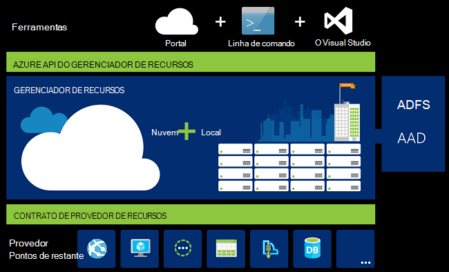
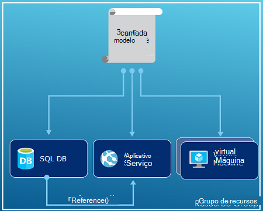
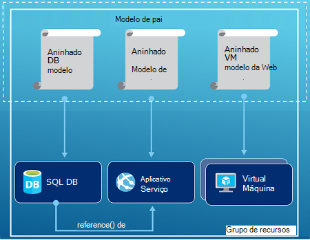
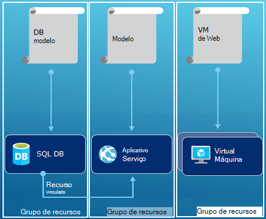

<properties
   pageTitle="Visão geral do Gerenciador de recursos Azure | Microsoft Azure"
   description="Descreve como usar o Gerenciador de recursos do Azure para implantação, gerenciamento, e acessar o controle dos recursos do Azure."
   services="azure-resource-manager"
   documentationCenter="na"
   authors="tfitzmac"
   manager="timlt"
   editor="tysonn"/>

<tags
   ms.service="azure-resource-manager"
   ms.devlang="na"
   ms.topic="get-started-article"
   ms.tgt_pltfrm="na"
   ms.workload="na"
   ms.date="10/21/2016"
   ms.author="tomfitz"/>

# Visão geral do Gerenciador de recursos Azure

A infraestrutura do aplicativo normalmente consiste em vários componentes – talvez uma máquina virtual, conta de armazenamento e uma rede virtual, ou um aplicativo web, banco de dados, servidor de banco de dados e serviços de terceiros 3º. Você não vir esses componentes como entidades separadas, em vez disso, você vê-los como relacionados e interdependentes partes de uma única entidade. Você deseja implantar, gerenciar e monitorá-los como um grupo. Gerenciador de recursos de Azure permite que você trabalhe com os recursos na sua solução como um grupo. Você pode implantar, atualizar ou excluir todos os recursos para sua solução em uma operação única e coordenada. Usar um modelo para implantação e esse modelo pode servir para diferentes ambientes como teste, teste e produção. Gerenciador de recursos fornece segurança, auditoria e os recursos para ajudá-lo a gerenciar seus recursos após a implantação de marcação. 

## Terminologia

Se você é novo para o Gerenciador de recursos do Azure, há alguns termos podem não estar familiarizados com.

- **recurso** - um item gerenciável que está disponível através do Azure. Alguns recursos comuns estão uma máquina virtual, conta de armazenamento, web app, banco de dados e uma rede virtual, mas há muito mais.
- **grupo de recursos** - um contêiner que armazena recursos relacionados para uma solução do Azure. O grupo de recursos pode incluir todos os recursos para a solução, ou apenas os recursos que você deseja gerenciar como um grupo. Você decida como deseja alocar recursos para grupos de recursos com base no que faz mais sentido para sua organização. Consulte [grupos de recursos](#resource-groups).
- **provedor de recursos** - um serviço que fornece os recursos que você pode implantar e gerenciar através do Gerenciador de recursos. Cada provedor de recursos oferece operações para trabalhar com os recursos que são implantados. Alguns provedores de recursos comuns são Microsoft.Compute, que fornece o recurso de máquina virtual, Microsoft.Storage, que fornece o recurso de conta de armazenamento, e Microsoft.Web, que fornece recursos relacionados a aplicativos web. Consulte [provedores de recursos](#resource-providers).
- **Modelo do Gerenciador de recursos** - arquivo de um JavaScript Object Notation (JSON) que define um ou mais recursos para implantar em um grupo de recursos. Ele também define as dependências entre os recursos implantados. O modelo pode ser usado para implantar os recursos de forma consistente e repetidamente. Consulte [implantação do modelo](#template-deployment).
- **sintaxe declarativa** - sintaxe que permite que você indicar "Aqui é o que eu pretende criar" sem precisar escrever a sequência de programação comandos criá-lo. O modelo do Gerenciador de recursos é um exemplo de sintaxe declarativa. No arquivo, você define as propriedades para a infraestrutura implantar Azure. 

## Os benefícios de usar o Gerenciador de recursos

Gerenciador de recursos fornece vários benefícios:

- Você pode implantar, gerenciar e monitorar todos os recursos para a sua solução como um grupo, em vez de lidar com esses recursos individualmente.
- Repetidamente, você pode implantar sua solução em todo o ciclo de vida de desenvolvimento e ter confiança que seus recursos são implantados em um estado consistente.
- Você pode gerenciar sua infraestrutura por meio de modelos declarativos em vez de scripts.
- Você pode definir as dependências entre recursos para que eles são implantados na ordem correta.
- Você pode aplicar controle de acesso a todos os serviços em seu grupo de recursos, como controle de acesso baseado em função (RBAC) nativamente é integrado à plataforma de gerenciamento.
- Você pode aplicar marcas aos recursos para organizar logicamente todos os recursos na sua assinatura.
- Você pode esclarecer a cobrança da sua organização exibindo custos para um grupo de recursos compartilhando a mesma marca.  

Resource Manager fornece uma nova maneira de implantar e gerenciar suas soluções. Se você usou o modelo de implantação anterior e deseja saber mais sobre as alterações, consulte [Gerenciador de recursos de Noções básicas sobre implantação e implantação clássica](../resource-manager-deployment-model.md).

## Camada de gerenciamento consistente

Gerenciador de recursos fornece uma camada de gerenciamento consistente para tarefas que você executar através do PowerShell do Azure, CLI do Azure, portal Azure, API REST e ferramentas de desenvolvimento. Todas as ferramentas de usam um conjunto comum de operações. Use as ferramentas que funcionam melhor para você e usá-los indistintamente sem confusão. 

A imagem a seguir mostra como todas as ferramentas interagem com a mesma API do Gerenciador de recursos do Azure. A API passa as solicitações para o serviço do Gerenciador de recursos, que autentica e autoriza as solicitações. Gerenciador de recursos encaminha as solicitações para os provedores de recurso apropriado.

## Orientação

As sugestões a seguir o ajudarão a aproveitar ao máximo do Gerenciador de recursos ao trabalhar com suas soluções.

1. Definir e implantar sua infraestrutura através a sintaxe declarativa em modelos do Gerenciador de recursos, em vez de por meio de comandos fundamental.
2. Defina todas as etapas de implantação e a configuração no modelo. Você deve ter sem etapas manuais de configuração de sua solução.
3. Execute comandos fundamental para gerenciar os recursos, como iniciar ou interromper um aplicativo ou máquina.
4. Organize recursos com o mesmo ciclo de vida de um grupo de recursos. Use marcas para todos os outros organizar de recursos.

Para obter mais recomendações, consulte [práticas recomendadas para a criação de modelos do Gerenciador de recursos do Azure](../resource-manager-template-best-practices.md).

## Grupos de recursos

Existem alguns fatores importantes a considerar ao definir seu grupo de recursos:

1. Todos os recursos do seu grupo devem compartilhar o mesmo ciclo de vida. Você implantar, atualizar e excluí-las juntas. Se um recurso, como um servidor de banco de dados, precisa existir em um ciclo de implantação diferentes ele deve estar no outro grupo de recursos.
2. Cada recurso só pode existir em um grupo de recursos.
3. Você pode adicionar ou remover um recurso a um grupo de recursos a qualquer momento.
4. Você pode mover um recurso de um grupo de recursos para outro grupo. Para obter mais informações, consulte [Mover recursos para novo grupo de recursos ou assinatura](../resource-group-move-resources.md).
4. Um grupo de recursos pode conter recursos que residem em diferentes regiões.
5. Um grupo de recursos pode ser usado para controle de acesso para ações administrativas do escopo.
6. Um recurso pode interagir com recursos em outros grupos de recursos. Essa interação é comum quando os dois recursos estão relacionados, mas não compartilham o mesmo ciclo de vida (por exemplo, aplicativos web se conectando a um banco de dados).

Ao criar um grupo de recursos, você precisa fornecer um local para esse grupo de recursos. Você pode estar se perguntando "por que é um grupo de recursos necessário um local? E, se os recursos podem ter locais diferentes do grupo de recursos, por que a localização de grupo do recurso importa em todos os?" O grupo de recursos armazena metadados sobre os recursos. Portanto, quando você especificar um local para o grupo de recursos, você estará especificando onde metadados está armazenado. Por razões de conformidade, talvez você precise Certifique-se de que seus dados são armazenados em uma região específica.

## Provedores de recursos

Cada provedor de recursos oferece um conjunto de recursos e operações para trabalhar com um serviço Azure. Por exemplo, se você quiser armazenar chaves e senhas, você trabalhar com o provedor de recursos de **Microsoft.KeyVault** . Este provedor do recurso oferece um tipo de recurso chamado **compartimentos** para criação de Cofre de chave e um tipo de recurso chamado **compartimentos/segredos** para criar um segredo no cofre de chave. 

Antes de começar a implantação de seus recursos, você deve obter uma compreensão dos provedores de recursos disponíveis. Conhecer os nomes dos provedores de recursos e recursos ajuda você a definir recursos que você deseja implantar para o Azure.

Recuperar todos os provedores de recurso com o seguinte cmdlet do PowerShell:

    Get-AzureRmResourceProvider -ListAvailable

Ou, com o Azure CLI, recuperar todos os provedores de recurso com o seguinte comando:

    azure provider list

É possível examinar a lista retornada para os provedores de recursos que você precisa usar.

Para obter detalhes sobre um provedor de recursos, adicione o espaço para nome do provedor ao comando. O comando retorna os tipos de recursos com suporte para o provedor de recursos e as versões de API para cada tipo de recurso e locais com suporte. O seguinte cmdlet do PowerShell obtém detalhes sobre Microsoft.Compute:

    (Get-AzureRmResourceProvider -ProviderNamespace Microsoft.Compute).ResourceTypes

Ou, com o Azure CLI, recuperar os tipos de recursos com suporte, locais e as versões de API do Microsoft.Compute, com o seguinte comando:

    azure provider show Microsoft.Compute --json > c:\Azure\compute.json

Para obter mais informações, consulte [Gerenciador de recursos de provedores, regiões, as versões de API e esquemas](../resource-manager-supported-services.md).

## Implantação de modelo

Com o Gerenciador de recursos, você pode criar um modelo (no formato JSON) que define a infraestrutura e a configuração de sua solução Azure. Usando um modelo, pode repetidamente implantar sua solução em todo o ciclo de vida e ter confiança que seus recursos são implantados em um estado consistente. Quando você cria uma solução no portal do, a solução inclui automaticamente um modelo de implantação. Você não precisa criar seu modelo do zero, porque você pode começar com o modelo para sua solução e personalizá-lo para atender às suas necessidades específicas. Você pode recuperar um modelo para um grupo de recursos existentes, exportar o estado atual do grupo de recursos ou exibindo o modelo usado para uma determinada implantação. Exibir o [exportados modelo](../resource-manager-export-template.md) é uma maneira útil para saber mais sobre a sintaxe do modelo.

Para saber mais sobre o formato do modelo e como você constrói, consulte [Criação de modelos de gerente de recursos do Azure](../resource-group-authoring-templates.md) e [Explicação passo a passo de modelo do Gerenciador de recursos](../resource-manager-template-walkthrough.md).

Gerenciador de recursos processa o modelo como qualquer outra solicitação (consulte a imagem para a [camada de gerenciamento consistente](#consistent-management-layer)). Ele analisa o modelo e converte sua sintaxe em operações de API REST para os provedores de recurso apropriado. Por exemplo, quando o Gerenciador de recursos recebe um modelo com a seguinte definição de recurso:

    "resources": [
      {
        "apiVersion": "2016-01-01",
        "type": "Microsoft.Storage/storageAccounts",
        "name": "mystorageaccount",
        "location": "westus",
        "sku": {
          "name": "Standard_LRS"
        },
        "kind": "Storage",
        "properties": {
        }
      }
      ]

Converte a definição para a seguinte operação de API REST, que é enviada para o provedor de recursos de Microsoft.Storage:

    PUT
    https://management.azure.com/subscriptions/{subscriptionId}/resourceGroups/{resourceGroupName}/providers/Microsoft.Storage/storageAccounts/mystorageaccount?api-version=2016-01-01
    REQUEST BODY
    {
      "location": "westus",
      "properties": {
      }
      "sku": {
        "name": "Standard_LRS"
      },   
      "kind": "Storage"
    }

Como você define modelos e grupos de recursos é totalmente até você e como você deseja gerenciar sua solução. Por exemplo, você pode implantar seu aplicativo de três camadas por meio de um único modelo a um grupo de único recurso.

Mas, você não precisa definir sua infraestrutura inteira em um único modelo. Muitas vezes, faz sentido dividir suas necessidades de implantação em um conjunto de modelos de destino, propósito específico. Você pode reutilizar facilmente esses modelos para soluções diferentes. Para implantar uma solução específica, você cria um modelo de mestre que vincule todos os modelos necessários. A imagem a seguir mostra como implantar uma solução de três camadas por meio de um modelo de pai que inclui três modelos aninhados.

Se você imagina seus níveis tendo ciclos de vida separados, você pode implantar sua três camadas para separar grupos de recursos. Observe que os recursos ainda podem ser vinculados a recursos em outros grupos de recursos.

Para obter mais sugestões sobre como criar seus modelos, consulte [padrões para a criação de modelos do Gerenciador de recursos do Azure](../best-practices-resource-manager-design-templates.md). Para obter informações sobre modelos aninhados, consulte [usando modelos vinculados com o Gerenciador de recursos do Azure](../resource-group-linked-templates.md).

Gerenciador de recursos de Azure analisa dependências para garantir que recursos são criados na ordem correta. Se um recurso depende de um valor de outro recurso (como uma máquina virtual precisar de uma conta de armazenamento para discos), você pode definir uma dependência. Para obter mais informações, consulte [dependências de definição nos modelos do Gerenciador de recursos do Azure](../resource-group-define-dependencies.md).

Você também pode usar o modelo para atualizações a infraestrutura. Por exemplo, você pode adicionar um recurso à sua solução e adicionar regras de configuração para os recursos que já foram implantados. Se o modelo especifica criando um recurso, mas que já existe um recurso, o Gerenciador de recursos do Azure executa uma atualização em vez de criar um novo ativo. Gerenciador de recursos de Azure atualiza o ativo existente para o mesmo estado como seria como novo.  

Gerenciador de recursos fornece extensões para cenários quando precisar operações adicionais como instalar o software específico que não está incluído na configuração. Se você já estiver usando um serviço de gerenciamento de configuração, como DSC, chefe ou Puppet, você pode continuar trabalhando com esse serviço usando as extensões. Para obter informações sobre as extensões de máquina virtual, consulte [sobre os recursos e extensões de máquina virtual](../virtual-machines/virtual-machines-windows-extensions-features.md). 

Finalmente, o modelo torna-se parte do código-fonte para o aplicativo. Você pode check-in para o repositório de código fonte e atualizá-lo conforme evolui de seu aplicativo. Você pode editar o modelo por meio do Visual Studio.

Depois de definir seu modelo, você está pronto para implantar os recursos do Azure. Para os comandos implantar os recursos, consulte:

- [Implantar recursos com modelos do Gerenciador de recursos e PowerShell do Azure](../resource-group-template-deploy.md)
- [Implantar recursos com modelos do Gerenciador de recursos e CLI do Azure](../resource-group-template-deploy-cli.md)
- [Implantar recursos com modelos do Gerenciador de recursos e portal do Azure](../resource-group-template-deploy-portal.md)
- [Implantar recursos com modelos do Gerenciador de recursos e REST API de Gerenciador de recursos](../resource-group-template-deploy-rest.md)

## Marcas

Gerenciador de recursos fornece um recurso de marcação que permite que você categorizar os recursos de acordo com suas necessidades de gerenciamento ou de cobrança. Use marcas quando você tem um conjunto complexo de grupos de recursos e os recursos e precisa visualizar esses ativos da maneira que faz mais sentido para você. Por exemplo, você pode marcar recursos que servem uma função semelhante em sua organização ou pertencem ao mesmo departamento. Sem marcas, os usuários de sua organização podem criar vários recursos que podem ser difícil mais tarde identificar e gerenciar. Por exemplo, talvez você queira excluir todos os recursos para um projeto específico. Se esses recursos não estão marcados para o projeto, você precisa encontrá-los manualmente. Marcação pode ser uma maneira importante de reduzir custos desnecessários em sua assinatura. 

Recursos não precisa residem no mesmo grupo de recursos para compartilhar uma marca. Você pode criar seu próprios taxonomia marca para garantir que todos os usuários em sua organização usarem marcas comuns em vez de usuários inadvertidamente aplicando marcas ligeiramente diferentes (como "Departamento" em vez de "Departamento").

O exemplo a seguir mostra uma marca aplicada a uma máquina virtual.

    "resources": [    
      {
        "type": "Microsoft.Compute/virtualMachines",
        "apiVersion": "2015-06-15",
        "name": "SimpleWindowsVM",
        "location": "[resourceGroup().location]",
        "tags": {
            "costCenter": "Finance"
        },
        ...
      }
    ]

Para recuperar todos os recursos com um valor de marca, use o seguinte cmdlet do PowerShell:

    Find-AzureRmResource -TagName costCenter -TagValue Finance

Ou, o seguinte comando CLI Azure:

    azure resource list -t costCenter=Finance --json

Você também pode exibir recursos marcados por meio do portal do Azure.

O [relatório de uso](../billing/billing-understand-your-bill.md) para sua assinatura inclui nomes de marca e valores, que permite que você quebrar custos por marcas. Para obter mais informações sobre marcas, consulte [usando marcas para organizar seus recursos Azure](../resource-group-using-tags.md).

## Controle de acesso

Gerenciador de recursos permite controlar quem tem acesso a ações específicas para sua organização. Ele nativamente integra à plataforma de gerenciamento de controle de acesso baseado em função (RBAC) e aplica esse controle de acesso a todos os serviços em seu grupo de recursos. 

Há dois principais conceitos para compreender quando trabalhar com controle de acesso baseado em função:

- Definições de função - descrevem um conjunto de permissões e podem ser usados em muitas atribuições.
- Atribuições de função - associar uma definição com uma identidade (usuário ou grupo) para um escopo específico (assinatura, grupo de recursos ou recurso). A atribuição é herdada por escopos inferiores.

Você pode adicionar usuários a plataforma predefinida e funções específicas do recurso. Por exemplo, você pode tirar proveito da função predefinido chamado leitor que permite aos usuários visualizar recursos, mas não alterá-los. Adicionar usuários em sua organização que precisam desse tipo de acesso à função Leitor e aplicar a função à assinatura, grupo de recursos ou recurso.

Azure fornece as seguintes funções de quatro plataforma:

1.  Proprietário - pode gerenciar tudo, inclusive acesso
2.  Colaborador - gerenciam tudo, exceto acesso
3.  Leitor - pode exibir tudo, mas não pode fazer alterações
4.  Administrador de acesso do usuário - pode gerenciar o acesso do usuário aos recursos do Azure

Azure também fornece várias funções específicas do recurso. Alguns tipos comuns são:

1.  Colaborador de máquina virtual - gerenciam máquinas virtuais, mas não conceda acesso a eles e não é possível gerenciar a conta de armazenamento ou rede virtual à qual eles estão conectados
2.  Colaborador de rede - pode gerenciar todos os recursos de rede, mas não conceder acesso a eles
3.  Colaborador de conta de armazenamento - pode gerenciar contas de armazenamento, mas não conceder acesso a eles
4. SQL Server Colaborador - gerenciam servidores SQL e bancos de dados, mas não suas políticas de segurança
5. Colaborador do site - pode gerenciar sites, mas não os planos da web à qual eles estão conectados

Para obter uma lista completa de funções e ações permitidas, consulte [RBAC: integrado funções](../active-directory/role-based-access-built-in-roles.md). Para obter mais informações sobre controle de acesso baseado em função, consulte [Controle de acesso baseado em função do Azure](../active-directory/role-based-access-control-configure.md). 

Em alguns casos, você deseja executar código ou script que acessa os recursos, mas você não deseja executá-lo em credenciais do usuário. Em vez disso, você deseja criar uma identidade chamada um serviço principal para o aplicativo e atribuir a função adequada para o serviço principal. Gerenciador de recursos permite que você criar credenciais para o aplicativo e programaticamente autenticar o aplicativo. Para saber mais sobre a criação de objetos de serviço, consulte um dos tópicos a seguir:

- [Usar o PowerShell do Azure para criar um objeto de serviço para acessar recursos](../resource-group-authenticate-service-principal.md)
- [Usar CLI do Azure para criar um objeto de serviço para acessar recursos](../resource-group-authenticate-service-principal-cli.md)
- [Usar o portal para criar o aplicativo do Active Directory e capital de serviço que pode acessar recursos](../resource-group-create-service-principal-portal.md)

Você pode também explicitamente bloquear recursos essenciais para impedir que os usuários excluam ou modifiquem-los. Para obter mais informações, consulte [recursos de bloqueio com o Gerenciador de recursos do Azure](../resource-group-lock-resources.md).

## Logs de atividades

Gerenciador de recursos de logs de todas as operações que criar, modificar ou excluir um recurso. Você pode usar os logs de atividade para encontrar um erro quando a solução de problemas ou para monitorar como um usuário de sua organização modificado um recurso. Para ver os logs, selecione **logs de atividade** na lâmina **configurações** para um grupo de recursos. Você pode filtrar os registros por muitos valores diferentes, incluindo qual usuário iniciou a operação. Para obter informações sobre como trabalhar com os logs de atividades, consulte [operações de auditoria com o Gerenciador de recursos](../resource-group-audit.md).

## Políticas personalizadas

Gerenciador de recursos permite que você crie regras personalizadas para gerenciar seus recursos. Os tipos de políticas que criou podem incluir cenários diferentes. Você pode aplicar uma convenção de nomenclatura em recursos, limite quais tipos e instâncias de recursos pode ser implantado ou limitar quais regiões podem hospedar um tipo de recurso. Você pode exigir um valor de marca em recursos para organizar cobrança por departamentos. Criar políticas para ajudar a reduzir os custos e manter a consistência em sua assinatura. 

Definir políticas com JSON e, em seguida, aplicar essas políticas em sua assinatura ou dentro de um grupo de recursos. Políticas são diferentes de controle de acesso baseado em função porque eles são aplicados aos tipos de recursos.

O exemplo a seguir mostra uma política que garante a consistência de marca, especificando que todos os recursos incluam uma marca de costCenter.

    {
      "if": {
        "not" : {
          "field" : "tags",
          "containsKey" : "costCenter"
        }
      },
      "then" : {
        "effect" : "deny"
      }
    }

Há muito mais tipos de políticas que você pode criar. Para obter mais informações, consulte a [Política de uso para gerenciar recursos e controlar o acesso](../resource-manager-policy.md).

## SDKs

SDKs Azure estão disponíveis para vários idiomas e plataformas.
Cada uma dessas implementações de idioma está disponível por meio de seu gerente de pacote de ecossistema e GitHub.

O código em cada uma destes SDKs é gerado das especificações de API RESTful do Azure.
Essas especificações são Abrir origem e baseiam na especificação Swagger 2.0.
O código SDK gerado por meio de um projeto de código-fonte aberto chamado AutoRest.
AutoRest transforma essas especificações API RESTful bibliotecas de cliente em vários idiomas.
Se você quiser melhorar qualquer aspectos do código gerado no SDK do, todo o conjunto de ferramentas para criar o SDK do são abertos, disponível gratuitamente e com base em um formato de especificação API amplamente adotado.

Aqui estão nossos repositórios de SDK de origem aberto. Podemos comentários, problemas, de boas-vindas e puxe solicitações.

[.NET](https://github.com/Azure/azure-sdk-for-net) | [Java](https://github.com/Azure/azure-sdk-for-java) | [Node](https://github.com/Azure/azure-sdk-for-node) | [PHP](https://github.com/Azure/azure-sdk-for-php) | [Python](https://github.com/Azure/azure-sdk-for-python) | [Ruby](https://github.com/Azure/azure-sdk-ruby)

> [AZURE.NOTE]Se o SDK não fornece a funcionalidade necessária, você também pode chamar a [API do Azure REST](https://msdn.microsoft.com/library/azure/dn790568.aspx) diretamente.

## Amostras

### .NET

- [Gerenciar recursos do Azure e grupos de recursos](https://azure.microsoft.com/documentation/samples/resource-manager-dotnet-resources-and-groups/)
- [Implantar um SSH habilitado máquina virtual com um modelo](https://azure.microsoft.com/documentation/samples/resource-manager-dotnet-template-deployment/)

### Java

- [Gerenciar recursos do Azure](https://azure.microsoft.com/documentation/samples/resources-java-manage-resource/)
- [Gerenciar grupos de recursos do Azure](https://azure.microsoft.com/documentation/samples/resources-java-manage-resource-group/)
- [Implantar um SSH habilitado máquina virtual com um modelo](https://azure.microsoft.com/documentation/samples/resources-java-deploy-using-arm-template/)

### Node

- [Gerenciar recursos do Azure e grupos de recursos](https://azure.microsoft.com/documentation/samples/resource-manager-node-resources-and-groups/)
- [Implantar um SSH habilitado máquina virtual com um modelo](https://azure.microsoft.com/documentation/samples/resource-manager-node-template-deployment/)

### Python

- [Gerenciar recursos do Azure e grupos de recursos](https://azure.microsoft.com/documentation/samples/resource-manager-python-resources-and-groups/)
- [Implantar um SSH habilitado máquina virtual com um modelo](https://azure.microsoft.com/documentation/samples/resource-manager-python-template-deployment/)

### Ruby

- [Gerenciar recursos do Azure e grupos de recursos](https://azure.microsoft.com/documentation/samples/resource-manager-ruby-resources-and-groups/)
- [Implantar um SSH habilitado máquina virtual com um modelo](https://azure.microsoft.com/documentation/samples/resource-manager-ruby-template-deployment/)

Além desses exemplos, você pode pesquisar as amostras de galeria.

[.NET](https://azure.microsoft.com/documentation/samples/?service=azure-resource-manager&platform=dotnet) | [Java](https://azure.microsoft.com/documentation/samples/?service=azure-resource-manager&platform=java) | [Node](https://azure.microsoft.com/documentation/samples/?service=azure-resource-manager&platform=nodejs) | [Python](https://azure.microsoft.com/documentation/samples/?service=azure-resource-manager&platform=python) | [Ruby](https://azure.microsoft.com/documentation/samples/?service=azure-resource-manager&platform=ruby)

## Próximas etapas

- Para obter uma introdução simples para trabalhar com modelos, consulte [Exportar um modelo do Gerenciador de recursos do Azure de recursos existentes](../resource-manager-export-template.md).
- Para obter uma explicação mais completa de criação de um modelo, consulte [Explicação passo a passo de modelo do Gerenciador de recursos](../resource-manager-template-walkthrough.md).
- Para compreender as funções que você pode usar em um modelo, consulte [funções de modelo](../resource-group-template-functions.md)
- Para obter informações sobre como usar o Visual Studio com o Gerenciador de recursos, consulte [Criando e implantando grupos de recursos Azure por meio do Visual Studio](../vs-azure-tools-resource-groups-deployment-projects-create-deploy.md).
- Para obter informações sobre como usar o código de VS com o Gerenciador de recursos, consulte [Trabalhando com modelos de Gerenciador de recursos do Azure no Visual Studio código](../resource-manager-vs-code.md).

Aqui está uma demonstração em vídeo desta visão geral:

[AZURE.VIDEO azure-resource-manager-overview]

[powershellref]: https://msdn.microsoft.com/library/azure/dn757692(v=azure.200).aspx
