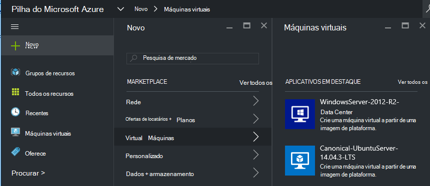
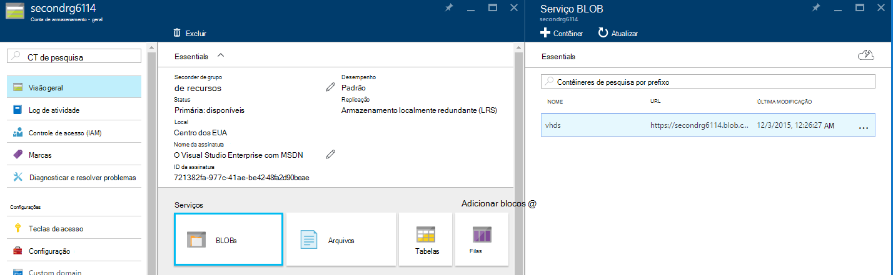
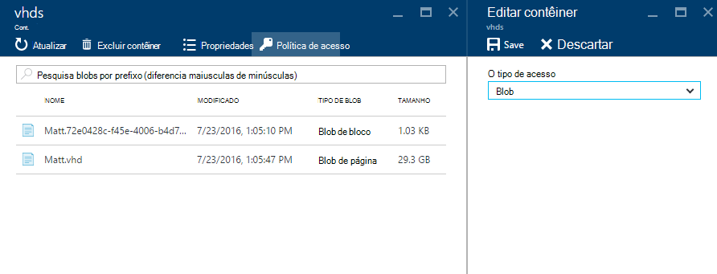
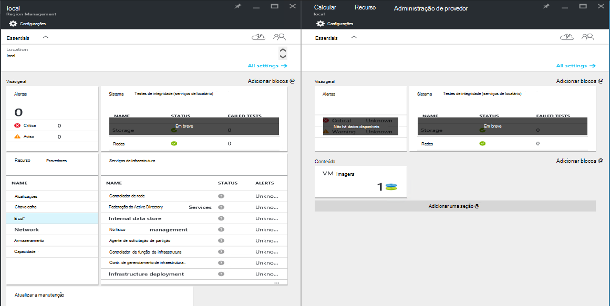
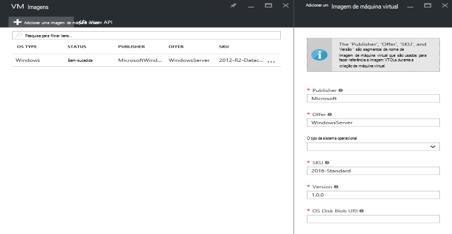

<properties
    pageTitle="Adicionando uma imagem de máquina virtual a pilha de Azure | Microsoft Azure"
    description="Adicionar Windows ou Linux VM imagem personalizada da sua organização para locatários usar"
    services="azure-stack"
    documentationCenter=""
    authors="mattmcg"
    manager="darmour"
    editor=""/>

<tags
    ms.service="azure-stack"
    ms.workload="na"
    ms.tgt_pltfrm="na"
    ms.devlang="na"
    ms.topic="get-started-article"
    ms.date="09/26/2016"
    ms.author="mattmcg"/>

# <a name="make-a-custom-virtual-machine-image-available-in-azure-stack"></a>Disponibilizar uma imagem personalizada máquina virtual na pilha do Azure


Pilha Azure permite que administradores disponibilizar imagens de máquina virtual, como VHD personalizado da sua organização, para seus locatários. Imagens podem ser referenciadas por modelos do Gerenciador de recursos do Azure ou adicionadas a interface do usuário do Azure Marketplace com a criação de um item de Marketplace. Uma imagem do Windows Server 2012 R2 é incluída por padrão no Azure pilha Technical Preview.

> [AZURE.NOTE] Imagens de máquina virtual com itens de Marketplace podem ser implantadas selecionando **novo** na interface de usuário e, em seguida, selecionando a categoria de **máquinas virtuais** . Os itens de imagem de máquina virtual são listados.


## <a name="add-a-vm-image-to-marketplace-with-powershell"></a>Adicionar uma imagem de máquina virtual Marketplace com PowerShell

Se a imagem de máquina virtual VHD está disponível localmente no console de máquina virtual (ou outro dispositivo conectado externamente), use as seguintes etapas:

1. Prepare uma imagem de disco rígido virtual do sistema operacional Windows ou Linux no formato VHD (não VHDX).
    -   Para imagens do Windows, o artigo [carregar uma imagem máquina virtual do Windows Azure para implantações do Gerenciador de recursos](virtual-machines-windows-upload-image.md) contém instruções de preparação de imagem na seção **preparar o VHD para carregamento** .
    -   Para imagens de Linux, siga as etapas para preparar a imagem ou usar uma imagem existente do Azure pilha Linux conforme descrito no artigo [Linux implantar máquinas virtuais do Azure pilha](azure-stack-linux.md).

2. Clonar o [repositório de ferramentas de pilha do Azure](https://aka.ms/azurestackaddvmimage)e importar o módulo **ComputeAdmin**

    ```powershell
    Import-Module .\ComputeAdmin\AzureStack.ComputeAdmin.psm1
    ```

3. Adicione a imagem de máquina virtual chamando o cmdlet Add-VMImage.
    -  Inclua o publisher, oferta, SKU e versão para a imagem de máquina virtual. Esses parâmetros são usados por modelos do Gerenciador de recursos do Azure que fazem referência a imagem de máquina virtual.
    -  Especifica osType como Windows ou Linux.
    -  Incluir sua ID do Azure Active Directory locatários no formulário * &lt;myaadtenant&gt;*. onmicrosoft.com.
    - A seguir é uma invocação de exemplo do script:

    ```powershell
       Add-VMImage -publisher "Canonical" -offer "UbuntuServer" -sku "14.04.3-LTS" -version "1.0.0" -osType Linux -osDiskLocalPath 'C:\Users\AzureStackAdmin\Desktop\UbuntuServer.vhd' -tenantID <myaadtenant>.onmicrosoft.com
    ```

    > [AZURE.NOTE] O cmdlet solicita credenciais para adicionar a imagem de máquina virtual. Fornecer credenciais do Active Directory do Azure, o administrador como serviceadmin@ * &lt;myaadtenant&gt;*. onmicrosoft.com, para o aviso.  

O comando faz o seguinte:
- Autentica para o ambiente de pilha do Azure
- Carrega o VHD local para uma conta de armazenamento temporário recém-criado
- Adiciona a imagem de máquina virtual para o repositório de imagem de máquina virtual
- Cria um item de Marketplace

Para verificar que o comando foi executado com êxito, vá para o Marketplace no portal e, em seguida, verifique se a imagem de máquina virtual está disponível na categoria **máquinas virtuais** .

> 

A seguir é uma descrição dos parâmetros de comando.


| Parâmetro | Descrição |
|----------| ------------ |
|**tenantID** | Sua ID de locatário do Azure Active Directory no formulário * &lt;AADTenantID*. onmicrosoft.com&gt;. |
|**Publisher** | O publisher nome segmento a imagem de máquina virtual que locatários uso ao implantar a imagem. Um exemplo é 'Microsoft'. Não inclua um espaço ou outros caracteres especiais neste campo.|
|**oferta** | O segmento de nome de oferta da imagem máquina virtual que locatários uso ao implantar a imagem de máquina virtual. Um exemplo é 'WindowsServer'. Não inclua um espaço ou outros caracteres especiais neste campo. |
| **SKU** | O SKU nome segmento a imagem de máquina virtual que locatários uso ao implantar a imagem de máquina virtual. Um exemplo é 'Datacenter2016'. Não inclua um espaço ou outros caracteres especiais neste campo. |
|**Versão** | A versão da imagem máquina virtual que locatários uso ao implantar a imagem de máquina virtual. Esta versão está no formato * \#.\#. \#*. Um exemplo é '1.0.0'. Não inclua um espaço ou outros caracteres especiais neste campo.|
| **osType** | O osType da imagem deve ser 'Windows' ou 'Linux'. |
|**osDiskLocalPath** | O caminho local para o disco de sistema operacional VHD que você está carregando como uma imagem de máquina virtual para pilha do Azure. |
|**dataDiskLocalPaths**| Uma matriz opcional dos caminhos de local para discos de dados que podem ser carregados como parte da imagem máquina virtual.|
|**CreateGalleryItem**| Um sinalizador booliano que determina se deseja criar um item no Marketplace. O padrão é definido como true.|
|**título**| O nome de exibição de item de Marketplace. O padrão é definido como o Publisher-oferta-Sku da imagem máquina virtual.|
|**Descrição**| A descrição do item Marketplace. |
|**osDiskBlobURI**| Opcionalmente, este script também aceita um armazenamento de Blob URI para osDisk.|
|**dataDiskBlobURIs**| Opcionalmente, este script também aceita uma matriz de armazenamento de Blob URIs para adicionar discos de dados para a imagem.|


## <a name="add-a-vm-image-through-the-portal"></a>Adicionar uma imagem de máquina virtual por meio do portal

> [AZURE.NOTE] Este método requer a criação do item Marketplace separadamente.

Um requisito de imagens é que eles podem ser referenciados por um armazenamento de Blob URI. Preparar uma imagem de disco rígido virtual do sistema operacional Windows ou Linux no formato VHD (não VHDX) e carregue a imagem a uma conta de armazenamento no Azure ou na pilha do Azure. Se sua imagem já é carregada ao armazenamento de Blob no Azure ou na pilha do Azure, você pode ignorar esta etapa.

Siga as etapas do artigo de [carregar uma imagem máquina virtual do Windows Azure para implantações do Gerenciador de recursos](https://azure.microsoft.com/documentation/articles/virtual-machines-windows-upload-image/) o etapa **carregar a imagem de máquina virtual à sua conta de armazenamento**. Tenha em mente o seguinte:

-   Para uma imagem de Linux, siga as instruções para preparar a imagem ou usar uma imagem existente do Azure pilha Linux conforme descrito no artigo [Linux implantar máquinas virtuais do Azure pilha](azure-stack-linux.md).

- É mais eficiente para carregar uma imagem ao armazenamento de Blob de pilha do Azure que ao armazenamento de Blob do Azure porque ele leva menos tempo para a imagem de máquina virtual por push para o repositório de imagem do Azure pilha. Enquanto segue as instruções de carregamento, certifique-se de substituir a etapa [PowerShell autenticar com pilha do Microsoft Azure](azure-stack-deploy-template-powershell.md) para a etapa 'Login no Azure'.

- Anote o armazenamento de Blob URI onde você carregar a imagem. Ela tem o seguinte formato: * &lt;storageAccount&gt;/&lt;blobContainer&gt;/&lt;targetVHDName&gt;*. vhd

2.  Para tornar o blob anonimamente acessível, vá para o contêiner de armazenamento de blob de conta onde a imagem de máquina virtual VHD foi carregada para **Blob** e, em seguida, selecione a **Política de acesso**. Se você quiser, em vez disso, você pode gerar uma assinatura de acesso compartilhado para o contêiner e incluí-lo como parte do blob URI.





1.  Entrar no Azure pilha como administrador. Vá para **gerenciamento de região**. Em seguida, em **RPs**, selecione **Provedor de recursos de computação** > **Imagens de máquina virtual** > **Adicionar.**

    

2.  Na lâmina seguinte, insira o publisher, oferta, SKU e versão da imagem máquina virtual. Esses segmentos de nome referem-se a imagem de máquina virtual no Gerenciador de recursos do Azure modelos. Certifique-se de selecionar o **osType** corretamente. Para **osDiskBlobURI**, insira o URI onde a imagem foi carregada na etapa 1. Clique em **criar** para começar a criar a imagem de máquina virtual.

    

3.  O status de imagem de máquina virtual muda para 'Êxito' quando a imagem for adicionada com êxito.

4.  Locatários podem implantar a imagem de máquina virtual, especificando o publisher, oferta, SKU e versão da imagem máquina virtual em um modelo do Gerenciador de recursos do Azure. Para tornar a imagem de máquina virtual mais prontamente disponível para consumo de locatário na interface de usuário, é melhor para [criar um item de Marketplace](azure-stack-create-and-publish-marketplace-item.md).
