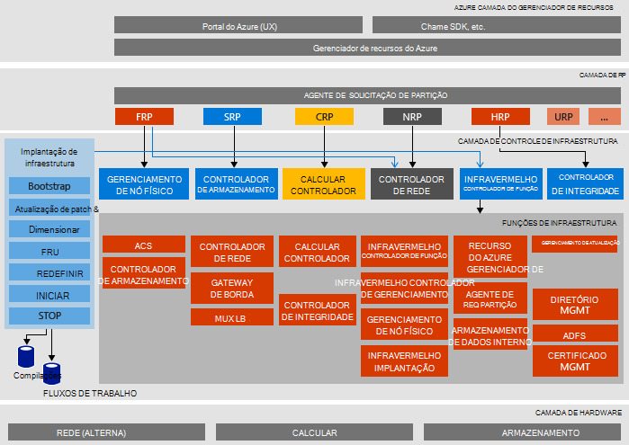

<properties
    pageTitle="Arquitetura do Microsoft Azure pilha prova de conceito (VDC) | Microsoft Azure"
    description="Exiba a arquitetura do Microsoft Azure pilha VDC."
    services="azure-stack"
    documentationCenter=""
    authors="heathl17"
    manager="byronr"
    editor=""/>

<tags
    ms.service="azure-stack"
    ms.workload="na"
    ms.tgt_pltfrm="na"
    ms.devlang="na"
    ms.topic="article"
    ms.date="10/25/2016"
    ms.author="helaw"/>

# Arquitetura do Microsoft Azure pilha VDC

O Azure pilha VDC é uma implantação de um nó de 2 de visualização técnica do Azure pilha. Todos os componentes são instalados em máquinas virtuais executando em um computador host único. 

## Diagrama de arquitetura lógica
O diagrama a seguir ilustra a arquitetura lógica de VDC de pilha do Azure e seus componentes.

## Funções de máquina virtual
O Azure pilha VDC oferece serviços usando as seguintes VMs no host de VDC:

 - **MAS-ACS01** Máquina virtual serviços de armazenamento do Azure pilha de hospedagem.

 - **MAS-ADFS01** Máquina virtual hospedando os serviços de Federação do Active Directory.  Esta máquina virtual não é usada na Technical Preview 2.  

 - **MAS-ASQL01**  Máquina virtual fornecendo um armazenamento de dados interno para funções de infraestrutura do Azure pilha.  

 - **MAS-BGPNAT01** Máquina virtual atuando como um roteador de borda e fornece recursos NAT e VPN para pilha do Azure.

 - **MAS-CA01** Máquina virtual oferecendo serviços de autoridade de certificação de serviços de função do Azure pilha.

 - **MAS-CON01** Máquina virtual disponível para os desenvolvedores para instalar o PowerShell, Visual Studio e outras ferramentas.

 - **MAS DC01** Máquina virtual do Active Directory, DNS e DHCP serviços para Microsoft Azure pilha de hospedagem.

 - **MAS-GWY01** Máquina virtual fornecendo serviços de gateway como conexões de-to-site VPN para redes de locatário de borda.

 - **MAS-NC01**  Máquina virtual controlador de rede, que gerencia serviços de rede do Azure pilha de hospedagem.  

 - **MAS-SLB01**  Máquina virtual fornece balanceamento de carga serviços na pilha do Azure para locatários e serviços de infraestrutura do Azure pilha.  

 - **MAS-SUS01**  Virtual máquina de hospedagem Windows Server Update Services e responsável por fornecer atualizações para outras máquinas virtuais de pilha do Azure.

 - **MAS-WAS01**  Máquina virtual portal e Gerenciador de recursos do Azure serviços de hospedagem.

 - **MAS-XRP01** Máquina virtual que hospeda os provedores de recursos principais do Microsoft Azure pilha, incluindo os provedores de recursos de computação, rede e armazenamento.

## Serviços de armazenamento
Serviços de armazenamento no sistema operacional do host físico incluem:

 - **Serviço Blob do ACS** Azure Blob de armazenamento consistente serviço, que fornece serviços de armazenamento de blob e tabela.

 - **SoFS** Servidor de arquivos de escala-out.

 - **Referências de CSV** Cluster de sistema de arquivo e apresentam resiliência compartilhadas Volume.

 - **Disco virtual**, **Espaço de armazenamento**e **Armazenamento espaços direto** são a tecnologia subjacente de armazenamento respectivos no Windows Server para habilitar o provedor de recursos de armazenamento do Microsoft Azure pilha core.

## Próximas etapas

[Implantar pilha Azure](azure-stack-deploy.md)

[Cenários primeiro tentar](azure-stack-first-scenarios.md)

