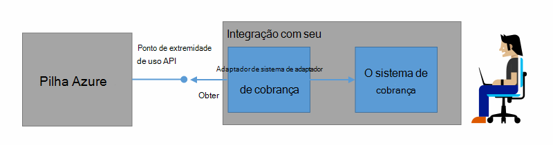
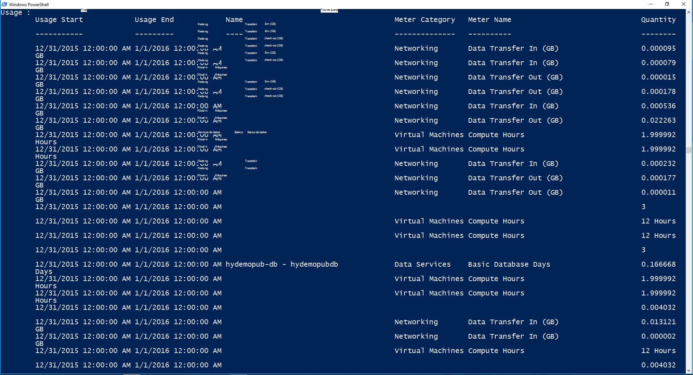

<properties
    pageTitle="Cobrança de cliente e devolução na pilha Azure | Microsoft Azure"
    description="Saiba como recuperar informações de uso do recurso de pilha do Azure."
    services="azure-stack"
    documentationCenter=""
    authors="AlfredoPizzirani"
    manager="byronr"
    editor=""/>

<tags
    ms.service="azure-stack"
    ms.workload="na"
    ms.tgt_pltfrm="na"
    ms.devlang="na"
    ms.topic="article"
    ms.date="10/18/2016"
    ms.author="alfredop"/>

# Cliente de cobrança e devolução na pilha do Azure

Agora que você estiver usando pilha do Azure, é uma boa ideia pensar sobre como controlar o uso. Provedores de serviço dependem de informações de uso para cobrar seus clientes e entender o custo de fornecimento de serviços.
Empresas, também, normalmente controlar o uso por departamento.

Pilha Azure não é um sistema de cobrança. Não carregar seu locatários para recursos que usam. Porém, Azure pilha ter a infraestrutura para coletar e agregar dados de uso para cada provedor único recurso. Você pode acessar esses dados e exportá-lo para um sistema de cobrança usando um adaptador de cobrança ou exportá-lo para uma ferramenta de inteligência de negócios como o Microsoft Power BI.

## Quais informações de uso pode encontrar e como?

Provedores de recursos do Azure pilha geram registros de uso em intervalos por hora. Os registros mostram a quantidade de cada recurso que foi consumida e qual assinatura consumidas o recurso. Esses dados são armazenados. Você pode acessar os dados por meio da API REST.

Um administrador de serviço pode recuperar dados de uso para todas as assinaturas de locatários. Locatários individuais podem recuperar apenas suas próprias informações.

Os registros de uso têm informações sobre o uso de computação, rede e armazenamento. Para obter uma lista de metros, consulte [Este artigo](azure-stack-usage-related-faq.md).

## Recuperar informações de uso

Para gerar os registros, é essencial que você tenha recursos executando e usando ativamente o sistema. Se você não tiver certeza se tiver quaisquer recursos executando, no Azure Marketplace de pilha implantar, executar uma máquina virtual (VM). Examinar a máquina virtual monitoramento blade para garantir que ele está em execução.

Recomendamos que você execute cmdlets do Windows PowerShell para exibir dados de uso.
PowerShell chama as APIs de uso do recurso.

1.  [Instalar e configurar o Azure PowerShell](https://azure.microsoft.com/en-us/documentation/articles/powershell-install-configure/).

2.  Para se conectar ao Gerenciador de recursos do Azure, use o cmdlet do PowerShell **AzureRmAccount de Login**.

3.  Para selecionar a assinatura que você usou para criar recursos, digite **Get-AzureRmSubscription – nome de inscrição "sua sub" | Selecione AzureRmSubscription**.

4.  Para recuperar os dados, use o cmdlet [**Get-UsageAggregates**](https://msdn.microsoft.com/en-us/library/mt619285.aspx)do PowerShell.
    Se houver dados de uso, ele será retornado no PowerShell, como no exemplo a seguir. PowerShell retorna 1.000 linhas de uso por chamada.
    Você pode usar o argumento de *continuação* para recuperar conjuntos de linhas além do primeiro 1.000. Para obter mais informações sobre os dados de uso, consulte a [referência da API de uso do recurso](azure-stack-provider-resource-api.md).

    

## Próximas etapas

[Uso de recursos de provedor API](azure-stack-provider-resource-api.md)

[API de uso do recurso de locatário](azure-stack-tenant-resource-usage-api.md)

[Perguntas Frequentes relacionadas de uso](azure-stack-usage-related-faq.md)
