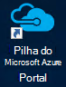
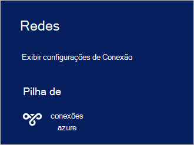

<properties
    pageTitle="Conectar-se a pilha Azure | Microsoft Azure"
    description="Saiba como conectar pilha do Azure"
    services="azure-stack"
    documentationCenter=""
    authors="ErikjeMS"
    manager="byronr"
    editor=""/>

<tags
    ms.service="azure-stack"
    ms.workload="na"
    ms.tgt_pltfrm="na"
    ms.devlang="na"
    ms.topic="get-started-article"
    ms.date="10/18/2016"
    ms.author="erikje"/>

# <a name="connect-to-azure-stack"></a>Conectar-se a pilha Azure
Para gerenciar recursos, você deve se conectar ao computador do Azure pilha VDC. Você pode usar qualquer uma das seguintes opções de conexão:

 - Área de trabalho remota: permite que um único usuário simultâneo conectar-se rapidamente do computador VDC.
 - Rede privada virtual (VPN): permite que vários usuários simultâneos conectar-se de clientes de fora da infraestrutura do Azure pilha (requer configuração).

## <a name="connect-with-remote-desktop"></a>Conectar-se com a área de trabalho remota
Com uma conexão de área de trabalho remota, um único usuário simultâneo pode trabalhar com o portal de gerenciamento de recursos. Você também pode usar as ferramentas na máquina virtual MAS-CON01.

1.  Faça logon na máquina física Azure pilha VDC.

2.  Abra uma Conexão de área de trabalho remota e conectar ao MAS-CON01. Digite **AzureStack\AzureStackAdmin** como o nome de usuário e a senha administrativa fornecidas durante a instalação do Azure pilha.  

3.  Na área de trabalho MAS CON01, clique duas vezes o ícone de **Portal do Microsoft Azure pilha** (https://portal.azurestack.local/) para abrir o [portal](azure-stack-key-features.md#portal).

    

4.  Faça logon usando as credenciais do Active Directory do Azure especificadas durante a instalação.

## <a name="connect-with-vpn"></a>Conectar-se com VPN
Conexões de rede privada virtual permitir que vários usuários simultâneos conectar-se de clientes de fora da infraestrutura do Azure pilha. Você pode usar o portal gerenciar recursos. Você também pode usar ferramentas, como o Visual Studio e PowerShell, no seu cliente local.

1.  Instale o módulo AzureRM usando o seguinte comando:
   
    ```PowerShell
    Install-Module -Name AzureRm -RequiredVersion 1.2.6 -Scope CurrentUser
    ```   
   
2. Baixe os scripts de ferramentas de pilha do Azure.  Esses arquivos podem ser baixados, navegando até o [repositório de GitHub](https://github.com/Azure/AzureStack-Tools)ou executando o seguinte script do Windows PowerShell como um administrador de suporte:
    
    >[AZURE.NOTE]  As etapas a seguir exigem PowerShell 5.0.  Para verificar sua versão, execute $PSVersionTable.PSVersion e comparar a versão "Principal".  

    ```PowerShell
       
       #Download the tools archive
       invoke-webrequest https://github.com/Azure/AzureStack-Tools/archive/master.zip -OutFile master.zip

       #Expand the downloaded files. 
       expand-archive master.zip -DestinationPath . -Force

       #Change to the tools directory
       cd AzureStack-Tools-master
    ````

3.  Na mesma sessão do PowerShell, navegue até a pasta de **Conectar** e importar o módulo AzureStack.Connect.psm1:

    ```PowerShell
    cd Connect
    import-module .\AzureStack.Connect.psm1
    ```

4.  Para criar a conexão do Azure pilha VPN, execute o seguinte Windows PowerShell. Antes de executar, preencha os campos de endereço de host de pilha do Azure e senha de administrador. 
    
    ```PowerShell
    #Change the IP Address below to match your Azure Stack host
    $hostIP = "<HostIP>"

    # Change password below to reference the password provided for administrator during Azure Stack installation
    $Password = ConvertTo-SecureString "<Admin Password>" -AsPlainText -Force

    # Add Azure Stack One Node host & CA to the trusted hosts on your client computer
    Set-Item wsman:\localhost\Client\TrustedHosts -Value $hostIP -Concatenate
    Set-Item wsman:\localhost\Client\TrustedHosts -Value mas-ca01.azurestack.local -Concatenate  

    # Update Azure Stack host address to be the IP Address of the Azure Stack POC Host
    $natIp = Get-AzureStackNatServerAddress -HostComputer $hostIP -Password $Password

    # Create VPN connection entry for the current user
    Add-AzureStackVpnConnection -ServerAddress $natIp -Password $Password

    # Connect to the Azure Stack instance. This command (or the GUI steps in step 5) can be used to reconnect
    Connect-AzureStackVpn -Password $Password 
    ```

5. Quando solicitado, confie o host do Azure pilha.

6. Quando solicitado, instale um certificado (o prompt aparece por trás da janela de sessão do Powershell).

7. Para testar a conexão portal, em um navegador da Internet, navegue até *https://portal.azurestack.local*.

8. Para revisar e gerenciar a conexão do Azure pilha, use **redes** em seu cliente:

    

>[AZURE.NOTE] Esta conexão VPN não oferece conectividade para VMs ou outros recursos. Para obter informações sobre conectividade para recursos, consulte [Uma Conexão de VPN nó](azure-stack-create-vpn-connection-one-node-tp2.md)


## <a name="next-steps"></a>Próximas etapas
[Primeiras tarefas](azure-stack-first-scenarios.md)

[Instalar e conectar-se com o PowerShell](azure-stack-connect-powershell.md)

[Instalar e conectar-se com CLI](azure-stack-connect-cli.md)


