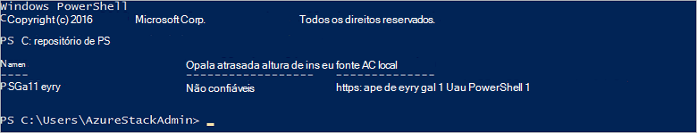

<properties
    pageTitle="Conectar-se a pilha Azure com o PowerShell | Microsoft Azure"
    description="Saiba como gerenciar pilha Azure com o PowerShell"
    services="azure-stack"
    documentationCenter=""
    authors="HeathL17"
    manager="byronr"
    editor=""/>

<tags
    ms.service="azure-stack"
    ms.workload="na"
    ms.tgt_pltfrm="na"
    ms.devlang="na"
    ms.topic="article"
    ms.date="10/19/2016"
    ms.author="helaw"/>

# Instale o PowerShell e se conecte a pilha do Azure
Neste guia, podemos siga as etapas para conexão com pilha de Azure com o PowerShell. Quando concluído, estas etapas podem também ajudá-lo a gerenciar e implantar recursos.

## Instalar os cmdlets do PowerShell do Azure pilha

1.  Cmdlets de AzureRM são instalados da Galeria do PowerShell. Para começar, abra um Console do PowerShell no MAS CON01 e execute o seguinte comando para retornar uma lista de repositórios de PowerShell disponíveis:

        Get-PSRepository

      

2.  Execute o seguinte comando para instalar o módulo AzureRM:

        Install-Module -Name AzureRM -RequiredVersion 1.2.6 -Scope CurrentUser

    >[AZURE.NOTE] *-Escopo CurrentUser* é opcional. Se desejar mais do que o usuário atual tenha acesso a módulos, use um prompt de comando e deixe desativar o parâmetro de *escopo* .

3.  Para confirmar a instalação do AzureRM módulos, execute os seguintes comandos:

        Get-Command -Module AzureRM.AzureStackAdmin

## Conectar-se a pilha Azure
Um módulo está disponível para download que manipula Configurando a conexão do PowerShell para pilha do Azure para você.  Visite [Ferramentas de pilha do Azure](http://aka.ms/ConnectToAzureStackPS) para o módulo e etapas adicionais. 

## Recuperar uma lista de assinaturas
Nesta seção, você verificar cmdlets do PowerShell estiver executando em pilha Azure recuperando e selecionando uma assinatura para uso.

Execute o seguinte comando para recuperar uma lista de assinaturas do Azure pilha associado à sua conta:

    Get-AzureRmSubscription

## Próximas etapas
[Implantar modelos com o PowerShell](azure-stack-deploy-template-powershell.md)

[Conectar-se com CLI Azure](azure-stack-connect-cli.md)

[Implantar modelos com o Visual Studio](azure-stack-deploy-template-visual-studio.md)

