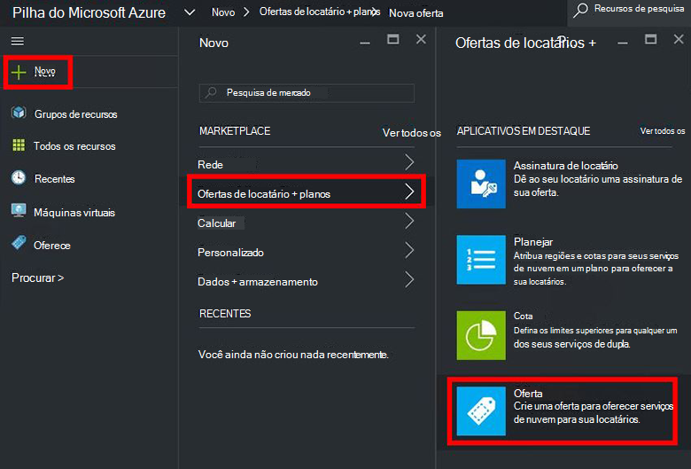
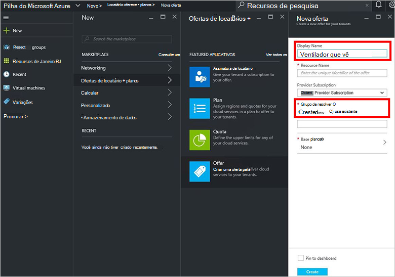
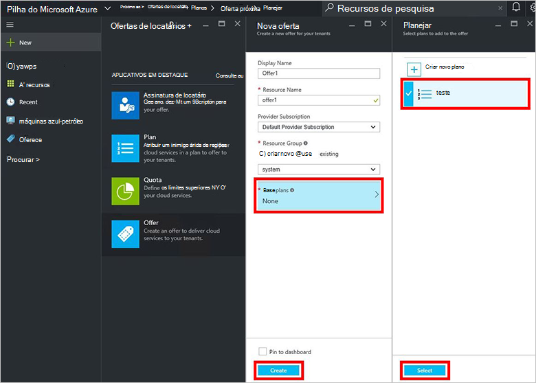
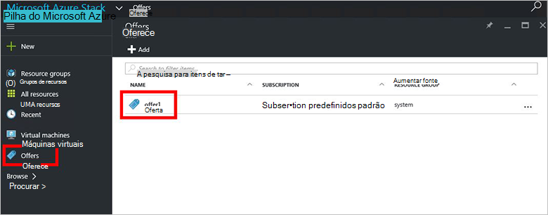
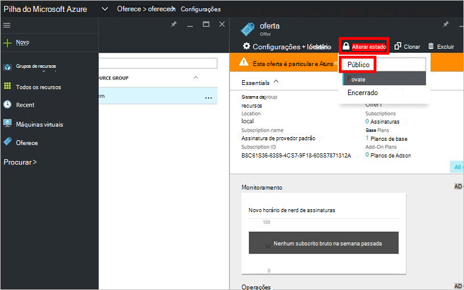

<properties
    pageTitle="Criar uma oferta na pilha do Azure | Microsoft Azure"
    description="Como um administrador de serviço, Aprenda a criar uma oferta para seu locatários na pilha do Azure."
    services="azure-stack"
    documentationCenter=""
    authors="ErikjeMS"
    manager="byronr"
    editor=""/>

<tags
    ms.service="azure-stack"
    ms.workload="na"
    ms.tgt_pltfrm="na"
    ms.devlang="na"
    ms.topic="get-started-article"
    ms.date="09/26/2016"
    ms.author="erikje"/>

# Criar uma oferta na pilha do Azure

[Oferece](azure-stack-key-features.md#services-plans-offers-and-subscriptions) são grupos de um ou mais planos provedores apresentam para locatários comprar ou assinar. Este documento mostra como criar uma oferta que inclui o [plano que você criou](azure-stack-create-plan.md) na última etapa. Esta oferta oferece a capacidade de provisionar máquinas virtuais de assinantes.

1.  [Entrar no](azure-stack-connect-azure-stack.md#log-in-as-a-service-administrator) portal do como um administrador de serviço e, em seguida, clique em **novo** > **locatário oferece + planos** > **oferecer**.
    

2.  Na lâmina **Oferecem novo** , preencha o **Nome de exibição** e o **Nome do recurso**e selecione um **Grupo de recursos**novos ou existentes. O nome de exibição é nome amigável da oferta. Somente o administrador pode ver o nome do recurso. É o nome que os administradores usam para trabalhar com a oferta como um recurso do Gerenciador de recursos do Azure.

    

3.  Clique em **planos de Base** , na lâmina **plano** , selecione o plano que você deseja incluir na oferta de e clique em **Selecionar**. Clique em **criar** para criar a oferta.

    
    
4. Clique em **oferece** e clique na oferta que você acabou de criar.

    

5.  Clique em **Alterar estado**e clique em **público**.
  
    

Ofertas devem ser feitas públicas para locatários acessar o modo de exibição completo ao inscrever-se. Ofertas podem ser:

- **Público**: visível para locatários.

- **Particular**: visível apenas para os administradores de serviço. Útil ao criar um rascunho o plano ou a oferta, ou se o administrador do serviço quer aprovar cada assinatura.

- **Decommissioned**: fechadas para novos assinantes. O administrador do serviço pode usar encerrado para evitar futuras assinaturas, mas deixe assinantes atuais inalterados.

Alterações para a oferta não estão imediatamente visíveis para o site principal. Para ver as alterações, talvez você precise logout/logon para ver a nova assinatura no "seletor de assinatura" ao criar grupos de recursos/recurso.

## Próximas etapas

[Assinar uma oferta e provisionar uma máquina virtual](azure-stack-subscribe-plan-provision-vm.md)
