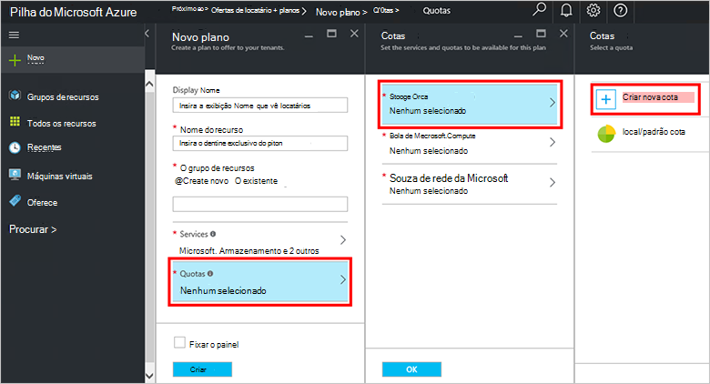

<properties
    pageTitle="Criar um plano em pilha Azure | Microsoft Azure"
    description="Como um administrador de serviço, crie um plano que permite assinantes provisionar virtual máquinas."
    services="azure-stack"
    documentationCenter=""
    authors="ErikjeMS"
    manager="byronr"
    editor=""/>

<tags
    ms.service="azure-stack"
    ms.workload="na"
    ms.tgt_pltfrm="na"
    ms.devlang="na"
    ms.topic="get-started-article"
    ms.date="09/26/2016"
    ms.author="erikje"/>

# Criar um plano na pilha do Azure

[Planos](azure-stack-key-features.md#services-plans-offers-and-subscriptions) são agrupamentos de um ou mais serviços. Como um provedor, você pode criar planos para oferecer a sua locatários. Por sua vez, seu locatários assinar suas ofertas de usar os planos e serviços incluírem. Este exemplo mostra como criar um plano que inclui a computação, rede e provedores de recursos de armazenamento. Este plano oferece a capacidade de provisionar máquinas virtuais de assinantes.

1.  Em um navegador de internet, navegue até https://portal.azurestack.local.

2.  [Entrar no](azure-stack-connect-azure-stack.md#log-in-as-a-service-administrator) portal do Azure pilha como um administrador de serviço e insira suas credenciais de administrador de serviço (a conta que você criou durante a etapa 5 da seção [executar o script PowerShell](azure-stack-run-powershell-script.md) ) e, em seguida, clique em **entrar**.

    Os administradores de serviços podem criar ofertas e planos e gerenciar usuários.

3.  Para criar um plano e oferta que locatários podem assinar, clique em **novo** > **locatário oferece + planos** > **plano**.

    

4.  Na lâmina **Novo plano** , preencha **Nome para exibição** e o **Nome do recurso**. O nome de exibição é o nome do plano amigável consulte locatários. Somente o administrador pode ver o nome do recurso. É o nome que os administradores usam para trabalhar com o plano como um recurso do Gerenciador de recursos do Azure.

    

5.  Criar um novo **Grupo de recursos**ou selecione um existente, como um contêiner para o plano (por exemplo, "OffersAndPlans")

    

6.  Clique em **Serviços**, selecione **Microsoft.Compute**, **Microsoft.Network**e **Microsoft.Storage**e, em seguida, clique em **Selecionar**.

    

7.  Clique em **cotas**, clique em **Microsoft.Storage (local)**e, em seguida, selecione a cota padrão ou clique em **Criar nova cota** para personalizar a cota.

    

8.  Digite um nome para a cota, clique em **Configurações de cota**, defina os valores de cota clique **Okey**e clique em **criar**.

    

9. Clique em **Microsoft.Network (local)**e, em seguida, selecione a cota padrão ou clique em **Criar nova cota** para personalizar a cota.

    

10. Digite um nome para a cota, clique em **Configurações de cota**, defina os valores de cota clique **Okey**e clique em **criar**.

    

11. Clique em **Microsoft.Compute (local)**e, em seguida, selecione a cota padrão ou clique em **Criar nova cota** para personalizar a cota.

    

12.  Digite um nome para a cota, clique em **Configurações de cota**, defina os valores de cota clique **Okey**e clique em **criar**.

    

13. Na lâmina **cotas** , clique **Okey**e na lâmina **Novo plano** , clique em **criar** para criar o plano.

    

14. Para ver seu novo plano, clique em **todos os recursos**, e em seguida, pesquise o plano e clique em seu nome.

    

## Próximas etapas

[Criar uma oferta](azure-stack-create-offer.md)
