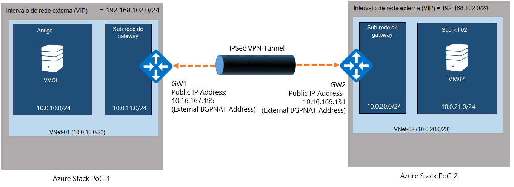
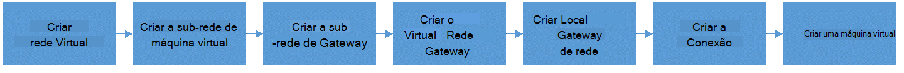
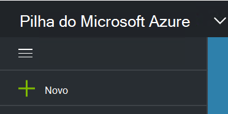
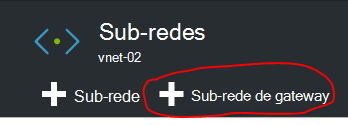
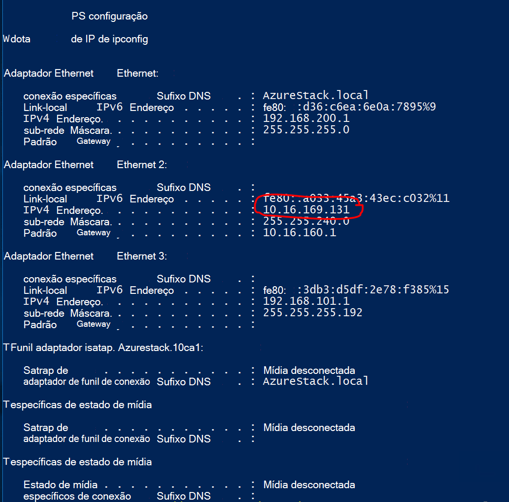
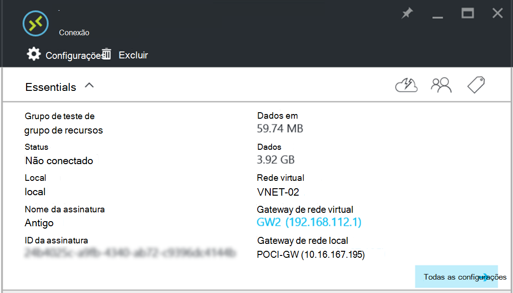

<properties
    pageTitle="Criar uma conexão de-to-Site VPN entre duas redes virtuais em diferentes ambientes do Azure pilha VDC | Microsoft Azure"
    description="Procedimento passo a passo que permitirá que um administrador de nuvem para criar uma conexão de VPN to-Site entre dois ambientes de VDC de um nó em TP2."
    services="azure-stack"
    documentationCenter=""
    authors="ScottNapolitan"
    manager="darmour"
    editor=""/>

<tags
    ms.service="azure-stack"
    ms.workload="na"
    ms.tgt_pltfrm="na"
    ms.devlang="na"
    ms.topic="get-started-article"
    ms.date="09/26/2016"
    ms.author="scottnap"/>

# Criar uma conexão de-to-Site VPN entre duas redes virtuais em diferentes ambientes do Azure pilha VDC

## Visão geral

Este artigo conduz você pelas etapas para criar uma Conexão de VPN-to-Site entre duas redes virtuais nos dois ambientes Azure pilha prova de conceito (VDC) separadas. O objetivo disso é ajudar as pessoas que estão avaliando to-Site gateways entenderem como configurar conexões VPN entre redes virtuais nas duas implantações Azure pilha diferentes.  No processo de fazer isso, você obterá uma compreensão como Gateways VPN funcionam no Azure pilha.

>[AZURE.NOTE] Este documento se aplica especificamente à VDC do Azure pilha TP2.

### Diagrama de Conexão

A seguir é um diagrama que mostra a nossa configuração deve aparência quando podemos terminar.

### Antes de começar

Para concluir essa configuração, você precisa dos seguintes itens assim Verifique se você tem estes itens antes de começar.

-   Dois servidores que atendem aos requisitos de hardware do Azure pilha VDC definidos pelos [Pré-requisitos de implantação do Azure pilha](azure-stack-deploy.md)e os outros pré-requisitos definidos pelo documento.

-   O pacote de implantação do Azure pilha visualização técnica 2.

## Implantando os ambientes de VDC

Você implantará dois ambientes Azure pilha VDC para concluir essa configuração.

-   Para cada POC que você implantar, você pode simplesmente siga as instruções de implantação detalhadas no artigo [Implantar VDC do Azure pilha](azure-stack-run-powershell-script.md).
    Podemos fará referência para cada ambiente VDC neste documento forma genérica como POC1 e POC2.

## Configurar cotas para computação, rede e armazenamento

Você precisa configurar cotas para computação, rede e armazenamento para que esses serviços podem ser associados um plano e, em seguida, uma oferta que locatários pode assinar.

>[AZURE.NOTE] Você precisa fazer essas etapas para cada ambiente Azure pilha VDC.

A experiência para criar cotas para serviços foi alterado de TP1. As etapas sobre como criar cotas em TP2 podem ser encontradas no <http://aka.ms/mas-create-quotas>. Você pode aceitar os padrões para todas as configurações de cota para este exercício.

## Criar um plano e oferta

[Planos](azure-stack-key-features.md) são agrupamentos de um ou mais serviços. Como um provedor, você pode criar planos para oferecer a sua locatários. Por sua vez, seu locatários assinar suas ofertas de usar os planos e serviços incluírem.

>[AZURE.NOTE] Você precisará executar essas etapas para cada ambiente Azure pilha VDC.

1.  Primeiro, crie um plano. Para fazer isso, você pode seguir as etapas no artigo online [criar um plano](azure-stack-create-plan.md) .

2.  Crie uma oferta seguindo as etapas descritas em [criar uma oferta na pilha do Azure](azure-stack-create-offer.md).

3.  Faça logon no Portal do como um administrador de locatário e [assinar a oferta criada] (azure-pilha-assinar-plano-provisionar-vm.md.

## Criar os recursos de rede no VDC 1

Agora, vamos realmente criar os recursos que precisamos definir nossa configuração. As etapas a seguir ilustram que estamos vai ser fazendo. Estas instruções serão ser mostrando como criar recursos através do Portal, mas a mesma coisa pode ser feita por meio do PowerShell.

### Faça logon como um locatário

Um administrador de serviço pode efetuar login como um locatário para testar os planos, ofertas e assinaturas que seus locatários podem usar. Se você ainda não tiver uma, [criar uma conta de locatário](azure-stack-add-new-user-aad.md) antes de efetuar login.

### Criar a rede virtual & sub-rede de máquina virtual

1.  Faça logon usando uma conta de locatário.

2.  No portal do Azure, clique no ícone de **novo** .

     
3.  Selecione a **rede** do menu Marketplace.

4.  Clique no item de **rede Virtual** no menu.

5.  Clique no botão **criar** na parte inferior da lâmina de descrição do recurso. Insira os seguintes valores nos campos apropriados de acordo com esta tabela.

  	| **Campo**             | **Valor** |
  	|----------------------- | ------ |
  	| Nome                  |vnet-01 |
  	| Espaço de endereço         | 10.0.10.0/23 |
  	| Nome de sub-rede           | sub-rede-01 |
  	| Intervalo de endereços de sub-rede  | 10.0.10.0/24 |

6.  Você deve ver a assinatura que você criou anteriormente preenchido no campo de **assinatura** .

7.  Grupo de recursos, você pode criar um novo grupo de recursos ou se você já tiver um, selecione Usar existente.

8.  Verifique se o local padrão.

9.  Clique no botão **criar** .

### Criar a sub-rede de Gateway

1.  Abra o recurso de rede Virtual que você acabou de criar (Vnet-01) no painel.

2.  Na lâmina configurações, selecione sub-redes

3.  Clique no botão de **Sub-rede de Gateway** para adicionar uma sub-rede de Gateway à rede Virtual.

     
4.  O nome da sub-rede é definido como **GatewaySubnet** por padrão.
    Sub-redes de gateway são especiais e devem ter esse nome específico para funcionar corretamente.

5.  No campo do **intervalo de endereços** , digite **10.0.11.0/24**.

6.  Clique no botão **criar** para criar a Gateway sub-rede.

### Criar o Gateway de rede Virtual

1.  No portal do Azure, clique no ícone de **novo** .

    

2.  Selecione a **rede** do menu Marketplace.

3.  Selecione o **gateway de rede Virtual** na lista de recursos de rede.

4.  Analise a descrição e clique em **criar**.

5.  No campo **nome** digite **GW1**.

6.  Clique no item de **rede Virtual** para escolher uma rede virtual.
    Selecione **Vnet-01** na lista.

7.  Clique no item de menu do **endereço IP público** . Quando a lâmina do endereço IP pública escolha abre clique no botão Criar novo.

8.  No campo **nome** , digite **GW1-PiP** e clique em **Okey.**

9.  O **tipo de Gateway** deve ter **VPN** selecionada por padrão. Manter essa configuração.

10. O **tipo de VPN** deve ter **baseado em rota** selecionada por padrão.
    Manter essa configuração.

11. Verificar a **assinatura** e o **local** estão corretos. Você pode fixar o recurso até o painel se desejar. Clique em **criar**.

### Criar o Gateway de rede Local

O recurso de Gateway Local de rede é um pouco estranho em nosso cenário.
É o mesmo recurso que você encontrar no Azure, porém no Azure normalmente tem como objetivo para representar um dispositivo físico, no local que você usaria para conectar-se para o gateway de rede virtual no Azure. Em nosso exemplo, ambas as extremidades da conexão são gateways de rede virtual realmente!

Uma maneira de pensar sobre isso de forma mais genérica que o recurso de Gateway de rede Local é sempre destina-se para indicar que o gateway remoto na outra extremidade da conexão. Devido a maneira que o VDC foi criada, na verdade, precisamos fornecer o endereço do adaptador de rede externa na VM NAT da outra VDC como o endereço IP público do Gateway rede Local. Podemos irá criar mapeamentos NAT na VM NAT para certificar-se de que ambas as extremidades estão conectadas corretamente.

### Obter o endereço IP do adaptador externo da VM NAT

1.  Fazer logon na máquina física na pilha do Azure para POC2.

2.  [Tecla Windows] + R para abrir o menu **Executar** e digite **mstsc** e pressione enter.

3.  No campo do **computador** , insira o nome **MAS-BGPNAT01** e clique no botão **Conectar** .

4.  Clique no Menu Iniciar, clique com botão direito no PowerShell e selecione **Executar como administrador**.

5.  Tipo de **IPConfig/todos os**.

6.  Localize o adaptador Ethernet está conectado à sua rede local e tome nota do endereço IPv4 vinculado a esse adaptador. Em meu ambiente, é **10.16.167.195** mas contrário será algo diferente.

7.  Grave esse endereço. Este é o que usaremos como o endereço IP público do recurso Gateway Local de rede que criamos no POC1.

### Criar o recurso de Gateway de rede Local

1.  Fazer logon na máquina física na pilha do Azure para POC1.

2.  No campo do **computador** , insira o nome **MAS-CON01** e clique no botão **Conectar** .

3.  No portal do Azure, clique no ícone de **novo** .

    

4.  Selecione a **rede** do menu Marketplace.

5.  Selecione o **gateway de rede local** na lista de recursos.

6.  No campo **nome** , digite **POC2 GW**.

7.  Nós ainda não souber o endereço IP do nosso outro Gateway, mas foi okey porque podemos voltar e alterá-lo posteriormente. Por agora, insira **10.16.167.195** no **campo de endereço IP**.

8.  No campo **Espaço de endereço** , digite o espaço de endereço da Vnet que estamos criando em POC2. Isso vai ser **10.0.20.0/23** insira esse valor.

9.  Verifique se sua **assinatura**, o **Grupo de recursos** e o **local** estão corretos e clique em **criar**.

### Criar a Conexão

1.  No portal do Azure, clique no ícone de **novo** .

     

2.  Selecione a **rede** do menu Marketplace.

3.  Selecione a **Conexão** na lista de recursos.

4.  Na lâmina configurações **básicas** , escolha **to-site (IPSec)** como o **tipo de Conexão**.

5.  Selecione a **assinatura**, o **Grupo de recursos** e o **local** e clique em **Okey**.

6.  Na lâmina **configurações** , escolha o **Gateway de rede Virtual** (**GW1**) que você criou anteriormente.

7.  Escolha o **local** **Gateway de rede** (**POC2 GW**) que você criou anteriormente.

8.  No campo **Nome de Conexão** , insira **POC1-POC2**.

9.  No campo **Chave compartilhada (PSK)** , digite **12345**. Clique em **Okey**.

### Criar uma máquina virtual

Para validar dados viajando pela Conexão VPN, você precisa de VMs envie e receba dados em cada POC. Vamos criar uma máquina virtual no POC1 agora e colocá-lo em nosso sub-rede máquina virtual nossa rede virtual.

1. No portal do Azure, clique no ícone de  **novo** .

     

2.  Selecione **máquinas virtuais** no menu Marketplace.

3.  Na lista de imagens de máquina virtual, selecione a imagem do **Windows Server 2012 R2 data center** .

4.  Na lâmina **Noções básicas** , no campo **nome** , insira o valor **VM01**.

5.  Insira um nome de usuário válido e uma senha. Você usará essa conta para efetuar login na máquina virtual depois que ela foi criada.

6.  Fornecer uma **assinatura**, o **Grupo de recursos** e o **local** e clique em **Okey**.

7.  Na lâmina **tamanho** , escolha um tamanho de máquina virtual para esta instância e clique em **Selecionar**.

8.  Na lâmina configurações, você pode aceitar os padrões, apenas certifique-se de que a rede Virtual selecionada é **VNET-01** e sub-rede está definida como **10.0.10.0/24**. Clique em **Okey**.

9.  Examine as configurações na lâmina **Resumo** e clique em **Okey**.

## Criar os recursos de rede no VDC 2

### Faça logon como um locatário

Um administrador de serviço pode efetuar login como um locatário para testar os planos, ofertas e assinaturas que seus locatários podem usar. Se você ainda não tiver uma, [criar uma conta de locatário](azure-stack-add-new-user-aad.md) antes de efetuar login.

### Criar a rede virtual & sub-rede de máquina virtual

1. Faça logon usando uma conta de locatário.

2. No portal do Azure, clique no ícone de  **novo** .

     

3.  Selecione a **rede** do menu Marketplace.

4.  Clique no item de **rede Virtual** no menu.

5.  Clique no botão **criar** na parte inferior da lâmina de descrição do recurso. Insira os seguintes valores para os campos apropriados listados na tabela abaixo.

  	|**Campo**              |**Valor** |
  	| ----------------------|----------|
  	| Nome                  | vnet-02 |
  	| Espaço de endereço         | 10.0.20.0/23 |
  	| Nome de sub-rede           | sub-rede-02 |
  	| Intervalo de endereços de sub-rede  | 10.0.20.0/24 |

6.  Você deve ver a assinatura que você criou anteriormente preenchido no campo de **assinatura** .

7.  Grupo de recursos, você pode criar um novo grupo de recursos ou se você já tiver um, selecione Usar existente.

8.  Verifique se o **local**do padrão. Se desejar, você pode fixar a rede virtual para o painel de controle para facilitar o acesso.

9.  Clique no botão **criar** .

### Criar a sub-rede de Gateway

1.  Abra o recurso de rede Virtual criado (**Vnet-02**) no painel.

2.  Na lâmina **configurações** , selecione **sub-redes.**

3.  Clique no botão de **Sub-rede de Gateway** para adicionar uma sub-rede de Gateway à rede Virtual.

     

4.  O nome da sub-rede é definido como **GatewaySubnet** por padrão.
    Sub-redes de gateway são especiais e devem ter esse nome específico para funcionar corretamente.

5.  No campo do **intervalo de endereços** , digite **10.0.20.0/24**.

6.  Clique no botão **criar** para criar a Gateway sub-rede.

### Criar o Gateway de rede Virtual

1. No portal do Azure, clique no ícone de  **novo** .

     

2.  Selecione a **rede** do menu Marketplace.

3.  Selecione o **gateway de rede Virtual** na lista de recursos de rede.

4.  Analise a descrição e clique em **criar**.

5.  No campo **nome** digite **GW2**.

6.  Clique no item de **rede Virtual** para escolher uma rede virtual.
    Selecione **Vnet-02** na lista.

7.  Clique no item de menu do **endereço IP público** . Quando a lâmina do endereço IP pública escolha abre clique no botão Criar novo.

8.  No campo **nome** , digite **GW2-PiP** e clique em **Okey.**

9.  O **tipo de Gateway** deve ter **VPN** selecionada por padrão. Manter essa configuração.

10. O **tipo de VPN** deve ter **baseado em rota** selecionada por padrão.
    Manter essa configuração.

11. Verificar a **assinatura** e o **local** estão corretos. Você pode fixar o recurso até o painel se desejar. Clique em **criar**.

### Criar o Gateway de rede Local

#### Obter o endereço IP do adaptador externo da VM NAT

1.  Fazer logon na máquina física na pilha do Azure para POC1.

2.  Pressione e mantenha pressionada [tecla do Windows] + R para abrir o menu **Executar** e digite **mstsc** e pressione inserir.

3.  No campo do **computador** , insira o nome **MAS-BGPNAT01** e clique no botão **Conectar** .

4.  Clique no Menu Iniciar, clique com botão direito no PowerShell e selecione **Executar como administrador**.

5.  Tipo de **IPConfig/todos os**.

6.  Localize o adaptador Ethernet está conectado à sua rede local e tome nota do endereço IPv4 vinculado a esse adaptador. Em meu ambiente é **10.16.169.131** mas contrário será algo diferente.

7.  Grave esse endereço. Este é o que mais tarde usaremos como o endereço IP público do recurso Gateway Local de rede que criamos no POC1.

#### Criar o recurso de Gateway de rede Local

1.  Fazer logon na máquina física na pilha do Azure para POC2.

2.  No campo do **computador** , insira o nome **MAS-CON01** e clique no botão **Conectar** .

3. No portal do Azure, clique no ícone de **novo** .

     

4.  Selecione a **rede** do menu Marketplace.

5.  Selecione o **gateway de rede local** na lista de recursos.

6.  No campo **nome** , digite **POC1 GW**.

7.  Agora, precisamos o endereço IP público podemos gravados para o gateway de rede Virtual no POC1. Digite **10.16.169.131** no **campo de endereço IP**.

8.  No campo **Espaço de endereço** , digite o espaço de endereço de **Vnet-01** de POC1 - **10.0.0.0/16**.

9.  Verifique se sua **assinatura**, o **Grupo de recursos** e o **local** estão corretos e clique em **criar**.

## Criar a Conexão

1. No portal do Azure, clique no ícone de  **novo** .

     

2.  Selecione a **rede** do menu Marketplace.

3.  Selecione a **Conexão** na lista de recursos.

4.  Na lâmina configurações **básicas** , escolha **to-site (IPSec)** como o **tipo de Conexão**.

5.  Selecione a **assinatura**, o **Grupo de recursos** e o **local** e clique em **Okey**.

6.  Na lâmina **configurações** , escolha o **Gateway de rede Virtual** (**GW1**) que você criou anteriormente.

7.  Escolha o **local** **Gateway de rede** (**POC1 GW**) que você criou anteriormente.

8.  No campo **Nome de Conexão** , insira **POC2-POC1**.

9.  No campo **Chave compartilhada (PSK)** , digite **12345**. Se você escolher um valor diferente, lembre-se de que ele deve corresponder ao valor de chave compartilhada atribuída na POC1. Clique em **Okey**.

## Criar uma máquina virtual

Criar uma máquina virtual no POC1 agora e colocá-lo em nosso sub-rede máquina virtual nossa rede virtual.

1.  No portal do Azure, clique no ícone de **novo** .

     

2.  Selecione **máquinas virtuais** no menu Marketplace.

3.  Na lista de imagens de máquina virtual, selecione a imagem do **Windows Server 2012 R2 data center** .

4.  Na lâmina **Noções básicas** , no campo **nome** , insira o valor **VM02**.

5.  Insira um nome de usuário válido e uma senha. Você usará essa conta para efetuar login na máquina virtual depois que ela foi criada.

6.  Fornecer uma **assinatura**, o **Grupo de recursos** e o **local** e clique em **Okey**.

7.  Na lâmina **tamanho** , escolha um tamanho de máquina virtual para esta instância e clique em **Selecionar**.

8.  Na lâmina configurações, você pode aceitar os padrões, apenas certifique-se de que a rede Virtual selecionada é **VNET-02** e sub-rede está definida como **20.0.0.0/24**. Clique em **Okey**.

9.  Examine as configurações na lâmina **Resumo** e clique em **Okey**.

## Configurar a VM NAT em cada POC para passagem de gateway

Porque a VDC foi projetada para ser independentes e isolados da rede na qual o host físico é implantado, a rede de VIP "Externo" que os gateways estão conectados à não é realmente externa, mas em vez disso está oculta atrás de um roteador fazendo a conversão de endereço de rede (NAT). O roteador é realmente uma Windows Server máquina virtual (**MAS BGPNAT01**) executando a função de roteamento e serviços de acesso remoto (RRAS) na infraestrutura de VDC. Precisamos configurar NAT na VM MAS BGPNAT01 para permitir a Conexão de VPN-to-Site conectar-se em ambas as extremidades.

>[AZURE.NOTE] Esta configuração é necessária VDC apenas para ambientes.

### Configurar NAT

Você precisa siga estas etapas em ambientes tanto VDC.

1.  Fazer logon na máquina física na pilha do Azure para POC1.

2.  Pressione e mantenha pressionada [tecla do Windows] + R para abrir o menu **Executar** e digite **mstsc** e pressione inserir.

3.  No campo do **computador** , insira o nome **MAS-BGPNAT01** e clique no botão **Conectar** .

4.  Clique no Menu Iniciar, clique com botão direito no PowerShell e selecione **Executar como administrador**.

5.  Tipo de **IPConfig/todos os**.

6.  Localize o adaptador Ethernet está conectado à sua rede local e tome nota do endereço IPv4 vinculado a esse adaptador. Em meu ambiente, ele é **10.16.169.131** (circulado em vermelho abaixo), mas sua será algo diferente.

     

7.  Insira o seguinte comando do PowerShell para designar o endereço NAT externo para as portas que a autenticação IKE. Lembre-se de alterar o endereço IP ao que corresponde ao seu ambiente.

        Add-NetNatExternalAddress -NatName BGPNAT -IPAddress 10.16.169.131 PortStart 499 -PortEnd 501

8. Em seguida, vamos criar um mapeamento de NAT estático para mapear o endereço externo para o endereço IP público de Gateway para mapear a porta ISAKMP 500 fase 1 da túnel IPSEC.

        Add-NetNatStaticMapping -NatName BGPNAT -Protocol UDP -ExternalIPAddress 10.16.169.131 -InternalIPAddress 192.168.102.1 -ExternalPort 500 -InternalPort 500

9.  Finalmente, precisamos fazer NAT transversal que usa porta 4500 estabelecer o túnel IPEC concluído com êxito em dispositivos NAT.

         Add-NetNatStaticMapping -NatName BGPNAT -Protocol UDP -ExternalIPAddress 10.16.169.131 -InternalIPAddress 192.168.102.1 -ExternalPort 4500 -InternalPort 4500

10.  Repita as etapas de 1 a 9 em POC2.

## Testar a conexão

Agora que foi estabelecida a conexão to-Site que nós deve validar que que teremos o tráfego fluindo através dele. Esta tarefa é simple, pois envolve apenas logon em uma das VMs criamos em ambiente VDC e ping a máquina virtual criado em outro ambiente. Para garantir que estamos colocando o tráfego através do conexão to-Site, queremos certificar-se de que podemos executar ping no endereço de IP direto (DIP) da máquina virtual na sub-rede remota, não o VIP. Para fazer isso, precisamos descobrir qual é o endereço na outra extremidade da nossa conexão.

### Faça logon no locatário de máquina virtual em POC1

1.  Fazer logon na máquina física na pilha do Azure para POC1 e faça logon portal usando uma conta de locatário.

3.  Clique no ícone de **máquinas virtuais** na barra de navegação à esquerda.

4.  Encontre **VM01** que você criou anteriormente na lista de VMs e clique nele.

5. Na lâmina da máquina virtual, clique em **Conectar**.

     

6.  Abra um Prompt de comando do dentro da máquina virtual e digite **IPConfig/todos os**.

7.  Encontre o **Endereço IPv4** na saída e tome nota. Este é o endereço que você irá executar ping do POC2. Nesse ambiente, o endereço é **10.0.10.4**, mas em seu ambiente podem ser diferente. No entanto deve se situar dentro da sub-rede **10.0.10.0/24** criado anteriormente.

### Faça logon no locatário de máquina virtual em POC2

1.  Entrar na máquina física na pilha do Azure para POC2 e faça logon no portal usando uma conta de locatário.

3.  Clique no ícone de **máquinas virtuais** na barra de navegação à esquerda.

4.  Encontre **VM02** que você criou anteriormente na lista de VMs e clique nele.

5.  Na lâmina da máquina virtual, clique em **Conectar**.

     

6.  Abra um Prompt de comando do dentro da máquina virtual e digite **IPConfig/todos os**.

7.  Você deve ver um endereço IPv4 que esteja dentro de 10.0.20.0/24. No meu laboratório de teste, o endereço é 10.0.20.4, mas sua podem ser diferente.

8.  Agora da máquina virtual no POC2 queremos ping a máquina virtual no POC1, por meio do túnel. Para fazer isso, podemos ping a DIP que estamos gravou de VM01.
    Em meu laboratório é 10.0.10.4, mas certifique-se de executar ping no endereço que você encontrou em seu laboratório. Você verá um resultado que tem esta aparência.

     

9.  Uma resposta da máquina virtual remota indica um teste bem-sucedido! Você pode fechar a janela da máquina virtual conectar ou, se preferir, tente fazer algumas outras transferências de dados para testar sua conexão (como uma cópia do arquivo).

### Exibindo dados transferir estatísticas com a conexão de gateway

Se você quiser saber a quantidade de dados está passando por meio de sua conexão to-Site, essas informações estarão disponíveis na lâmina Conexão. Este teste também é outra boa maneira de verificar se o ping que você acabou de enviar realmente foi por meio de conexão a VPN.

1.  Enquanto ainda conectado a **ClientVM** em POC2, Log no **Portal do Microsoft Azure pilha VDC** usando sua conta de locatário.

2.  Clique no item de menu **Procurar** e selecione **conexões**.

3.  Clique na conexão de **POC2-POC1** na lista.

4.  Na lâmina conexão, você pode ver estatísticas para dados e check-out. Na imagem abaixo você ver que alguns números maiores que apenas ping seriam conta. Isso ocorre porque fizemos algumas transferências de arquivos. Você deve ver alguns valores de diferente de zero lá.

     
