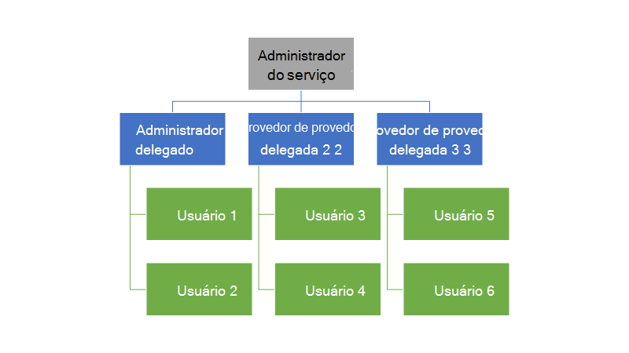
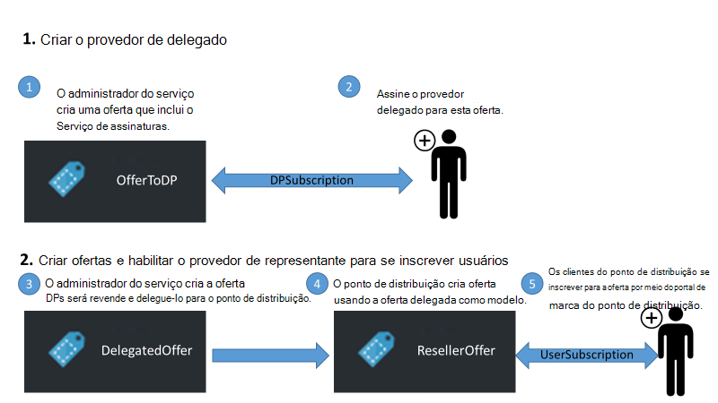
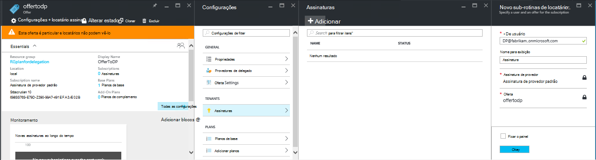
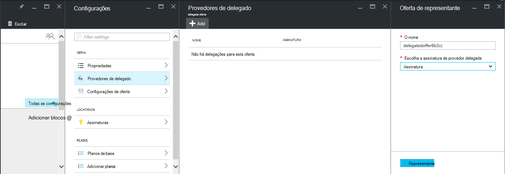
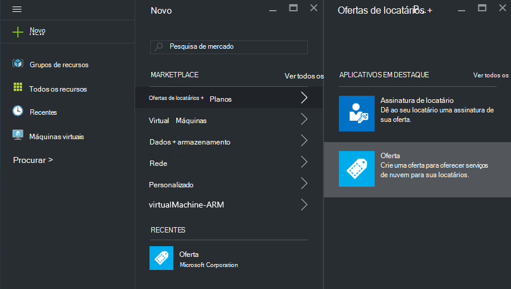
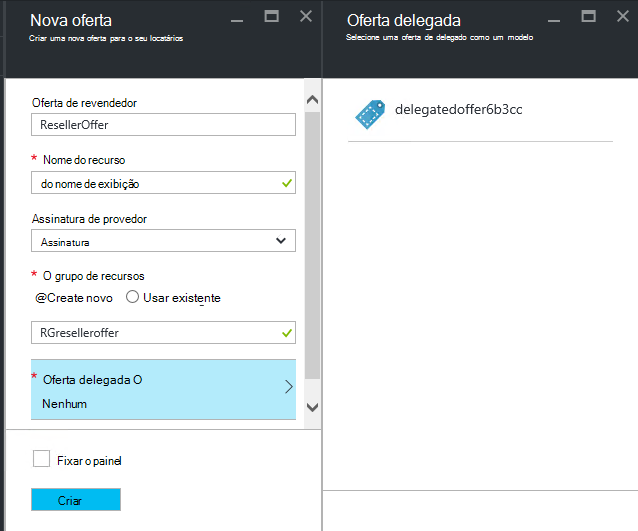
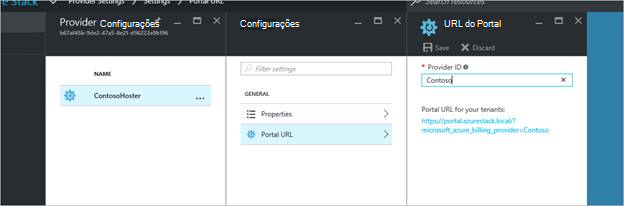
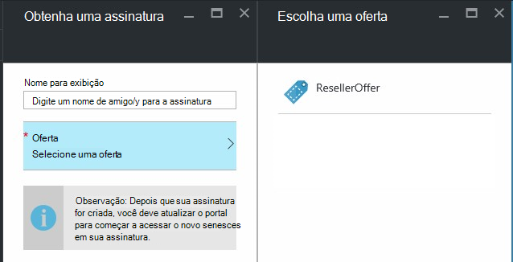

<properties
    pageTitle="Delegando ofertas na pilha do Azure | Microsoft Azure"
    description="Aprenda a colocar outras pessoas responsável pelo criando ofertas e inscrever usuários para você."
    services="azure-stack"
    documentationCenter=""
    authors="AlfredoPizzirani"
    manager="byronr"
    editor=""/>

<tags
    ms.service="azure-stack"
    ms.workload="na"
    ms.tgt_pltfrm="na"
    ms.devlang="na"
    ms.topic="article"
    ms.date="10/07/2016"
    ms.author="alfredop"/>

#Delegando ofertas na pilha do Azure

Como um administrador de serviço, você geralmente quer colocar outras pessoas responsável pelo criando ofertas e inscrever usuários para você. Por exemplo, isso pode acontecer se você for um provedor de serviço e você desejar revendedores Inscrever clientes e gerenciá-los em seu nome. Ele também pode acontecer em uma empresa se fazem parte de um grupo central de TI e desejar divisões ou subsidiárias para se inscrever usuários sem sua intervenção.

Delegação ajuda você a essas tarefas, ajudando a atingir e gerenciar usuários mais do que você poderá fazer diretamente. A ilustração a seguir mostra um nível de delegação, mas Azure pilha suporta vários níveis. Provedores de delegados alternadamente podem delegar a outros provedores, até cinco níveis.

Os administradores podem delegar a criação de ofertas e locatários para outros usuários usando a funcionalidade de delegação.

##Funções e etapas delegação

Para compreender delegação, tenha em mente que há três funções envolvidas:

-   O **administrador do serviço** gerencia a infraestrutura de pilha do Azure, cria um modelo de oferta e delegue outras pessoas para oferecê-lo aos seus usuários.

-   Os usuários delegados são chamados **delegados provedores**. Eles podem pertencer a outras organizações (como outras locatários do Azure Active Directory).

-   **Os usuários** inscrever-se para as ofertas e usá-los para gerenciar suas cargas de trabalho, criando VMs, armazenar dados, etc.

Como mostrado no gráfico a seguir, existem duas etapas na configuração de delegação.

1.  Identifique os provedores de delegado. Faça isso inscrevendo-las uma oferta com base em um plano que contém apenas o serviço de assinaturas.
    Os usuários que se inscreveram para esta oferta adquirir alguns dos recursos do administrador do serviço, incluindo a capacidade de estender ofertas e entre os usuários para eles.

2.  Delega uma oferta para o provedor delegado. Esta oferta funciona como um modelo para que o provedor de delegado pode oferecer. O provedor de delegado agora é capaz de fazer a oferta, escolha um nome para ele (mas não altere seus serviços e cotas) e oferecem aos clientes.

Para agir como provedores de delegados, os usuários precisam estabelecer uma relação com o provedor principal; em outras palavras, eles precisam criar uma assinatura. Neste cenário, essa assinatura identifica os provedores de delegado como tendo à direita para apresentadas ofertas em nome do provedor de principal.

Depois que essa relação é estabelecida, o administrador do sistema pode delegar uma oferta para o provedor de delegado. O provedor de delegado agora é capaz de fazer a oferta, renomeá-la (mas não altere seu conteúdo) e oferecem aos seus clientes.

Para estabelecer um provedor de delegados, uma oferta de representante e verificar se os usuários podem inscrever-se para ele, siga as instruções nas seções a seguir.

##Configurar funções

Para ver um provedor de delegado no trabalho, você precisa de outras contas do Active Directory do Azure além da sua conta de administrador de serviço. Se você não os tiver, crie duas contas. As contas podem pertencer a qualquer locatário AAD. Podemos fará referência a eles como o provedor de delegado (DP) e o usuário.

| **Função** | **Direitos organizacionais** |
| -------------------- | ----------------------- |
|  Provedor de delegado | Usuário |
| Usuário | Usuário |

##Identifique os provedores de delegado

1.  Entrar como administrador do serviço.

2.  Crie a oferta que permitirão locatários se tornar provedores delegados. Isso requer que você criar um plano e uma oferta com base nele:

    a.  [Criar um plano](azure-stack-create-plan.md).
        Este plano deve incluir apenas o serviço de assinaturas. Neste artigo, vamos usar um plano chamado PlanForDelegation.

    b.  [Criar uma oferta](azure-stack-create-offer.md) 
     com base nesse plano. Neste artigo, nós usamos uma oferta chamada OfferToDP.

    c.  Após a criação da oferta for concluída, adicione a ID de usuário do provedor delegado como um locatário para esta oferta clicando     **assinaturas** &gt; **Adicionar** &gt; **Nova assinatura de locatário**.

  

> [AZURE.NOTE]Como com todas as ofertas de pilha do Azure, você tem a opção de fazer a oferta públicos e que ajuda usuários Inscreva-la, ou mantê-lo particular e tendo o administrador do serviço gerenciar a inscrição. Provedores de delegado são geralmente um pequeno grupo e você deseja controlar quem é admitido, portanto mantendo esta oferta particulares surte na maioria dos casos.

##Administrador do serviço cria a oferta delegada

Agora você tem estabelecidas seu provedor de delegado. A próxima etapa é criar o plano e a oferta que você vai delegar e que seus clientes usará. Você deve definir esta oferta exatamente como você deseja os clientes para vê-la, porque o provedor de delegado não serão capaz de mudar os planos e as cotas de que ele inclui.

1.  Como administrador do serviço, [criar um plano](azure-stack-create-plan.md) e [uma oferta](azure-stack-create-offer.md) com base nele. Neste artigo, nós usamos uma oferta chamada DelegatedOffer.
> [AZURE.NOTE]Esta oferta não precisa ser tornado público. Podem ser feita público se você escolher, mas, na maioria dos casos, você só quiser provedores delegados para ter acesso a ele. Depois que você delega uma oferta particular, conforme descrito nas etapas a seguir, o provedor de delegado terá acesso a ele.

2.  Delega a oferta. Vá para DelegatedOffer e, no painel configurações, clique em **Provedores delegada** &gt; **Adicionar**.

3.  Selecione a assinatura do provedor delegada na caixa de listagem suspensa e clique **representante**.

> 

##Provedor de delegado personaliza a oferta

Entrar como provedor de delegados e criar uma nova oferta usando a oferta delegada como um modelo.

1.  Clique em **novo** &gt; **locatário oferece + planos** &gt; **oferecer**.

    

2.  Atribua um nome para a oferta. Aqui, estamos escolha ResellerOffer. Selecione a oferta delegada baseá-lo em e clique em **criar**.
    
    

    >[AZURE.NOTE] Observe a diferença comparada para oferecer criação como experientes pelo administrador do serviço. O provedor de delegado não constrói a oferta de planos de base e planos de complemento; ela só pode escolher da ofertas que tem sido delegadas a ela e não fará alterações a elas.

3. Tornar a oferta público clicando em **Procurar** &gt; **oferece**, selecionando a oferta e, em seguida, clicando em **Alterar estado**.

4. O provedor delegado expõe essas ofertas através do portal de sua própria URL. Observe que essas ofertas são visíveis apenas pelo portal delegada. Para localizar e alterar esta URL:

    a.  Clique em **Procurar** &gt; **configurações de provedor** &gt; **URL Portal**.

    b.  Altere a identificação de provedor se desejado.

    c.  Copiar o portal de URL para um local separado, como o bloco de notas.

    
<!-- -->
Agora você concluiu a criação de uma oferta de delegado como um provedor de delegado. Sair como provedor de delegado. Feche a guia de navegador que você tem usado.

##Inscrever-se para a oferta

1.  Em uma nova janela do navegador, vá para o portal delegado URL que você salvou na etapa anterior. Entre no portal como usuário. Observação: você deve usar o portal delegado para esta etapa. A oferta delegada não ficará visível caso contrário.

2.  No painel de controle, clique em **obter uma assinatura**. Você verá que somente as ofertas delegadas criadas pelo provedor de delegados são apresentadas ao usuário:

> 

Isso conclui o processo de delegação de oferta. O usuário pode agora Inscreva-se para esta oferta obtendo uma assinatura para ele.

##Delegação de várias camadas

Delegação de várias camadas permite que o provedor de delegado delegar a oferta para outras entidades. Isso permite, por exemplo, a criação de mais profundas canais de revendedores, no qual o provedor Gerenciando Azure pilha delegue uma oferta para um distribuidor, que por sua vez delegue ao revendedor.
Pilha Azure suporta até cinco níveis de delegação.

Para criar vários níveis de delegação de oferta, o provedor de delegado alternadamente delegue a oferta para o próximo provedor. O processo é o mesmo para o provedor de delegado como ela estava para o administrador de serviço (consulte o [administrador do serviço cria a oferta delegada](#service-admin-creates-the-delegated-offer)).

##Próximas etapas
[Provisionar uma máquina virtual](azure-stack-provision-vm.md)
