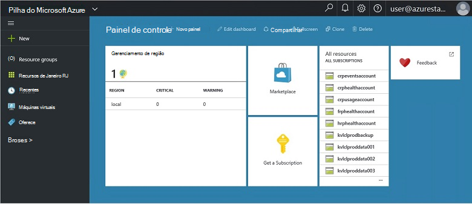
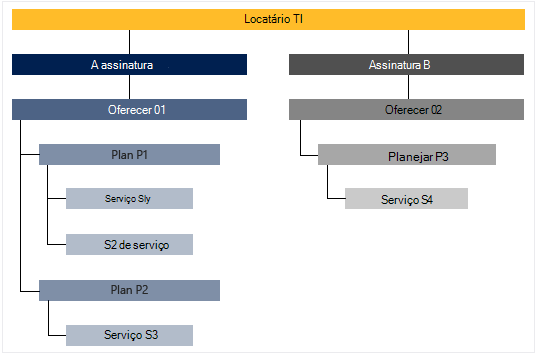

<properties
    pageTitle="Principais recursos e conceitos na pilha do Azure | Microsoft Azure"
    description="Saiba mais sobre os principais recursos e conceitos na pilha do Azure."
    services="azure-stack"
    documentationCenter=""
    authors="Heathl17"
    manager="byronr"
    editor=""/>

<tags
    ms.service="azure-stack"
    ms.workload="na"
    ms.tgt_pltfrm="na"
    ms.devlang="na"
    ms.topic="article"
    ms.date="10/25/2016"
    ms.author="helaw"/>

# Principais recursos e conceitos na pilha do Azure

Se você estiver começando a usar o Microsoft Azure pilha, estes termos e descrições de recursos podem ser útil.

## Personas

Há dois tipos de usuários para o Microsoft Azure pilha, o administrador do serviço e o locatário (cliente).

-  Um **administrador do serviço** pode configurar e gerenciar provedores de recursos, ofertas de locatário, planos, serviços, cotas e preços.
-  Um **locatário** adquire (ou compras) serviços que oferece o administrador do serviço. Locatários podem provisionar, monitorar e gerenciar serviços que eles se inscreveu, como máquinas virtuais, armazenamento e aplicativos Web.

## Portal

Principais métodos de interação com pilha do Microsoft Azure é o portal e PowerShell.

O portal do Microsoft Azure pilha é uma instância do portal do Azure em execução nos seus servidores. É um site que fornece uma experiência de autoatendimento para administradores de serviço e locatários com controle de acesso baseado em função (RBAC) a capacidade de nuvem, permitindo que o aplicativo rápido, desenvolvimento de serviço e implantação e recursos.

## Regiões, serviços, planos, ofertas e assinaturas

Na pilha do Azure, os serviços são fornecidos para locatários usando regiões, assinaturas, ofertas e planos. Locatários podem assinar oferece vários. Ofertas podem ter um ou mais planos e planos podem ter um ou mais serviços.

Hierarquia de exemplo de assinaturas de um locatário ofertas, cada um com diversos planos e serviços.

### Regiões
Azure regiões de pilha são um elemento básico de escala e gerenciamento.  Uma organização pode ter várias regiões com recursos disponíveis em cada região.  Regiões também podem ter ofertas de serviço diferente disponíveis.

### Serviços

Pilha do Microsoft Azure permite que os provedores oferecer uma ampla variedade de serviços e aplicativos, como máquinas virtuais, SQL Server bancos de dados, SharePoint, Exchange e muito mais.

### Planos

Planos são agrupamentos de um ou mais serviços. Como um provedor, você cria planos para oferecer a sua locatários. Por sua vez, seu locatários assinar suas ofertas de usar os planos e serviços incluírem.

Cada serviço adicionado a um plano pode ser configurado com configurações de cota para ajudá-lo a gerenciar sua capacidade de nuvem. Cotas podem incluir restrições como limites de máquina virtual, RAM e CPU e são aplicadas por assinatura do usuário. Cotas podem ser diferenciadas pelo local. Por exemplo, um plano que contém os serviços de computação da região A poderia ter uma cota de duas máquinas virtuais, 4GB de RAM e 10 cores de CPU.

Ao redigir uma oferta, o administrador do serviço pode incluir **planos de base**. Esses planos base são incluídos por padrão quando um locatário assinado por essa oferta. Assim que um usuário se inscreve (e a assinatura é criada), o usuário tem acesso a todos os provedores de recurso especificado nesses planos base (com as cotas correspondentes).

O administrador do serviço também pode incluir **planos de complemento** em uma oferta. Planos de complemento não são incluídos por padrão na assinatura. Complemento planos são planos adicionais (cotas) disponíveis em uma oferta que um proprietário de assinatura pode adicionar às suas assinaturas.

### Oferece

Ofertas são grupos de um ou mais planos provedores apresentam para locatários comprar (assinar). Por exemplo, oferecer Alpha pode conter plano R (de 1 de região que contém um conjunto de serviços de computação) e plano B (da região 2 contendo um conjunto de serviços de rede e armazenamento).

Uma oferta vem com um conjunto de planos de base e os administradores de serviço podem criar planos de complemento que locatários podem adicionar à sua assinatura.

### Assinaturas

Uma assinatura é como locatários compram seu ofertas. Uma assinatura é uma combinação de um locatário com uma oferta. Um locatário pode ter assinaturas do oferece vários. Cada assinatura se aplica a apenas uma oferta. Assinaturas de um locatário determinam os planos/serviços que eles possam acessar.

As assinaturas ajudam provedores organizar acesso e uso de serviços e recursos de nuvem.

## Gerenciador de recursos do Azure

Usando o Gerenciador de recursos do Azure, você pode trabalhar com seus recursos de infraestrutura em um modelo baseado no modelo, declaritive.   Ele fornece uma interface única que você pode usar para implantar, gerenciar e monitorar os componentes de solução, como máquinas virtuais, contas de armazenamento, aplicativos web e bancos de dados. Para obter informações completas e orientação, consulte [Visão geral do Gerenciador de recursos do Azure](../azure-resource-manager/resource-group-overview.md).

### Grupos de recursos

Grupos de recursos são coleções de recursos, serviços e aplicativos — e cada recurso tem um tipo, como máquinas virtuais, redes virtuais, IPs público, contas de armazenamento e sites. Cada recurso deve estar em um grupo de recursos e para ajudam a grupos de recursos logicamente organizar recursos, como por carga de trabalho ou local.

Aqui estão algumas coisas importantes a considerar ao definir um grupo de recursos:

-   Cada recurso só pode existir em um grupo de recursos.

-   Você irá implantar, atualizar e excluir itens em um grupo de recursos juntos. Se um recurso, como um servidor de banco de dados, precisa existir em um ciclo de implantação diferente, ele deve estar no outro grupo de recursos.

-   Você pode adicionar ou remover um recurso a um grupo de recursos a qualquer momento.

-   Você pode mover um recurso de um grupo de recursos para outro grupo.

-   Um grupo de recursos pode conter recursos que residem em diferentes regiões.

-   Um grupo de recursos pode ser usado para controle de acesso para ações administrativas do escopo.

-   Um recurso pode ser vinculado a um recurso em outro grupo de recursos quando os dois recursos devem interagir uns com os outros, mas eles não compartilham o mesmo ciclo de vida. Por exemplo, vários aplicativos devem se conectar a um banco de dados, mas esse banco de dados não deve ser atualizado ou excluído no mesmo ritmo como os aplicativos.

-   No Microsoft Azure pilha, recursos como planos e ofertas também são gerenciados em grupos de recursos.

-   Você pode reimplantar um grupo de recursos.  Isso é útil para fins de testes ou desenvolvimento.  

### Modelos do Azure Gerenciador de recursos

Com o Gerenciador de recursos do Azure, você pode criar um modelo simples (no formato JSON) que define a implantação e configuração do aplicativo. Este modelo é conhecido como um modelo do Gerenciador de recursos do Azure e fornece uma maneira declarativa para definir a implantação. Usando um modelo, pode repetidamente implantar seu aplicativo em todo o ciclo de vida do aplicativo e tiver confiança que seus recursos são implantados em um estado consistente.

## Provedores de recursos (RPs) — RP de rede, calcular RP, armazenamento RP

Provedores de recursos são serviços web que formam a base de todos os IaaS com base no Azure e serviços de PaaS. Gerenciador de recursos de Azure depende RPs diferentes para fornecer acesso aos serviços de um hoster.

Há três RPs principal: rede, armazenamento e computação. Cada um desses RPs ajuda você a configurar e controlar seus respectivos recursos. Administradores de serviço também podem adicionar novos provedores de recursos personalizados.

### Calcular RP

O provedor de recursos de computação (CRP) permite que os locatários pilha do Azure criar seus próprios máquinas virtuais. Ele também fornece funcionalidade para o administrador de serviço configurar o provedor de recursos para locatários. O CRP inclui a capacidade de criar máquinas virtuais, bem como as extensões de máquina Virtual. O serviço de extensão de máquina Virtual Ajuda fornecem recursos de IaaS para máquinas virtuais Windows e Linux.

### Rede RP

O provedor de recursos de rede (NRP) fornece uma série de recursos de rede definidos pelo Software (SDN) e virtualização de função de rede (NFV) para a nuvem privada. Esses recursos estão consistentes com a nuvem pública do Azure para que podem ser gravados uma vez e implantados tanto na nuvem pública do Azure ou local Microsoft Azure pilha modelos de aplicativos. O RP de rede fornece controle de rede mais granular, marcas de metadados, mais rápida configuração, personalização rápida e repetitiva e várias interfaces de controle (incluindo o PowerShell, .NET SDK, Node SDK, API baseada em REST). Você pode usar o NRP para criar grupos de segurança de rede do software carga balanceadores, IPs público, redes virtuais, entre outros.

### Armazenamento RP

O RP de armazenamento oferece quatro serviços de armazenamento do Azure consistentes: blob, tabela, fila e gerenciamento de conta. Ele também oferece um serviço de administração de nuvem de armazenamento para facilitar a administração de provedor de serviço de serviços de armazenamento do Azure consistentes. Armazenamento do Azure fornece flexibilidade para armazenar e recuperar grandes quantidades de dados não estruturados, como documentos e arquivos de mídia com Blobs do Azure, e NoSQL estruturado com base em dados com tabelas do Azure. Para obter mais informações sobre o armazenamento do Azure, consulte [Introdução ao Microsoft Azure armazenamento](../storage/storage-introduction.md).

#### Armazenamento de blob

Armazenamento de blob armazena qualquer conjunto de dados. Um blob pode ser qualquer tipo de texto ou dados binários, como um documento, arquivo de mídia ou instalador do aplicativo. Armazenamento de tabela armazena conjuntos de dados estruturados. Armazenamento de tabela é um armazenamento de dados de atributo key NoSQL, que permite desenvolvimento rápido e acesso rápido a grandes quantidades de dados. Armazenamento de fila fornece mensagens confiáveis para processamento de fluxo de trabalho e para comunicação entre os componentes de serviços de nuvem.

Cada blob é organizada em um contêiner. Contêineres também fornecem uma maneira útil para atribuir políticas de segurança para grupos de objetos. Uma conta de armazenamento pode conter qualquer número de contêineres, e um contêiner pode conter qualquer número de blobs, até o limite de capacidade de 500 TB da conta de armazenamento. Blob storage oferece três tipos de blobs, bloquear blobs, acrescentar blobs e blobs de página (discos). Bloco blobs são otimizados para streaming e armazenando objetos de nuvem e são uma boa opção para armazenar documentos, arquivos de mídia, backups etc. Acrescentar blobs são semelhantes aos bloco blobs, mas são otimizados para acrescentar operações. Um blob de acréscimo pode ser atualizado apenas adicionando um novo bloco até o final. Acrescentar blobs são uma boa opção para cenários como log, onde os novos dados precisam ser gravados apenas para o final do blob. Blobs de página são otimizados para representar IaaS discos e suporte aleatório grava e pode ser até 1 TB em tamanho. Uma rede do Azure máquina virtual anexados IaaS disco é um VHD armazenado como um blob de página.

#### Armazenamento de tabela

Armazenamento de tabela é o repositório de chave/atributo NoSQL da Microsoft – tem um design sem esquemas, tornando mais diferente do bancos de dados relacionais tradicionais. Como esquemas de falta de armazenamentos de dados, é fácil adaptar seus dados conforme as necessidades dos seus evolve de aplicativo. Armazenamento de tabela é fácil de usar, para que os desenvolvedores podem criar aplicativos rapidamente. Armazenamento de tabela é uma loja de atributo key, significando que cada valor em uma tabela é armazenado com um nome de propriedade digitado. O nome da propriedade pode ser usado para filtrar e especificar critérios de seleção. Uma coleção de propriedades e seus valores compõem uma entidade. Desde esquemas de falta de armazenamento de tabela, duas entidades na mesma tabela podem conter diferentes conjuntos de propriedades, e essas propriedades podem ser de diferentes tipos. Você pode usar o armazenamento de tabela para armazenar flexíveis conjuntos de dados, como dados de usuário para aplicativos web, catálogos de endereços, informações de dispositivo e qualquer outro tipo de metadados que requer o seu serviço. Você pode armazenar qualquer número de entidades em uma tabela e uma conta de armazenamento pode conter qualquer número de tabelas, para cima até o limite de capacidade da conta de armazenamento.

#### Armazenamento de fila
Armazenamento do Azure fila fornece nuvem de mensagens entre os componentes de aplicativo. Criar aplicativos para escala, componentes de aplicativo geralmente são desassociados, para que eles possam ser redimensionados independentemente. O armazenamento de fila oferece mensagens assíncrona para comunicação entre componentes de aplicativo, se eles estiverem executando na nuvem, na área de trabalho, em um servidor local ou em um dispositivo móvel. Armazenamento de fila também dá suporte a gerenciamento de tarefas assíncronas e criação de fluxos de trabalho de processo.

## Controle de acesso (RBAC) baseado em função

Você pode usar RBAC para conceder acesso de sistema para os usuários autorizados, grupos e serviços atribuindo funções em um nível de recurso individual, grupo de recursos ou assinatura. Cada função define o nível de acesso que um usuário, grupo ou serviço tem sobre os recursos do Microsoft Azure pilha.

RBAC Azure tem três funções básicas que se aplicam a todos os tipos de recurso: proprietário, Colaborador e leitor. Proprietário tem acesso total a todos os recursos, inclusive o direito de acesso de representante que outras pessoas. Colaborador pode criar e gerenciar todos os tipos de recursos Azure, mas não pode conceder acesso a outras pessoas. Leitor só pode exibir recursos Azure existentes. O restante das funções RBAC no Azure permitir o gerenciamento de recursos específicos do Azure. Por exemplo, a função Colaborador de máquina Virtual permite a criação e gerenciamento de máquinas virtuais, mas não permitir o gerenciamento de rede virtual ou sub-rede que se conecta a máquina virtual.

## Dados de uso

Pilha do Microsoft Azure coleta e agrega dados de uso em todos os provedores de recursos para fornecer um relatório conciso por usuário. Dados podem ser tão simples quanto contagem de recurso consumidas ou complexas como contadores de desempenho e dimensionamento individuais. Os dados estão disponíveis por meio da API REST. Há uma API de locatário Azure consistente bem como provedor e delegada APIs do provedor para obter dados de uso em todas as assinaturas de locatários. Esses dados podem ser usados a integração com uma ferramenta externa ou um serviço de cobrança ou devolução.

## Próximas etapas

[Implantar visualização técnica do Azure pilha 2 (VDC)](azure-stack-deploy.md)
