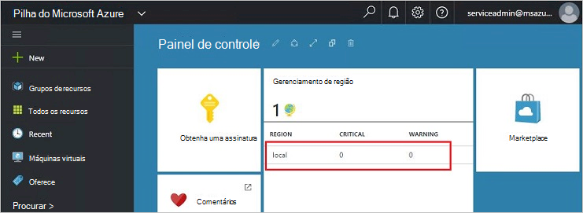
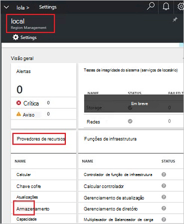
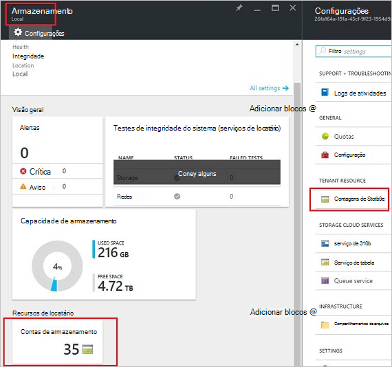
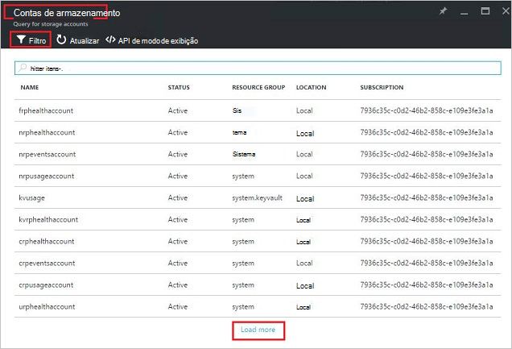
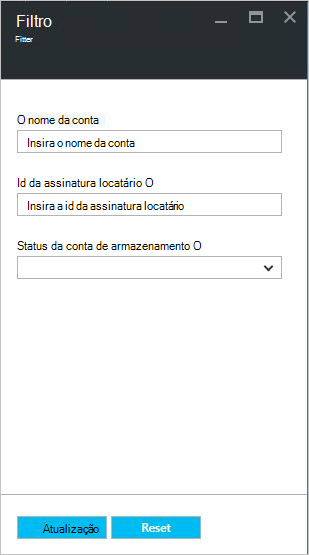
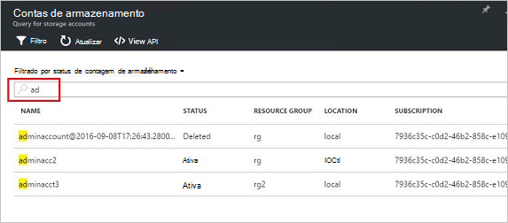
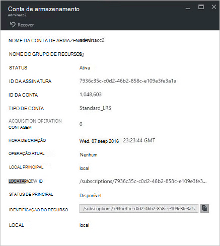
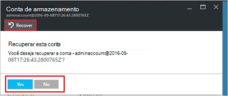
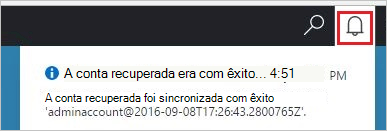
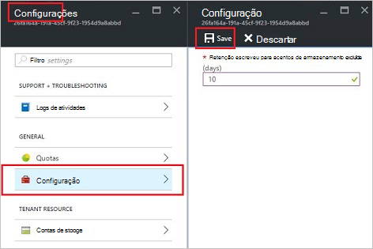

<properties
    pageTitle="Gerenciar contas de armazenamento do Azure pilha | Microsoft Azure"
    description="Saiba como localizar, gerenciar, recuperar e recuperar contas de armazenamento do Azure pilha"
    services="azure-stack"
    documentationCenter=""
    authors="AniAnirudh"
    manager="darmour"
    editor=""/>

<tags
    ms.service="azure-stack"
    ms.workload="na"
    ms.tgt_pltfrm="na"
    ms.devlang="na"
    ms.topic="get-started-article"
    ms.date="09/26/2016"
    ms.author="anirudha"/>

# <a name="manage-storage-accounts-in-azure-stack"></a>Gerenciar contas de armazenamento na pilha Azure

Saiba como gerenciar contas de armazenamento na pilha do Azure para localizar, recuperar e recuperar capacidade de armazenamento com base nas necessidades de negócios.

## <a name="find-a-storage-account"></a>Localizar uma conta de armazenamento

A lista de contas de armazenamento na região pode ser visualizada na pilha de Azure por:

1.  Em um navegador de internet, navegue até [https://portal.azurestack.local](https://portal.azurestack.local/).

2.  Entre portal do Azure pilha como administrador (usando as credenciais fornecidas durante a implantação)

3.  No painel de ferramentas padrão – localizar lista **gerenciamento de região** e clique na região que você deseja explorar – por exemplo **(local**).

    

4.  Selecione **armazenamento** na lista de **Provedores de recursos** .

    

5.  Agora, na administração de provedor do recurso lâmina armazenamento – Role para baixo até a guia "Contas de armazenamento" e clique nela.

    
    
    A página resultante é a lista de contas de armazenamento nessa região.

    

Por padrão, os 10 primeiros serão exibidos. Você pode escolher buscar mais clicando no link "carregar mais" na parte inferior da lista <br>
OU <br>
Se você estiver interessado em uma conta de armazenamento específica – você pode **Filtrar e buscar as contas relevantes** apenas.<br>

Para filtrar para contas:

1. Clique no botão de filtro na parte superior da lâmina.

2. Na lâmina filtro, ele permite que você especifique o **nome da conta**,  **ID da assinatura** ou **status** para ajustar a lista de contas de armazenamento a ser exibido. Usá-los conforme apropriado.

3. Clique em Atualizar. A lista deve atualizar adequadamente.

    

4. Para redefinir o filtro – clique no botão Filtrar, limpar as seleções e atualizar.

Caixa de texto Pesquisar, na parte superior a lâmina de lista de contas de armazenamento, permite que você realce o texto selecionado na lista de contas. Isso é realmente útil no caso quando o nome completo ou a id não está disponível com facilidade.<br>
Você pode usar texto livre aqui para ajudar a encontrar a conta que você está interessado.




## <a name="look-at-account-details"></a>Examine os detalhes da conta

Após você ter localizado as contas que você está interessado em Visualizar, você pode clicar em determinada conta exibir determinados detalhes. Um novo blade será aberto com os detalhes da conta como o tipo de conta, hora de criação, local etc.




## <a name="recover-a-deleted-account"></a>Recuperar uma conta excluída

Talvez você esteja em uma situação onde você deseja recuperar uma conta excluída.<br>
Em AzureStack, há uma maneira muito simples para fazê-lo.

1.  Vá navegue até a lista de contas de armazenamento. [Consulte encontrar uma conta de armazenamento](#find-a-storage-account)

2.  Localize essa conta específica na lista. Talvez você precise filtrar.

3.  Verificar o 'estado' da conta. Deve haver a informação "excluídos".

4.  Clique na conta que abre a lâmina de detalhes de conta.

5.  Sobre este blade – localize o botão "recuperar" e clique nela.

6.  Confirmar pressionando "Sim"

    

7.  A recuperação está no processo … aguardar indicação que ele foi bem-sucedido.
    Você também pode clicar no ícone "bell" na parte superior do portal para exibir indicações de andamento.

    

  Depois que a conta recuperada é sincronizada com êxito, um pode voltar a usá-lo.

### <a name="some-gotchas"></a>Alguns truques

- Sua conta excluída mostra estado como "fora retenção".

  Isso significa que a conta excluída excedeu o período de retenção e não pode ser recuperável mais.

- Sua conta excluída não aparece na lista de contas.

  Isso poderia significa que a conta excluída já foi coletado como lixo. Nesse caso não é possível recuperá-la mais. Consulte "recuperar a capacidade de" abaixo.

## <a name="set-retention-period"></a>Definir o período de retenção

Configuração de período de retenção permite que um administrador especificar um período de tempo em dias (entre 0 e 9999 dias) durante o qual qualquer conta excluída potencialmente pode ser recuperada. O período de retenção padrão é definido como 15 dias. Configurando o valor como "0" significa que qualquer conta excluída imediatamente estará fora retenção e marcado para coleta de lixo periódicos.

Para alterar o período de retenção –

1.  Em um navegador de internet, navegue até [https://portal.azurestack.local](https://portal.azurestack.local/).

2.  Entre portal do Azure pilha como administrador (usando as credenciais fornecidas durante a implantação)

3.  No painel de ferramentas padrão – localizar lista **gerenciamento de região** e clique na região que você deseja explorar – por exemplo **(local**).

4.  Selecione **armazenamento** na lista de **Provedores de recursos** .

5.  Clique no ícone configurações na parte superior para abrir a lâmina de configuração.

6.  Clique em configuração - período de retenção.

7.  Você pode editar o valor e salvá-lo.

 Esse valor serão efetivas imediatamente e refletir em toda a sua região.



## <a name="reclaim-capacity"></a>Recuperar capacidade

Um dos efeitos de lado de ter um período de retenção é que uma conta excluída vai continuar a consumir capacidade até chegar fora do período de retenção. Como administrador que talvez seja necessário uma maneira de recuperar isso excluído agora espaço contas apesar de período de retenção ainda não expirou. Atualmente, você pode usar um cmdline explicitamente substituam o período de retenção e recuperar a capacidade de imediatamente. Para fazê-lo –

1.  Supondo que você tenha Azure PowerShell instalado e configurado. Caso contrário, siga as instruções aqui: para instalar a versão mais recente do PowerShell do Azure e associá-lo a sua assinatura do Azure, veja [como instalar e configurar o Azure PowerShell](http://azure.microsoft.com/documentation/articles/powershell-install-configure/).
    Para obter mais informações sobre cmdlets do Gerenciador de recursos do Azure, consulte [Usando o PowerShell Azure com o Gerenciador de recursos do Azure](http://go.microsoft.com/fwlink/?LinkId=394767)

2.  Execute este cmdlet:

    ```
    PS C:\\>; Clear-ACSStorageAccount -ResourceGroupName system
    -FarmName <your farmname>
    ```

> Para obter mais detalhes, consulte a [documentação do powershell AzureStack](https://msdn.microsoft.com/library/mt637964.aspx)

> [AZURE.NOTE] Executar este cmdlet excluirá permanentemente a conta e seu conteúdo. Ele não será mais recuperável. Use com cuidado.

