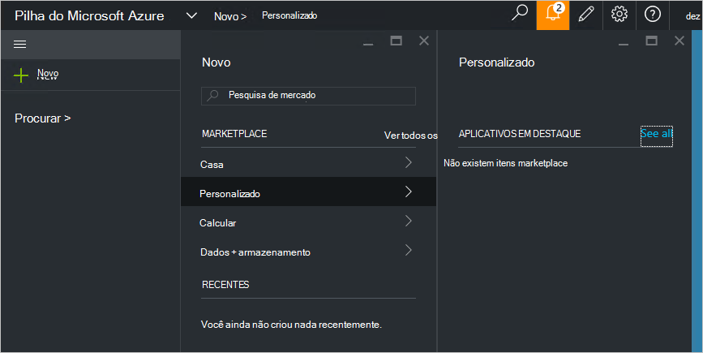

<properties
    pageTitle="Publicar um item de marketplace personalizado na pilha de Azure (administrador de serviço) | Microsoft Azure"
    description="Como um administrador de serviço, saiba como publicar um item de marketplace personalizado na pilha do Azure."
    services="azure-stack"
    documentationCenter=""
    authors="rupisure"
    manager="byronr"
    editor=""/>

<tags
    ms.service="azure-stack"
    ms.workload="na"
    ms.tgt_pltfrm="na"
    ms.devlang="na"
    ms.topic="article"
    ms.date="09/26/2016"
    ms.author="rupisure"/>

# O pilha Azure Marketplace

O Marketplace é uma coleção de itens personalizados para pilha do Azure, como serviços, aplicativos e recursos. Ele é o lugar onde locatários vêm para criar novos recursos e implantar novos aplicativos. Administradores de serviço podem adicionar itens personalizados para o Marketplace e locatários poderão vê-los imediatamente.

Para abrir o Marketplace, clique em **novo**.

O Marketplace é atualizado a cada cinco minutos.

## Itens de Marketplace

Cada item Marketplace tem:

-   Um modelo do Gerenciador de recursos do Azure para provisionamento de recursos

-   Metadados, como cadeias de caracteres, ícones e outro material de marketing

-   Informações de formatação para exibir o item no portal

Cada item publicado no mercado usa um formato chamado o pacote de galeria do Azure (azpkg). Recursos de implantação ou runtime (como código, arquivos zip com software ou imagens de máquina virtual) devem ser adicionados à pilha de Azure separadamente, não como parte do Item Marketplace. 

## Próximas etapas

[Criar e publicar um item de marketplace](azure-stack-create-and-publish-marketplace-item.md)
