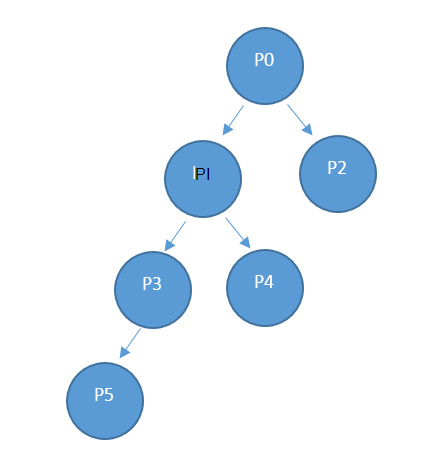

<properties
    pageTitle="Uso de recursos de provedor API | Microsoft Azure"
    description="Referência do uso de recursos API, que recuperar informações de uso do Azure pilha."
    services="azure-stack"
    documentationCenter=""
    authors="AlfredoPizzirani"
    manager="byronr"
    editor=""/>

<tags
    ms.service="azure-stack"
    ms.workload="na"
    ms.tgt_pltfrm="na"
    ms.devlang="na"
    ms.topic="article"
    ms.date="10/18/2016"
    ms.author="alfredop"/>

# Uso de recursos de provedor API

O provedor do termo aplica para o administrador do serviço e quaisquer provedores delegadas. Administradores de serviço e provedores de delegado podem usar a API de uso do provedor para exibir o uso de suas locatários diretos. Por exemplo, P0 pode chamar a API de provedor para obter informações de uso do P1 e do P2 uso direto e P1 pode chamar para obter informações de uso sobre P3 e P4.

## Referência de chamada de API

### Solicitação

A solicitação obtém detalhes de consumo para as assinaturas solicitadas e para o período solicitado. Não há nenhum corpo da solicitação.

Esse uso API é uma API de provedor, para que o chamador deve ser atribuído a uma função de proprietário, colaborador ou leitor na assinatura do provedor.

| **Método**  | **URI de solicitação** |
| ------------ | ------------------------------------------------------------------------------------------------------------------------------------------------------------------------------------------------------------------------------------------------------------------------------------------------------ |
|  Obter        | https://{armendpoint}/subscriptions/{subId}/providers/Microsoft.Commerce/subscriberUsageAggregates?reportedStartTime={reportedStartTime}&reportedEndTime={reportedEndTime}&aggregationGranularity={granularity}&subscriberId={sub1.1}&api-version=2015-06-01-preview&continuationToken={token-value} |

### Argumentos

| **Argumento**              | **Descrição** |
| -------------------------- | --------------------------------------------------------------------------------------------------------------------------------------------------------------------------------------------------------------------------------------------------------------------------------------------------------------------------------------------------------- |
| *armendpoint*             | Azure Gerenciador de recursos ponto de extremidade de seu ambiente do Azure pilha. A convenção de pilha Azure é o nome do ponto de extremidade do BRAÇO no https://api formato. {nome de domínio}'. Por exemplo, se o nome de domínio for azurestack.local, o ponto de extremidade do BRAÇO será https://api.azurestack.local. |
| *subId*                   | ID da assinatura do usuário que está fazendo a chamada. |
| *reportedStartTime*       | Hora de início da consulta. O valor de *DateTime* deve ser UTC e no início da hora, por exemplo, 13:00. Para agregação diária, defina esse valor para meia-noite UTC. O formato é *escape* ISO 8601, por exemplo, 2015-06-16T18% 3a53% 3a11% 2b00% 3a00Z, onde os dois-pontos é escape para % 3a e plus é escape para 2% bilhões para que fique URI amigável. |
| *reportedEndTime*         | Hora de término da consulta. As restrições que se aplicam a *reportedStartTime* também se aplicarão a esse argumento. O valor de *reportedEndTime* não pode ser no futuro. |
| *aggregationGranularity*  | Parâmetro opcional que tem dois valores possíveis distintas: diariamente e por hora. Como os valores sugerem, um retorna os dados em detalhamento diário e a outra é uma resolução por hora. A opção diária é o padrão. |
| *subscriberId*            | ID da assinatura. Para obter dados filtrados, a ID de assinatura de um locatário direto do provedor é necessária. Se nenhum parâmetro de ID de assinatura for especificado, a chamada retorna dados de uso para locatários direto todos do provedor. |
| *versão da API*             | Versão do protocolo que é usado para fazer essa solicitação. Você deve usar 2015-06-01-visualização. |
| *continuationToken*       | Token recuperados da última chamada para o provedor de API de uso. Isso é necessário quando uma resposta é maior do que 1.000 linhas. Este é o indicador de progresso. Se não estiver presente, os dados são recuperados desde o início do dia ou hora, com base no detalhamento passado. |

### Resposta

Obtenha /subscriptions/sub1/providers/Microsoft.Commerce/subscriberUsageAggregates?reportedStartTime=reportedStartTime=2014-05-01T00%3a00%3a00%2b00%3a00 & reportedEndTime = 2015-06-01T00% 3a00% 3a00% 2b00% 3a00 & aggregationGranularity = diária & subscriberId = sub1.1 & versão da api = 1.0

{

"valor":\[

{

"id": "/subscriptions/sub1.1/providers/Microsoft.Commerce/UsageAggregate/sub1.1-

meterID1 ",

"nome": "sub1.1-meterID1",

"tipo": "Microsoft.Commerce/UsageAggregate",

"propriedades": {

"subscriptionId": "sub1.1",

"usageStartTime": "2015-03-03T00:00:00 + 00:00",

"usageEndTime": "2015-03-04T00:00:00 + 00:00",

"instanceData": "{\\" Microsoft.Resources\\": {\\" resourceUri\\":\\" resourceUri1\\",\\"local\\

":\\" Alasca\\",\\" marcas\\": nulo,\\" additionalInfo\\": nulo}}",

:2.4000000000 "quantidade",

"meterId": "meterID1"

}

},

…

### Detalhes da resposta

| **Argumento**       | **Descrição**
| ------------------ | ------------------------------------------------------------------------------------------------------------- |
| *ID*               | ID exclusiva do agregado uso
| *nome*             | Nome da agregação de uso
| *tipo*             | Definição de recurso
| *subscriptionId*   | Identificador de assinatura do usuário pilha do Azure
| *usageStartTime*   | UTC hora de início o Balde de uso ao qual pertence este agregado de uso
| *usageEndTime*     | Hora de término de UTC do Balde de uso ao qual pertence este agregado de uso
| *instanceData*     | Pares de chave-valor de detalhes da instância (em um novo formato):  *resourceUri*: totalmente qualificado identificação do recurso, que inclui os grupos de recursos e o nome da instância   *local*: região no qual esse serviço foi executado   *marcas*: marcas de recursos que são especificadas pelo usuário   *additionalInfo*: obter mais detalhes sobre o recurso consumido, por exemplo, tipo de imagem ou a versão do sistema operacional |
| *quantidade*         | Quantidade de consumo de recursos que ocorreram nesta moldura de tempo |
| *meterId*          | ID exclusiva para o recurso que foi consumida (também chamado *identificação de recurso*) |

## Próximas etapas

[Uso de recursos de locatário Referência API](azure-stack-tenant-resource-usage-api.md)

[Perguntas Frequentes relacionadas de uso](azure-stack-usage-related-faq.md)
