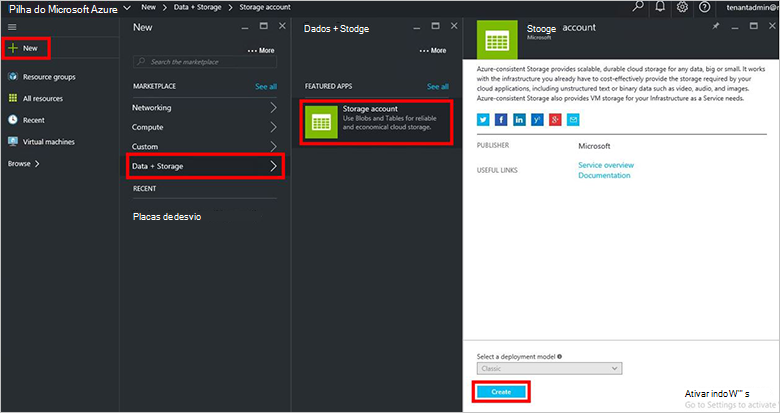
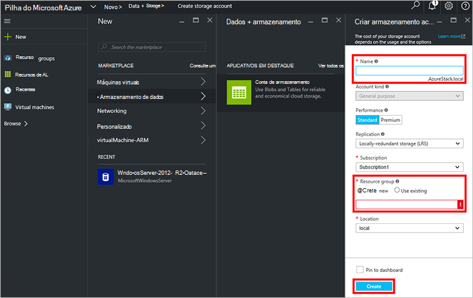
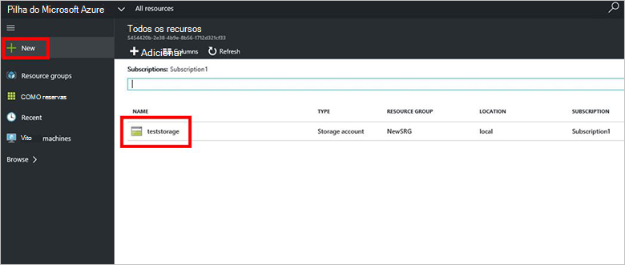

<properties
    pageTitle="Contas de armazenamento na pilha do Azure | Microsoft Azure"
    description="Saiba como criar uma conta de armazenamento do Azure pilha."
    services="azure-stack"
    documentationCenter=""
    authors="ErikjeMS"
    manager="byronr"
    editor=""/>

<tags
    ms.service="azure-stack"
    ms.workload="na"
    ms.tgt_pltfrm="na"
    ms.devlang="na"
    ms.topic="get-started-article"
    ms.date="09/26/2016"
    ms.author="erikje"/>

# Contas de armazenamento na pilha do Azure

Contas de armazenamento incluem serviços Blob e tabela e namespace exclusivo para os objetos de dados de armazenamento. Por padrão, os dados em sua conta está disponíveis somente para você, o proprietário da conta de armazenamento.

1.  No computador do Azure pilha VDC, faça logon no `https://portal.azurestack.local` como [um administrador](azure-stack-connect-azure-stack.md#log-in-as-a-service-administrator)e, em seguida, clique em **novo** > **dados + armazenamento** > **conta de armazenamento**.

    

2.  Na lâmina **Criar conta de armazenamento** , digite um nome para a sua conta de armazenamento. Criar um novo **Grupo de recursos**, ou selecione um existente e clique em **criar** para criar a conta de armazenamento.

    

3. Para ver sua nova conta de armazenamento, clique em **todos os recursos**, e em seguida, pesquise a conta de armazenamento e clique em seu nome.

    
    
## Próximas etapas

[Use modelos do Gerenciador de recursos do Azure](azure-stack-arm-templates.md)

[Saiba mais sobre contas de armazenamento do Azure](../storage/storage-create-storage-account.md)

[Baixar o guia de validação de armazenamento do Azure consistente pilha Azure](http://aka.ms/azurestacktp1doc)
