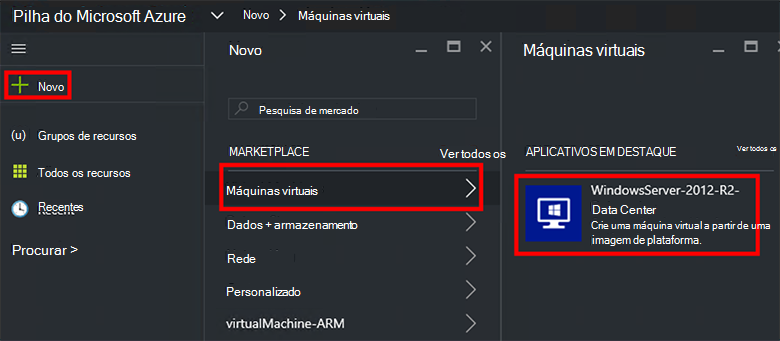
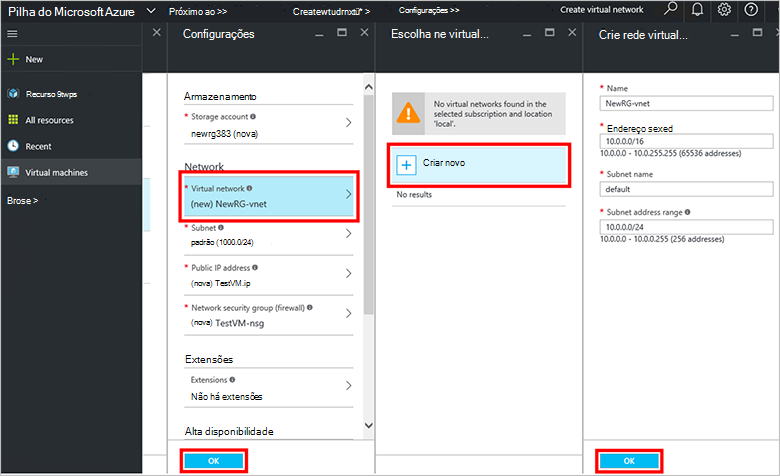
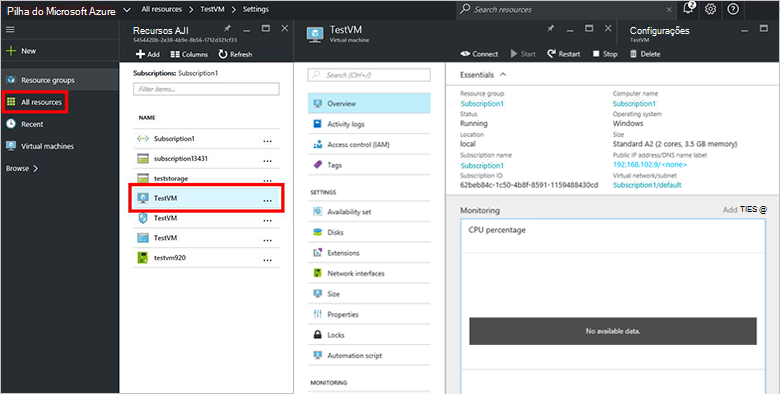

<properties
    pageTitle="Provisionar uma máquina virtual na pilha de Azure (Locatário) | Microsoft Azure"
    description="Como um locatário, saiba como provisionar uma máquina virtual na pilha do Azure."
    services="azure-stack"
    documentationCenter=""
    authors="ErikjeMS"
    manager="byronr"
    editor=""/>

<tags
    ms.service="azure-stack"
    ms.workload="na"
    ms.tgt_pltfrm="na"
    ms.devlang="na"
    ms.topic="get-started-article"
    ms.date="10/12/2016"
    ms.author="erikje"/>

# Provisionar uma máquina virtual

Como administrador, você pode criar máquinas virtuais para avaliar recursos antes de oferta-los nos planos.

## Provisionar uma máquina virtual

1.  No computador do Azure pilha VDC, faça logon no `https://portal.azurestack.local` como [um administrador](azure-stack-connect-azure-stack.md#log-in-as-a-service-administrator)e, em seguida, clique em **novo** > **máquinas virtuais** > **WindowsServer 2012-R2-data center**.  

    

2.  Na lâmina **Noções básicas** , digite um **nome**, **nome de usuário**e **senha**. Para **tipo de disco de máquina virtual**, escolha a **unidade de disco rígido**. Escolha uma **assinatura**. Criar um **grupo de recursos**, ou selecione um existente e clique em **Okey**.  

3.  Na lâmina **Escolher um tamanho** , clique em **A1 básico**e, em seguida, clique em **Selecionar**.  

4.  Na lâmina **configurações** , clique em **rede Virtual**. Na lâmina **Escolher uma rede virtual** , clique em **Criar novo**. Na lâmina **Criar rede virtual** , aceite todos os padrões e clique em **Okey**. Na lâmina **configurações** , clique em **Okey**.

    

5.  Na lâmina **Resumo** , clique em **Okey** para criar a máquina virtual.  

6. Para ver sua nova máquina virtual, clique em **todos os recursos**, e em seguida, pesquise na máquina virtual e clique em seu nome.

    

## Próximas etapas

[Contas de armazenamento](azure-stack-provision-storage-account.md)
