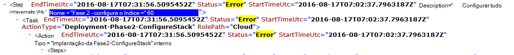

<properties
    pageTitle="Execute novamente uma implantação de uma etapa que falhou | Microsoft Azure"
    description="Se você tiver uma falha durante a implantação, você pode tentar as seguintes etapas para executar novamente a implantação de onde ele falha."
    services="azure-stack"
    documentationCenter=""
    authors="ErikjeMS"
    manager="byronr"
    editor=""/>

<tags
    ms.service="azure-stack"
    ms.workload="na"
    ms.tgt_pltfrm="na"
    ms.devlang="na"
    ms.topic="get-started-article"
    ms.date="09/26/2016"
    ms.author="erikje"/>
    
# Execute novamente uma implantação de uma etapa que falhou
  
Se você tiver uma falha durante a implantação, você pode tentar as seguintes etapas para executar novamente a implantação de onde ele falha.

## Localizar a falha

Anote a falha, especificamente a parte que destaca em qual etapa invocação falha. Por exemplo,

**2016-08-17 00:30:57 erro 1 > 1 > ação: invocação da etapa 60.140.143 falhou. Interrompendo invocação do plano de ação.**

Esta é a etapa de implantação onde você iniciará o reexecutar da implantação.

## Encontrar mais detalhes sobre a falha

Se desejar mais detalhes do erro, encontre associada **Resumo. AAAA-MM-DD.tt.N.log.xml** no **C:\CloudDeployment\Logs\* * pasta.
Pesquisar a cadeia de caracteres "Erro" e siga-la por meio de saída, até ver uma grande quantidade de texto de XML não-formatado que contém a mensagem de erro (Esta seção com frequência coincide com a última instância da cadeia de caracteres "Erro"). Por exemplo:

Você também pode usar essas informações para controlar a etapa execute, acompanhar os números "Índice" do último erro. Na imagem acima, você pode ver (começando da parte inferior): 143, 140 e, em seguida, se rolam para cima, você verá 60:

Colocar isso tudo juntos (agora de cima para baixo), você recebe 60.140.143, assim como na saída do console PS da falha (conforme visto na seção "Localizar o falha" acima).

## Execute novamente a implantação em uma etapa específica

Agora que você tem a etapa que a implantação falhou no, você pode tentar uma - reexecutar da implantação dessa etapa.

> [AZURE.IMPORTANT] Os seguintes comandos devem ser executados pelo usuário correto, no contexto com a falha que ocorreu. Se a falha ocorreu antes do HOST foi adicionado ao domínio, execute estas etapas como a conta administrador local. Se a falha ocorreu após o HOST foi adicionado ao domínio, execute estas etapas como administrador do domínio (azurestack\azurestackadmin).

### Execute o comando chamar EceAction

1. Um elevado PS no console do, importe os seguintes módulos:

        Import-Module C:\CloudDeployment\CloudDeployment.psd1 -Force
        Import-Module C:\CloudDeployment\ECEngine\EnterpriseCloudEngine.psd1 -Force 

2. Em seguida, execute o seguinte comando (exemplo acima usado aqui):

        Invoke-EceAction -RolePath Cloud -ActionType Deployment -Start 60.140.143 -Verbose

3.  Isso iniciará a implantação da etapa identificada pelo - início parâmetro do comando chamar EceAction

### Resultados de um - reexecutar /-início

Independentemente da opção escolher, a implantação começará novamente na especificado - comece parâmetro.

1.  Se a falha for recuperável, a implantação continuará até a sua conclusão.

2.  Se a implantação falhar novamente...
    
    - no mesmo lugar: falha provavelmente não é recuperável e investigações é necessária.

    - um novo local após onde ele falha desta vez: você pode tentar essas mesmas etapas para iniciá-lo entrar novamente.

    - um novo local antes de onde ele falha desta vez: algo deu errado com uma chamada idempotentes, que exige o investigação.

## Próximas etapas

[Conectar-se a pilha Azure](azure-stack-connect-azure-stack.md)

