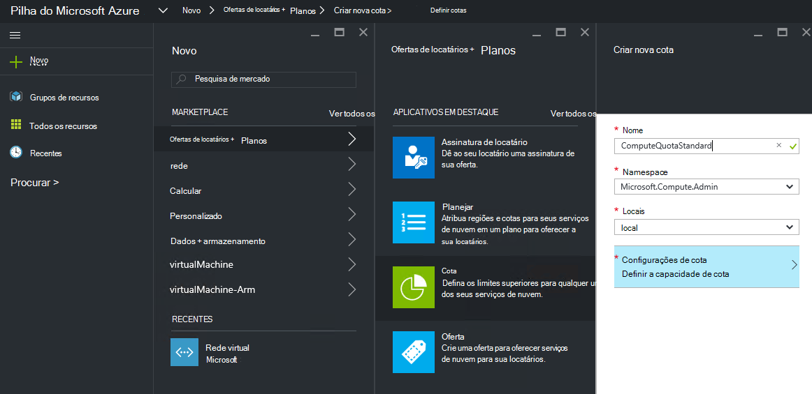
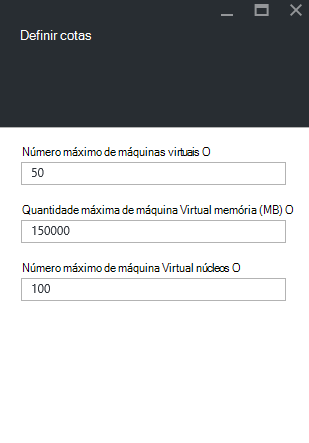
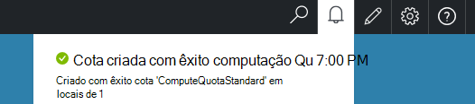

<properties
    pageTitle="Cotas em pilha Azure | Microsoft Azure"
    description="Os administradores definir cotas para restringir a quantidade máxima de recursos que locatários têm acesso ao."
    services="azure-stack"
    documentationCenter=""
    authors="mattmcg"
    manager="byronr"
    editor=""/>

<tags
    ms.service="azure-stack"
    ms.workload="na"
    ms.tgt_pltfrm="na"
    ms.devlang="na"
    ms.topic="get-started-article"
    ms.date="09/26/2016"
    ms.author="mattmcg"/>

# Definir cotas em pilha do Azure

As cotas de definem os limites de recursos que uma assinatura de locatário pode provisionar ou consumir. Por exemplo, uma cota pode permitir que um locatário criar VMs até cinco. Para adicionar um serviço para um plano, o administrador deve configurar as definições de cota para esse serviço.

As cotas são configuráveis por serviço e por local, permitindo que os administradores fornecem controle granular sobre o consumo de recursos. Os administradores podem criar um ou mais recursos de cota e as associe planos, significando que eles possam fornecer ofertas diferenciadas para seus serviços. Cotas de um serviço específico podem ser criadas da lâmina de administração do **Provedor de recursos** para esse serviço.

Um locatário que assina uma oferta que contém vários planos pode usar todos os recursos que estão disponíveis em cada plano.

## Para criar uma cota de IaaS

1.  Em um navegador, vá para [https://portal.azurestack.local](https://portal.azurestack.local/).

    Entre portal do Azure pilha como administrador (usando as credenciais que você forneceu durante a implantação).

2.  Selecione **novo**e selecione **cota**.

3.  Selecione o primeiro serviço para o qual você deseja criar uma cota. Para uma cota de IaaS, siga estas etapas para os serviços de computação, rede e armazenamento.
Neste exemplo, primeiro criamos uma cota para o serviço de computação. Na lista de **Namespace** , selecione o namespace **Microsoft.Compute.Admin** .

    > 

4.  Escolha o local onde a cota é definida (por exemplo, 'local').

5.  No item de **Configurações de cota** , ele diz: **definir a capacidade de cota**. Clique neste item para definir as configurações de cota.

6.  Na lâmina **Definir cotas** , você ver todos os recursos de computação para o qual você pode configurar limites. Cada tipo tem um valor padrão que associado a ela. Você pode alterar esses valores ou você pode selecionar o botão **Okey** na parte inferior da lâmina para aceitar os padrões.

    > 

7.  Depois de ter configurado os valores e clicado **Okey**, o item **Configurações de cota** é exibido como **configurado**. Clique em **Okey** para criar o recurso de **cota** .

    Você deve ver uma notificação indicando que o recurso de cota está sendo criado.

8.   Após o conjunto de cota tiver sido criado com êxito, você receberá uma notificação de segunda. A cota de serviço de computação agora está pronta para ser associadas a um plano. Repita essas etapas com os serviços de rede e armazenamento, e estiver pronto para criar um plano de IaaS!

    >   

## Calcular tipos de cota

|**Tipo**                    |**Valor padrão**| **Descrição**|
|--------------------------- | ------------------------------------|------------------------------------------------------------------|
|Número máximo de máquinas virtuais   |50|O número máximo de máquinas virtuais que pode criar uma assinatura neste local. |
|Número máximo de cores de máquina virtual              |100|O número máximo de cores que pode criar uma assinatura neste local (por exemplo, uma máquina virtual A3 tem quatro cores).|
|Quantidade máxima de memória de máquina virtual (GB)         |150|A quantidade máxima de RAM que pode ser provisionado em megabytes (por exemplo, uma máquina virtual A1 consome 1,75 GB de RAM).|

> [AZURE.NOTE] Calcule as cotas não são aplicadas nesta visualização técnica.

## Tipos de cota de armazenamento

|**Item**                           |**Valor padrão**   |**Descrição**|
|---------------------------------- |------------------- |-----------------------------------------------------------|
|Capacidade máxima (GB)              |500                 |Capacidade de armazenamento total que pode ser consumida por uma assinatura neste local.|
|Número total de contas de armazenamento   |20                  |O número máximo de contas de armazenamento que pode criar uma assinatura neste local.|

## Tipos de cota de rede

|**Item**                                                   |**Valor padrão**   |**Descrição**|
|----------------------------------------------------------| ------------------- |--------------------------------------------------------------------------------------------------------------------------------------------------------------------|
| IPs público max                         |50                  |O número máximo de IPs público que pode criar uma assinatura neste local. |
| Redes virtuais max                   |50                  |O número máximo de redes virtuais que pode criar uma assinatura neste local. |
| Gateways de rede virtual max           |1                   |O número máximo de gateways de rede virtual (VPN Gateways) que pode criar uma assinatura neste local. |
| Máximo de conexões de rede                |2                   |O número máximo de conexões de rede (ponto a ponto ou to-site) que pode criar uma assinatura em todos os gateways de rede virtual neste local. |
| Balanceadores de carga de max                     |50                  |O número máximo de balanceadores de carga que pode criar uma assinatura neste local. |
| Max NICs                               |100                 |O número máximo de interfaces de rede que pode criar uma assinatura neste local. |
| Grupos de segurança de rede max            |50                  |O número máximo de grupos de segurança de rede que pode criar uma assinatura neste local. |
