<properties
    pageTitle="Implantar o provedor de recursos do SQL Server na pilha do Azure | Microsoft Azure"
    description="Etapas detalhadas para implantar um adaptador de provedor de recursos de servidor SQL na pilha do Azure."
    services="azure-stack"
    documentationCenter=""
    authors="Dumagar"
    manager="byronr"
    editor=""/>

<tags
    ms.service="multiple"
    ms.workload="na"
    ms.tgt_pltfrm="na"
    ms.devlang="na"
    ms.topic="article"
    ms.date="09/26/2016"
    ms.author="dumagar"/>

# Implantar o adaptador de provedor de recurso do SQL Server na pilha Azure

> [AZURE.NOTE] As informações a seguir se aplica somente implantações de TP1 de pilha do Azure.

Utilize este artigo para acompanhar as etapas detalhadas para configurar o adaptador de provedor do SQL Server recurso na pilha Azure prova de conceito (VDC). Consulte [usar bancos de dados do SQL Azure pilha](azure-stack-sql-rp-deploy-short.md) entender a arquitetura e recursos do provedor.

## Etapas de configuração antes de implantar

Antes de implantar o provedor de recursos, você precisa:

- Tem uma imagem do Windows Server padrão com .NET 3.5
- Desativar a segurança aprimorada do Internet Explorer (IE)
- Instalar a versão mais recente do PowerShell do Azure

### Criar uma imagem do Windows Server, incluindo .NET 3.5

Se você baixou os bits de pilha Azure após 23/2/2016 porque a imagem padrão do Windows Server 2012 R2 base inclui framework .NET 3.5 neste download e versões posteriores, você pode pular esta etapa.

Se você baixou antes de 23/2/2016, você precisa criar um VHD de data center do Windows Server 2012 R2 com imagem de .NET 3.5 e conjunto é como a imagem padrão no repositório de imagens de plataforma.

### Desativar IE enhanced segurança e habilitar cookies

Para implantar um provedor de recursos, você executar o ambiente de script integrado do PowerShell (ISE) como administrador, então você precisa permitir cookies e JavaScript no perfil do Internet Explorer que você usa para entrar no Active Directory do Azure para suplementos sinal de administrador e usuário.

**Para desativar o IE segurança aprimorada:**

1. Entrar no computador do Azure pilha prova de conceito (VDC) como AzureStack/administrador e, em seguida, abra o Gerenciador de servidor.

2. Desative **A configuração de segurança aprimorada IE** para administradores e usuários.

3. Entre máquina virtual **ClientVM.AzureStack.local** como administrador e, em seguida, abra o Gerenciador de servidor.

4. Desative **A configuração de segurança aprimorada IE** para administradores e usuários.

**Para habilitar cookies:**

1. Na tela Iniciar do Windows, clique em **todos os aplicativos**, clique em **Acessórios do Windows**, clique com botão direito **Do Internet Explorer**, aponte para **mais**e clique em **Executar como administrador**.

2. Se solicitado, marque **uso recomendado segurança**e clique em **Okey**.

3. No Internet Explorer, clique nas **Ferramentas (ícone de engrenagem e)** &gt; **Opções da Internet** &gt; guia **privacidade** .

4. Clique em **Avançado**, certifique-se de que ambos os botões **Aceitar** são selecionados, clique **Okey**e clique em **Okey** novamente.

5. Feche o Internet Explorer e reinicie o PowerShell ISE como administrador.

### Instalar uma versão compatível do Azure pilha do PowerShell do Azure

1. Desinstale qualquer Azure PowerShell existentes de sua máquina virtual cliente.

2. Entrar na máquina Azure pilha VDC como AzureStack/administrador.

3. Usando a área de trabalho remota, entre na máquina virtual de **ClientVM.AzureStack.local** como administrador.

4. Abra o painel de controle, clique em **desinstalar um programa** &gt; clique **Azure PowerShell** &gt; clique em **desinstalar**.

5. [Baixar o PowerShell Azure mais recente que ofereça suporte a pilha do Azure](http://aka.ms/azstackpsh) e instalá-lo.

    Após a instalação do PowerShell, você pode executar essa verificação script do PowerShell para certificar-se de que você pode conectar a sua instância do Azure pilha (uma página da web de login deve aparecer).

## Inicialização a implantação de provedor de recurso PowerShell

1. Conectar-se a área de trabalho remota do Azure pilha VDC a clientVm.AzureStack.Local e entrar como azurestack\\azurestackuser.

2. [Baixar os binários SQLRP](http://aka.ms/massqlrprfrsh) arquivo. Talvez você precise remover o bloco de segurança de download de Internet clicando no arquivo, selecionando **Propriedades** e na guia **Geral** , escala **Desbloquear**, **Okey**. Isso deve impedir exceções 'Não foi possível carregar arquivo ou assembly' relacionadas a DeploymentTelemetry.dll e as exceções de implantação de rastreamento subsequentes.

3. Extrair os arquivos para d:\\SQLRP.

4. Executar o d:\\SQLRP\\Bootstrap.cmd arquivo como um administrador (azurestack\\administrador).

    Isso abre o arquivo de Bootstrap.ps1 com o PowerShell ISE.

5. Quando a janela do PowerShell ISE completa o carregamento, clique no botão Reproduzir ou pressione F5.

    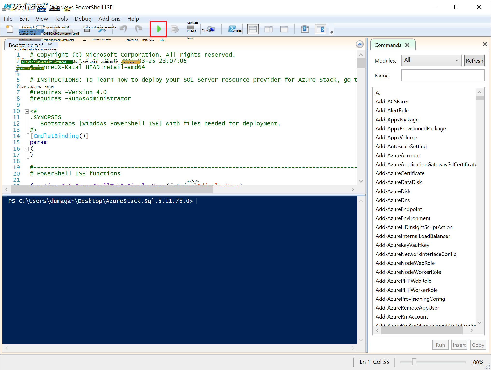

    Duas guias principais carregará, cada um contendo todos os scripts e arquivos que você precisa implantar o provedor de recursos.

## Preparar os pré-requisitos

Clique na guia de **Preparação pré-requisitos** para:

- Criar certificados necessários
- Carregar artefatos para uma conta de armazenamento na pilha do Azure
- Publicar itens da Galeria

### Criar os certificados necessários
Esse script **New-SslCert.ps1** adiciona a \_. Certificado SSL de AzureStack.local.pfx a d:\\SQLRP\\pré-requisitos\\BlobStorage\\pasta do contêiner. O certificado protege a comunicação entre o provedor de recursos e a instância local do Gerenciador de recursos do Azure.

1. Na guia principal **Pré-requisitos preparar** , clique na guia **New-SslCert.ps1** e executá-lo.

2. No prompt que aparece, digite uma senha PFX que protege a chave particular e **anote essa senha**. Você precisará-la mais tarde.

### Carregar todos os artefatos para uma conta de armazenamento na pilha do Azure

1. Clique na guia de **Carregamento-Microsoft.Sql-RP.ps1** e executá-lo.

2. Na caixa de diálogo de solicitação do Windows PowerShell credencial, digite as credenciais de administrador de serviço do Azure pilha.

3. Quando for solicitado a ID do Azure Active Directory locatário, digite seu nome de domínio totalmente qualificado do Active Directory do Azure locatário: por exemplo, microsoftazurestack.onmicrosoft.com.

    Uma janela pop-up solicita credenciais.

    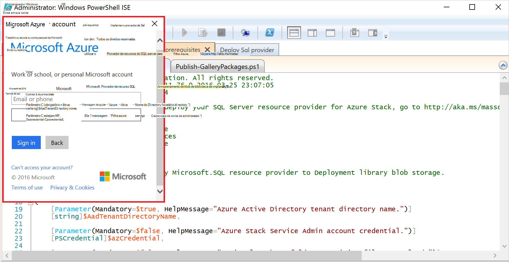

    > [AZURE.TIP] Se o pop-up não aparecer, você que ainda não desligado IE enhanced segurança para habilitar o JavaScript neste computador e o usuário ou você ainda não aceitou cookies no IE. Consulte [Configurar etapas antes de implantar](#set-up-steps-before-you-deploy).

4. Digite suas credenciais de administrador de serviço de pilha do Azure e clique em **Entrar**.

### Publicar itens da Galeria para a criação de recurso posterior

Selecione a guia **Publicar GalleryPackages.ps1** e executá-lo. Esse script adiciona dois itens de marketplace Marketplace do portal do Azure pilha VDC que você pode usar para implantar recursos de banco de dados como itens de marketplace.

## Implantar o provedor de recursos do SQL Server máquina virtual

Agora que você tiver preparado a VDC de pilha Azure com os certificados necessários e os itens de marketplace, você pode implantar um provedor de recursos do SQL Server. Clique na guia **provedor implantar SQL** para:

   - Forneça os valores em um arquivo JSON que referencia o processo de implantação
   - Implantar o provedor de recursos
   - Atualizar o DNS local
   - Registrar o adaptador de provedor de recurso do SQL Server

### Forneça os valores no arquivo JSON

Clique em **Microsoft.Sqlprovider.Parameters.JSON**. Este arquivo tem parâmetros que o modelo do Gerenciador de recursos do Azure precisa implantar corretamente em pilha do Azure.

1. Preencha os parâmetros **vazio** no arquivo JSON:

    - Certifique-se de que você forneça o **adminusername** e **adminpassword** para a máquina virtual provedor de recursos do SQL:

        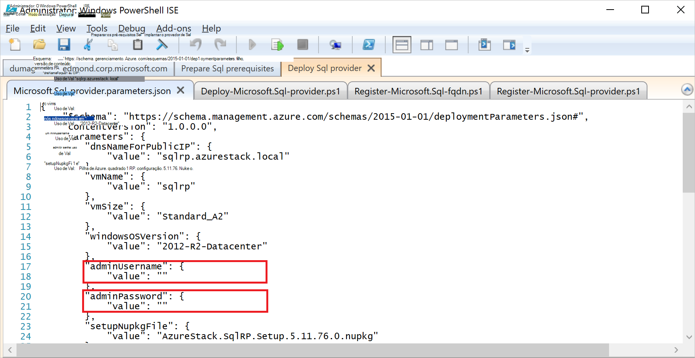

    - Certifique-se de que você fornece a senha para o parâmetro de **SetupPfxPassword** que você fez uma anotação na etapa [Preparar prequisites](#prepare-prerequisites) :

    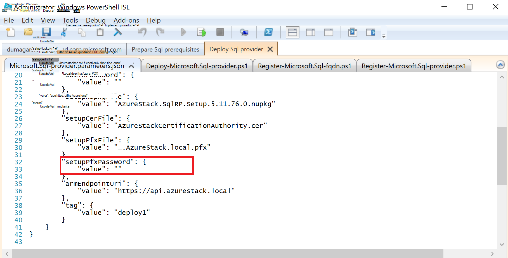

2. Clique em **Salvar** para salvar o arquivo de parâmetro.

### Implantar o provedor de recursos

1. Clique na guia **implantar-Microsoft.sql-provider.PS1** e execute o script.
2. Digite seu nome de locatário do Azure Active Directory quando solicitado.
3. Na janela pop-up, envie suas credenciais de administrador de serviço do Azure pilha.

Toda a implantação pode demorar entre 25 e 55 minutos em algumas POCs de pilha Azure altamente utilizados. As etapas mais será a extensão de configuração de estado desejado (DSC) e a execução do PowerShell, que é a etapa final. Cada pode levar minutos de 10 a 25.

### Atualizar o DNS local

1. Clique na guia **Register-Microsoft.SQL-fqdn.ps1** e execute o script.
2. Quando solicitado para ID do Azure Active Directory locatário, seu nome de domínio totalmente qualificado do Active Directory do Azure locatário de entrada: por exemplo, **microsoftazurestack.onmicrosoft.com**.

### Registrar o provedor de recursos RP SQL##

1. Clique na guia **Register-Microsoft.SQL-provider.ps1** e execute o script.

2. Quando solicitado para credenciais, use os seguintes valores de nome de usuário e senha:

   - **sqlRpUsername**
   - **sqlRpPassw0rd**

   > [AZURE.IMPORTANT] Estes são os valores *literal* que você precisa digitar quando solicitado a fornecer credenciais. Esses não são espaços reservados. * *Fazer *não* tipo * * o nome que você salvou no arquivo de parâmetros antes de implantar a máquina virtual.

## Verifique se a implantação usando o Portal de pilha do Azure

1. Saia do ClientVM e entrar novamente como **AzureStack\AzureStackUser**.

2. Na área de trabalho, clique em **Portal do Azure pilha VDC** e entrar no portal do como administrador do serviço.

3. Verificar se a implantação foi bem-sucedida. Clique em **Procurar** &gt; **Grupos de recursos** &gt; clique em grupo de recursos que você usou (o padrão é **SQLRP**) e, em seguida, certifique-se de que a parte essentials da lâmina (metade superior) lê **implantação bem-sucedida**.

      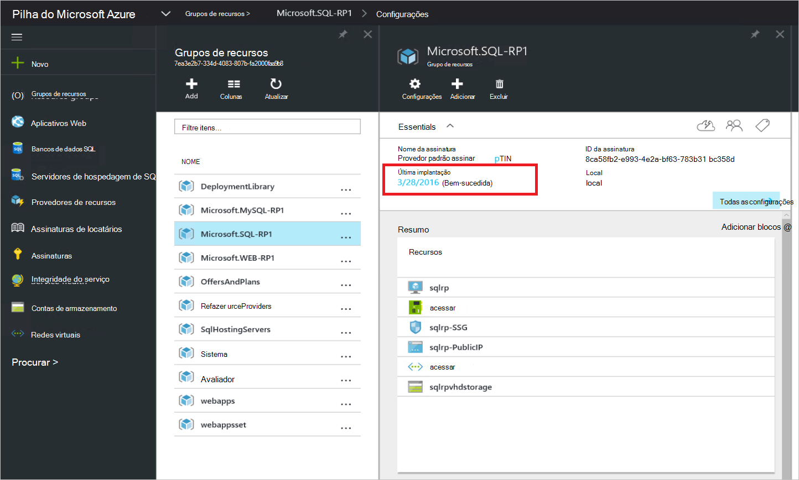

4. Verificar se o registro foi bem-sucedida. Clique em **Procurar** &gt; **provedores de recursos**e, em seguida, procure **Local do SQL**:

      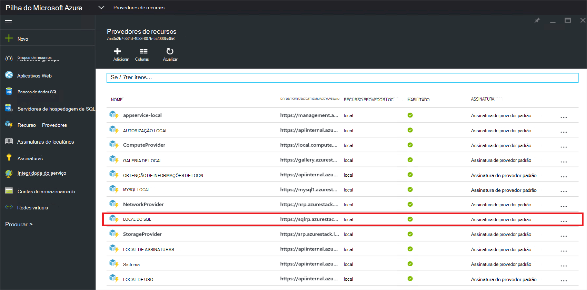

## Fornecer capacidade para seu provedor de recursos do SQL, conectando a um SQL server hospedagem

1. Entre portal do Azure pilha VDC como um administrador de serviço

2. Clique em **recurso provedores** &gt; **Local do SQL** &gt; **vá para gerenciamento de recursos de provedor** &gt; **servidores** &gt; **Adicionar**.

    A lâmina de **Servidores de hospedagem de SQL** é onde você pode conectar o provedor de recursos do SQL Server para reais instâncias do SQL Server que servir como back-end do provedor de recursos.

    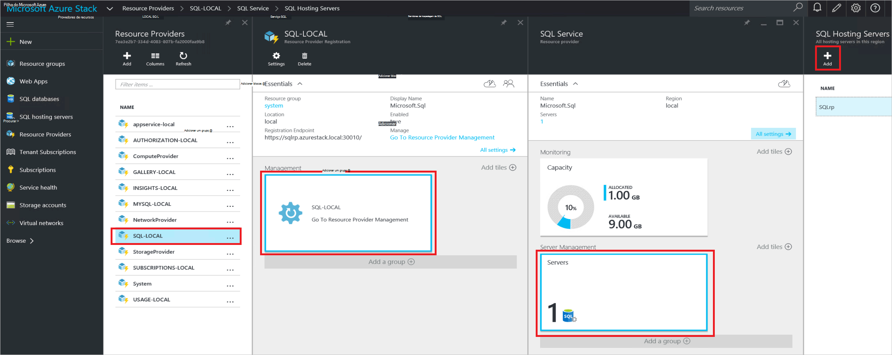

3. Preencha o formulário com os detalhes de conexão da instância do SQL Server. Por padrão, um SQL Server pré-configurado chamado "SQLRP" com o nome de usuário do administrador "sa" e a senha que você destacados no parâmetro "adminpassword" nos parâmetros de que JSON está em execução na máquina virtual.

## Criar seu primeiro banco de dados do SQL para testar sua implantação

1. Entre no portal do Azure pilha VDC como administrador de serviço.

2. Clique em **Procurar** &gt; **bancos de dados SQL** &gt; **Adicionar**
  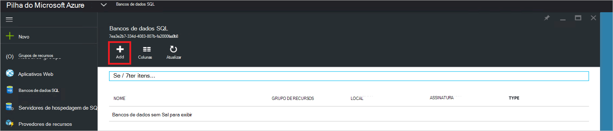

3. Preencha o formulário com detalhes de banco de dados, incluindo um **Nome de servidor**, **Logon de administrador do servidor**e **senha** para um novo *servidor virtual* na lâmina **Novo servidor** .

    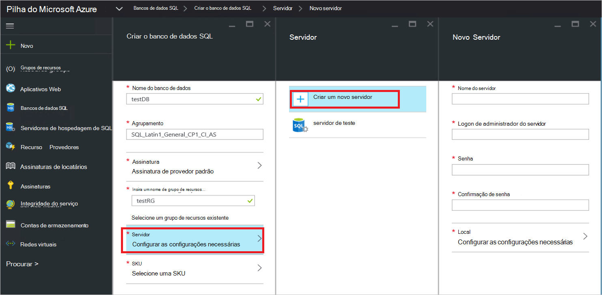

    O servidor virtual é uma construção artificial. Ele não mapear para o SQL Server em si, mas em vez disso manifestos por meio de username dentro a cadeia de conexão, que gera o provedor de recursos no final deste processo. **Observação a senha que você digitar separadamente para o servidor virtual**. O portal nunca mostrará a senha.

4. Você será solicitado a escolher um nível de preços para seu banco de dados.

    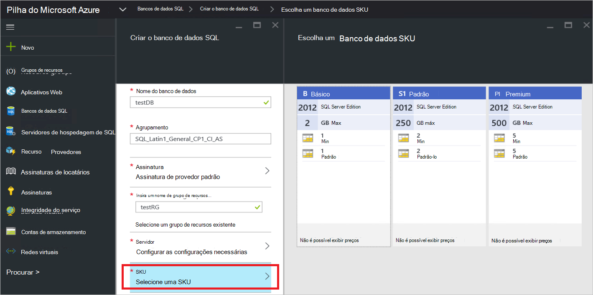

    Níveis não estão implementadas nesta versão, mas seu consumo é controlado pelo Resource Manager do Azure como uma forma de apresentar a diferenciação, que você pode criar no imposição de cota etc.

5. Submeter o formulário e aguarde a implantação ser concluída.

6. Na lâmina resultante, observe o campo "Cadeia de Conexão". Você pode usar essa cadeia de caracteres em qualquer aplicativo que requer acesso ao SQL Server (por exemplo, um aplicativo web) na sua pilha do Azure.

    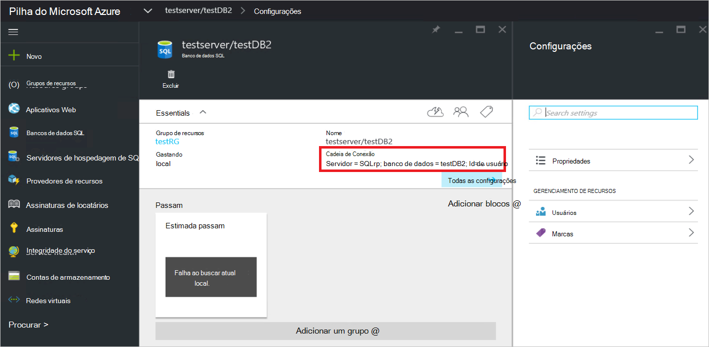

## Próximas etapas

Experimente outros [Serviços de PaaS](azure-stack-tools-paas-services.md) como o [provedor de recursos do servidor MySQL](azure-stack-mysql-rp-deploy-short.md) e o [provedor de recursos de aplicativos Web](azure-stack-webapps-deploy.md).
