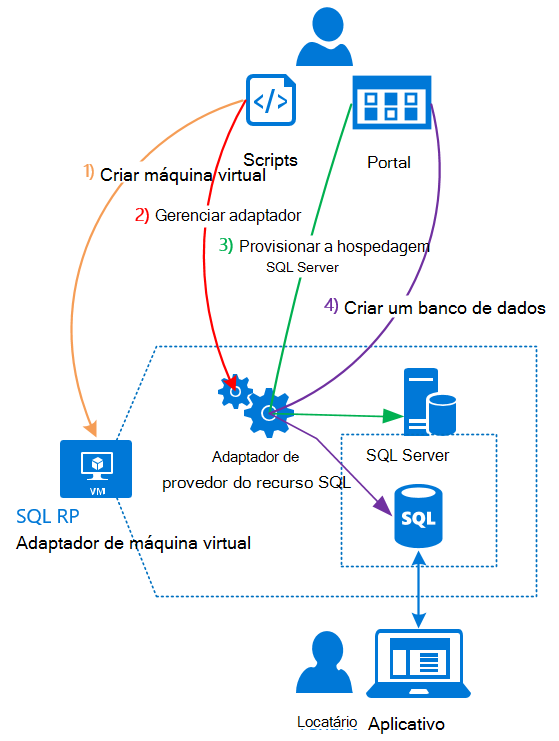

<properties
    pageTitle="Usando bancos de dados do SQL Azure pilha | Microsoft Azure"
    description="Saiba como você pode implantar bancos de dados SQL como um serviço na pilha do Azure e as etapas rápidas para implantar o adaptador de provedor de recursos do SQL Server."
    services="azure-stack"
    documentationCenter=""
    authors="Dumagar"
    manager="byronr"
    editor=""/>

<tags
    ms.service="multiple"
    ms.workload="na"
    ms.tgt_pltfrm="na"
    ms.devlang="na"
    ms.topic="article"
    ms.date="09/26/2016"
    ms.author="dumagar"/>

# Usar bancos de dados do SQL Azure pilha

> [AZURE.NOTE] As informações a seguir se aplica somente implantações de TP1 de pilha do Azure.

Use o adaptador de provedor de recursos do SQL Server para expor bancos de dados SQL como um serviço de pilha do Azure. Depois de instalar o provedor de recursos, você e seus usuários podem criar bancos de dados para aplicativos de nuvem nativos, site que são baseados no SQL e cargas de trabalho que são baseadas no SQL sem precisar provisionar uma máquina virtual (VM) que hospeda o SQL Server cada vez.

Como o provedor de recursos não tem todos os recursos do Azure SQL Database durante a prova de conceito (VDC), este artigo começa com uma visão geral da arquitetura de provedor do recurso. Depois que você obtenha uma rápida visão geral das etapas para configurar o provedor de recursos, com links para as etapas mais detalhadas em [implantar o adaptador provedor recurso de banco de dados do SQL Azure pilha VDC](azure-stack-sql-rp-deploy-long.md).

## Arquitetura de adaptador de provedor de recursos do SQL Server
O provedor de recursos não oferece o banco de dados, recursos de gerenciamento do Azure SQL Database. Por exemplo, pools elástica banco de dados e a capacidade de desempenho de banco de dados de discagem para cima e para baixo instantâneos não estão disponíveis. No entanto, o provedor de recursos suporta o mesmo criar, ler, atualizar e operações de exclusão (CRUD) disponíveis no Azure SQL Database.

O provedor de recursos é composto por três componentes:

- **Adaptador de provedor do SQL o recurso máquina virtual**, que abrange o processo de provedor de recursos e os servidores que hospedam o SQL Server.
- **O provedor de recursos em si**, que processa solicitações de provisionamento e expõe recursos de banco de dados.
- **Servidores que hospedam o SQL Server**, que fornecem capacidade para bancos de dados.

O seguinte diagrama conceitual mostra esses componentes e as etapas que você percorrer quando você implantar o provedor de recursos, configurar um servidor que hospeda o SQL Server e, em seguida, cria um banco de dados.

## Etapas rápidas para implantar o provedor de recursos
Use estas etapas se você já estiver familiarizado com o Azure pilha. Se desejar mais detalhes, siga os links em cada seção ou ir direto para [implantar o adaptador provedor recurso de banco de dados do SQL Azure pilha VDC](azure-stack-sql-rp-deploy-long.md).

1.  Certifique-se de que concluir todas as [etapas antes de implantar de configuração](azure-stack-sql-rp-deploy-long.md#set-up-steps-before-you-deploy) o provedor de recursos:

  - Framework .NET 3.5 já está configurada na imagem base do Windows Server. (Se você baixou os bits de pilha Azure após 23 de fevereiro de 2016, você pode ignorar esta etapa.)
  - [Uma versão do PowerShell do Azure que é compatível com o Azure pilha está instalada](http://aka.ms/azStackPsh).
  - Nas configurações de segurança do Internet Explorer na ClientVM, [cookies e segurança aprimorada está desativada do Internet Explorer estão habilitados](azure-stack-sql-rp-deploy-long.md#Turn-off-IE-enhanced-security-and-enable-cookies).

2. [Baixar o arquivo de binários do SQL Server RP](http://aka.ms/massqlrprfrsh) e extraia-o para o ClientVM no seu VDC de pilha do Azure.

3. [Executar bootstrap.cmd e scripts](azure-stack-sql-rp-deploy-long.md#Bootstrap-the-resource-provider-deployment-PowerShell-and-Prepare-for-deployment).

    Um conjunto de scripts é agrupado por duas guias principais abertas no PowerShell Integrated Scripting ambiente (ISE). Executar todos os scripts carregados em sequência da esquerda para a direita em cada guia.

    1. Execute scripts na guia de **preparação** da esquerda para a direita para:

        - Crie um certificado curinga para proteger a comunicação entre o provedor de recursos e o Gerenciador de recursos do Azure.
        - Carregue os certificados e todos os outros artefatos para uma conta de armazenamento para pilha do Azure.
        - Publica pacotes de galeria para que você pode implantar SQL e recursos por meio da Galeria.

        > [AZURE.IMPORTANT] Se qualquer um dos scripts congelar sem motivo evidente depois que você enviar seu locatário do Active Directory do Azure, suas configurações de segurança podem estar bloqueando uma DLL necessário para a implantação executar. Para resolver esse problema, procure o Microsoft.AzureStack.Deployment.Telemetry.Dll na sua pasta de provedor do recurso, clique sobre ela, clique em **Propriedades**e depois marque **Desbloquear** na guia **Geral** .

    1. Execute scripts na guia **implantar** da esquerda para a direita para:

        - [Implantar uma máquina virtual](azure-stack-sql-rp-deploy-long.md#Deploy-the-SQL-Server-Resource-Provider-VM) que hospeda o seu provedor de recursos e o SQL Server. Esse script faz referência a um arquivo de parâmetro JSON, que você precisa atualizar com alguns valores antes de executar o script.
        - [Registrar um registro DNS local](azure-stack-sql-rp-deploy-long.md#Update-the-local-DNS) que mapeia para seu provedor de recurso máquina virtual.
        - [Registrar seu provedor de recurso](azure-stack-sql-rp-deploy-long.md#Register-the-SQL-RP-Resource-Provider) com o Gerenciador de recursos local do Azure.

        > [AZURE.IMPORTANT] Todos os scripts presumem que a imagem do sistema operacional base preenche os pré-requisitos (.NET 3.5 instalado, JavaScript e cookies habilitados a ClientVM e uma versão compatível do Azure PowerShell instalado). Se você receber erros quando você executar os scripts, confira o que você atendida os pré-requisitos.

6. [Conectar o provedor de recursos em um servidor que está hospedando o SQL Server](#Provide-capacity-to-your-SQL-Resource-Provider-by-connecting-it-to-a-hosting-SQL-server) no portal do Azure pilha. Clique em **Procurar** &gt; **provedores de recursos** &gt; **SQLRP** &gt; **vá para gerenciamento de recursos de provedor** &gt; **servidores** &gt; **Adicionar**.

    Use "sa" para o nome de usuário e a senha que você usou quando você implantou o provedor de recursos máquina virtual.

7. Para [testar seu novo provedor de recursos do SQL Server](/azure-stack-sql-rp-deploy-long.md#create-your-first-sql-database-to-test-your-deployment), implante um banco de dados do SQL no portal do Azure pilha. Clique em **criar** &gt; **personalizado** &gt; **banco de dados do SQL Server**.

Isso deve obter seu provedor de recursos do SQL Server e executando no cerca de 45 minutos (dependendo do seu hardware).
