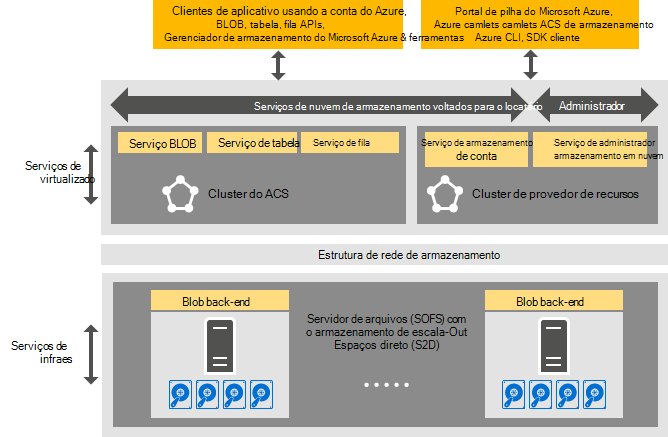

<properties
    pageTitle="Introdução ao armazenamento do Azure consistente | Microsoft Azure"
    description="Saiba mais sobre o armazenamento do Azure consistente"
    services="azure-stack"
    documentationCenter=""
    authors="AniAnirudh"
    manager="darmour"
    editor=""/>

<tags
    ms.service="azure-stack"
    ms.workload="na"
    ms.tgt_pltfrm="na"
    ms.devlang="na"
    ms.topic="get-started-article"
    ms.date="09/26/2016"
    ms.author="anirudha"/>

# Introdução ao armazenamento do Azure consistentes
Armazenamento do Azure consistente é o conjunto de serviços de nuvem do armazenamento na pilha do Microsoft Azure. Armazenamento do Azure consistente fornece blob, tabela, fila e funcionalidade de gerenciamento de conta com uma semântica Azure consistente. Ele também fornece funcionalidade para ajudar a gerenciar serviços de armazenamento de um administrador de nuvem. Este artigo apresenta o armazenamento do Azure consistente e discute como serviços de nuvem do armazenamento na pilha do Azure complementam perfeitamente os sofisticados [recursos de armazenamento definidos pelo software no Windows Server 2016](https://blogs.technet.microsoft.com/windowsserver/2016/04/14/ten-reasons-youll-love-windows-server-2016-5-software-defined-storage/).

Armazenamento do Azure consistente oferece as seguintes amplas categorias de funcionalidade:

- **BLOBs**: página blobs, bloquear blobs e acrescentar blobs com   [consistente Azure blob](https://msdn.microsoft.com/library/azure/dd179355.aspx#Anchor_1) 
   comportamento

- **Tabelas**: entidades, partições e outras propriedades de tabela com   [tabela Azure consistente](https://msdn.microsoft.com/library/azure/dd179355.aspx#Anchor_3) 
   comportamento

- **Filas**: mensagens confiáveis e persistentes e filas com   [fila Azure consistente](https://msdn.microsoft.com/library/azure/dd179355.aspx#Anchor_2) 
   comportamento

- **Contas**: gerenciamento de recursos de conta com   [conta Azure consistente](https://azure.microsoft.com/documentation/articles/storage-create-storage-account/) 
   comportamento para contas de armazenamento geral provisionado por meio do [modelo de implantação do Gerenciador de recursos do Azure](https://azure.microsoft.com/documentation/articles/resource-manager-deployment-model/)

- **Administração**: gerenciamento de serviços de armazenamento interno de armazenamento do Azure consistentes e voltados para o locatário (discutido em outros artigos)

## Arquitetura de armazenamento do Azure consistentes

Figura 1. Armazenamento do Azure consistente: modo de exibição de solução

## Armazenamento do Azure consistente virtualizado clusters e serviços

A arquitetura de armazenamento do Azure consistente, todos os serviços de armazenamento acessível com o administrador ou Locatário são virtualizados. Isto é, eles executados no serviço gerenciados pelo provedor e altamente disponível que VMs com base em funcionalidade de [Hyper-V](https://technet.microsoft.com/library/dn765471.aspx) no [Windows Server 2016](http://www.microsoft.com/server-cloud/products/windows-server-2016/).
Embora VMs estão altamente disponíveis com base na tecnologia de [Cluster de Failover do Windows Server](https://technet.microsoft.com/library/dn765474.aspx) , os serviços de armazenamento virtualizado Azure consistente próprios são agrupada convidado altamente disponíveis serviços baseados na [tecnologia do Azure serviço tecidos](http://azure.microsoft.com/campaigns/service-fabric/).

Armazenamento do Azure consistente utiliza dois clusters de serviço tecidos em uma implantação do Azure pilha.
O serviço de provedor de recursos de armazenamento é implantado em um cluster de estrutura de serviço ("RP cluster") que também é compartilhado por outros serviços de provedores de recurso básico. O restante do armazenamento virtualizado serviços de caminho de dados, incluindo o Blob, tabela e fila serviços-- são hospedados em um cluster de serviço tecidos segundo ("Azure consistente armazenamento cluster").

## Serviço BLOB e definidos pelo software de armazenamento

O Blob finalizar serviço novamente, por outro lado, executa diretamente em nós do cluster de [Servidor de arquivos de escala-Out](https://technet.microsoft.com/library/hh831349.aspx) . A arquitetura de solução de pilha do Azure, servidor de arquivos de escala-Out se baseia o [Armazenamento espaços Direct](https://technet.microsoft.com/library/mt126109.aspx)-cluster de failover com base, nada compartilhado. Figura 1 representa os principais serviços de componente de armazenamento do Azure consistentes e seu modelo de implantação distribuída. Como você pode ver no diagrama, o armazenamento do Azure consistente incluído com os recursos de armazenamento definido pelo software existentes no Windows Server 2016. Nenhum hardware especial é necessário para o armazenamento do Azure consistente além esses requisitos de plataforma do Windows Server.

## Farm de armazenamento

Farm de armazenamento é a coleção de infraestrutura de armazenamento, recursos e serviços de back-end que fornecem juntos voltados para o administrador e voltados para o locatário serviços de armazenamento do Azure consistente em uma implantação do Azure pilha. Especificamente, o Farm de armazenamento inclui o seguinte:

- Hardware de armazenamento (por exemplo, nós de servidor de arquivos de escala-Out, discos)

- Recursos de estrutura de armazenamento (por exemplo, compartilhamentos SMB)

- Serviços de estrutura de serviço relacionados a armazenamento (por exemplo, ponto de extremidade serviço Blob desativar o Azure consistente cluster de armazenamento)

- Serviços relacionados ao armazenamento que são executadas em nós de servidor de arquivos de escala-Out (por exemplo, o serviço de Blob)

## Cenários de uso de armazenamento IaaS e PaaS

Blobs de página de armazenamento do Azure consistente, como em Azure, fornecem os discos virtuais no infraestrutura de todos os como um uso do serviço (IaaS) cenários:

- Criar uma máquina virtual usando o disco de sistema operacional personalizado em um blob de página

- Criar uma máquina virtual usando a imagem personalizada do sistema operacional em um blob de página

- Criar uma máquina virtual usando uma imagem do Azure Marketplace em um novo blob de página

- Criar uma máquina virtual usando um disco em branco em um nova blob de página

Da mesma forma, para plataforma como um cenários de serviço (PaaS), blobs de bloco de armazenamento do Azure consistente, acrescentar blobs, filas, e tabelas funcionam como no Azure.

## Funções de usuário

Armazenamento do Azure consistente é muito útil para duas funções de usuário:

- Proprietários de aplicativos, incluindo os desenvolvedores e TI corporativos. Eles não precisam manter ou implantar duas versões de um aplicativo e scripts que realizar o mesmo trabalho em uma nuvem pública e uma nuvem privada/hospedado em um data center. Armazenamento do Azure consistente fornece serviços de armazenamento por meio da API REST, SDK, cmdlet e portal do Azure pilha.

- Provedores de serviços, incluindo enterprise IT, quem implantar e gerenciar serviços de nuvem do armazenamento baseado em pilha do Microsoft Azure, vários locatários.

## Próximas etapas

- [Armazenamento azure consistente: diferenças e considerações] (azure-pilha-acs-diferenças-tp2.md)
