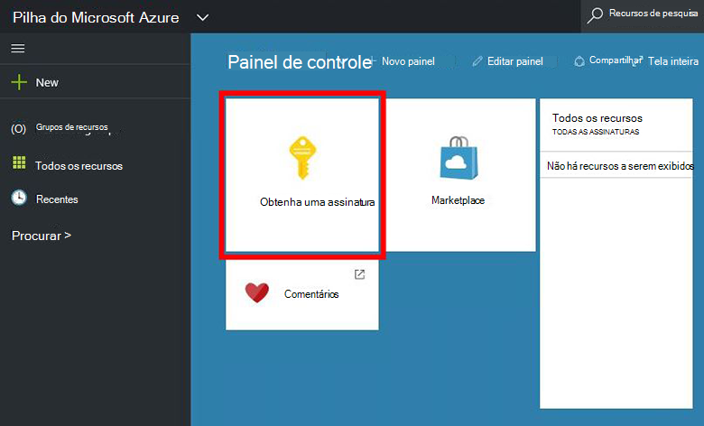
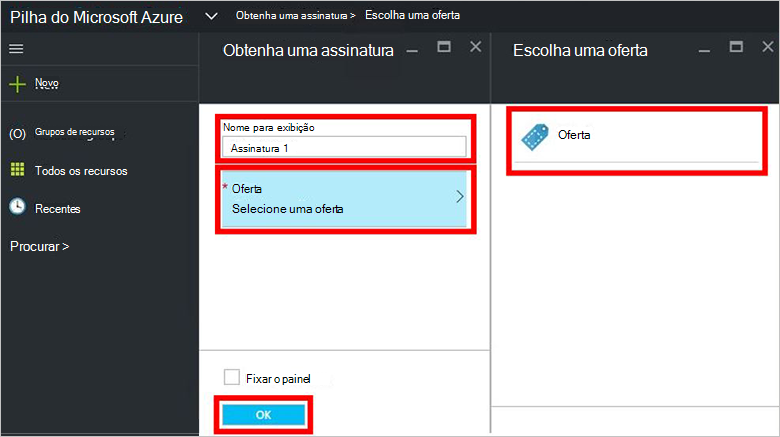
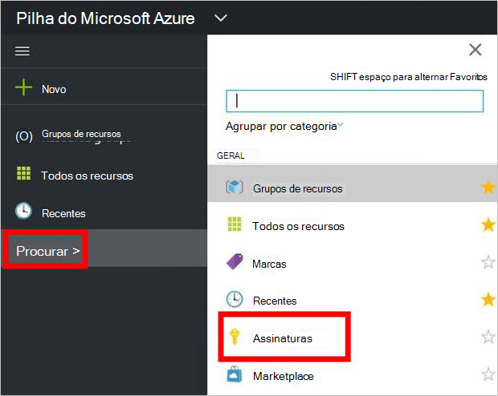

<properties
    pageTitle="Assinar uma oferta e provisionar uma máquina virtual na pilha de Azure (Locatário) | Microsoft Azure"
    description="Como um locatário, saiba como assinar uma oferta e provisionar uma máquina virtual na pilha do Azure."
    services="azure-stack"
    documentationCenter=""
    authors="ErikjeMS"
    manager="byronr"
    editor=""/>

<tags
    ms.service="azure-stack"
    ms.workload="na"
    ms.tgt_pltfrm="na"
    ms.devlang="na"
    ms.topic="get-started-article"
    ms.date="09/26/2016"
    ms.author="erikje"/>

# Inscrever-se em uma oferta

Agora que você [criou uma oferta](azure-stack-create-offer.md), teste que seu locatários podem criar uma assinatura.

1.  No computador do Azure pilha VDC, faça logon no `https://portal.azurestack.local` como [um locatário](azure-stack-connect-azure-stack.md#log-in-as-a-tenant) e clique em **obter uma assinatura**.

    

2.  No campo **Nome de exibição** , digite um nome para sua assinatura, clique **oferecem**, clique em uma das ofertas na lâmina **Escolher uma oferta** e clique em **criar**.

    

4.  Para exibir a assinatura que você criou, clique em **Procurar**, clique em **assinaturas**, clique em sua nova assinatura.  

    

Depois que você assina uma oferta, atualize o portal para ver os serviços que fazem parte da nova assinatura.

## Próximas etapas

[Provisionar uma máquina virtual](azure-stack-provision-vm.md)
