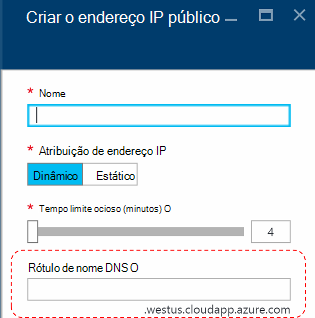
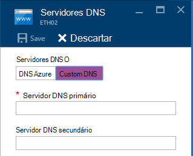
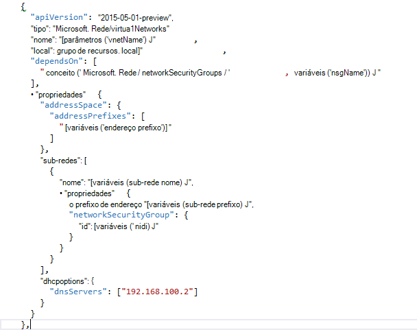

<properties
    pageTitle="Noções básicas do DNS na pilha Azure TP2 | Microsoft Azure"
    description="Noções básicas sobre novos recursos do DNS e recursos no Azure pilha TP2"
    services="azure-stack"
    documentationCenter=""
    authors="ScottNapolitan"
    manager="darmour"
    editor=""/>

<tags
    ms.service="azure-stack"
    ms.workload="na"
    ms.tgt_pltfrm="na"
    ms.devlang="na"
    ms.topic="get-started-article"
    ms.date="09/26/2016"
    ms.author="scottnap"/>

# Apresentando iDNS para pilha do Azure
================================

iDNS é um novo recurso no 2 de visualização de tecnologia para pilha Azure que permite resolver nomes DNS externos (como http://www.bing.com).
Ele também permite que você registrar nomes de rede virtual interna. Fazendo isso, você pode resolver VMs na mesma rede virtual pelo nome em vez do endereço IP, sem precisar fornecer personalizadas entradas do servidor DNS.

É algo que sempre esteve lá no Azure, mas agora está disponível no Windows Server 2016 e pilha do Azure, também.

O que faz iDNS?
------------------

Com iDNS na pilha do Azure, você obtém os seguintes recursos, sem precisar especificar personalizadas entradas do servidor DNS.

-   Compartilhado serviços de resolução de nome DNS para cargas de trabalho de locatário.

-   Serviço DNS autoritativo resolução de nomes e registro DNS dentro da rede virtual do locatário.

-   Serviço de Recursive DNS para resolução de nomes de Internet de locatário VMs. Inquilinos não for mais necessário especificar entradas personalizadas de DNS para resolver nomes de Internet (por exemplo, www.bing.com).

Você ainda pode trazer seu próprio DNS e use os servidores DNS personalizados se você quer. Mas agora, se você quiser apenas poderá resolver nomes de DNS da Internet e poderá se conectar com outras máquinas virtuais na mesma rede virtual, não será necessário especificar nada e ele funcionará.

O que iDNS não faz?
---------------------

Quais iDNS não permite que você faça é criar um registro DNS para um nome que pode ser resolvido de fora da rede virtual.

No Azure, você tem a opção de especificar um rótulo de nome DNS que pode ser associado um endereço IP público. Você pode escolher o rótulo (prefixo), mas Azure escolhe o sufixo, que é baseado na região em que você criar o endereço IP público.

Na imagem acima, o Azure criará um "A" registro no DNS para o rótulo de nome DNS especificado sob a zona **westus.cloudapp.azure.com**. O prefixo e o sufixo junto Redija um domínio nome FQDN (totalmente qualificado) que pode ser resolvido a partir de qualquer lugar na Internet pública.

Na TP2, pilha Azure suporta apenas iDNS para o registro de nome interno, para que ele não pode fazer o seguinte.

-   Crie um registro DNS em uma zona DNS hospedado existente (por exemplo, azurestack.local).

-   Crie uma zona DNS (como Contoso.com).

-   Crie um registro em sua própria zona de DNS personalizada.

-   Suporte a compra de nomes de domínio.

Alterações no DNS do Azure pilha TP1
-----------------------------------

Na versão 1 de visualização de tecnologia (TP1) da pilha do Azure, você tinha que fornecer os servidores DNS personalizados se você quisesse poderá resolver hosts por nome em vez de endereço IP. Isso significa que, se você estivesse criando uma rede virtual ou uma máquina virtual, você tinha que fornecer pelo menos uma entrada de servidor DNS. Para o ambiente de VDC TP1, isso significa inserindo o IP do servidor DNS de tecidos VDC, ou seja 192.168.200.2.

Se você criou uma máquina virtual através do portal, você tinha selecione **Custom DNS** na rede virtual ou configurações de adaptador ethernet.

Em TP2, você pode selecionar o DNS do Azure e não precisa especificar personalizadas entradas do servidor DNS.

Se você criou uma máquina virtual por meio de um modelo com sua própria imagem, você tinha que adicionar a propriedade **DHCPOptions** e resolução para trabalhar de nome de servidor DNS para obter o DNS. A imagem a seguir mostra o que isso era semelhante.

Em TP2, você não precisa fazer essas alterações em seus modelos de máquina virtual para permitir que suas VMs resolver nomes de Internet. Eles apenas devem funcionar.