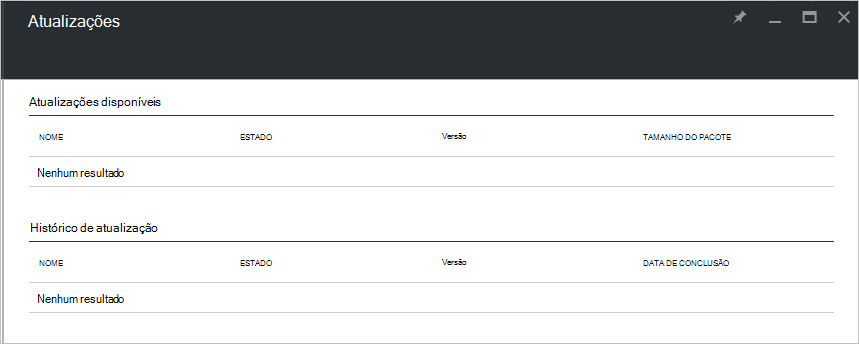

<properties
    pageTitle="Atualizações em pilha Azure | Microsoft Azure"
    description="Saiba mais sobre as atualizações na pilha do Azure"
    services="azure-stack"
    documentationCenter=""
    authors="HeathL17"
    manager="byronr"
    editor=""/>

<tags
    ms.service="azure-stack"
    ms.workload="na"
    ms.tgt_pltfrm="na"
    ms.devlang="na"
    ms.topic="article"
    ms.date="09/26/2016"
    ms.author="Helaw"/>

# Gerenciamento de atualizações na pilha do Azure
Técnica 2 de visualização apresenta uma visualização da experiência de gerenciamento de atualizações de pilha do Azure.  Neste tópico, você vai navegar para o nó de atualizações.  

## Blade de atualizações
1.  Para acessar a lâmina de atualizações, clique em **Procurar** e, em seguida, clique em **atualizações**.

2.  Clique no local onde **local** .

3.  Você verá uma tela listando atualizações disponíveis e atualizar histórico.  Em 2 de visualização técnica, atualizações não estarão disponíveis para a instalação.  

    

## Próximas etapas
- [Entender a arquitetura de VDC de pilha Azure](azure-stack-architecture.md)      
- [Compreender os pré-requisitos de implantação](azure-stack-deploy.md)
- [Implantar pilha Azure](azure-stack-run-powershell-script.md)
 
    
  

  

