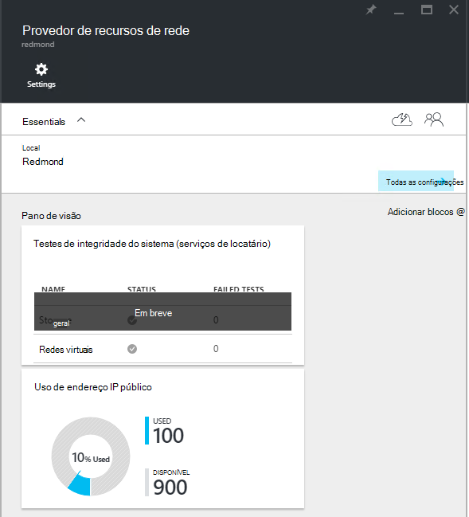
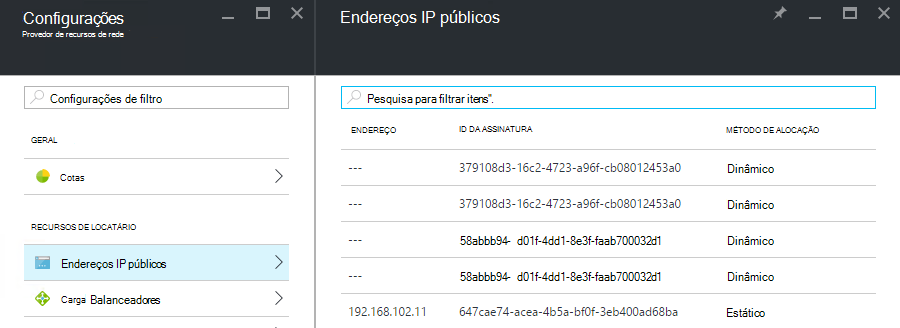

<properties
    pageTitle="Exibindo o consumo de endereço IP público em TP2 | Microsoft Azure"
    description="Os administradores podem ver o consumo de endereços IP públicos em uma região"
    services="azure-stack"
    documentationCenter=""
    authors="ScottNapolitan"
    manager="darmour"
    editor=""/>

<tags
    ms.service="azure-stack"
    ms.workload="na"
    ms.tgt_pltfrm="na"
    ms.devlang="na"
    ms.topic="get-started-article"
    ms.date="09/26/2016"
    ms.author="scottnap"/>

# Exibir consumo de endereço IP público no Azure pilha TP2

Como um administrador de serviço, você pode exibir o número de endereços IP públicos que tenham sido alocados para locatários, o número de endereços IP públicos que ainda estão disponíveis para alocação e a porcentagem de endereços IP públicos que tenham sido alocados nesse local.

O bloco de **Uso de endereço IP pública** mostra o número total de endereços IP públicos que tiver sido consumidas em todos os pools de endereços IP públicos na estrutura, se eles foram usados para locatários ocorrências VM IaaS, serviços de infraestrutura de tecidos ou recursos de endereço IP públicos explicitamente criadas pelo locatários.

A finalidade neste bloco é dar administradores do Azure pilha uma sensação de número geral de endereços IP públicos que tenha sido consumida neste local. Isso ajuda os administradores a determinar se eles estão com pouco deste recurso.

Na lâmina **configurações** , o item de menu de **Endereços IP públicos** em **recursos de locatário** lista somente os endereços IP públicos que foram *explicitamente criado por locatários*. Assim, o número de **usado** o bloco de endereços IP públicos sobre o **Uso de endereço IP pública** sempre é diferente do (maior que) o número no bloco **Endereços IP públicos** em **recursos do locatário**.

## Exiba as informações de uso de endereço IP públicas

Para exibir o número total de endereços IP públicos que tenha sido consumida na região:

1.  No portal do Azure pilha, clique em **Procurar**e, em seguida, selecione **Os provedores de recursos**.

2.  Na lista de **Provedores de recursos**, selecione **Administrador de provedor de recursos de rede**.

3.  Como alternativa, você pode clicar em Procurar **| Locais** e selecione o local em que você deseja exibir na lista. Em seguida, no bloco **Provedores de recursos** , selecione **Administrador de provedor de recursos de rede**.

4.  A lâmina de aterrissagem de **Provedor de recursos de rede** exibe o bloco de **Uso de endereço IP pública** na seção **Visão geral** .

Tenha em mente que o **usado** número representa o número de IP público endereços de IP público todos os endereços pools nesse local atribuídos. O número **disponível** representa o número de IP público endereços de IP tudo público endereço pools que não foram atribuídos e ainda estão disponíveis. O número **% usado** representa o número de endereços usados ou atribuídos como uma porcentagem do número total de IP público endereços em todos os público IP endereço pools nesse local.

## Exibir os endereços IP públicos que foram criados pelos assinaturas de locatários

Para ver uma lista de endereços IP públicos explicitamente criadas pelo assinaturas de locatários em uma região específica, vá para a lâmina de **configurações** da **Administração de provedor de recursos de rede**e selecione **Endereços IP públicos**.

Você observará que alguns endereços IP públicos que tenham sido alocados dinamicamente aparecem na lista, mas não tem um endereço associado a eles. Isso ocorre porque o recurso de endereço já foi criado no provedor de recursos de rede, mas não no controlador de rede.

O controlador de rede não atribua um endereço para este recurso até que realmente está associado a uma interface, uma placa de interface de rede (NIC), um balanceador de carga ou um gateway de rede virtual. Quando o endereço IP público é vinculado a uma interface, o controlador de rede aloca um endereço IP a ele, e ele é exibido no campo **endereço** .

## Exibir a público informações resumo tabela de endereços IP

Há um número de diferentes casos em que os endereços IP públicos são atribuídos que determinam se o endereço aparece uma lista ou em outra.

| **Caso de atribuição de endereço IP público** | **Aparece no resumo de uso** | **Aparece na lista de endereços IP pública locatário** |
| ------------------------------------- | ----------------------------| ---------------------------------------------- |
| Endereço IP dinâmico público ainda não atribuído a um balanceador de carga ou NIC (temporário) | Não | Sim |
| Dinâmico endereço IP público atribuído a um balanceador de carga ou NIC. | Sim | Sim |
| Público endereço IP estático atribuído a um balanceador de carga ou NIC do locatário. | Sim | Sim |
| Público endereço IP estático atribuído a um ponto de extremidade do serviço de infraestrutura tecidos. | Sim | Não |
| Endereço IP público implicitamente criado por instâncias de VM IaaS e usado para NAT saída em uma rede virtual. Estes são criados nos bastidores sempre que um locatário cria uma instância de máquina virtual para que VMs podem enviar informações para a Internet. | Sim | Não |
