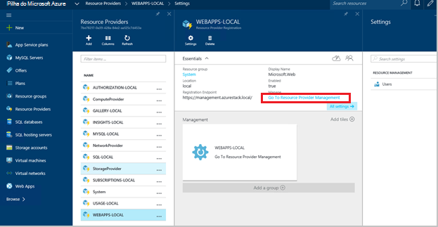
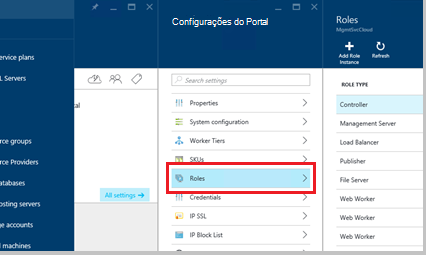
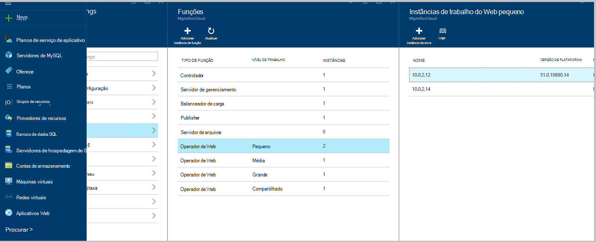
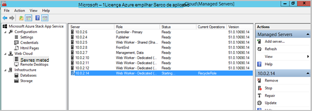
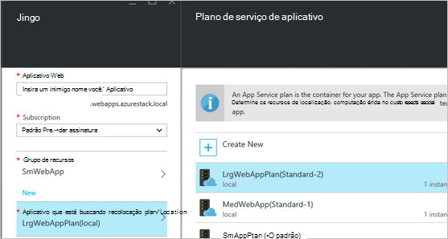
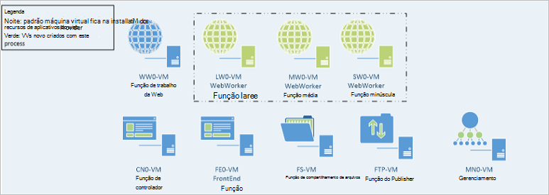

<properties
    pageTitle="Funções de trabalho da Web de aplicativos Web adicionando mais | Microsoft Azure"
    description="Orientações detalhadas para dimensionamento Azure pilha Web App"
    services="azure-stack"
    documentationCenter=""
    authors="kathm"
    manager="slinehan"
    editor=""/>

<tags
    ms.service="azure-stack"
    ms.workload="app-service"
    ms.tgt_pltfrm="na"
    ms.devlang="na"
    ms.topic="article"
    ms.date="09/26/2016"
    ms.author="kathm"/>

#   <a name="web-apps-adding-more-web-worker-roles"></a>Aplicativos da Web: Adicionando mais funções de trabalho da web

> [AZURE.NOTE] As informações a seguir se aplica somente implantações de TP1 de pilha do Azure.

Este documento fornece instruções sobre como dimensionar funções de trabalho de web Web Apps. Ele contém etapas para a criação de funções de trabalho adicionais da web para oferecer suporte a ofertas de aplicativos web de qualquer tamanho.

Pilha Azure suporta implantações de aplicativos web gratuito e compartilhado. Para adicionar outros tipos, você precisará adicionar mais funções de trabalho da web.

Se você não tiver certeza de qual foi implantado com a instalação de aplicativos Web padrão, você pode revisar informações adicionais [aqui](azure-stack-webapps-overview.md).

As etapas a seguir são necessárias para funções de trabalho de web de escala:

1.  [Criar uma nova máquina virtual](#step-1-create-a-new-vm-to-support-the-new-instance-size)

2.  [Configure a máquina virtual](#step-2-configure-the-virtual-machine)

3.  [Configurar a função de trabalho da web no portal do Azure pilha](#step-3-configure-the-web-worker-role-in-the-azure-stack-portal)

4.  [Configurar planos de serviço de aplicativo](#step-4-configure-app-service-plans)

##<a name="step-1-create-a-new-vm-to-support-the-new-instance-size"></a>Etapa 1: Criar uma nova VM para o novo tamanho de instância de suporte

Crie uma máquina virtual, conforme descrito [neste artigo](azure-stack-provision-vm.md), garantindo que as seleções a seguir são feitas:

 - Nome de usuário e senha: fornecem o mesmo nome de usuário e senha que você forneceu quando você instalou o Web Apps.

 - Assinatura: Use a assinatura de provedor padrão.

 - Grupo de recursos: escolha **AppService Local**.

> [AZURE.NOTE]Armazene as máquinas virtuais para funções de trabalho no mesmo grupo de recursos como o aplicativo é implantado em Web Apps. (Isso é recomendado para esta versão).

##<a name="step-2-configure-the-virtual-machine"></a>Etapa 2: Configurar a máquina Virtual

Após a implantação ter sido concluído, a seguinte configuração é necessária para a função de trabalho da web de suporte:

1.  Abra o Gerenciador de servidor na máquina host e clique em **Ferramentas** &gt; **Gerenciador de Hyper-v**.

2.  Conecte usando o protocolo de área de trabalho remota (RDP) para a nova máquina virtual que você criou na etapa 1. O nome do servidor está localizado no painel de resumo quando cada máquina virtual está selecionada.

3.  Abra o PowerShell clicando no botão **Iniciar** e digitando PowerShell. **PowerShell.exe**de atalho e, em seguida, selecione **Executar como administrador** para abrir o PowerShell no modo de administrador.

4.  Copiar e colar cada dos seguintes comandos (uma de cada vez) para a janela do PowerShell e pressione enter:

    ```netsh advfirewall firewall set rule group="File and Printer Sharing" new enable=Yes```
    ```netsh advfirewall firewall set rule group="Windows Management Instrumentation (WMI)" new enable=yes```
    ```reg add HKLM\\SOFTWARE\\Microsoft\\Windows\\CurrentVersion\\Policies\\system /v LocalAccountTokenFilterPolicy /t REG\_DWORD /d 1 /f```

5.  Reinicie a máquina virtual.

> [AZURE.NOTE]Observação: Esses são os requisitos mínimos para Web Apps. Eles são as configurações padrão da imagem do Windows 2012 R2 incluídos com o Azure pilha. As instruções foram fornecidas para referência futura e para aqueles usando uma imagem diferente.

##<a name="step-3-configure-the-web-worker-role-in-the-azure-stack-portal"></a>Etapa 3: Configurar a função de trabalho da web no portal do Azure pilha

1.  Abra o portal de como o administrador do serviço em **ClientVM**.

2.  Navegar para **os provedores de recurso** &gt; **WEBAPPS LOCAL**.

    
 
3.  Clique em **Ir para gerenciamento de provedor de recursos**.

4.  Clique em **funções**.

    
 
5.  Clique em **Adicionar a instância de função**.

6.  Clique na **camada** que você gostaria de implantar a nova instância (pequeno, médio, grande ou compartilhado).

    
 
7.  Configure o seguinte:
 - Nomedoservidor: Forneça o endereço IP do servidor que você criou anteriormente (seção 1).
 - Tipo de função: Web trabalhador.
 - Trabalhador camada: Correspondências nível tamanho selecionado.

8. Clique em **Okey.**

9. Faça logon em CN0-máquina virtual e abra o **MMC de gerenciamento de nuvem da Web**.

10. Navegar na **Web nuvem** &gt; **servidores gerenciados**.

11. Clique no nome do servidor que você acabou de ser implantado. Analise a coluna de status e aguarde para mover para a próxima etapa até que o status seja "Pronto".

    

##<a name="step-4-configure-app-service-plans"></a>Etapa 4: Configurar planos de serviço de aplicativo

> [AZURE.NOTE]Na versão atual dos aplicativos Web, planos de serviço de aplicativo devem ser armazenados em grupos de recursos separado. Criar um grupo de recursos para cada tamanho do web app e coloque os planos do aplicativo em seus grupos de recursos apropriado.

1.  Entre portal do sobre o ClientVM.

2.  Navegue até o **novo** &gt; **Web e dispositivos móveis**.

3.  Selecione o aplicativo web que você gostaria de implantar.

4.  Forneça as informações para o aplicativo da web e selecione **AppService plano / local**.

-   Clique em **Criar novo**.

-   Crie seu novo plano, selecionando o nível de preços correspondente para o plano.

> [AZURE.NOTE]Você pode criar vários planos enquanto nessa lâmina. Antes de implantar, no entanto, certifique-se de que você selecionou o plano apropriado.

A seguir mostra um exemplo dos vários planos disponíveis:    

##<a name="final-web-app-service-vm-configuration"></a>Configuração de máquina virtual do serviço Web App final

A imagem abaixo fornece um modo de exibição do ambiente depois que você tiver dimensionada as funções de trabalho da web. Os itens verdes representam as novas adições de função.
    
