<properties
     pageTitle="Como criar uma solicitação de suporte Azure | Microsoft Azure"
     description="Como criar uma solicitação de suporte Azure."
     services="Azure Supportability"
     documentationCenter=""
     authors="ganganarayanan"
     manager="scotthit"
     editor=""/>

<tags
     ms.service="azure-supportability"
     ms.workload="na"
     ms.tgt_pltfrm="na"
     ms.devlang="na"
     ms.topic="article"
     ms.date="10/25/2016"
     ms.author="gangan"/>

# Como criar uma solicitação de suporte do Azure

## Resumo
Clientes Azure podem criar e gerenciar solicitações de suporte no portal do Azure, [https://portal.azure.com](https://portal.azure.com).
>[AZURE.NOTE] Portal do Azure para Alemanha é [https://portal.microsoftazure.de](https://portal.microsoftazure.de) e para o portal do governo Azure é [https://portal.azure.us](https://portal.azure.us).

Com base nos comentários do cliente, podemos atualizou a experiência de solicitação de suporte para focalizar três objetivos principais:

- **Otimizado**: reduzir cliques e blades simplificam o processo de enviar uma solicitação de suporte.
- **Integrado**: quando você está solucionando um problema com um recurso Azure, deve ser fácil abrir uma solicitação de suporte para o recurso sem alternar o contexto.
- **Eficiente**: coletar as informações de chave sua engenharia reversa suporte precisará com eficiência resolvido o problema.

## Guia de Introdução
No menu de navegação superior ou diretamente de uma lâmina de recurso, você pode criar uma solicitação de suporte.

**Na barra de navegação superior de**

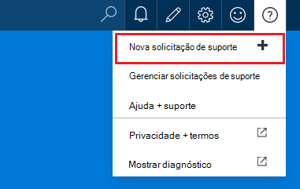

**De uma lâmina de recurso**

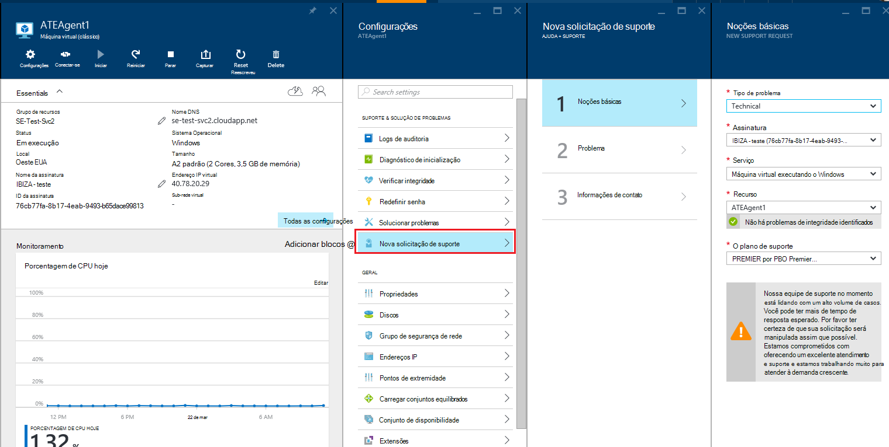

## Noções básicas
A primeira etapa do processo de solicitação de suporte coleta informações básicas sobre o problema e o plano de suporte.

Vamos ver um exemplo: você está enfrentando problemas técnicos com sua máquina virtual e suspeitar de um problema de conectividade de rede.
Selecionar o serviço ("Máquina Virtual executando o Windows") e o recurso (o nome da sua máquina virtual) na primeira etapa do assistente inicia o processo de obtenção de ajuda para esse problema.

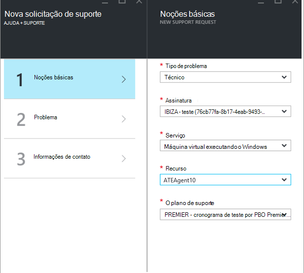

>[AZURE.NOTE] Azure fornece suporte ilimitado para gerenciamento de assinatura (coisas como cobrança, ajustes de cota e transferências de conta). Para obter suporte técnico, você precisa de um plano de suporte. [Saiba mais sobre planos de suporte](https://azure.microsoft.com/support/plans).

## Problema
A segunda etapa do assistente reúne detalhes adicionais sobre o problema. Fornecer detalhes precisos nesta etapa nos permite para direcionar o seu caso para a melhor engenharia de suporte para o problema e começar a diagnosticar o problema assim que possível.

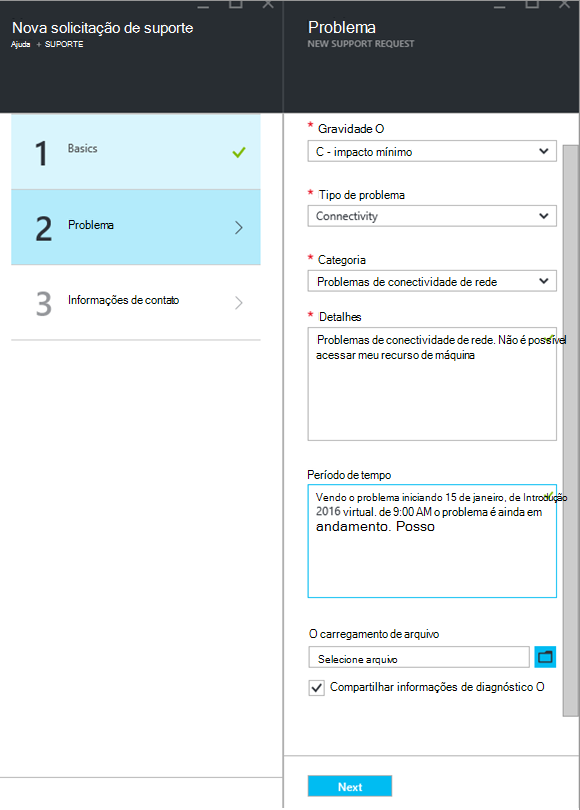

Continuar com o exemplo de conectividade de máquina virtual do acima, preencha este formulário para indicar um problema de conectividade de rede e você deseja fornecer mais detalhes sobre o problema, inclua o tempo aproximado quando você encontrou o problema.

## Ajuda relacionados
Para alguns problemas, fornecemos links de Ajuda relacionados para solucionar o problema. Se os documentos recomendados não ajudar, você pode continuar durante o processo para criar uma solicitação de suporte.
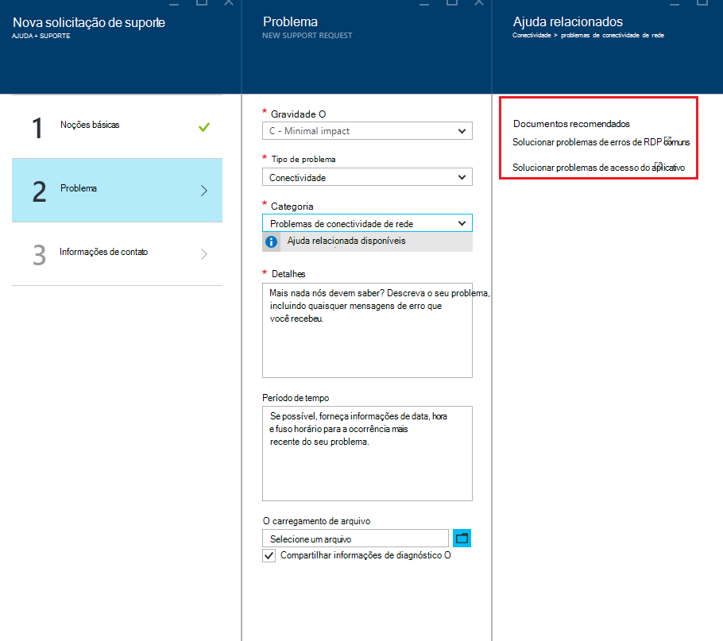

## Informações de contato
A última etapa do assistente confirma suas informações de contato para que sabemos como encontrá-lo.
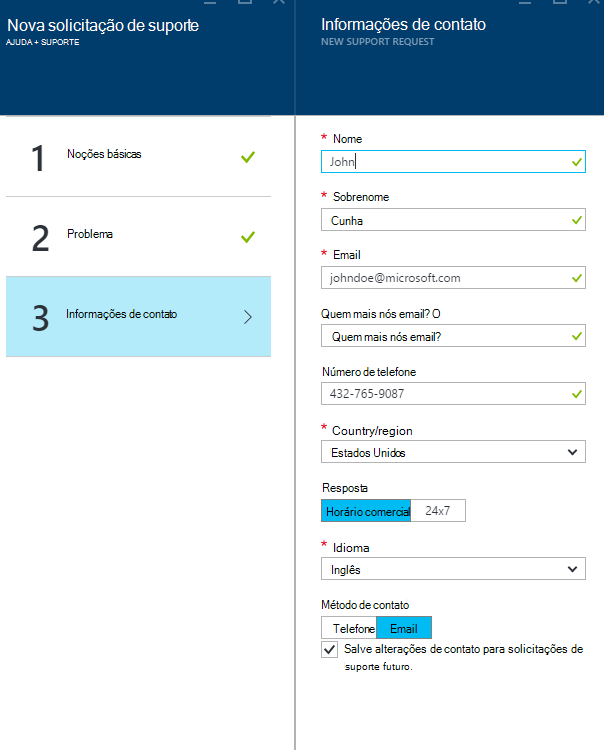

Dependendo da gravidade do seu problema, você pode ser solicitado para indicar se você gostaria que contatemos você durante o horário comercial ou se você preferir uma resposta de 24 x 7, o que significa que podemos podem contatá-lo a qualquer momento.
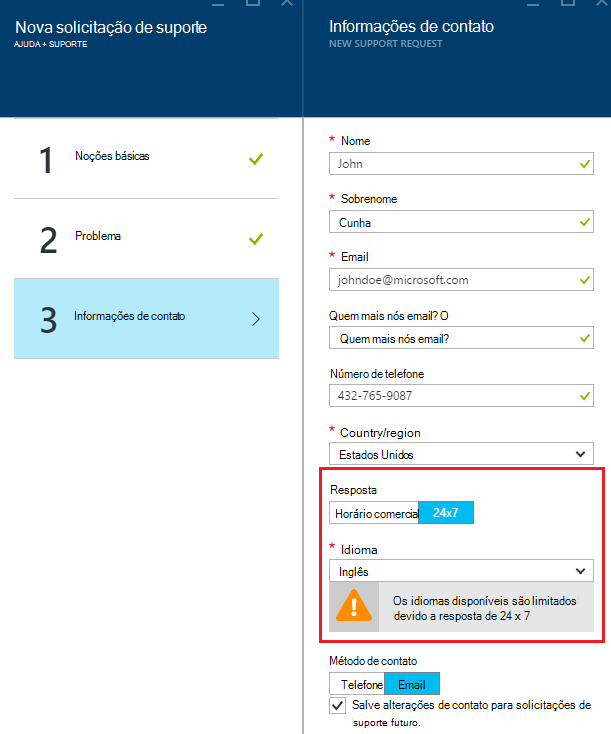

## Gerenciar solicitações de suporte
Depois de criar a solicitação de suporte, você pode exibir os detalhes na página **Gerenciar solicitações de suporte** .

**Na barra de navegação superior de**

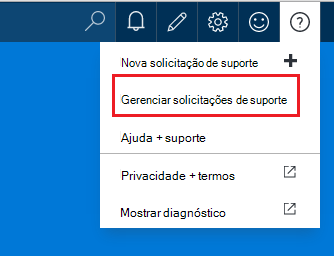

Na página **Gerenciar solicitações de suporte** , você pode exibir todas as solicitações de suporte e seus status.
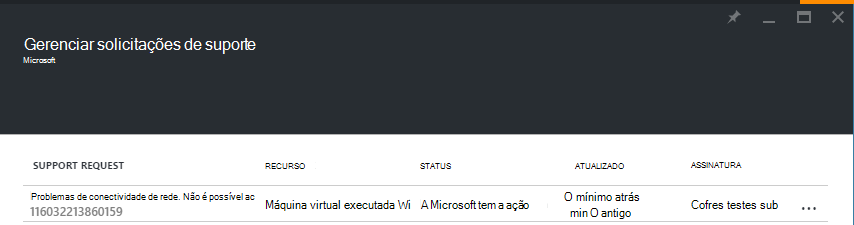

Selecione a solicitação de suporte para exibir detalhes, incluindo gravidade e o tempo esperado levará para uma engenharia de suporte responder.
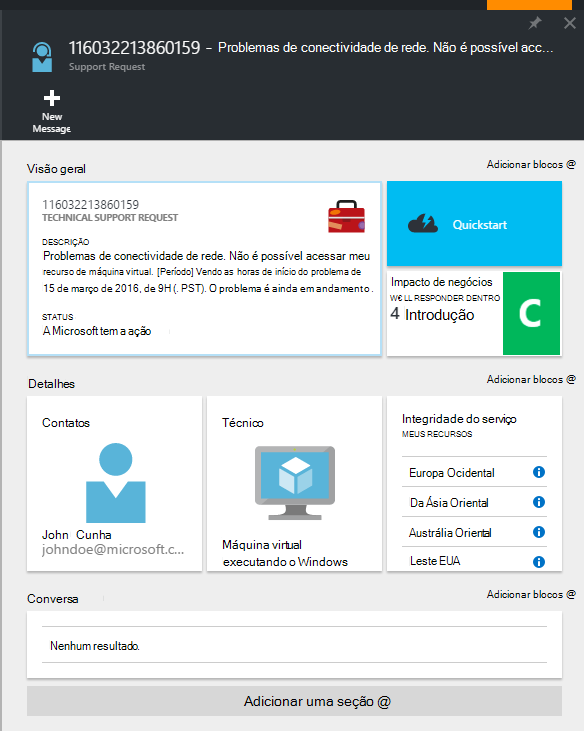

Se você quiser alterar a gravidade da solicitação, clique no bloco de **impacto de negócios** . No exemplo anterior, a solicitação está definida para c gravidade.

Clicando no bloco mostra a lista de severidades que você pode atribuir a uma solicitação de suporte abertos.

>[AZURE.NOTE] O nível de gravidade máxima depende de seu plano de suporte. [Saiba mais sobre planos de suporte](https://azure.microsoft.com/support/plans).

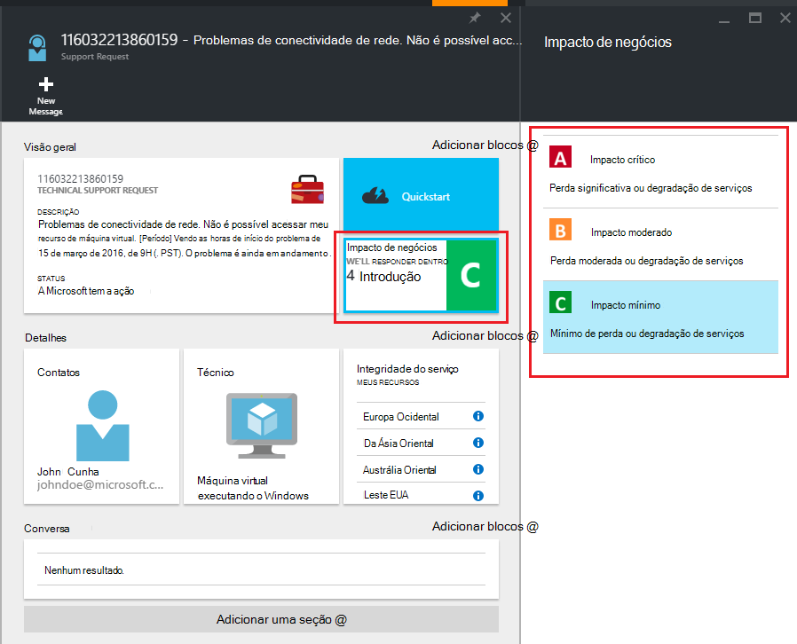

## Comentários
Estamos sempre são abertos para comentários e sugestões! Envie suas [sugestões](https://feedback.azure.com/forums/266794-support-feedback). Além disso, você pode se envolver conosco por meio do [Twitter](https://twitter.com/azuresupport) ou os [fóruns do MSDN](https://social.msdn.microsoft.com/Forums/azure).

## Saiba Mais
[Perguntas frequentes sobre o suporte do Azure](https://azure.microsoft.com/support/faq)
