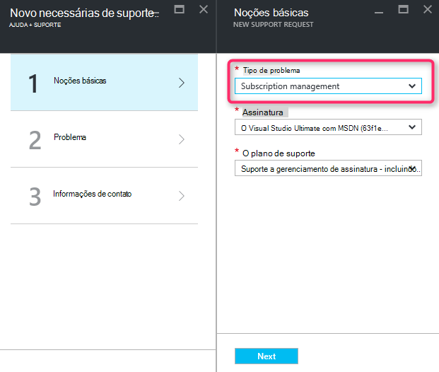
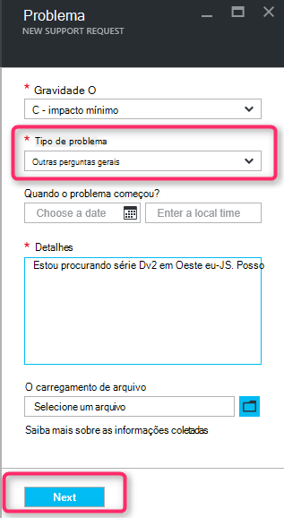
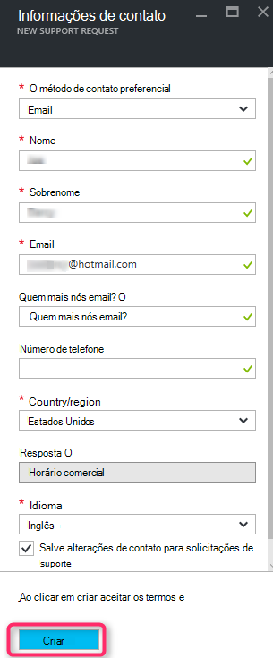

<properties
     pageTitle="Série SKU disponível | Microsoft Azure"
     description="Algumas séries SKU não estão disponíveis para a assinatura selecionada para essa região."
     services="Azure Supportability"
     documentationCenter=""
     authors="ganganarayanan"
     manager="scotthit"
     editor=""/>

<tags
     ms.service="azure-supportability"
     ms.workload="na"
     ms.tgt_pltfrm="na"
     ms.devlang="na"
     ms.topic="article"
     ms.date="08/12/2016"
     ms.author="gangan"/>

# Série SKU indisponível

Em algumas regiões determinados SKUs não ficam disponíveis automaticamente em novas assinaturas.  Isso pode ocorrer quando [SKUs mais eficazes são apresentados em uma região](https://azure.microsoft.com/updates/announcing-new-dv2-series-virtual-machine-size/) e a popularidade do legado SKU recusa.
A mensagem "*algumas SKU série não está disponível para a assinatura selecionada para essa região*" é exibida ao criar uma solicitação de suporte para aumentar a cota de núcleo de computação.

Você pode examinar a disponibilidade SKU na página [Serviços de Azure por região](https://azure.microsoft.com/regions/#services) . 

Para solicitar acesso a uma SKU restrito de sua assinatura, crie uma solicitação de suporte de "Gerenciamento de assinatura".

- Na página Noções básicas, selecione o tipo de problema como "Gerenciamento de assinatura" e clique em "Avançar".

- Na página do problema, selecione o tipo de problema como "Outras perguntas gerais" e insira a região exato e SKU que não está vendo.
Isso ajuda a acelerar o processo de suporte.

- Na página informações de contato, insira os detalhes do contato e clique em "Criar".

## Comentários
Estamos sempre são abertos para comentários e sugestões! Envie suas [sugestões](https://feedback.azure.com/forums/266794-support-feedback). Além disso, você pode se envolver conosco por meio do [Twitter](https://twitter.com/azuresupport) ou os [fóruns do MSDN](https://social.msdn.microsoft.com/Forums/azure).

## Saiba Mais
[Perguntas frequentes sobre o suporte do Azure](https://azure.microsoft.com/support/faq)
