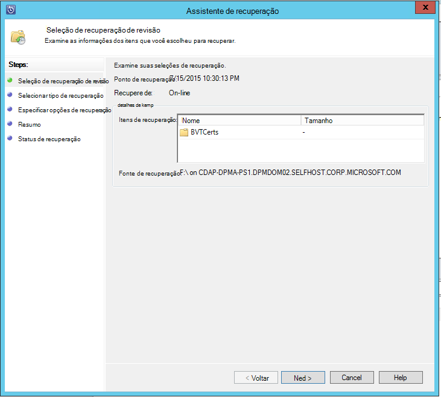

<properties
    pageTitle="Recuperar dados de outro servidor DPM no cofre backup | Microsoft Azure"
    description="Recupere os dados que você já protegido para um cofre Azure Backup de qualquer servidor DPM registrado esse cofre."
    services="backup"
    documentationCenter=""
    authors="nkolli1"
    manager="shreeshd"
    editor=""/>

<tags
    ms.service="backup"
    ms.workload="storage-backup-recovery"
    ms.tgt_pltfrm="na"
    ms.devlang="na"
    ms.topic="article"
    ms.date="08/08/2016"
    ms.author="giridham;jimpark;trinadhk;markgal"/>

# Recuperar dados de outro servidor DPM no cofre de backup
Agora você pode recuperar os dados que você tenha protegido para um cofre Azure Backup de qualquer servidor DPM registrado para que os. Portanto, o processo para fazer é totalmente integrado ao console de gerenciamento do DPM e é semelhante a outros recuperação fluxos de trabalho.

Para recuperar dados de outro servidor DPM no cofre de backup, você precisará [System Center Data Protection Manager UR7](https://support.microsoft.com/en-us/kb/3065246) e o [agente de Backup do Azure mais recente](http://aka.ms/azurebackup_agent).

## Recuperar dados de outro servidor DPM
Para recuperar dados de outro servidor DPM:

1. Na guia **recuperação** do console de gerenciamento do DPM, clique em **' Adicionar externos DPM'** (na parte superior esquerda da tela).

    

2. Baixar novas **credenciais cofre** do cofre associado ao **servidor DPM** onde os dados serão recuperados, escolha o servidor DPM na lista de servidores DPM registrado com o Cofre de backup e fornecer a **senha de criptografia** associado ao servidor DPM cujos dados está sendo recuperados.

    

    >[AZURE.NOTE] Somente os servidores DPM associados com o mesmo Cofre de registro poderá recuperar dados uns dos outros.

    Depois que o servidor DPM externo for adicionado com êxito, você pode procurar dados do servidor DPM externo e servidor local do DPM a partir da guia de **recuperação** .

3. Procure a lista de servidores de produção protegidos pelo servidor DPM externo disponíveis e selecione a fonte de dados apropriado.

    

4. Selecione **o mês e ano** dos **pontos de recuperação** de lista suspensa, selecione a **Data de recuperação** necessários para quando o ponto de recuperação foi criado e selecione o **tempo de recuperação**.

    Será exibida uma lista de arquivos e pastas no painel inferior, que pode ser acessado e recuperado em qualquer local.

    

5. Clique com botão direito no item apropriado e clique em **recuperar**.

    

6. Examine a **recuperar a seleção**. Verifique se os dados e a hora da cópia de backup está sendo recuperada, bem como a fonte do qual a cópia de backup foi criada. Se a seleção estiver incorreta, clique em **Cancelar** para navegar de volta para a guia de recuperação para selecionar ponto de recuperação apropriada. Se a seleção estiver correta, clique em **Avançar**.

    

7. Selecione **recuperar para um local alternativo**. **Navegue** para o local correto para a recuperação.

    

8. Escolha a opção relacionada ao **Criar cópia**, **Ignorar**ou **Substituir**.
    - **Criar cópia** criará uma cópia do arquivo no caso não há um conflito de nome.
    - **Ignorar** ignorará recuperando o arquivo no caso não há um conflito de nome.
    - **Sobrescrever** substituirá a cópia existente no local especificado em caso de um conflito de nome.

    Escolha a opção apropriada para **Restaurar segurança**. Você pode aplicar as configurações de segurança do computador de destino onde os dados serão recuperados ou as configurações de segurança que estavam aplicáveis ao produto no momento em que o ponto de recuperação foi criado.

    Identifique se uma **notificação** será enviada uma vez a recuperação ser concluída com êxito.

    

9. A tela de **Resumo** lista as opções escolhidas até o momento. Quando você clicar **'Recuperar'**, os dados serão recuperados para o local apropriado no local.

    

    >[AZURE.NOTE] É possível monitorar o trabalho de recuperação na guia **Monitoring** do servidor DPM.

    

10. Você pode clicar em **Limpar DPM externos** na guia **recuperação** do servidor DPM para remover o modo de exibição do servidor DPM externo.

    

## Solucionando problemas de mensagens de erro
|Não. |  Mensagem de erro | Etapas de solução de problemas |
| :-------------: |:-------------| :-----|
|1.|        Este servidor não está registrado ao Cofre especificado pela credencial cofre.|  **Causa:** Este erro aparece quando o arquivo de credencial cofre selecionado não pertence ao Cofre de backup associado ao servidor DPM no qual a recuperação é uma tentativa.   **Resolução:** Baixe o arquivo de credencial cofre do cofre backup à qual o servidor DPM está registrado.|
|2.|        Os dados recuperáveis não estão disponíveis ou o servidor selecionado não é um servidor DPM.|   **Causa:** Há que nenhuma outros servidores DPM com DPM 2012 R2 UR7 registrado ao Cofre de backup, ou os servidores DPM com DPM 2012 R2 UR7 ainda não tiveram carregou os metadados, ou o servidor selecionado não é servidor DPM (também conhecidos como o Windows Server ou o Windows Client).   **Resolução:** Se houver outros servidores DPM registrados ao Cofre de backup, certifique-se de SCDPM 2012 R2 UR7 e mais recentes do Azure Backup agent são instalados.  Se houver outros servidores DPM registrados ao Cofre de backup com DPM 2012 R2 UR7, aguarde um dia após a instalação do UR7 para iniciar o processo de recuperação. O trabalho à noite serão carregadas os metadados para todos os backups anteriormente protegidos para a nuvem. Os dados serão disponíveis para recuperação.|
|3.|        Nenhum outro servidor DPM está registrado para este cofre.|   **Causa:** Não há nenhum outros servidores DPM com DPM 2012 R2 UR7 ou acima que são registrados para o compartimento do qual a recuperação está sendo tentada. **Resolução:** Se houver outros servidores DPM registrados ao Cofre de backup, certifique-se de SCDPM 2012 R2 UR7 e mais recentes do Azure Backup agent são instalados. Se houver outros servidores DPM registrados ao Cofre de backup com DPM 2012 R2 UR7, aguarde um dia após a instalação do UR7 para iniciar o processo de recuperação. O trabalho à noite serão carregadas os metadados para todos os backups anteriormente protegidos para a nuvem. Os dados serão disponíveis para recuperação.|
|4.|        A senha de criptografia fornecida não coincide com senha associada com o servidor a seguir:**<server name>**|  **Causa:** A senha de criptografia usada no processo de criptografia de dados a partir de dados do servidor DPM que está sendo recuperados não coincidir com a senha de criptografia fornecida. O agente não conseguiu descriptografar os dados. Portanto, a recuperação falhará. **Resolução:** Forneça a mesma exata senha de criptografia associada ao servidor DPM cujos dados está sendo recuperados.|

## Perguntas frequentes:
1. **Por que não consigo adicionar um servidor DPM externo de outro servidor DPM após instalar o UR7 e o agente de Backup do Azure mais recente?**

    A) para os servidores DPM existentes com fontes de dados protegidas na nuvem (usando um pacote cumulativo de atualizações anteriores ao atualizar Rollup 7), você precisa esperar pelo menos um dia depois de instalar o UR7 e o agente de Backup do Azure mais recente para iniciar o *servidor adicionar DPM externos*. Isso é necessário para carregar os metadados dos grupos de proteção de DPM no Azure. Isso ocorre na primeira vez por meio de um trabalho à noite.

2. **O que é a versão mínima do agente de Backup do Azure necessário?**

    A) a versão mínima do agente de Backup Azure para ativar esse recurso é 2.0.8719.0.  Versão do agente de Backup Azure pode ser verificado por meio de navegação para o painel de controle **>** itens de painel de controle de todas as **>** programas e recursos **>** agente de serviços de recuperação do Microsoft Azure. Se a versão for menor que 2.0.8719.0, baixe a [versão mais recente do Azure Backup agent](https://go.microsoft.com/fwLink/?LinkID=288905) e instale.

    

## Próximas etapas:
• [Azure FAQ de Backup](backup-azure-backup-faq.md)
