<properties
    pageTitle="Restaurar máquinas virtuais de backup usando o portal Azure | Microsoft Azure"
    description="Restaurar uma máquina virtual Azure a partir de um ponto de recuperação usando o portal do Azure"
    services="backup"
    documentationCenter=""
    authors="markgalioto"
    manager="cfreeman"
    editor=""
    keywords="Restaurar backup; como restaurar; ponto de recuperação;"/>

<tags
    ms.service="backup"
    ms.workload="storage-backup-recovery"
    ms.tgt_pltfrm="na"
    ms.devlang="na"
    ms.topic="article"
    ms.date="08/10/2016"
    ms.author="trinadhk; jimpark;"/>

# Usar o portal do Azure para restaurar máquinas virtuais

> [AZURE.SELECTOR]
- [Restaurar VMs no portal de clássico](backup-azure-restore-vms.md)
- [Restaurar VMs no portal do Azure](backup-azure-arm-restore-vms.md)

Proteger seus dados fazendo instantâneos dos seus dados em intervalos definidos. Esses instantâneos são conhecidos como pontos de recuperação e elas são armazenadas em compartimentos de serviços de recuperação. Se ou quando é necessário reparar ou recriar uma máquina virtual, você pode restaurar a máquina virtual de qualquer um dos pontos de recuperação salvo. Ao restaurar um ponto de recuperação, você pode Retorna ou reverter a máquina virtual para o estado quando o ponto de recuperação foi tirado. Este artigo explica como restaurar uma máquina virtual.

> [AZURE.NOTE] Azure tem dois modelos de implantação para criar e trabalhar com recursos: [Gerenciador de recursos e clássico](../resource-manager-deployment-model.md). Este artigo fornece as informações e procedimentos para restaurar VMs implantadas usando o modelo do Gerenciador de recursos.

## Restaurar um ponto de recuperação

1. Entre [portal do Azure](http://portal.azure.com/)

2. No menu Azure, clique em **Procurar** e na lista de serviços, digite **Os serviços de recuperação**. A lista de serviços ajusta que você digita. Quando você vir **compartimentos de serviços de recuperação**, selecione-o.

    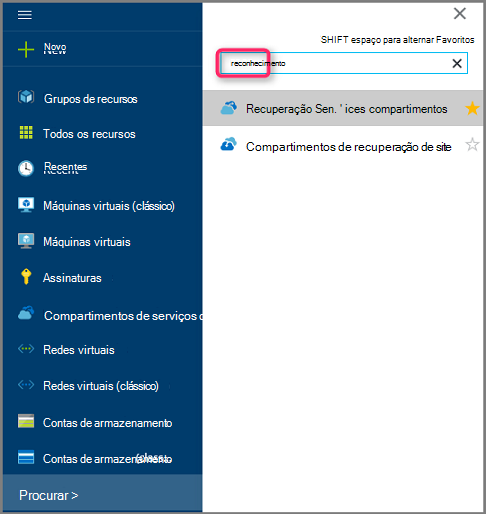

    Lista de compartimentos na assinatura é exibida.

    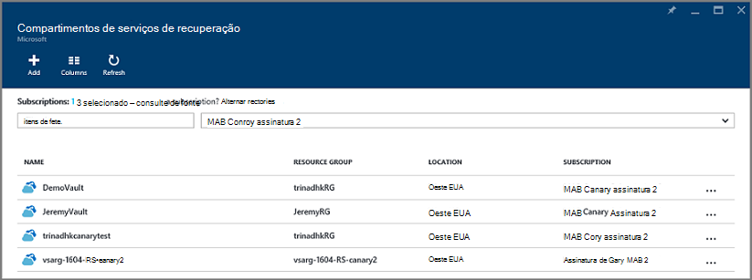

3. Na lista, selecione o cofre associado com a máquina virtual que você deseja restaurar. Quando você clica no cofre, abre seu painel.

    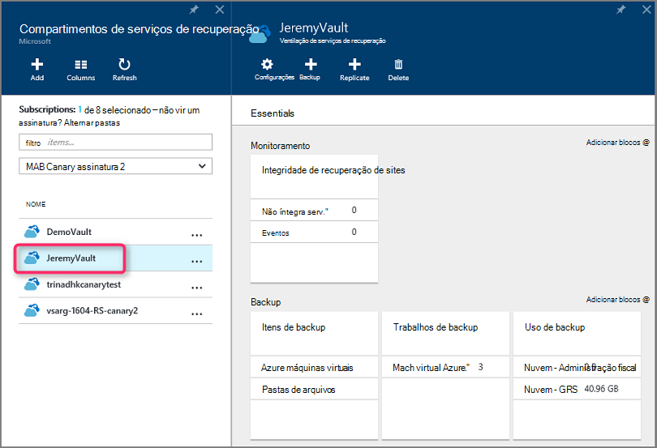

4. Agora que você está no painel Cofre. Nos **Itens de Backup** lado a lado, clique em **máquinas virtuais do Azure** para exibir as VMs associadas ao cofre.

    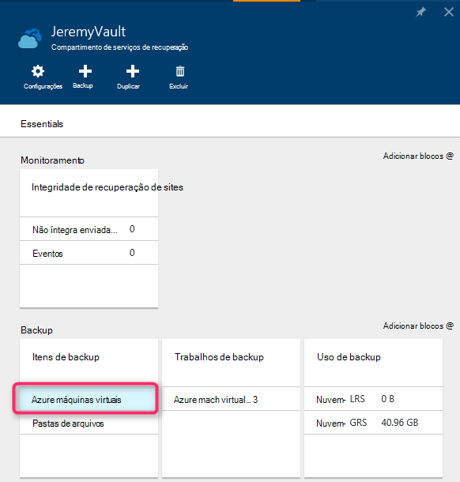

    A lâmina de **Itens de Backup** abre e exibe a lista de Azure máquinas virtuais.

    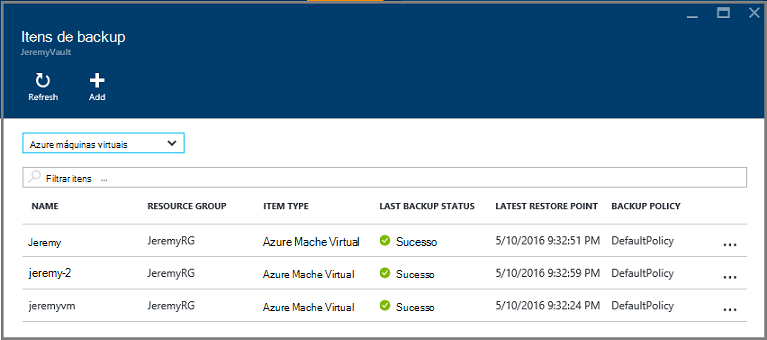

5. Na lista, selecione uma máquina virtual para abrir o painel de controle. Abre o painel de máquina virtual para a área de monitoramento, que contém o bloco de pontos de restauração.

    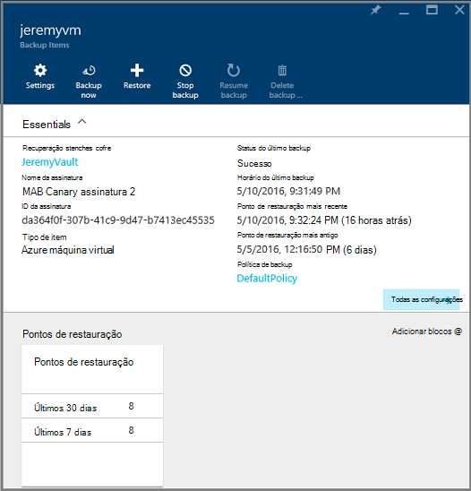

6. No menu do painel de máquina virtual, clique em **Restaurar**

    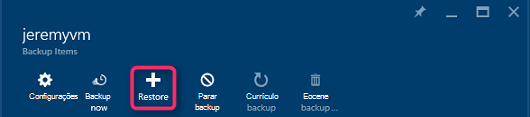

    Abre a lâmina de restauração.

    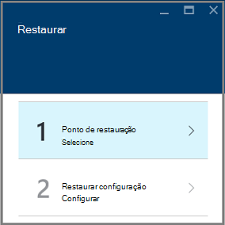

7. Na lâmina **Restaurar** , clique em **Restaurar ponto** para abrir a lâmina de **ponto Selecione Restaurar** .

    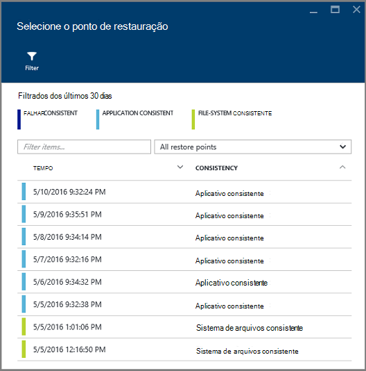

    Por padrão, a caixa de diálogo exibe todos os pontos de restauração de últimos 30 dias. Use o **filtro** para alterar o intervalo de tempo dos pontos de restauração exibido. Por padrão, os pontos de restauração de consistência todos são exibidos. Modificar **restaurar todos os pontos** de filtro para selecionar uma consistência específico de pontos de restauração. Para obter mais informações sobre cada tipo de restauração ponto, consulte a explicação de [consistência](./backup-azure-vms-introduction.md#data-consistency)de dados.  
    - Escolha a **consistência do ponto de restauração** dessa lista:
        - Travar pontos de restauração consistente,
        - Pontos de restauração consistente do aplicativo,
        - Pontos de restauração consistente do sistema de arquivos
        - Todos os pontos de restauração.  

8. Escolha um ponto de restauração e clique **Okey**.

    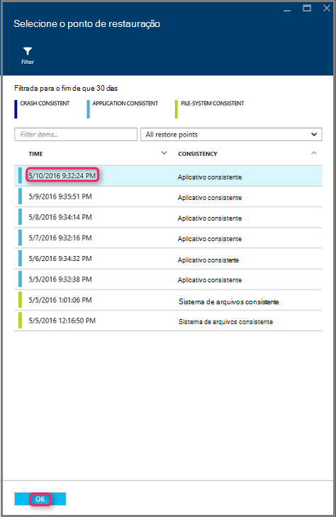

    A lâmina **Restaurar** mostra que o ponto de restauração está definido.

    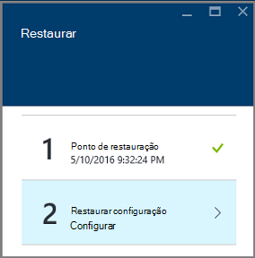

9. Na lâmina **Restaurar** , **Restaurar configuração** se abre automaticamente após o ponto de restauração está definido.

    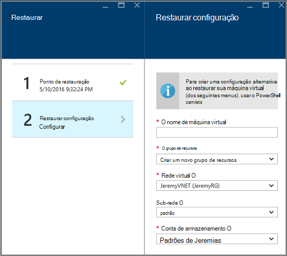

## Escolhendo uma configuração de restauração de máquina virtual

Agora que você selecionou o ponto de restauração, escolha uma configuração para a restauração máquina virtual. Suas opções para configurar a máquina virtual restaurada são usar: portal Azure ou PowerShell.

> [AZURE.NOTE] Portal fornece uma opção de criação rápida para máquina virtual restaurado. Se você quiser personalizar a configuração de máquina virtual da máquina virtual restaurado estimem, usar o PowerShell para restaurar o backup de discos e anexá-los a opção de configuração de máquina virtual. Consulte [Restaurando uma máquina virtual com configurações de rede especial](#restoring-vms-with-special-network-configurations).

1. Se você não ainda estiver lá, vá para a lâmina **Restaurar** . Certifique-se de um **ponto de restauração** foi selecionado e clique em **Restaurar configuração** para abrir a lâmina de **configuração de recuperação** .

    

2. Na lâmina **Restaurar configuração** , digite ou selecione valores para cada um dos seguintes campos:
    - **Nome de máquina Virtual** - forneça um nome para a máquina virtual. O nome deve ser exclusivo para o grupo de recursos (para uma máquina virtual implantado Gerenciador de recursos) ou serviço de nuvem (para uma máquina virtual clássico). Você não pode substituir a máquina virtual se ele já existir na assinatura.
    - **Grupo de recursos** - usar um grupo de recursos existente ou crie um novo. Se você estiver restaurando uma máquina virtual clássico, use este campo para especificar o nome de um novo serviço de nuvem. Se você cria um novo serviço de nuvem/grupo de recursos, o nome deve ser exclusivo. Normalmente, o nome do serviço de nuvem está associado a uma URL de público - por exemplo: [cloudservice]. cloudapp.net. Se você tentar usar um nome para o serviço de nuvem/grupo de recursos de nuvem que já foi usado, o Azure atribui o serviço de nuvem/grupo de recursos o mesmo nome que a máquina virtual. Azure exibe VMs não está associadas com qualquer grupos de afinidade e serviços de nuvem/grupos de recursos. Para obter mais informações, consulte [como migrar de grupos de afinidade com uma rede Virtual regionais (VNet)](../virtual-network/virtual-networks-migrate-to-regional-vnet.md).
    - **Rede virtual** - selecione a rede virtual (VNET) ao criar a máquina virtual. O campo fornece todos os VNETs associadas a assinatura. Grupo de recursos da máquina virtual é exibido entre parênteses.
    - **Sub-rede** - se a VNET tiver sub-redes, a primeira sub-rede é selecionada por padrão. Se houver sub-redes adicionais, selecione a sub-rede desejada.
    - **Conta de armazenamento** - esse menu lista as contas de armazenamento no mesmo local como o Cofre de serviços de recuperação. Ao escolher uma conta de armazenamento, selecione uma conta que compartilha o mesmo local que o Cofre de serviços de recuperação. Não há suporte para contas de armazenamento que são redundantes de zona. Se não houver nenhuma contas de armazenamento com o mesmo local que o Cofre de serviços de recuperação, você deve criar uma antes de iniciar a operação de restauração. Tipo de replicação da conta armazenamento é mencionado entre parênteses.

    > [AZURE.NOTE] Se você estiver restaurando uma máquina virtual implantado Gerenciador de recursos, você deve identificar uma rede virtual (VNET). Uma rede virtual (VNET) é opcional para uma máquina virtual clássico.

3. Na lâmina **Restaurar configuração** , clique em **Okey** para finalizar a configuração de restauração.

4. Na lâmina **Restaurar** , clique em **Restaurar** para disparar a operação de restauração.

    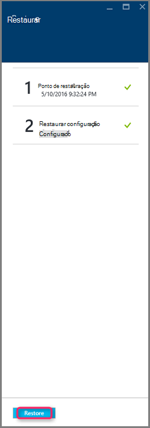

## Controlar a operação de restauração

Depois que você aciona a operação de restauração, o serviço de Backup cria um trabalho para controlar a operação de restauração. O serviço de Backup também cria e temporariamente exibe a notificação na área de notificação do portal. Se você não vir a notificação, você pode sempre clique no ícone de notificações para exibir suas notificações.

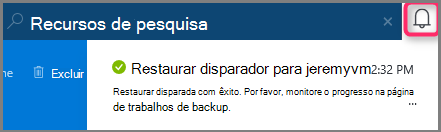

Para visualizar a operação enquanto está processando ou exibir quando concluída, abra a lista de trabalhos de Backup.

1. No menu Azure, clique em **Procurar** e na lista de serviços, digite **Os serviços de recuperação**. A lista de serviços ajusta que você digita. Quando você vir **compartimentos de serviços de recuperação**, selecione-o.

    

    Lista de compartimentos na assinatura é exibida.

    

2. Na lista, selecione o cofre associado com a máquina virtual restaurado. Quando você clica no cofre, abre seu painel.

3. No painel Cofre nos **Trabalhos de Backup** lado a lado, clique em **máquinas virtuais do Azure** para exibir os trabalhos associados cofre.

    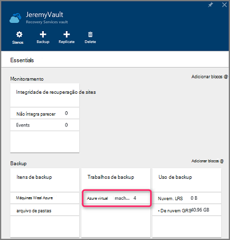

    A lâmina de **Trabalhos de Backup** abre e exibe a lista de trabalhos.

    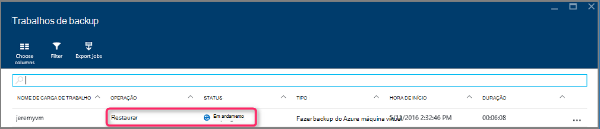

## Restaurando VMs com configurações de rede especial
É possível fazer backup e restaurar VMs com as seguintes configurações de rede especial. Entretanto, essas configurações requerem algumas considerações especiais ao percorrer o processo de restauração.

- VMs em balanceador de carga (interna e externa)
- VMs com vários IPs reservadas
- VMs com várias placas de rede

>[AZURE.IMPORTANT] Ao criar a configuração de rede especial para VMs, você deve usar o PowerShell para criar VMs a partir dos discos restaurados.

Para recriar totalmente as máquinas virtuais após a restauração em disco, siga estas etapas:

1. Restaure de um cofre de serviços de recuperação usando o [PowerShell](../backup-azure-vms-automation.md#restore-an-azure-vm)

2. Criar a configuração de máquina virtual necessária para balanceador de carga / vários IP reservado NIC/múltiplo usando os cmdlets do PowerShell e use-os para criar a máquina virtual do desejado configuração.
    - Criar máquina virtual no serviço de nuvem com [balanceador de carga interno](https://azure.microsoft.com/documentation/articles/load-balancer-internal-getstarted/)
    - Criar máquina virtual para se conectar ao [Internet opostas balanceador de carga] (https://azure.microsoft.com/en-us/documentation/articles/load-balancer-internet-getstarted/)
    - Criar máquina virtual com [várias placas de rede](https://azure.microsoft.com/documentation/articles/virtual-networks-multiple-nics/)
    - Criar máquina virtual com [vários IPs reservados](https://azure.microsoft.com/documentation/articles/virtual-networks-reserved-public-ip/)

## Próximas etapas
Agora que você pode restaurar suas VMs, consulte o artigo de solução de problemas para obter informações sobre erros comuns com VMs. Além disso, confira o artigo sobre como gerenciar tarefas com suas VMs.

- [Solucionando problemas de erros](backup-azure-vms-troubleshoot.md#restore)
- [Gerenciar máquinas virtuais](backup-azure-manage-vms.md)
